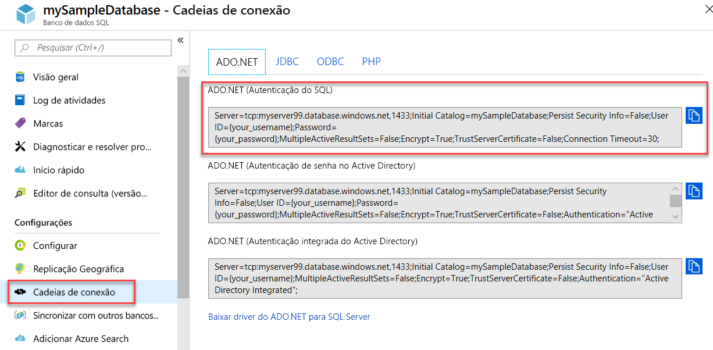

# Artigos sobre a conexão ao Banco de Dados SQL do Azure e à Instância Gerenciada de SQL do Azure e a consulta deles
[!INCLUDE[appliesto-sqldb-sqlmi](../includes/appliesto-sqldb-sqlmi.md)]

O documento a seguir inclui links para exemplos do Azure que mostram como se conectar ao Banco de Dados SQL do Azure e à Instância Gerenciada de SQL do Azure e consultá-los. Para obter algumas recomendações relacionadas à segurança em nível de transporte, confira [Considerações sobre o TLS para a conectividade de banco de dados](#tls-considerations-for-database-connectivity).

## Inícios rápidos

| Guia de Início Rápido | Descrição |
|---|---|
|[SQL Server Management Studio](connect-query-ssms.md)|Este guia de início rápido demonstra como usar não só o SSMS para se conectar a um banco de dados, mas também as instruções T-SQL (Transact-SQL) para consultar, inserir, atualizar e excluir dados no banco de dados.|
|[Azure Data Studio](/sql/azure-data-studio/quickstart-sql-database?toc=%2fazure%2fsql-database%2ftoc.json)|Este guia de início rápido demonstra como usar não só o Azure Data Studio para se conectar a um banco de dados, mas também as instruções T-SQL para criar o TutorialDB usado nos tutoriais do Azure Data Studio.|
|[Azure portal](connect-query-portal.md)|Este guia de início rápido demonstra como usar não só o editor de consultas para se conectar a um banco de dados (somente no Banco de Dados SQL do Azure), mas também as instruções T-SQL para consultar, inserir, atualizar e excluir dados no banco de dados.|
|[Visual Studio Code](connect-query-vscode.md)|Este guia de início rápido demonstra como usar não só o Visual Studio Code para se conectar a um banco de dados, mas também as instruções T-SQL para consultar, inserir, atualizar e excluir dados no banco de dados.|
|[.NET com Visual Studio](connect-query-dotnet-visual-studio.md)|Este guia de início rápido demonstra como usar não só o .NET Framework para criar um programa C# com o Visual Studio e se conectar a um banco de dados, mas também as instruções T-SQL para consultar dados.|
|[.NET Core](connect-query-dotnet-core.md)|Este guia de início rápido demonstra como usar não só o .NET Core no Windows/Linux/macOS para criar um programa C# e se conectar a um banco de dados, mas também as instruções T-SQL para consultar dados.|
|[Go](connect-query-go.md)|Este guia de início rápido demonstra como usar o Go para se conectar a um banco de dados. As instruções Transact-SQL para consultar e modificar dados também são demonstradas.|
|[Java](connect-query-java.md)|Este guia de início rápido demonstra como usar não só o Java para se conectar a um banco de dados, mas também as instruções T-SQL para consultar dados.|
|[Node.js](connect-query-nodejs.md)|Este guia de início rápido demonstra como usar não só o Node.js para criar um programa e se conectar a um banco de dados, mas também as instruções T-SQL para consultar dados.|
|[PHP](connect-query-php.md)|Este guia de início rápido demonstra como usar não só o PHP para criar um programa e se conectar a um banco de dados, mas também as instruções T-SQL para consultar dados.|
|[Python](connect-query-python.md)|Este guia de início rápido demonstra como usar não só o Python para se conectar a um banco de dados, mas também as instruções T-SQL para consultar dados. |
|[Ruby](connect-query-ruby.md)|Este guia de início rápido demonstra como usar não só o Ruby para criar um programa e se conectar a um banco de dados, mas também as instruções T-SQL para consultar dados.|
|[R](connect-query-r.md)|Este guia de início rápido demonstra como usar não só o R com os Serviços de Machine Learning do Banco de Dados SQL do Azure para criar um programa e se conectar a um banco de dados no Banco de Dados SQL do Azure, mas também as instruções T-SQL para consultar dados.|
|||

## Obter informações de conexão do servidor

Obtenha as informações de conexão necessárias para se conectar ao banco de dados no Banco de Dados SQL do Azure. Você precisará do nome totalmente qualificado do servidor ou do host, do nome do banco de dados e das informações de logon nos próximos procedimentos.

1. Entre no [portal do Azure](https://portal.azure.com/).

2. Navegue até a página **bancos de dados SQL** ou **Instâncias Gerenciadas de SQL**.

3. Na página **Visão geral**, examine o nome do servidor totalmente qualificado ao lado de **Nome do servidor** para obter um banco de dados no Banco de Dados SQL do Azure ou o nome do servidor totalmente qualificado (ou endereço IP) ao lado de **Host** para obter uma instância gerenciada de SQL do Azure ou um SQL Server na VM do Azure. Para copiar o nome do servidor ou o nome do host, passe o mouse sobre ele e selecione o ícone **Copiar**.

> [!NOTE]
> Para obter informações de conexão do SQL Server na VM do Azure, confira [Conectar-se a uma Instância do SQL Server](../virtual-machines/windows/sql-vm-create-portal-quickstart.md#connect-to-sql-server).

## Obter informações de conexão do ADO.NET (opcional, somente no Banco de Dados SQL)

1. Navegue até a folha do banco de dados no portal do Azure e, em **Configurações**, selecione **Cadeias de conexão**.

2. Examine a cadeia de conexão **ADO.NET** completa.

    

3. Copie a cadeia de conexão **ADO.NET** se pretender usá-la.

## Considerações sobre o TLS para a conectividade de banco de dados

Todos os drivers compatíveis com a Microsoft ou fornecidos por ela usam o TLS (Segurança da Camada de Transporte) para se conectar aos bancos de dados no Banco de Dados SQL do Azure ou na Instância Gerenciada de SQL do Azure. Nenhuma configuração especial é necessária. Para todas as conexões a uma Instância do SQL Server, a um banco de dados no Banco de Dados SQL do Azure ou a uma instância da Instância Gerenciada de SQL do Azure, é recomendável que todos os aplicativos sejam definidos segundo as seguintes configurações ou seus equivalentes:

- **Encrypt = On**
- **TrustServerCertificate = Off**

Alguns sistemas usam palavras-chave diferentes, porém equivalentes, para essas palavras-chave de configuração. Essas configurações garantem que o driver do cliente verifica a identidade do certificado TLS recebida do servidor.

Também recomendamos que você desabilite o TLS 1.1 e 1.0 no cliente, caso precise cumprir o PCI-DSS (Payment Card Industry – Data Security Standard).

Drivers não Microsoft não podem usar o TLS por padrão. Isso pode ser um fator importante ao se conectar ao Banco de Dados SQL do Azure ou à Instância Gerenciada de SQL do Azure. Aplicativos com drivers inseridos podem não permitir o controle dessas configurações de conexão. Recomendamos que você examine a segurança desses drivers e aplicativos antes de usá-los em sistemas que interagem com os dados confidenciais.

## Bibliotecas

Você pode usar várias bibliotecas e estruturas para se conectar ao Banco de Dados SQL do Azure ou à Instância Gerenciada de SQL do Azure. Confira nossos [Tutoriais de introdução](https://aka.ms/sqldev) para conhecer rapidamente as linguagens de programação como C#, Java, Node.js, PHP e Python. Em seguida, crie um aplicativo usando o SQL Server no Linux ou Windows ou o Docker no macOS.

A tabela a seguir lista as bibliotecas de conectividade ou *drivers* que os aplicativos cliente podem usar de uma variedade de idiomas para conectar e usar o SQL Server em execução no local ou na nuvem. Você pode usá-los no Linux, no Windows ou no Docker para se conectar ao Banco de Dados SQL do Azure, à Instância Gerenciada de SQL do Azure e ao Azure Synapse Analytics.

| Linguagem | Plataforma | Recursos adicionais | Baixar | Introdução |
| :-- | :-- | :-- | :-- | :-- |
| C# | Windows, Linux, macOS | [Microsoft ADO.NET for SQL Server](/sql/connect/ado-net/microsoft-ado-net-sql-server) | [Download](https://www.microsoft.com/net/download/) | [Introdução](https://www.microsoft.com/sql-server/developer-get-started/csharp/ubuntu)
| Java | Windows, Linux, macOS | [Microsoft JDBC Driver para SQL Server](/sql/connect/jdbc/microsoft-jdbc-driver-for-sql-server/) | [Download](/sql/connect/jdbc/download-microsoft-jdbc-driver-for-sql-server) |  [Introdução](https://www.microsoft.com/sql-server/developer-get-started/java/ubuntu)
| PHP | Windows, Linux, macOS| [Driver do SQL de PHP para SQL Server](/sql/connect/php/microsoft-php-driver-for-sql-server) | [Download](/sql/connect/php/download-drivers-php-sql-server) | [Introdução](https://www.microsoft.com/sql-server/developer-get-started/php/ubuntu/)
| Node.js | Windows, Linux, macOS | [Driver Node.js para SQL Server](/sql/connect/node-js/node-js-driver-for-sql-server/) | [Instalar](/sql/connect/node-js/step-1-configure-development-environment-for-node-js-development/) |  [Introdução](https://www.microsoft.com/sql-server/developer-get-started/node/ubuntu)
| Python | Windows, Linux, macOS | [Driver Python SQL](/sql/connect/python/python-driver-for-sql-server/) | Opções de instalação:   \* [pymssql](/sql/connect/python/pymssql/step-1-configure-development-environment-for-pymssql-python-development/)   \* [pyodbc](/sql/connect/python/pyodbc/step-1-configure-development-environment-for-pyodbc-python-development/) |  [Introdução](https://www.microsoft.com/sql-server/developer-get-started/python/ubuntu)
| Ruby | Windows, Linux, macOS | [Ruby Driver para SQL Server](/sql/connect/ruby/ruby-driver-for-sql-server/) | [Instalar](/sql/connect/ruby/step-1-configure-development-environment-for-ruby-development/) | [Introdução](https://www.microsoft.com/sql-server/developer-get-started/ruby/ubuntu)
| C++ | Windows, Linux, macOS | [Microsoft ODBC Driver for SQL Server](/sql/connect/odbc/microsoft-odbc-driver-for-sql-server/) | [Download](/sql/connect/odbc/microsoft-odbc-driver-for-sql-server/) |  

A tabela a seguir lista exemplos de estruturas de ORM (mapeamento relacional de objeto) e da Web que os aplicativos cliente podem usar com o SQL Server, com o Banco de Dados SQL do Azure, com a Instância Gerenciada de SQL do Azure e com o Azure Synapse Analytics. Você pode usar as estruturas no Linux, no Windows ou no Docker.

| Linguagem | Plataforma | ORM(s) |
| :-- | :-- | :-- |
| C# | Windows, Linux, macOS | [Entity Framework](/ef) [Entity Framework Core](/ef/core/index) |
| Java | Windows, Linux, macOS |[Colocar o ORM em hibernação](https://hibernate.org/orm)|
| PHP | Windows, Linux, macOS | [Laravel (Eloquent)](https://laravel.com/docs/eloquent) [Doctrine](https://www.doctrine-project.org/projects/orm.html) |
| Node.js | Windows, Linux, macOS | [Sequelize ORM](https://sequelize.org/) |
| Python | Windows, Linux, macOS |[Django](https://www.djangoproject.com/) |
| Ruby | Windows, Linux, macOS | [Ruby on Rails](https://rubyonrails.org/) |
||||

## Próximas etapas

- Para obter informações sobre a arquitetura de conectividade, consulte [Arquitetura de conectividade do Banco de Dados SQL do Azure](connectivity-architecture.md).
- Encontre [drivers do SQL Server](/sql/connect/sql-connection-libraries/) que são usados para se conectar por meio de aplicativos cliente.
- Conecte-se ao Banco de Dados SQL do Azure ou à Instância Gerenciada de SQL do Azure:
  - [Conectar e consultar usando o .NET (C#)](connect-query-dotnet-core.md)
  - [Conectar e consultar usando o PHP](connect-query-php.md)
  - [Conectar e consultar usando o Node.js](connect-query-nodejs.md)
  - [Conectar e consultar usando o Java](connect-query-java.md)
  - [Conectar e consultar usando o Python](connect-query-python.md)
  - [Conectar e consultar usando o Ruby](connect-query-ruby.md)
  - [Instalar as ferramentas sqlcmd e bcp de linha de comando do SQL Server no Linux](/sql/linux/sql-server-linux-setup-tools) – Para usuários do Linux: tente se conectar ao Banco de Dados SQL do Azure ou à Instância Gerenciada de SQL do Azure usando o [sqlcmd](/sql/ssms/scripting/sqlcmd-use-the-utility).
- Exemplos de código de lógica de repetição:
  - [Conectar-se de maneira resiliente com o ADO.NET][step-4-connect-resiliently-to-sql-with-ado-net-a78n]
  - [Conectar-se de maneira resiliente com o PHP][step-4-connect-resiliently-to-sql-with-php-p42h]

<!-- Link references. -->

[step-4-connect-resiliently-to-sql-with-ado-net-a78n]: /sql/connect/ado-net/step-4-connect-resiliently-sql-ado-net

[step-4-connect-resiliently-to-sql-with-php-p42h]: /sql/connect/php/step-4-connect-resiliently-to-sql-with-php
