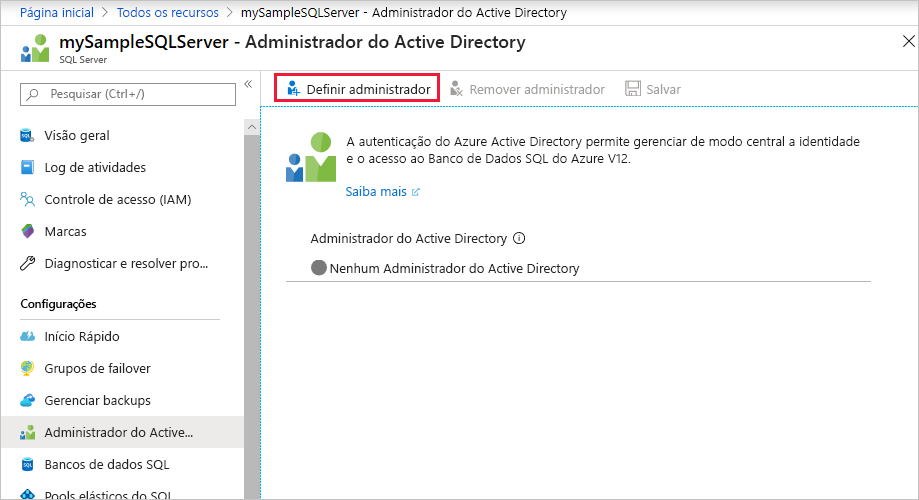
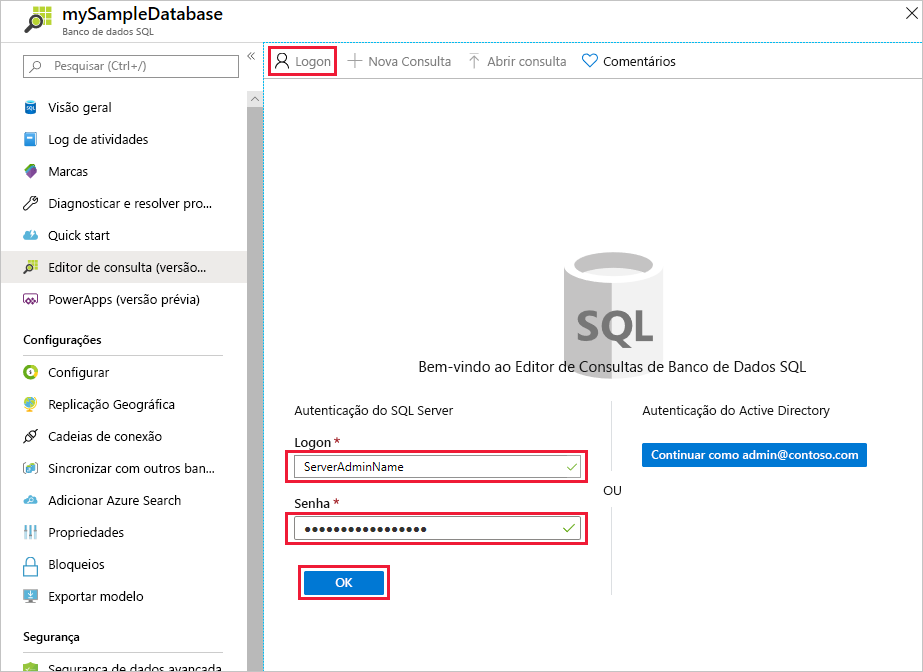
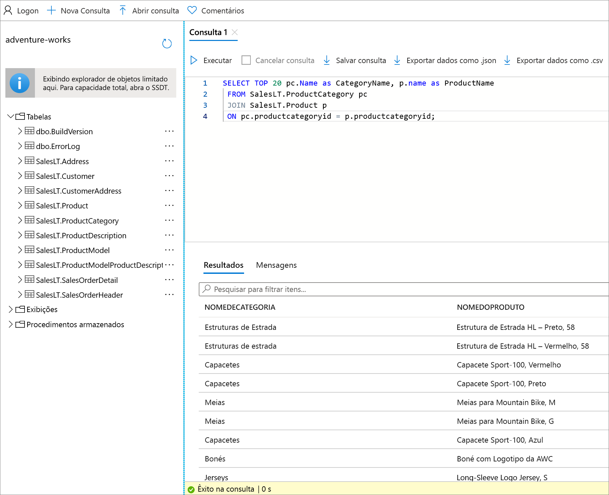

# <a name="quickstart-use-the-azure-portals-query-editor-preview-to-query-an-azure-sql-database"></a>Início Rápido: Usar o editor de consultas do portal do Azure (versão prévia) para consultar um Banco de Dados SQL do Azure
[!INCLUDE[appliesto-sqldb](../includes/appliesto-sqldb.md)]

O editor de consultas é uma ferramenta no portal do Azure para executar consultas SQL com relação ao seu banco de dados no Banco de Dados SQL do Azure ou no data warehouse no Azure Synapse Analytics.

Neste guia de início rápido, você usará o editor de consultas para executar consultas T-SQL (Transact-SQL) em um banco de dados.

## <a name="prerequisites"></a>Pré-requisitos

### <a name="create-a-database-with-sample-data"></a>Criar um banco de dados com dados de exemplo

A conclusão deste início rápido requer o banco de dados de exemplo AdventureWorksLT. Se você não tem uma cópia funcional do banco de dados de exemplo AdventureWorksLT no Banco de Dados SQL, o seguinte guia de início rápido ajuda você a criar um rapidamente:

[Início Rápido: Criar um banco de dados no Banco de Dados SQL do Azure usando o portal do Azure, o PowerShell ou a CLI do Azure](single-database-create-quickstart.md)

### <a name="set-an-azure-active-directory-admin-for-the-server-optional"></a>Defina um administrador do Azure Active Directory para o servidor (opcional)

Configurar um administrador do Azure AD (Azure Active Directory) permite que você use uma identidade exclusiva para entrar no portal do Azure e no banco de dados. Caso queira usar o Azure AD para se conectar ao editor de consultas, siga as etapas abaixo.

Esse processo é opcional, você pode usar a autenticação do SQL para se conectar ao editor de consultas.

> [!NOTE]
> * Ainda não há suporte para contas de email (por exemplo, outlook.com, gmail.com, yahoo.com e assim por diante) serem usadas como administradores do Azure AD. Escolha um usuário criado nativamente no Azure AD ou federado nele.
> * A entrada de administrador do Azure AD funciona com contas que tenham a autenticação de dois fatores habilitada, mas o editor de consultas não oferece suporte à autenticação de dois fatores.

1. No portal do Azure, navegue até o servidor do banco de dados SQL.

2. No menu **Servidor SQL**, selecione **Administrador do Active Directory**.

3. Na barra de ferramentas da página do SQL Server **Administrador do Active Directory**, selecione **Definir administrador**.

    

4. Na página **Adicionar administrador**, na caixa de pesquisa, insira um usuário ou grupo a ser localizado, selecione-o como administrador e, em seguida, escolha o botão **Selecionar**.

5. De volta à barra de ferramentas da página do SQL Server **Administrador do Active Directory**, selecione **Salvar**.

## <a name="using-sql-query-editor"></a>Como usar o editor de consulta SQL

1. Entre no [portal do Azure](https://portal.azure.com/) e selecione o banco de dados que você deseja consultar.

2. No menu **Banco de dados SQL**, selecione **Editor de consultas (versão prévia)** .

    

### <a name="establish-a-connection-to-the-database"></a>Estabelecer uma conexão com o banco de dados

Embora você tenha entrado no portal, ainda é necessário fornecer credenciais para acessar o banco de dados. Você pode se conectar usando a autenticação do SQL ou o Azure Active Directory para se conectar ao banco de dados.

#### <a name="connect-using-sql-authentication"></a>Conectar-se usando Autenticação SQL

1. Na página **Logon**, em **Autenticação do SQL Server**, insira um **Logon** e uma **Senha** para um usuário que tenha acesso ao banco de dados. Se você não tiver certeza, use o logon e a senha do administrador do servidor do banco de dados.

    

2. Selecione **OK**.

#### <a name="connect-using-azure-active-directory"></a>Conectar-se usando o Azure Active Directory

No **Editor de consultas (versão prévia)** , visualize a página de **Login** na seção **Autenticação do Active Directory**. A autenticação ocorrerá automaticamente, portanto, se você for um administrador do Azure AD do banco de dados, verá uma mensagem dizendo que você entrou. Selecione o botão **Continuar como** *\<your user or group ID>* . Se a página indicar que você não fez logon com êxito, talvez seja necessário atualizá-la.

### <a name="query-a-database-in-sql-database"></a>Consultar um banco de dados no Banco de Dados SQL

As consultas de exemplo a seguir devem ser executadas com êxito no banco de dados de exemplo AdventureWorksLT.

#### <a name="run-a-select-query"></a>Executar uma consulta SELECT

1. Cole a consulta a seguir no editor de consultas:

   ```sql
    SELECT TOP 20 pc.Name as CategoryName, p.name as ProductName
    FROM SalesLT.ProductCategory pc
    JOIN SalesLT.Product p
    ON pc.productcategoryid = p.productcategoryid;
   ```

2. Selecione **Executar** e, em seguida, examine a saída no painel **Resultados**.

   

3. Opcionalmente, você pode salvar a consulta como um arquivo .sql ou exportar os dados retornados como um arquivo .json, .csv ou .xml.

#### <a name="run-an-insert-query"></a>Executar uma consulta INSERT

Execute a instrução T-SQL [INSERT](/sql/t-sql/statements/insert-transact-sql/) a seguir para adicionar um novo produto à tabela `SalesLT.Product`.

1. Substitua a consulta anterior por esta.

    ```sql
    INSERT INTO [SalesLT].[Product]
           ( [Name]
           , [ProductNumber]
           , [Color]
           , [ProductCategoryID]
           , [StandardCost]
           , [ListPrice]
           , [SellStartDate]
           )
    VALUES
           ('myNewProduct'
           ,123456789
           ,'NewColor'
           ,1
           ,100
           ,100
           ,GETDATE() );
   ```


2. Selecione **Executar** para inserir uma nova linha na tabela `Product`. O painel **Mensagens** exibe **Êxito na consulta: Linhas afetadas: 1**.


#### <a name="run-an-update-query"></a>Executar uma consulta UPDATE

Execute a instrução T-SQL [UPDATE](/sql/t-sql/queries/update-transact-sql/) a seguir para modificar o novo produto.

1. Substitua a consulta anterior por esta.

   ```sql
   UPDATE [SalesLT].[Product]
   SET [ListPrice] = 125
   WHERE Name = 'myNewProduct';
   ```

2. Selecione **Executar** para atualizar a linha especificada na tabela `Product`. O painel **Mensagens** exibe **Êxito na consulta: Linhas afetadas: 1**.

#### <a name="run-a-delete-query"></a>Executar uma consulta DELETE

Execute a instrução T-SQL [DELETE](/sql/t-sql/statements/delete-transact-sql/) a seguir para remover o novo produto.

1. Substitua a consulta anterior por esta:

   ```sql
   DELETE FROM [SalesLT].[Product]
   WHERE Name = 'myNewProduct';
   ```

2. Selecione **Executar** para excluir a linha especificada da tabela `Product`. O painel **Mensagens** exibe **Êxito na consulta: Linhas afetadas: 1**.


## <a name="troubleshooting-and-considerations"></a>Considerações e solução de problemas

Há algumas coisas que se deve saber ao trabalhar com o editor de consultas.

### <a name="configure-local-network-settings"></a>Definir as configurações de rede local

Se você receber um dos seguintes erros no editor de consultas:
 - *As configurações de rede local poderão estar impedindo que o Editor de Consultas emita consultas. Clique aqui para obter instruções sobre como definir suas configurações de rede*
 - *Não foi possível estabelecer uma conexão com o servidor. Isso pode indicar um problema com a configuração de firewall local ou as configurações de proxy de rede*

Isso ocorre porque o editor de consultas usa as portas 443 e 1443 para se comunicar. Você precisará verificar se habilitou o tráfego HTTPS de saída nessas portas. As instruções a seguir guiarão você sobre como fazer isso, dependendo do seu sistema operacional. Talvez seja necessário trabalhar com o departamento de TI da sua empresa para conceder aprovação para abrir essa conexão em sua rede local.

#### <a name="steps-for-windows"></a>Etapas para Windows

1. Abra o **Windows Defender Firewall**
2. No menu do lado esquerdo, selecione **Configurações avançadas**
3. No **Windows Defender Firewall com Segurança Avançada**, selecione **Regras de saída** no menu do lado esquerdo.
4. Selecione **Nova regra...** no menu do lado direito

No **Assistente de nova regra de saída**, siga estas etapas:

1. Selecione **porta** como o tipo de regra que você deseja criar. Selecione **Avançar**
2. Selecione **TCP**
3. Selecione **Portas remotas específicas** e insira "443, 1443". Depois, selecione **Avançar**
4. Selecione "Permitir a conexão se ela for segura"
5. Selecione **Próximo** e, depois, selecione **Próximo** novamente
5. Mantenha selecionados "Domínio", "Privado" e "Público"
6. Dê um nome à regra, por exemplo "Acessar o editor de consultas SQL do Azure" e, opcionalmente, uma descrição. Depois, selecione **Concluir**

#### <a name="steps-for-mac"></a>Etapas para Mac
1. Abra as **Preferências do Sistema** (menu da Apple > Preferências do Sistema).
2. Clique em **Segurança e Privacidade**.
3. Clique em **Firewall**.
4. Se o firewall estiver desativado, selecione **Clicar em bloquear para fazer alterações** na parte inferior e selecione **Ativar Firewall**
4. Clique em **Opções de Firewall**.
5. Na janela **Privacidade e Segurança**, selecione essa opção: "Permitir automaticamente que o software assinado receba ligações de entrada".

#### <a name="steps-for-linux"></a>Etapas para Linux
Execute estes comandos para atualizar o iptables
  ```
  sudo iptables -A OUTPUT -p tcp --dport 443 -j ACCEPT
  sudo iptables -A OUTPUT -p tcp --dport 1443 -j ACCEPT
  ```

### <a name="connection-considerations"></a>Considerações sobre a conexão

* Para conexões públicas com o editor de consultas, você precisa [adicionar o endereço IP de saída para regras de firewall permitido do servidor](firewall-create-server-level-portal-quickstart.md) para acessar seus bancos de dados e data warehouses.

* Caso tenha uma conexão de link privada configurada no servidor e esteja se conectando ao editor de consultas de um IP na rede virtual privada, o editor de consultas funcionará sem a necessidade de adicionar o endereço IP do cliente nas regras de firewall do servidor do banco de dados SQL.

* As permissões mais básicas de RBAC necessárias para usar o editor de consultas são o acesso de leitura ao servidor e ao banco de dados. Qualquer pessoa com esse nível de acesso poderá acessar o recurso editor de consultas. Para limitar o acesso a usuários específicos, você deve impedir que eles possam entrar no editor de consultas com as credenciais de autenticação do Azure Active Directory ou do SQL. Caso eles não possam se atribuir como administrador do AAD para o servidor ou acessar/adicionar uma conta de administrador do SQL, eles não deverão ser capazes de usar o editor de consultas.

* O editor de consultas não dá suporte à conexão com o banco de dados `master`.

* O editor de consultas não consegue se conectar a um banco de dados de réplica com `ApplicationIntent=ReadOnly`

* Caso tenha sido exibida a mensagem de erro "Não foi possível validar o cabeçalho X-CSRF-Signature", execute a seguinte ação para resolver o problema:

    * Verifique se o relógio do computador está configurado na hora e no fuso horário corretos. Você também pode tentar deixar o fuso horário do seu computador igual ao do Azure pesquisando o fuso horário do local da instância, como Leste dos EUA, Pacífico e assim por diante.
    * Caso esteja em uma rede proxy, verifique se o cabeçalho de solicitação "X-CSRF-Signature" não está sendo modificado ou removido.

### <a name="other-considerations"></a>Outras considerações

* Pressionar **F5** atualiza a página do editor de consultas e qualquer consulta em que se esteja trabalhando é perdida.

* Há um tempo limite de 5 minutos para a execução da consulta.

* O editor de consultas só dá suporte à projeção cilíndrica para tipos de dados geográficos.

* Não há suporte para IntelliSense para tabelas e exibições de banco de dados, mas o editor dá suporte ao preenchimento automático em nomes que já foram digitados.

## <a name="next-steps"></a>Próximas etapas

Para saber mais sobre o T-SQL com suporte no Banco de Dados SQL do Azure, confira [Resolver diferenças do Transact-SQL durante a migração para o Banco de Dados SQL](transact-sql-tsql-differences-sql-server.md).
