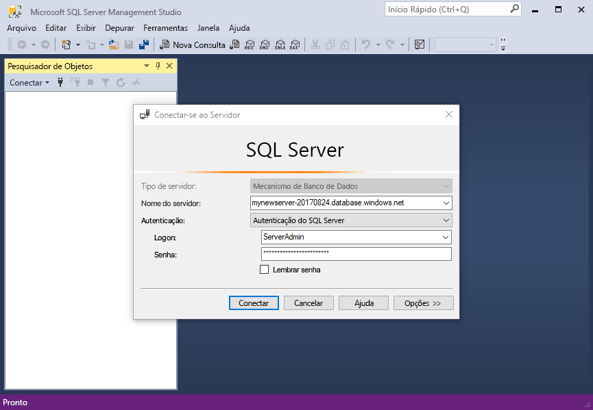
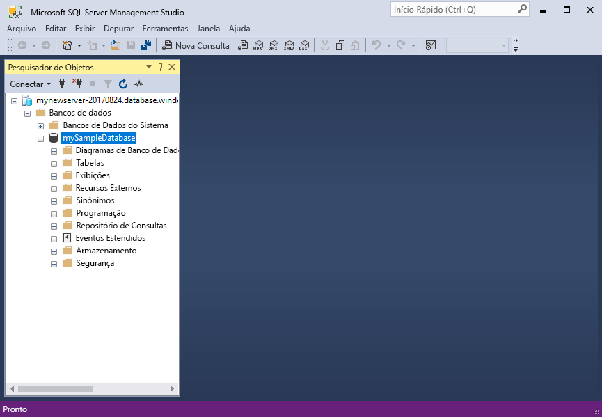
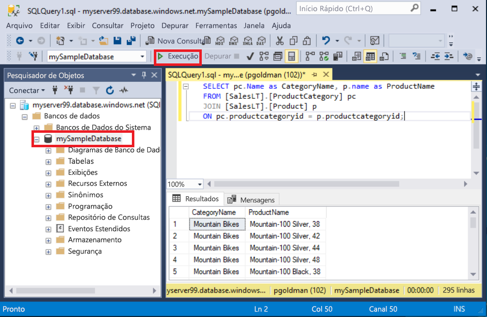
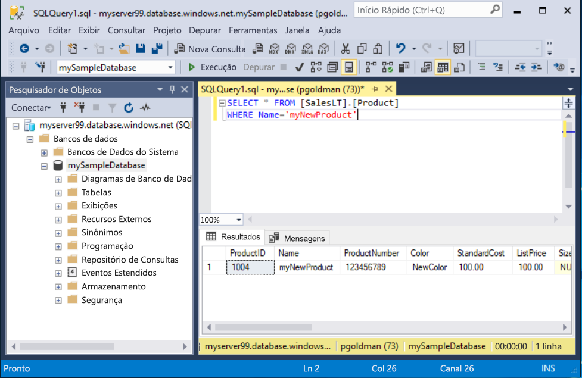

# <a name="quickstart-use-ssms-to-connect-to-and-query-azure-sql-database-or-azure-sql-managed-instance"></a>Início Rápido: Usar o SSMS para se conectar e consultar um Banco de Dados SQL do Azure ou uma Instância Gerenciada de SQL do Azure
[!INCLUDE[appliesto-sqldb-sqlmi](../includes/appliesto-sqldb-sqlmi.md)]

Neste início rápido, você aprenderá a usar o SSMS (SQL Server Management Studio) para se conectar a um Banco de Dados SQL do Azure ou uma Instância Gerenciada de SQL do Azure e executar algumas consultas.

## <a name="prerequisites"></a>Pré-requisitos

A conclusão deste início rápido requer os seguintes itens:

- [SQL Server Management Studio (SSMS)](/sql/ssms/download-sql-server-management-studio-ssms/).

- Um banco de dados no Banco de Dados SQL do Azure. Você pode usar um destes guias de início rápido para criar e, em seguida, configurar um banco de dados no Banco de Dados SQL do Azure:

  | Ação | Banco de Dados SQL | Instância Gerenciada do SQL | SQL Server na VM do Azure |
  |:--- |:--- |:---|:---|
  | Criar| [Portal](single-database-create-quickstart.md) | [Portal](../managed-instance/instance-create-quickstart.md) | [Portal](../virtual-machines/windows/sql-vm-create-portal-quickstart.md)
  || [CLI](scripts/create-and-configure-database-cli.md) | [CLI](https://medium.com/azure-sqldb-managed-instance/working-with-sql-managed-instance-using-azure-cli-611795fe0b44) |
  || [PowerShell](scripts/create-and-configure-database-powershell.md) | [PowerShell](../managed-instance/scripts/create-configure-managed-instance-powershell.md) | [PowerShell](../virtual-machines/windows/sql-vm-create-powershell-quickstart.md)
  | Configurar | [Regra de firewall de IP no nível do servidor](firewall-create-server-level-portal-quickstart.md)| [Conectividade de uma VM](../managed-instance/connect-vm-instance-configure.md)|
  |||[Conectividade do local](../managed-instance/point-to-site-p2s-configure.md) | [Conectar ao SQL Server](../virtual-machines/windows/sql-vm-create-portal-quickstart.md)
  |Carregar dados|Adventure Works carregado por guia de início rápido|[Restaurar o Wide World Importers](../managed-instance/restore-sample-database-quickstart.md) | [Restaurar o Wide World Importers](../managed-instance/restore-sample-database-quickstart.md) |
  |||Restaurar ou importar o Adventure Works por meio do arquivo [BACPAC](database-import.md) do [GitHub](https://github.com/Microsoft/sql-server-samples/tree/master/samples/databases/adventure-works)| Restaurar ou importar o Adventure Works por meio do arquivo [BACPAC](database-import.md) do [GitHub](https://github.com/Microsoft/sql-server-samples/tree/master/samples/databases/adventure-works)|
  |||

  > [!IMPORTANT]
  > Os scripts deste artigo são escritos para usar o banco de dados do Adventure Works. Com uma instância gerenciada, você deve importar o banco de dados do Adventure Works para um banco de dados de instância ou modificar os scripts deste artigo para usar o banco de dados da Wide World Importers.

Se você simplesmente quiser executar algumas consultas ad hoc sem instalar o SSMS, confira [Início rápido: Usar o editor de consultas do portal do Azure para consultar um banco de dados no Banco de Dados SQL do Azure](connect-query-portal.md).

## <a name="get-server-connection-information"></a>Obter informações de conexão do servidor

Obtenha as informações de conexão necessárias para se conectar ao banco de dados. Você precisará do nome totalmente qualificado do [servidor](logical-servers.md) ou do host, do nome do banco de dados e das informações de logon para concluir o início rápido.

1. Entre no [portal do Azure](https://portal.azure.com/).

2. Navegue até o **banco de dados** ou a **instância gerenciada** que você deseja consultar.

3. Na página **Visão geral**, examine o nome do servidor totalmente qualificado próximo de **Nome do servidor** para seu banco de dados no Banco de Dados SQL do Azure ou o nome do servidor totalmente qualificado (ou endereço IP) próximo de **Host** para sua instância gerenciada na Instância Gerenciada de SQL ou sua instância do SQL Server na VM. Para copiar o nome do servidor ou o nome do host, passe o mouse sobre ele e selecione o ícone **Copiar**.

> [!NOTE]
> Para obter informações de conexão do SQL Server na VM do Azure, confira [Conectar-se ao SQL Server](../virtual-machines/windows/sql-vm-create-portal-quickstart.md#connect-to-sql-server)

## <a name="connect-to-your-database"></a>Conectar-se ao seu banco de dados

[!INCLUDE[ssms-connect-azure-ad](../includes/ssms-connect-azure-ad.md)]

No SSMS, conecte-se ao servidor.

> [!IMPORTANT]
> Um servidor escuta na porta 1433. Para se conectar a um servidor por trás de um firewall corporativo, essa porta do firewall deve estar aberta.

1. Abra o SSMS.

2. A caixa de diálogo **Conectar-se ao Servidor** é exibida. Insira as seguintes informações:

   | Configuração      | Valor sugerido    | Descrição |
   | ------------ | ------------------ | ----------- |
   | **Tipo de servidor** | Mecanismo de banco de dados | Valor obrigatório. |
   | **Nome do servidor** | O nome do servidor totalmente qualificado | Algo como: **servername.database.windows.net**. |
   | **Autenticação** | Autenticação do SQL Server | Este tutorial usa a autenticação do SQL. |
   | **Logon** | ID de usuário da conta do administrador do servidor | A ID de usuário da conta do administrador do servidor usada para criar o servidor. |
   | **Senha** | Senha da conta do administrador do servidor | A senha da conta do administrador do servidor usada para criar o servidor. |
   ||||

     

> [!NOTE]
> Este tutorial usa a Autenticação do SQL Server.

3. Selecione **Opções** na caixa de diálogo **Conectar-se ao servidor**. No menu suspenso **Conectar-se ao banco de dados**, selecione **mySampleDatabase**. A conclusão do início rápido na seção [Pré-requisitos](#prerequisites) cria um banco de dados AdventureWorksLT chamado mySampleDatabase. Se sua cópia funcional do banco de dados AdventureWorks tiver um nome diferente de mySampleDatabase, selecione-a em vez disso.

     

4. Selecione **Conectar**. A janela Pesquisador de Objetos se abre.

5. Para exibir objetos do banco de dados, expanda **Bancos de Dados** e, em seguida, expanda o nó do banco de dados.

     

## <a name="query-data"></a>Consultar dados

Execute esse código Transact-SQL [SELECT](/sql/t-sql/queries/select-transact-sql/) para consultar os 20 principais produtos por categoria.

1. No Pesquisador de Objetos, clique com o botão direito do mouse em **mySampleDatabase** e selecione **Nova Consulta**. Abre uma nova janela de consulta conectada ao banco de dados.

2. Na janela da consulta, cole a seguinte consulta SQL:

   ```sql
   SELECT pc.Name as CategoryName, p.name as ProductName
   FROM [SalesLT].[ProductCategory] pc
   JOIN [SalesLT].[Product] p
   ON pc.productcategoryid = p.productcategoryid;
   ```

3. Na barra de ferramentas, selecione **Executar** para executar a consulta e recuperar dados das tabelas `Product` e `ProductCategory`.

    

### <a name="insert-data"></a>Inserir dados

Execute esse código Transact-SQL [INSERT](/sql/t-sql/statements/insert-transact-sql/) para criar um produto na tabela `SalesLT.Product`.

1. Substitua a consulta anterior por esta.

   ```sql
   INSERT INTO [SalesLT].[Product]
           ( [Name]
           , [ProductNumber]
           , [Color]
           , [ProductCategoryID]
           , [StandardCost]
           , [ListPrice]
           , [SellStartDate] )
     VALUES
           ('myNewProduct'
           ,123456789
           ,'NewColor'
           ,1
           ,100
           ,100
           ,GETDATE() );
   ```

2. Selecione **Executar** para inserir uma nova linha na tabela `Product`. O painel **Mensagens** é exibido **(1 linha afetada)** .

#### <a name="view-the-result"></a>Exibir o resultado

1. Substitua a consulta anterior por esta.

   ```sql
   SELECT * FROM [SalesLT].[Product]
   WHERE Name='myNewProduct'
   ```

2. Selecione **Executar**. O seguinte resultado aparecerá.

   

### <a name="update-data"></a>Atualizar dados

Execute este código Transact-SQL [UPDATE](/sql/t-sql/queries/update-transact-sql) para modificar seu novo produto.

1. Substitua a consulta anterior por aquela que retorna o novo registro criado anteriormente:

   ```sql
   UPDATE [SalesLT].[Product]
   SET [ListPrice] = 125
   WHERE Name = 'myNewProduct';
   ```

2. Selecione **Executar** para atualizar a linha especificada na tabela `Product`. O painel **Mensagens** é exibido **(1 linha afetada)** .

### <a name="delete-data"></a>Excluir dados

Execute esse código Transact-SQL [DELETE](/sql/t-sql/statements/delete-transact-sql/) para remover o novo produto.

1. Substitua a consulta anterior por esta.

   ```sql
   DELETE FROM [SalesLT].[Product]
   WHERE Name = 'myNewProduct';
   ```

2. Selecione **Executar** para excluir a linha especificada na tabela `Product`. O painel **Mensagens** é exibido **(1 linha afetada)** .

## <a name="next-steps"></a>Próximas etapas

- Para saber mais sobre o SSMS, confira [SQL Server Management Studio](/sql/ssms/sql-server-management-studio-ssms/).
- Para se conectar e consultar usando o Portal do Azure, consulte [Conectar e consultar com o editor de consultas do SQL do Portal do Azure](connect-query-portal.md).
- Para conectar e consultar usando o Visual Studio Code, veja [Conectar e consultar com o Visual Studio Code](connect-query-vscode.md).
- Para conectar e consultar usando o .NET, veja [Conectar e consultar com o .NET](connect-query-dotnet-visual-studio.md).
- Para conectar e consultar usando o PHP, veja [Conectar e consultar com o PHP](connect-query-php.md).
- Para conectar e consultar usando o Node.js, veja [Conectar e consultar com o Node.js](connect-query-nodejs.md).
- Para conectar e consultar usando o Java, veja [Conectar e consultar com o Java](connect-query-java.md).
- Para conectar e consultar usando o Python, veja [Conectar e consultar com o Python](connect-query-python.md).
- Para conectar e consultar usando o Ruby, veja [Conectar e consultar com o Ruby](connect-query-ruby.md).
