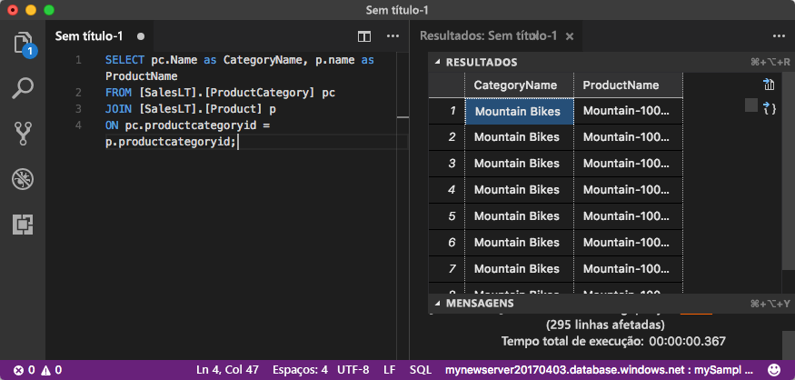

# <a name="quickstart-use-visual-studio-code-to-connect-and-query"></a>Início Rápido: Usar o Visual Studio Code para se conectar e consultar 
[!INCLUDE[appliesto-sqldb-sqlmi](../includes/appliesto-sqldb-sqlmi.md)]

O [Visual Studio Code](https://code.visualstudio.com/docs) é um editor de código gráfico para Linux, macOS e Windows. Ele é compatível com extensões, incluindo a [extensão mssql](https://aka.ms/mssql-marketplace) para consultar uma Instância do SQL Server, um Banco de Dados SQL do Azure, uma Instância Gerenciada de SQL do Azure e um banco de dados no Azure Synapse Analytics. Neste início rápido, você usará o Visual Studio Code para se conectar a um Banco de Dados SQL do Azure ou a uma Instância Gerenciada de SQL do Azure e, em seguida, executará instruções Transact-SQL para consultar, inserir, atualizar e excluir dados.

## <a name="prerequisites"></a>Pré-requisitos

- Um banco de dados no Banco de Dados SQL do Azure ou na Instância Gerenciada de SQL do Azure. Você pode usar um destes guias de início rápido para criar e, em seguida, configurar um banco de dados no Banco de Dados SQL do Azure:

  | Ação | Banco de Dados SQL do Azure | Instância Gerenciada do Azure SQL |
  |:--- |:--- |:---|
  | Criar| [Portal](single-database-create-quickstart.md) | [Portal](../managed-instance/instance-create-quickstart.md) |
  || [CLI](scripts/create-and-configure-database-cli.md) | [CLI](https://medium.com/azure-sqldb-managed-instance/working-with-sql-managed-instance-using-azure-cli-611795fe0b44) |
  || [PowerShell](scripts/create-and-configure-database-powershell.md) | [PowerShell](../managed-instance/scripts/create-configure-managed-instance-powershell.md) |
  | Configurar | [Regra de firewall de IP no nível do servidor](firewall-create-server-level-portal-quickstart.md)| [Conectividade em uma VM (máquina virtual)](../managed-instance/connect-vm-instance-configure.md)|
  |||[Conectividade do local](../managed-instance/point-to-site-p2s-configure.md)
  |Carregar dados|Adventure Works carregado por guia de início rápido|[Restaurar o Wide World Importers](../managed-instance/restore-sample-database-quickstart.md)
  |||Restaurar ou importar o Adventure Works de um arquivo [BACPAC](database-import.md) do [GitHub](https://github.com/Microsoft/sql-server-samples/tree/master/samples/databases/adventure-works)|
  |||

  > [!IMPORTANT]
  > Os scripts deste artigo são escritos para usar o banco de dados do Adventure Works. Com uma Instância Gerenciada de SQL, importe o banco de dados Adventure Works para um banco de dados de instância ou altere os scripts deste artigo para usar o banco de dados da Wide World Importers.

## <a name="install-visual-studio-code"></a>Instalar o Visual Studio Code

Certifique-se de instalar o [Visual Studio Code](https://code.visualstudio.com/Download) mais recente e carregar a [extensão mssql](https://aka.ms/mssql-marketplace). Para obter diretrizes sobre como instalar a extensão mssql, confira [Instalar o Visual Studio Code](/sql/linux/sql-server-linux-develop-use-vscode#install-and-start-visual-studio-code) e [mssql para Visual Studio Code ](https://marketplace.visualstudio.com/items?itemName=ms-mssql.mssql).

## <a name="configure-visual-studio-code"></a>Configurar o Visual Studio Code

### <a name="macos"></a>**macOS**

Para o macOS, é necessário instalar o OpenSSL, que é um pré-requisito do .NET Core que a extensão mssql usa. Abra seu terminal e digite os seguintes comandos para instalar o **brew** e o **OpenSSL**.

```bash
ruby -e "$(curl -fsSL https://raw.githubusercontent.com/Homebrew/install/master/install)"
brew update
brew install openssl
mkdir -p /usr/local/lib
ln -s /usr/local/opt/openssl/lib/libcrypto.1.0.0.dylib /usr/local/lib/
ln -s /usr/local/opt/openssl/lib/libssl.1.0.0.dylib /usr/local/lib/
```

### <a name="linux-ubuntu"></a>**Linux (Ubuntu)**

Nenhuma configuração especial é necessária.

### <a name="windows"></a>**Windows**

Nenhuma configuração especial é necessária.

## <a name="get-server-connection-information"></a>Obter informações de conexão do servidor

Obtenha as informações de conexão necessárias para se conectar ao Banco de Dados SQL do Azure. Você precisará do nome totalmente qualificado do servidor ou do host, do nome do banco de dados e das informações de logon nos próximos procedimentos.

1. Entre no [portal do Azure](https://portal.azure.com/).

2. Navegue até a página **bancos de dados SQL** ou **Instâncias Gerenciadas de SQL**.

3. Na página **Visão geral**, examine o nome do servidor totalmente qualificado próximo do **Nome do servidor** para o Banco de Dados SQL ou o nome do servidor totalmente qualificado próximo ao **Host** para uma Instância Gerenciada de SQL. Para copiar o nome do servidor ou o nome do host, passe o mouse sobre ele e selecione o ícone **Copiar**.

## <a name="set-language-mode-to-sql"></a>Definir o modo de linguagem para SQL

No Visual Studio Code, defina o modo de linguagem como **SQL** para permitir comandos mssql e T-SQL IntelliSense.

1. Abra uma nova janela do Visual Studio Code.

2. Pressione **Ctrl**+**N**. Um novo arquivo de texto sem formatação é aberto.

3. Selecione **Texto sem Formatação** no canto inferior direito da barra de status.

4. No menu suspenso **Selecionar modo de linguagem** que for aberto, selecione **SQL**.

## <a name="connect-to-your-database"></a>Conectar-se ao seu banco de dados

Use o Visual Studio Code para estabelecer uma conexão com seu servidor.

> [!IMPORTANT]
> Antes de continuar, verifique se o servidor e as informações de entrada estão prontos. Depois de começar a inserir as informações de perfil da conexão, se você mudar o foco do Visual Studio Code, terá que reiniciar a criação do perfil.

1. No Visual Studio Code, pressione **CTRL+Shift+P** (ou **F1**) para abrir a Paleta de Comandos.

2. Selecione **MS SQL:Connect** e escolha **Enter**.

3. Selecione **Criar perfil de conexão**.

4. Siga os prompts para especificar as propriedades de conexão do novo perfil. Depois de especificar cada valor, escolha **Enter** para continuar.

   | Propriedade       | Valor sugerido | Descrição |
   | ------------ | ------------------ | ------------------------------------------------- |
   | **Nome do servidor** | O nome do servidor totalmente qualificado | Algo como: **mynewserver20170313.database.windows.net**. |
   | **Nome do banco de dados** | mySampleDatabase | O banco de dados ao qual se conectar. |
   | **Autenticação** | Logon do SQL| Este tutorial usa a autenticação do SQL. |
   | **Nome de usuário** | Nome de usuário | O nome de usuário da conta do administrador de servidor usada para criar o servidor. |
   | **Senha (Logon do SQL)** | Senha | A senha de usuário da conta do administrador de servidor usada para criar o servidor. |
   | **Salvar senha?** | Sim ou não | Selecione **Sim** se não desejar inserir a senha toda vez. |
   | **Inserir um nome para este perfil** | Um nome do perfil, como **mySampleProfile** | Um perfil salvo acelera sua conexão nos logons subsequentes. |

   Se for bem-sucedido, uma notificação será exibida informando que seu perfil foi criado e está conectado.

## <a name="query-data"></a>Consultar dados

Execute a instrução Transact-SQL [SELECT](/sql/t-sql/queries/select-transact-sql) a seguir para consultar os 20 principais produtos por categoria.

1. Na janela do editor, cole a seguinte consulta SQL.

   ```sql
   SELECT pc.Name as CategoryName, p.name as ProductName
   FROM [SalesLT].[ProductCategory] pc
   JOIN [SalesLT].[Product] p
   ON pc.productcategoryid = p.productcategoryid;
   ```

2. Pressione **Ctrl**+**Shift**+**E** para executar a consulta e exibir os resultados das tabelas `Product` e `ProductCategory`.

    

## <a name="insert-data"></a>Inserir dados

Execute a instrução Transact-SQL [INSERT](/sql/t-sql/statements/insert-transact-sql) a seguir para adicionar um novo produto à tabela `SalesLT.Product`.

1. Substitua a consulta anterior por esta.

   ```sql
   INSERT INTO [SalesLT].[Product]
        ( [Name]
        , [ProductNumber]
        , [Color]
        , [ProductCategoryID]
        , [StandardCost]
        , [ListPrice]
        , [SellStartDate]
        )
     VALUES
        ('myNewProduct'
        ,123456789
        ,'NewColor'
        ,1
         ,100
         ,100
         ,GETDATE() );
   ```

2. Pressione **Ctrl**+**Shift**+**E** para inserir uma nova linha na tabela `Product`.

## <a name="update-data"></a>Atualizar dados

Execute a instrução Transact-SQL [UPDATE](/sql/t-sql/queries/update-transact-sql) a seguir para atualizar o produto adicionado.

1. Substitua a consulta anterior por esta:

   ```sql
   UPDATE [SalesLT].[Product]
   SET [ListPrice] = 125
   WHERE Name = 'myNewProduct';
   ```

2. Pressione **Ctrl**+**Shift**+**E** para atualizar a linha especificada na tabela `Product`.

## <a name="delete-data"></a>Excluir dados

Execute a instrução Transact-SQL [DELETE](/sql/t-sql/statements/delete-transact-sql) a seguir para remover o novo produto.

1. Substitua a consulta anterior por esta:

   ```sql
   DELETE FROM [SalesLT].[Product]
   WHERE Name = 'myNewProduct';
   ```

2. Pressione **Ctrl**+**Shift**+**E** para excluir a linha especificada na tabela `Product`.

## <a name="next-steps"></a>Próximas etapas

- Para conectar-se e consultar usando o SQL Server Management Studio, confira [Início Rápido: Usar o SQL Server Management Studio para conectar-se a um banco de dados no Banco de Dados SQL do Azure e consultar dados](connect-query-ssms.md).
- Para se conectar e consultar usando o portal do Azure, confira [Início Rápido: usar o editor de consulta SQL no portal do Azure para conectar e consultar dados](connect-query-portal.md).
- Para obter um artigo da MSDN magazine sobre como usar o Visual Studio Code, veja [Criar um banco de dados IDE com a postagem de blog de extensão MSSQL](/archive/msdn-magazine/2017/june/data-points-visual-studio-code-create-a-database-ide-with-mssql-extension).