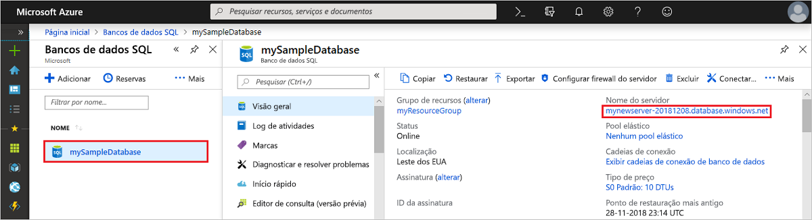

# Início Rápido: Criar uma regra de firewall de nível de servidor usando o portal do Azure
[!INCLUDE[appliesto-sqldb](../includes/appliesto-sqldb.md)]

Este início rápido mostra como criar uma [regra de firewall no nível do servidor](firewall-configure.md) no Banco de Dados SQL do Azure usando o portal do Azure para permitir que você se conecte a [servidores SQL lógicos](logical-servers.md), bancos de dados individuais, pools elásticos e os respectivos bancos de dados. Uma regra de firewall é necessária para se conectar em outros recursos do Azure e em recursos locais. As regras de firewall no nível do servidor não se aplicam à Instância Gerenciada de SQL do Azure.

## Pré-requisitos

Este Início Rápido usa os recursos criados em [Criar um banco de dados individual usando o portal do Azure](single-database-create-quickstart.md) como ponto de partida.

## Entre no Portal do Azure

Entre no [portal do Azure](https://portal.azure.com/).

## Criar uma regra de firewall de IP no nível do servidor

 O Banco de Dados SQL cria um firewall no nível do servidor para bancos de dados individuais e em pool. Esse firewall impede os aplicativos cliente de se conectarem ao servidor ou a um dos respectivos bancos de dados, a menos que você crie uma regra de firewall de IP para abrir o firewall. Para conexão de um endereço IP fora do Azure, crie uma regra de firewall para um endereço IP específico ou para um intervalo de endereços dos quais você deseja poder se conectar. Para obter mais informações sobre as regras de firewall de IP no nível do servidor e do banco de dados, confira [Regras de firewall de IP no nível do servidor e do banco de dados](firewall-configure.md).

> [!NOTE]
> O Banco de Dados SQL do Azure se comunica pela porta 1433. Se você estiver tentando se conectar de dentro de uma rede corporativa, o tráfego de saída pela porta 1433 talvez não seja permitido pelo firewall da rede. Se isso acontecer, você não conseguirá se conectar ao servidor, a menos que o departamento de TI abra a porta 1433.
> [!IMPORTANT]
> Uma regra de firewall igual a 0.0.0.0 permite que todos os serviços do Azure passem pela regra de firewall no nível do servidor e tentem se conectar a um banco de dados por meio do servidor.

Execute estas etapas para criar uma regra de firewall de IP no nível do servidor para o endereço IP do cliente e habilite a conectividade externa por meio do firewall do Banco de Dados SQL do Azure somente para o seu endereço IP.

1. Após a conclusão da implantação do [banco de dados](#prerequisites), selecione **Bancos de dados SQL** no menu à esquerda e escolha **mySampleDatabase** na página **Bancos de Dados SQL**. A página de visão geral de seu banco de dados é aberta, mostrando o nome totalmente qualificado do servidor (como **mynewserver-20170824.database.windows.net**) e fornece opções para configurações adicionais.

2. Copie esse nome do servidor totalmente qualificado para usar quando se conectar ao servidor e aos bancos de dados nos outros inícios rápidos.

   

3. Selecione **Definir firewall do servidor** na barra de ferramentas. A página **Configurações do firewall** do servidor será aberta.

   

4. Escolha **Adicionar IP do cliente** na barra de ferramentas para adicionar seu endereço IP atual a uma nova regra de firewall de IP no nível do servidor. Uma regra de firewall de IP no nível do servidor pode abrir a porta 1433 para um único endereço IP ou um intervalo de endereços IP.

   > [!IMPORTANT]
   > Por padrão, o acesso pelo firewall do Banco de Dados SQL do Azure está desabilitado em todos os serviços do Azure. Escolha **ATIVAR** nesta página se desejar habilitar o acesso para todos os serviços do Azure.
   >

5. Clique em **Salvar**. Uma regra de firewall de IP no nível do servidor é criada para o endereço IP atual que abre a porta 1433 no servidor.

6. Feche a página **Configurações do Firewall**.

Usando o SQL Server Management Studio ou outra ferramenta de sua escolha, agora você pode se conectar ao servidor e aos respectivos bancos de dados nesse endereço IP usando a conta do administrador do servidor criada anteriormente.

## Limpar os recursos

Salvar esses recursos se você deseja ir para as [Próximas etapas](#next-steps) e saiba como se conectar e consultar o banco de dados usando vários métodos diferentes. No entanto, se você quer excluir os recursos criados nesse início rápido, use as etapas a seguir.

1. No menu à esquerda no portal do Azure, selecione **Grupos de recursos** e, em seguida, selecione **myResourceGroup**.
2. Em sua página de grupo de recursos, selecione **Excluir**, digite **myResourceGroup** na caixa de texto e selecione **Excluir**.

## Próximas etapas

- Agora que você tem um banco de dados, você pode [se conectar e consultar](connect-query-content-reference-guide.md) usando uma das suas ferramentas ou linguagens favoritas, incluindo
  - [Conectar e consultar usando o SQL Server Management Studio](connect-query-ssms.md)
  - [Conectar e consultar usando o Azure Data Studio](/sql/azure-data-studio/quickstart-sql-database?toc=/azure/sql-database/toc.json)
- Para saber como projetar seu primeiro banco de dados, criar tabelas e inserir dados, consulte um destes tutoriais:
  - [Projetar seu primeiro banco de dados individual no Banco de Dados SQL do Azure usando o SSMS](design-first-database-tutorial.md)
  - [Projetar um banco de dados individual no Banco de Dados SQL do Azure e conectar-se com o C# e o ADO.NET](design-first-database-csharp-tutorial.md)
