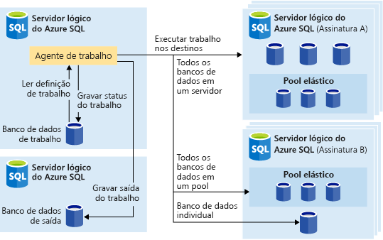
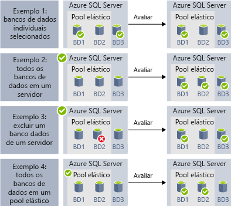

# Automatizar tarefas de gerenciamento usando trabalhos elásticos (versão prévia)

[!INCLUDE[appliesto-sqldb](../includes/appliesto-sqldb.md)]

Você pode criar e agendar trabalhos elásticos que podem ser executados periodicamente em um ou vários bancos de dados SQL do Azure para executar consultas T-SQL (Transact-SQL) e executar tarefas de manutenção. 

É possível definir o banco de dados de destino ou grupos de bancos de dados em que o trabalho será executado e também definir agendas para executar um trabalho.
Um trabalho lida com a tarefa de fazer logon no banco de dados de destino. Você também define, mantém e persiste scripts T-SQL que serão executados em um grupo de bancos de dados.

Cada trabalho registrará o status de execução e também repetirá as operações se ocorrer uma falha.

## Quando usar trabalhos elásticos

Há vários cenários nos quais você pode usar a automação de trabalhos elásticos:

- Automatizar tarefas de gerenciamento e, em seguida, agendá-las para serem executadas a todo dia da semana, após horas etc.
  - Implantar alterações de esquema, gerenciamento de credenciais, coleta de dados de desempenho ou coleta de telemetria do locatário (cliente).
  - Atualizar dados de referência (informações comuns a todos os bancos de dados), carregar dados do armazenamento de blobs do Azure.
- Configure trabalhos para serem executados em um conjunto de bancos de dados de modo recorrente, por exemplo, fora dos horários de pico.
  - Coletar resultados de consulta de um conjunto de bancos de dados em uma tabela central em uma base contínua. Consultas de desempenho podem ser executadas continuamente e configuradas para disparar tarefas adicionais a serem executadas.
- Coletar dados para relatórios
  - Agregue dados de uma coleção de bancos de dados em uma tabela de destino único.
  - Executar consultas de processamento de dados mais longas em um grande conjunto de bancos de dados, por exemplo, a coleta de telemetria do cliente. Resultados são coletados em uma única tabela de destino para análise posterior.
- Movimentações de dados 

### Automação em outras plataformas

Considere as seguintes tecnologias de agendamento de trabalhos em diferentes plataformas:

- Os **trabalhos elásticos** são os serviços de Agendamento de Trabalhos que executam trabalhos personalizados em um ou muitos bancos de dados no Banco de Dados SQL do Azure.
- Os **trabalhos do SQL Agent** são executados pelo serviço SQL Agent que continua a ser usado para automação de tarefas no SQL Server e também está incluído com Instâncias Gerenciadas de SQL do Azure. Os Trabalhos do SQL Agent não estão disponíveis no Banco de Dados SQL do Azure.

Os trabalhos elásticos podem ter como destino [Bancos de Dados SQL do Azure](sql-database-paas-overview.md), [pools elásticos do Banco de Dados SQL do Azure](elastic-pool-overview.md) e Banco de Dados SQL do Azure nos [mapas de fragmentos](elastic-scale-shard-map-management.md).

Para automação de trabalho de script T-SQL no SQL Server e na Instância Gerenciada de SQL do Azure, considere o [SQL Agent](job-automation-managed-instances.md). 

Para automação de trabalho de script T-SQL no Azure Synapse Analytics, considere [pipelines com gatilhos recorrentes](../../synapse-analytics/data-integration/concepts-data-factory-differences.md), que são [baseados no Azure Data Factory](../../synapse-analytics/data-integration/concepts-data-factory-differences.md).

Vale a pena observar as diferenças entre o SQL Agent (disponível no SQL Server e como parte da Instância Gerenciada de SQL) e o agente Trabalho Elástico do Banco de Dados (que pode executar T-SQL em Banco de Dados SQL do Azure ou em bancos de dados no SQL Server e na Instância Gerenciada de SQL do Azure, no Azure Synapse Analytics).

| |Trabalhos elásticos |SQL Agent |
|---------|---------|---------|
|**Escopo** | Qualquer número de bancos de dados no Banco de Dados SQL do Azure e/ou data warehouses na mesma nuvem do Azure do agente de trabalho. Os destinos podem estar em diferentes servidores, assinaturas e/ou regiões.   Os grupos de destino podem ser compostos de bancos de dados ou data warehouses individuais ou dos bancos de dados em um servidor, pool ou mapa de fragmentos (enumerados dinamicamente no runtime do trabalho). | Qualquer banco de dados individual na mesma instância que o SQL Agent. O recurso de administração multisservidor do SQL Server Agent permite que instâncias mestre/de destino coordenem a execução do trabalho, embora esse recurso não esteja disponível na instância gerenciada de SQL. |
|**Ferramentas e APIs com suporte** | Portal, PowerShell, T-SQL, Azure Resource Manager | T-SQL, SSMS (SQL Server Management Studio) |
 
## Destinos de trabalho elástico

Os **trabalhos elásticos** permitem executar um ou mais scripts T-SQL em paralelo, em um grande número de bancos de dados, seja com agendamento ou sob demanda.

É possível executar trabalhos agendados em qualquer combinação de bancos de dados: um ou mais bancos de dados individuais, todos os bancos de dados em um servidor, todos os bancos de dados em um pool elástico ou mapa de fragmentos, com a flexibilidade extra de poder incluir ou excluir qualquer banco de dados. Os trabalhos podem ser executados em diversos servidores e pools, até mesmo em bancos de dados presentes em assinaturas diferentes. Os servidores e pools são enumerados dinamicamente no runtime e, portanto, os trabalhos são executados em todos os bancos de dados existentes no grupo de destino no momento da execução.

A imagem a seguir mostra um agente de trabalho executando trabalhos em diferentes tipos de grupos de destino:

### Componentes do trabalho elástico

|Componente | Descrição (confira mais detalhes abaixo da tabela) |
|---------|---------|
|[**Agente de Trabalho Elástico**](#elastic-job-agent) | O recurso do Azure que você cria para executar e gerenciar trabalhos. |
|[**Banco de dados de trabalhos**](#elastic-job-database) | Um banco de dados no Banco de Dados SQL do Azure que o agente de trabalho usa para armazenar dados relacionados ao trabalho, definições de trabalho etc. |
|[**Grupo de destino**](#target-group) | O conjunto de servidores, pools, bancos de dados e mapas de fragmentos nos quais o trabalho é executado. |
|[**Trabalho**](#elastic-jobs-and-job-steps) | Um trabalho é uma unidade de trabalho composta de uma ou mais etapas de trabalho. As etapas de trabalho especificam qual script T-SQL deve ser executado, bem como outros detalhes necessários para a execução do script. |

#### Agente de trabalho elástico

Um agente de Trabalho Elástico é o recurso do Azure para criar, executar e gerenciar trabalhos. O agente de Trabalho Elástico é um recurso do Azure que você cria no portal (há suporte também para [PowerShell](elastic-jobs-powershell-create.md) e REST).

A criação de um **Agente de Trabalho Elástico** requer um banco de dados existente no Banco de Dados SQL do Azure. O agente configura esse Banco de Dados SQL do Azure existente como o [*Banco de dados do trabalho*](#elastic-job-database).

O agente de Trabalho Elástico é gratuito. O banco de dados de trabalhos usa a mesma taxa que qualquer banco de dados no Banco de Dados SQL do Azure.

#### Banco de dados de trabalho elástico

O *banco de dados de trabalhos* é usado para definir os trabalhos e rastrear o status e o histórico das execuções de trabalho. O *Banco de dados de trabalhos* também é usado para armazenar metadados de agente, logs, resultados e definições de trabalho. Além disso, ele contém muitos procedimentos armazenados úteis e outros objetos de banco de dados usados para criar, executar e gerenciar trabalhos usando o T-SQL.

Na versão prévia atual, um banco de dados existente no Banco de Dados SQL do Azure (S0 ou superior) é necessário para criar um agente de Trabalho Elástico.

O *Banco de dados de trabalhos* deve ser um objetivo de serviço limpo, vazio, S0 ou superior no Banco de Dados SQL do Azure. O objetivo de serviço recomendado do *Banco de dados de trabalhos* é S1 ou superior, mas a opção ideal depende das necessidades de desempenho dos trabalhos: o número de etapas de trabalho, o número de destinos de trabalho e a frequência com que os trabalhos são executados. 

Se as operações no banco de dados de trabalhos forem mais lentas do que o esperado, [monitore](monitor-tune-overview.md#azure-sql-database-and-azure-sql-managed-instance-resource-monitoring) o desempenho do banco de dados e a utilização de recursos no banco de dados de trabalhos durante períodos de lentidão usando o portal do Azure ou a DMV [sys.dm_db_resource_stats](/sql/relational-databases/system-dynamic-management-views/sys-dm-db-resource-stats-azure-sql-database). Se a utilização de um recurso, como CPU, E/S de Dados ou Gravação de Log, se aproximar de 100% e se correlacionar com períodos de lentidão, considere a possibilidade de dimensionar de maneira incremental o banco de dados para objetivos de serviço superiores (no [modelo de DTU](service-tiers-dtu.md) ou no [modelo de vCore](service-tiers-vcore.md)) até que o desempenho do banco de dados de trabalhos seja suficientemente aprimorado.

##### Permissões do banco de dados de trabalho elástico

Durante a criação do agente de trabalho, um esquema, tabelas e uma função chamada *jobs_reader* são criados no *Banco de dados de trabalhos*. A função, projetada para oferecer aos administradores um controle de acesso mais rígido para monitoramento de trabalho, tem a seguinte permissão:

|Nome da função |permissões de esquema 'jobs' |permissões de esquema 'jobs_internal' |
|---------|---------|---------|
|**jobs_reader** | SELECT | Nenhum |

> [!IMPORTANT]
> Considere as implicações de segurança antes de conceder acesso ao *banco de dados de trabalhos* como um administrador de banco de dados. Um usuário mal-intencionado com permissões para criar ou editar tarefas pode criar ou editar um trabalho que usa uma credencial armazenada para se conectar a um banco de dados sob controle do usuário mal-intencionado, o que permitiria que o usuário mal-intencionado determinasse a senha da credencial.

#### Grupo de destino

Um *grupo de destino* define o conjunto de bancos de dados em que uma etapa de trabalho será executada. Um grupo de destino pode conter qualquer quantidade ou combinação dos seguintes itens:

- **Servidor SQL lógico**: se um servidor for especificado, todos os bancos de dados existentes no servidor no momento da execução do trabalho farão parte do grupo. A credencial de banco de dados mestre deve ser fornecida para que o grupo possa ser enumerado e atualizado antes da execução do trabalho. Para obter mais informações sobre servidores lógicos, confira [O que é um servidor no Banco de Dados SQL do Azure e no Azure Synapse Analytics?](logical-servers.md).
- **Pool elástico**: se um pool elástico for especificado, todos os bancos de dados presentes no pool elástico no momento da execução do trabalho farão parte do grupo. Assim como ocorre para servidores, a credencial de banco de dados mestre deve ser fornecida para que o grupo possa ser atualizado antes da execução do trabalho.
- **Banco de dados único**: especifica um ou mais bancos de dados individuais como parte do grupo.
- **Mapa de fragmentos**: bancos de dados de um mapa de fragmentos.

> [!TIP]
> No momento da execução do trabalho, a *enumeração dinâmica* reavalia o conjunto de bancos de dados em grupos de destino que incluem servidores ou grupos. A enumeração dinâmica garante que os **trabalhos serão executados em todos os bancos de dados existentes no servidor ou pool no momento da execução do trabalho**. A reavaliação da lista de bancos de dados no runtime é especialmente útil para cenários em que a associação de pools ou servidores é alterada com frequência.

É possível incluir ou excluir pools e bancos de dados individuais do grupo. Isso permite a criação de um grupo de destino com qualquer combinação de bancos de dados. Por exemplo, você pode adicionar um servidor a um grupo de destino, mas excluir bancos de dados específicos em um pool elástico (ou excluir um pool inteiro).

Um grupo de destino pode incluir bancos de dados em várias assinaturas e em várias regiões. Observe que as execuções entre regiões têm maior latência do que as execuções dentro da mesma região.

Os exemplos a seguir mostram como definições de grupo-alvo diferentes são enumeradas dinamicamente no momento da execução do trabalho para determinar em quais bancos de dados o trabalho será executado:

O **exemplo 1** mostra um grupo de destino que consiste em uma lista de bancos de dados individuais. Quando uma etapa de trabalho é executada usando esse grupo de destino, a ação da etapa do trabalho é executada em cada um dos bancos de dados. 
O **Exemplo 2** mostra um grupo de destino que contém um servidor como destino. Quando uma etapa de trabalho é executada usando esse grupo de destino, o servidor é enumerado dinamicamente para determinar a lista de bancos de dados que estão atualmente no servidor. A ação da etapa de trabalho será executada em cada um desses bancos de dados. 
O **exemplo 3** mostra um grupo de destino semelhante ao do *exemplo 2*, mas o banco de dados individual é especificamente excluído. A ação da etapa de trabalho *não* será executada no banco de dados excluído. 
O **exemplo 4** mostra um grupo de destino que contém um pool elástico como destino. Semelhante ao *exemplo 2*, o pool será enumerado dinamicamente no tempo de execução do trabalho para determinar a lista de bancos de dados no pool.
  

O **Exemplo 5** e o **Exemplo 6** mostram cenários avançados em que os servidores, os pools elásticos e os bancos de dados podem ser combinados usando regras de inclusão e exclusão. 
O **exemplo 7** mostra que os fragmentos em um mapa de fragmentos também podem ser avaliados no tempo de execução do trabalho.

> [!NOTE]
> O próprio Banco de dados de trabalhos pode ser o destino de um trabalho. Nesse cenário, o Banco de dados de trabalhos é tratado da mesma forma que qualquer outro banco de dados de destino. O usuário do trabalho precisa ser criado e receber permissões suficientes no Banco de dados de trabalhos, e a credencial no escopo do banco de dados para o usuário do trabalho também precisa existir no banco de dados de trabalhos, assim como ele faz para qualquer outro banco de dados de destino.

#### Trabalhos elásticos e etapas de trabalho

Um *trabalho* é uma unidade de trabalho executada com agendamento ou como um único trabalho. Um trabalho consiste em uma ou mais *etapas de trabalho*.

Cada etapa de trabalho especifica um script T-SQL a ser executado, um ou mais grupos de destino no qual executar o script T-SQL e as credenciais de que o agente de trabalho precisa para se conectar ao banco de dados de destino. Cada etapa de trabalho tem tempo limite e políticas de repetição personalizáveis e pode, opcionalmente, especificar parâmetros de saída.

#### Saída do trabalho

O resultado das etapas de um trabalho em cada banco de dados de destino é registrado em detalhes, e a saída do script pode ser capturada em uma tabela específica. Você pode especificar um banco de dados para salvar os dados retornados de um trabalho.

#### Histórico de trabalho

Veja o histórico de execução do trabalho elástico no *Banco de dados de trabalhos* [consultando a tabela jobs.job_executions](elastic-jobs-tsql-create-manage.md#monitor-job-execution-status). Um trabalho de limpeza do sistema limpa o histórico de execuções com mais de 45 dias. Para remover o histórico de menos de 45 dias, chame o procedimento armazenado **sp_purge_history** no *Banco de dados de trabalhos*.

#### Status do trabalho

É possível monitorar as execuções do trabalho elástico no *Banco de dados de trabalhos* [consultando a tabela jobs.job_executions](elastic-jobs-tsql-create-manage.md#monitor-job-execution-status). 

### Desempenho, capacidade e limitações do agente

Os Trabalhos Elásticos usam o mínimo de recursos de computação enquanto aguardam a conclusão dos trabalhos de longa execução.

Dependendo do tamanho do grupo de destino de bancos de dados e do tempo de execução desejado para um trabalho (número de trabalhos simultâneos), o agente requer quantidades diferentes de computação e desempenho do *banco de dados de trabalhos* (quanto mais destinos e trabalhos, maior será a quantidade de computação necessária).

Atualmente, o limite é de 100 trabalhos simultâneos.

#### Impedir que os trabalhos reduzam o desempenho do banco de dados de destino

Para que os recursos não fiquem sobrecarregados ao executar trabalhos em bancos de dados em um pool elástico do SQL, os trabalhos podem ser configurados para limitar o número de bancos de dados em que o trabalho pode ser executado simultaneamente.

## Próximas etapas

- [Como criar e gerenciar trabalhos elásticos](elastic-jobs-overview.md)
- [Criar e gerenciar trabalhos elásticos usando o PowerShell](elastic-jobs-powershell-create.md)
- [Criar e gerenciar Trabalhos Elásticos usando T-SQL (Transact-SQL)](elastic-jobs-tsql-create-manage.md)