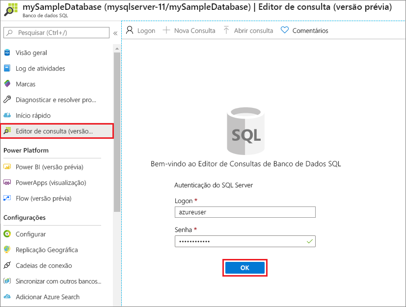
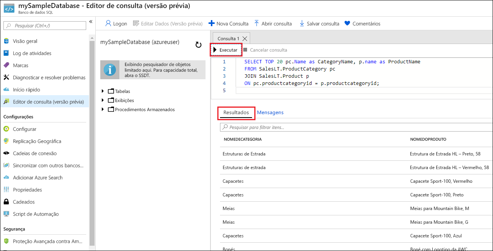

# <a name="quickstart-create-an-azure-sql-database-single-database"></a>Início Rápido: Criar um banco de dados individual do Banco de Dados SQL do Azure

Neste início rápido, você criará um [banco de dados individual](single-database-overview.md) no Banco de Dados SQL do Azure usando o portal do Azure, um script do PowerShell ou um script da CLI do Azure. Em seguida, você consultará o banco de dados usando o **Editor de consultas** no portal do Azure.


## <a name="prerequisite"></a>Pré-requisito

- Uma assinatura ativa do Azure. Se você não tiver uma, [crie uma conta gratuita](https://azure.microsoft.com/free/).

## <a name="create-a-single-database"></a>Criar um banco de dados individual

Este início rápido cria um banco de dados individual na [camada de computação sem servidor](serverless-tier-overview.md).

# <a name="portal"></a>[Portal](#tab/azure-portal)

Para criar um banco de dados individual no portal do Azure, este início rápido começa na página SQL do Azure.

1. Navegue até a página [Selecionar uma opção de Implantação do SQL](https://portal.azure.com/#create/Microsoft.AzureSQL).
1. Em **Bancos de dados SQL**, deixe **Tipo de recurso** definido como **Banco de dados individual** e selecione **Criar**.

   

1. Na guia **Noções básicas** do formulário **Criar Banco de Dados SQL**, em **Detalhes do projeto**, selecione a **Assinatura** do Azure desejada.
1. Para **Grupo de recursos**, selecione **Criar**, insira *myResourceGroup* e selecione **OK**.
1. Para **Nome do banco de dados**, insira *mySampleDatabase*.
1. Para **Servidor**, selecione **Criar** e preencha o formulário **Novo servidor** com os seguintes valores:
   - **Nome do servidor**: Insira *mysqlserver* e adicione caracteres para que o nome seja exclusivo. Não podemos fornecer um nome do servidor exato a ser usado porque os nomes dos servidores devem ser globalmente exclusivos para todos os servidores no Azure, não apenas para uma assinatura. Portanto, insira algo como mysqlserver12345 e o portal informará se esse nome está disponível ou não.
   - **Logon de administrador do servidor**: insira *azureuser*.
   - **Senha**: insira uma senha que atenda aos requisitos e insira-a novamente no campo **Confirmar senha**.
   - **Localização**: Selecione uma localização na lista suspensa.

   Selecione **OK**.

1. Deixe **Deseja usar o pool elástico do SQL** definido como **Não**.
1. Em **Computação + armazenamento**, selecione **Configurar banco de dados**.
1. Este início rápido usa um banco de dados sem servidor, portanto, selecione **Sem servidor** e **Aplicar**. 

      

1. Selecione **Avançar: Rede** na parte inferior da página.

   

1. Na guia **Rede**, para **Método de conectividade**, selecione **Ponto de extremidade público**.
1. Para **Regras de firewall**, defina **Adicionar endereço IP do cliente atual** como **Sim**. Deixe **Permitir que serviços e recursos do Azure acessem este servidor** definido como **Não**.
1. Selecione **Avançar: Configurações adicionais** na parte inferior da página.

   
  

1. Na guia **Configurações adicionais**, na seção **Fonte de dados**, para **Usar dados existentes**, selecione **Exemplo**. Isso cria um banco de dados de exemplo AdventureWorksLT, de modo que há algumas tabelas e os dados a consultar e com os quais experimentar, em vez de um banco de dados em branco vazio.
1. Você também pode habilitar o [Azure Defender para SQL](../database/azure-defender-for-sql.md).
1. Opcionalmente, defina a [janela de manutenção](../database/maintenance-window.md) para que a manutenção planejada seja executada no melhor momento para seu banco de dados.
1. Selecione **Examinar + criar** na parte inferior da página:

   

1. Na página **Examinar + criar**, após examinar, selecione **Criar**.

# <a name="azure-cli"></a>[CLI do Azure](#tab/azure-cli)

## <a name="launch-azure-cloud-shell"></a>Iniciar o Azure Cloud Shell

O Azure Cloud Shell é um shell interativo grátis que pode ser usado para executar as etapas neste artigo. Ele tem ferramentas do Azure instaladas e configuradas para usar com sua conta. 

Para abrir o Cloud Shell, basta selecionar **Experimentar** no canto superior direito de um bloco de código. Você também pode iniciar o Cloud Shell em uma guia separada do navegador indo até [https://shell.azure.com](https://shell.azure.com). Selecione **Copiar** para copiar os blocos de código, cole o código no Cloud Shell e depois pressione **Enter** para executá-lo.

## <a name="set-parameter-values"></a>Definir valores de parâmetro

Os valores a seguir são usados em comandos subsequentes para criar o banco de dados e os recursos necessários. Os nomes de servidor precisam ser globalmente exclusivos em todo o Azure para que a função $RANDOM seja usada para criar o nome do servidor. Substitua os valores 0.0.0.0 no intervalo de endereços IP para que correspondam ao seu ambiente específico.

```azurecli-interactive
# Set the resource group name and location for your server
resourceGroupName=myResourceGroup
location=eastus

# Set an admin login and password for your database
adminlogin=azureuser
password=Azure1234567!

# Set a server name that is unique to Azure DNS (<server_name>.database.windows.net)
serverName=server-$RANDOM

# Set the ip address range that can access your database
startip=0.0.0.0
endip=0.0.0.0
```

## <a name="create-a-resource-group"></a>Criar um grupo de recursos

Crie um grupo de recursos com o comando [az group create](/cli/azure/group). Um grupo de recursos do Azure é um contêiner lógico no qual os recursos do Azure são implantados e gerenciados. O exemplo a seguir cria um grupo de recursos chamado *myResourceGroup* na localização *eastus*:

```azurecli-interactive
az group create --name $resourceGroupName --location $location
```

## <a name="create-a-server"></a>Criar um servidor

Crie um servidor com o comando [az sql server create](/cli/azure/sql/server).

```azurecli-interactive
az sql server create \
    --name $serverName \
    --resource-group $resourceGroupName \
    --location $location  \
    --admin-user $adminlogin \
    --admin-password $password
```


## <a name="configure-a-firewall-rule-for-the-server"></a>Configurar uma regra de firewall para o servidor

Crie uma regra de firewall com o comando [az sql server firewall-rule create](/cli/azure/sql/server/firewall-rule).

```azurecli-interactive
az sql server firewall-rule create \
    --resource-group $resourceGroupName \
    --server $serverName \
    -n AllowYourIp \
    --start-ip-address $startip \
    --end-ip-address $endip
```


## <a name="create-a-single-database-with-azure-cli"></a>Criar um banco de dados individual usando a CLI do Azure

Crie um banco de dados com o comando [az sql db create](/cli/azure/sql/db). O código a seguir cria


```azurecli-interactive
az sql db create \
    --resource-group $resourceGroupName \
    --server $serverName \
    --name mySampleDatabase \
    --sample-name AdventureWorksLT \
    --edition GeneralPurpose \
    --compute-model Serverless \
    --family Gen5 \
    --capacity 2
```


# <a name="powershell"></a>[PowerShell](#tab/azure-powershell)

Crie um grupo de recursos, um servidor e um banco de dados individual usando o Windows PowerShell.

## <a name="launch-azure-cloud-shell"></a>Iniciar o Azure Cloud Shell

O Azure Cloud Shell é um shell interativo grátis que pode ser usado para executar as etapas neste artigo. Ele tem ferramentas do Azure instaladas e configuradas para usar com sua conta. 

Para abrir o Cloud Shell, basta selecionar **Experimentar** no canto superior direito de um bloco de código. Você também pode iniciar o Cloud Shell em uma guia separada do navegador indo até [https://shell.azure.com](https://shell.azure.com). Selecione **Copiar** para copiar os blocos de código, cole o código no Cloud Shell e depois pressione **Enter** para executá-lo.

## <a name="set-parameter-values"></a>Definir valores de parâmetro

Os valores a seguir são usados em comandos subsequentes para criar o banco de dados e os recursos necessários. Os nomes de servidor precisam ser globalmente exclusivos em todo o Azure para que o cmdlet Get-Random seja usado para criar o nome do servidor. Substitua os valores 0.0.0.0 no intervalo de endereços IP para que correspondam ao seu ambiente específico.

```azurepowershell-interactive
   # Set variables for your server and database
   $resourceGroupName = "myResourceGroup"
   $location = "eastus"
   $adminLogin = "azureuser"
   $password = "Azure1234567!"
   $serverName = "mysqlserver-$(Get-Random)"
   $databaseName = "mySampleDatabase"

   # The ip address range that you want to allow to access your server
   $startIp = "0.0.0.0"
   $endIp = "0.0.0.0"

   # Show randomized variables
   Write-host "Resource group name is" $resourceGroupName
   Write-host "Server name is" $serverName
```


## <a name="create-resource-group"></a>Criar grupo de recursos

Crie um grupo de recursos do Azure com [New-AzResourceGroup](/powershell/module/az.resources/new-azresourcegroup). Um grupo de recursos é um contêiner lógico no qual os recursos do Azure são implantados e gerenciados.

```azurepowershell-interactive
   Write-host "Creating resource group..."
   $resourceGroup = New-AzResourceGroup -Name $resourceGroupName -Location $location -Tag @{Owner="SQLDB-Samples"}
   $resourceGroup
```


## <a name="create-a-server"></a>Criar um servidor

Crie um servidor com o cmdlet [New-AzSqlServer](/powershell/module/az.sql/new-azsqlserver).

```azurepowershell-interactive
  Write-host "Creating primary server..."
   $server = New-AzSqlServer -ResourceGroupName $resourceGroupName `
      -ServerName $serverName `
      -Location $location `
      -SqlAdministratorCredentials $(New-Object -TypeName System.Management.Automation.PSCredential `
      -ArgumentList $adminLogin, $(ConvertTo-SecureString -String $password -AsPlainText -Force))
   $server
```

## <a name="create-a-firewall-rule"></a>Criar uma regra de firewall

Crie uma regra de firewall de servidor com o cmdlet [New-AzSqlServerFirewallRule](/powershell/module/az.sql/new-azsqlserverfirewallrule).

```azurepowershell-interactive
   Write-host "Configuring server firewall rule..."
   $serverFirewallRule = New-AzSqlServerFirewallRule -ResourceGroupName $resourceGroupName `
      -ServerName $serverName `
      -FirewallRuleName "AllowedIPs" -StartIpAddress $startIp -EndIpAddress $endIp
   $serverFirewallRule
```


## <a name="create-a-single-database-with-powershell"></a>Criar um banco de dados individual usando o PowerShell

Crie um banco de dados individual com o cmdlet [New-AzSqlDatabase](/powershell/module/az.sql/new-azsqldatabase).

```azurepowershell-interactive
   Write-host "Creating a gen5 2 vCore serverless database..."
   $database = New-AzSqlDatabase  -ResourceGroupName $resourceGroupName `
      -ServerName $serverName `
      -DatabaseName $databaseName `
      -Edition GeneralPurpose `
      -ComputeModel Serverless `
      -ComputeGeneration Gen5 `
      -VCore 2 `
      -MinimumCapacity 2 `
      -SampleName "AdventureWorksLT"
   $database
```

---


## <a name="query-the-database"></a>Consultar o banco de dados

Depois que o banco de dados for criado, você poderá usar o **Editor de consultas (versão prévia)** no portal do Azure para conectar-se ao banco de dados e consultar dados.

1. No portal, pesquise e selecione **bancos de dados SQL** e selecione seu banco de dados na lista.
1. Na página para o seu banco de dados, selecione **Editor de consultas (versão prévia)** no menu à esquerda.
1. Insira suas informações de logon do administrador do servidor e selecione **OK**.

   

1. Insira a consulta a seguir no painel **Editor de consultas**.

   ```sql
   SELECT TOP 20 pc.Name as CategoryName, p.name as ProductName
   FROM SalesLT.ProductCategory pc
   JOIN SalesLT.Product p
   ON pc.productcategoryid = p.productcategoryid;
   ```

1. Selecione **Executar** e, em seguida, examine os resultados da consulta no painel **Resultados**.

   

1. Feche a página **Editor de consultas** e selecione **OK** quando solicitado para descartar as edições não salvas.

## <a name="clean-up-resources"></a>Limpar os recursos

Mantenha o grupo de recursos, o servidor e o banco de dados individual para as próximas etapas e saiba como conectar e consultar seu banco de dados com métodos diferentes.

Quando você terminar de usar esses recursos, você poderá excluir o grupo de recursos criado, que também excluirá o servidor e o banco de dados individual dentro dele.

### <a name="portal"></a>[Portal](#tab/azure-portal)

Para excluir **myResourceGroup** e todos os recursos dele usando o portal do Azure:

1. No portal, pesquise e selecione **Grupos de recursos** e, em seguidas, **myResourceGroup** na lista.
1. Na página Grupo de recursos, selecione **Excluir grupo de recursos**.
1. Em **Digite o nome do grupo de recursos**, insira *myResourceGroup* e selecione **Excluir**.

### <a name="azure-cli"></a>[CLI do Azure](#tab/azure-cli)

Para excluir o grupo de recursos e os recursos dele, execute o seguinte comando da CLI do Azure usando o nome do seu grupo de recursos:

```azurecli-interactive
az group delete --name $resourceGroupName
```

### <a name="powershell"></a>[PowerShell](#tab/azure-powershell)

Para excluir o grupo de recursos e os recursos dele, execute o seguinte cmdlet do PowerShell usando o nome do seu grupo de recursos:

```azurepowershell-interactive
Remove-AzResourceGroup -Name $resourceGroupName
```

---

## <a name="next-steps"></a>Próximas etapas

[Conectar e consultar](connect-query-content-reference-guide.md) seu banco de dados usando diferentes ferramentas e linguagens:
> [!div class="nextstepaction"]
> [Conectar e consultar usando o SQL Server Management Studio](connect-query-ssms.md)
>
> [Conectar e consultar usando o Azure Data Studio](/sql/azure-data-studio/quickstart-sql-database?toc=/azure/sql-database/toc.json)

Deseja otimizar e reduzir seus gastos com a nuvem?

> [!div class="nextstepaction"]
> [Comece a analisar os custos com o Gerenciamento de Custos](../../cost-management-billing/costs/quick-acm-cost-analysis.md?WT.mc_id=costmanagementcontent_docsacmhorizontal_-inproduct-learn)