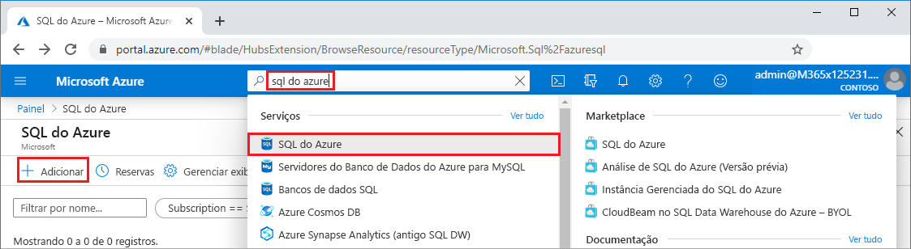
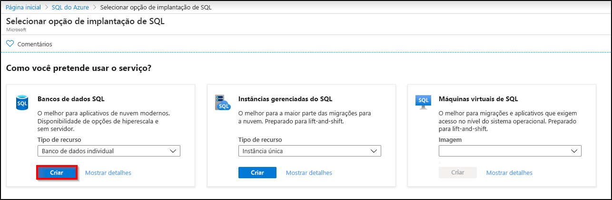
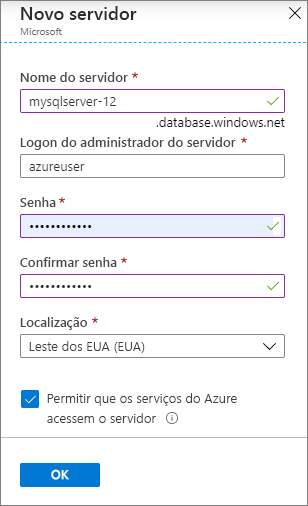
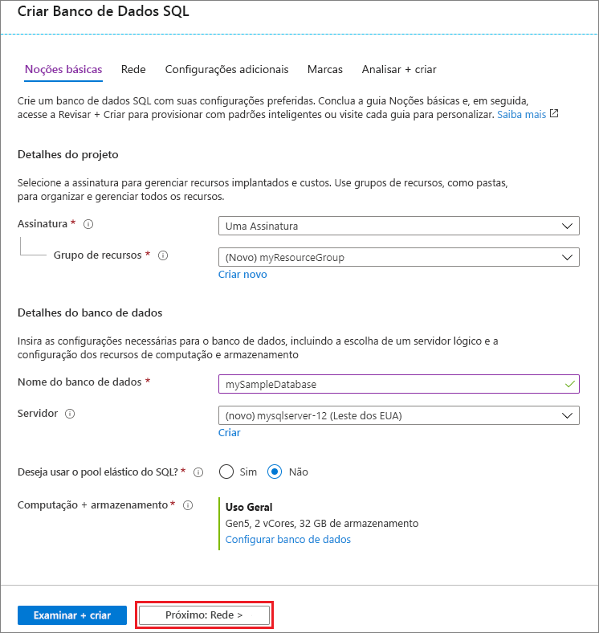
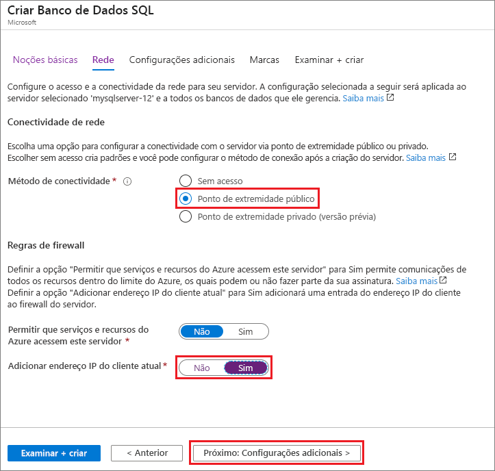
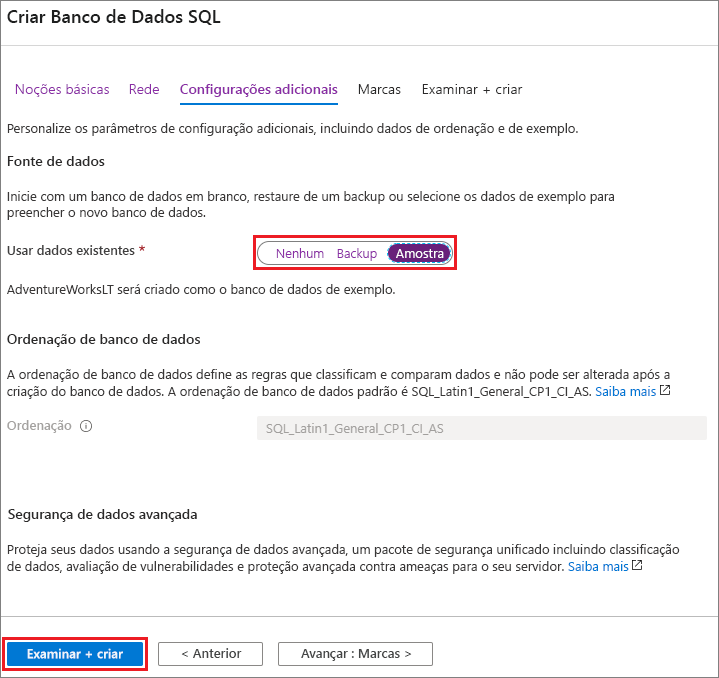

Nesta etapa, você criará um [servidor SQL lógico](../database/logical-servers.md) e um [banco de dados individual](../database/single-database-overview.md) que usa os dados de exemplo da AdventureWorksLT. Você pode criar o banco de dados usando os menus e as telas do portal do Azure ou um script da CLI do Azure ou do PowerShell no Azure Cloud Shell.

Todos os métodos incluem a configuração de uma regra de firewall no nível do servidor para permitir que o endereço IP público do computador que você está usando acesse o servidor. Para obter mais informações sobre como criar regras de firewall no nível do servidor, confira [Criar uma regra de firewall no nível do servidor](../database/firewall-create-server-level-portal-quickstart.md). Também é possível definir regras de firewall no nível do banco de dados. Confira [Criar uma regra de firewall no nível do banco de dados](/sql/relational-databases/system-stored-procedures/sp-set-database-firewall-rule-azure-sql-database).

# <a name="portal"></a>[Portal](#tab/azure-portal)

Para criar um grupo de recursos, um servidor e um banco de dados individual no portal do Azure:

1. Entre no [portal](https://portal.azure.com).
1. Na barra de pesquisa, pesquise pelo **SQL Azure** e selecione-o.
1. Na página do **SQL Azure**, selecione **Adicionar**.

   

1. Na página **Selecionar opção de implantação do SQL**, selecione o bloco **Bancos de dados SQL**, com **Banco de dados individual** em **Tipo de recurso**. Veja mais informações sobre os diferentes bancos de dados selecionando **Mostrar detalhes**.
1. Selecione **Criar**.

   

1. Na guia **Básico** do formulário **Criar banco de dados SQL**, em **Detalhes do projeto**, selecione a **Assinatura** correta do Azure caso ainda não esteja selecionada.
1. Em **Grupo de recursos**, selecione **Criar**, insira *myResourceGroup* e selecione **OK**.
1. Em **Detalhes do banco de dados**, para **Nome do banco de dados**, insira *mySampleDatabase*.
1. Para **Servidor**, selecione **Criar** e preencha o formulário **Novo servidor** da seguinte maneira:
   - **Nome do servidor**: insira *mysqlserver* e alguns caracteres para que o nome seja exclusivo.
   - **Logon de administrador do servidor**: insira *azureuser*.
   - **Senha**: insira uma senha que atenda aos requisitos e insira-a novamente no campo **Confirmar senha**.
   - **Localização**: abra o menu suspenso e escolha um local, como **(EUA) Leste dos EUA**.

   Selecione **OK**.

   

   Registre o logon de administrador do servidor e a senha para fazer logon no servidor e nos respectivos bancos de dados. Caso esqueça seu logon ou senha, obtenha o nome de logon ou redefina a senha na página do **servidor SQL** após a criação do banco de dados. Para abrir a página do **servidor SQL**, selecione o nome do servidor na página **Visão Geral** do banco de dados.

1. Em **Computação + armazenamento**, se quiser reconfigurar os padrões, selecione **Configurar banco de dados**.

   Na página **Configurar**, você pode:
   - Alterar a **Camada de computação** de **Provisionada** para **Sem servidor**.
   - Examinar e alterar as configurações de **vCores** e **Tamanho máximo de dados**.
   - Selecionar **Alterar configuração** para alterar a geração do hardware.

   Depois de fazer as alterações, selecione **Aplicar**.

1. Selecione **Avançar: Rede** na parte inferior da página.

   

1. Na guia **Rede**, em **Método de conectividade**, selecione **Ponto de extremidade público**.
1. Em **Regras de firewall**, defina **Adicionar endereço IP do cliente atual** como **Sim**.
1. Selecione **Avançar: Configurações adicionais** na parte inferior da página.

   
  
   Para obter mais informações sobre s configurações de firewall, confira [Permitir que serviços e recursos do Azure acessem este servidor](../database/network-access-controls-overview.md) e [Adicionar um ponto de extremidade privado](../database/private-endpoint-overview.md).

1. Na guia **Configurações adicionais**, na seção **Fonte de dados**, para **Usar dados existentes**, selecione **Exemplo**.
1. Você também pode habilitar [Azure Defender para SQL](../database/azure-defender-for-sql.md).
1. Opcionalmente, defina a [janela de manutenção](../database/maintenance-window.md) para que a manutenção planejada seja executada no melhor momento para seu banco de dados.
1. Selecione **Revisar + criar** na parte inferior da página.

   

1. Depois de revisar as configurações, selecione **Criar**.

# <a name="azure-cli"></a>[CLI do Azure](#tab/azure-cli)

Crie um grupo de recursos do Azure, um servidor e um banco de dados individual usando a CLI (interface de linha de comando) do Azure. Se não quiser usar o Azure Cloud Shell, [instale a CLI do Azure](/cli/azure/install-azure-cli) em seu computador.

Para executar o exemplo de código a seguir no Azure Cloud Shell, selecione **Experimentar** na barra de título do exemplo de código. Quando o Cloud Shell for aberto, selecione **Copiar** na barra de título do exemplo de código e cole o exemplo de código na janela do Cloud Shell. No código, substitua `<Subscription ID>` por sua ID de Assinatura do Azure e, para `$startip` e `$endip`, substitua `0.0.0.0` pelo endereço IP público do computador que está usando.

Siga os prompts na tela para entrar no Azure e executar o código.

Você também pode usar o Azure Cloud Shell no portal do Azure selecionando o ícone do Cloud Shell na barra superior.

   

Na primeira vez que usar o Cloud Shell no portal, selecione **Bash** na caixa de diálogo **Bem-vindo**. As sessões posteriores usarão a CLI do Azure em um ambiente Bash, ou você pode selecionar **Bash** na barra de controle do Cloud Shell.

O código da CLI do Azure a seguir cria um grupo de recursos, um servidor, um banco de dados individual e uma regra de firewall de IP no nível do servidor para acesso ao servidor. Não deixe de registrar o grupo de recursos e os nomes de servidor gerados para que possa gerenciá-los posteriormente.

```azurecli-interactive
#!/bin/bash

# Sign in to Azure and set execution context (if necessary)
az login
az account set --subscription <Subscription ID>

# Set the resource group name and location for your server
resourceGroupName=myResourceGroup-$RANDOM
location=westus2

# Set an admin login and password for your database
adminlogin=azureuser
password=Azure1234567

# Set a server name that is unique to Azure DNS (<server_name>.database.windows.net)
servername=server-$RANDOM

# Set the ip address range that can access your database
startip=0.0.0.0
endip=0.0.0.0

# Create a resource group
az group create \
    --name $resourceGroupName \
    --location $location

# Create a server in the resource group
az sql server create \
    --name $servername \
    --resource-group $resourceGroupName \
    --location $location  \
    --admin-user $adminlogin \
    --admin-password $password

# Configure a server-level firewall rule for the server
az sql server firewall-rule create \
    --resource-group $resourceGroupName \
    --server $servername \
    -n AllowYourIp \
    --start-ip-address $startip \
    --end-ip-address $endip

# Create a gen5 2 vCore database in the server
az sql db create \
    --resource-group $resourceGroupName \
    --server $servername \
    --name mySampleDatabase \
    --sample-name AdventureWorksLT \
    --edition GeneralPurpose \
    --family Gen5 \
    --capacity 2 \
```

O código anterior usa estes comandos da CLI do Azure:

| Comando | Descrição |
|---|---|
| [az account set](/cli/azure/account#az_account_set) | Define uma assinatura como a assinatura ativa atual. |
| [az group create](/cli/azure/group#az_group_create) | Cria um grupo de recursos no qual todos os recursos são armazenados. |
| [az sql server create](/cli/azure/sql/server#az_sql_server_create) | Cria um servidor que hospeda bancos de dados e pools elásticos. |
| [az sql server firewall-rule create](/cli/azure/sql/server/firewall-rule##az_sql_server_firewall_rule_create) | Cria uma regra de firewall no nível do servidor. |
| [az sql db create](/cli/azure/sql/db#az_sql_db_create) | Cria um banco de dados. |

Para obter mais exemplos da CLI do Azure do Banco de Dados SQL do Azure, confira [Exemplos da CLI do Azure](../database/az-cli-script-samples-content-guide.md).

# <a name="powershell"></a>[PowerShell](#tab/azure-powershell)

Crie um grupo de recursos, um servidor e um banco de dados individual usando o Windows PowerShell. Se não quiser usar o Azure Cloud Shell, [instale o módulo do Azure PowerShell](/powershell/azure/install-az-ps).

[!INCLUDE [updated-for-az](../../../includes/updated-for-az.md)]

Para executar o exemplo de código a seguir no Azure Cloud Shell, selecione **Experimentar** na barra de título do código. Quando o Cloud Shell for aberto, selecione **Copiar** na barra de título do exemplo de código e cole o exemplo de código na janela do Cloud Shell. No código, substitua `<Subscription ID>` por sua ID de Assinatura do Azure e, para `$startIp` e `$endIp`, substitua `0.0.0.0` pelo endereço IP público do computador que está usando.

Siga os prompts na tela para entrar no Azure e executar o código.

Você também pode usar o Azure Cloud Shell no portal do Azure selecionando o ícone do Cloud Shell na barra superior.

   

Na primeira vez que usar o Cloud Shell no portal, selecione **PowerShell** na caixa de diálogo **Bem-vindo**. As sessões posteriores usarão o PowerShell ou você poderá selecioná-lo na barra de controle do Cloud Shell.

O código do PowerShell a seguir cria um grupo de recursos do Azure, um servidor, um banco de dados individual e uma regra de firewall para acesso ao servidor. Não deixe de registrar o grupo de recursos e os nomes de servidor gerados para que possa gerenciá-los posteriormente.

   ```powershell-interactive
   # Set variables for your server and database
   $subscriptionId = '<SubscriptionID>'
   $resourceGroupName = "myResourceGroup-$(Get-Random)"
   $location = "West US"
   $adminLogin = "azureuser"
   $password = "Azure1234567"
   $serverName = "mysqlserver-$(Get-Random)"
   $databaseName = "mySampleDatabase"

   # The ip address range that you want to allow to access your server
   $startIp = "0.0.0.0"
   $endIp = "0.0.0.0"

   # Show randomized variables
   Write-host "Resource group name is" $resourceGroupName
   Write-host "Server name is" $serverName

   # Connect to Azure
   Connect-AzAccount

   # Set subscription ID
   Set-AzContext -SubscriptionId $subscriptionId

   # Create a resource group
   Write-host "Creating resource group..."
   $resourceGroup = New-AzResourceGroup -Name $resourceGroupName -Location $location -Tag @{Owner="SQLDB-Samples"}
   $resourceGroup

   # Create a server with a system wide unique server name
   Write-host "Creating primary server..."
   $server = New-AzSqlServer -ResourceGroupName $resourceGroupName `
      -ServerName $serverName `
      -Location $location `
      -SqlAdministratorCredentials $(New-Object -TypeName System.Management.Automation.PSCredential `
      -ArgumentList $adminLogin, $(ConvertTo-SecureString -String $password -AsPlainText -Force))
   $server

   # Create a server firewall rule that allows access from the specified IP range
   Write-host "Configuring firewall for primary server..."
   $serverFirewallRule = New-AzSqlServerFirewallRule -ResourceGroupName $resourceGroupName `
      -ServerName $serverName `
      -FirewallRuleName "AllowedIPs" -StartIpAddress $startIp -EndIpAddress $endIp
   $serverFirewallRule

   # Create General Purpose Gen4 database with 1 vCore
   Write-host "Creating a gen5 2 vCore database..."
   $database = New-AzSqlDatabase  -ResourceGroupName $resourceGroupName `
      -ServerName $serverName `
      -DatabaseName $databaseName `
      -Edition GeneralPurpose `
      -VCore 2 `
      -ComputeGeneration Gen5 `
      -MinimumCapacity 2 `
      -SampleName "AdventureWorksLT"
   $database
   ```

O código anterior usa estes cmdlets do PowerShell:

| Comando | Observações |
|---|---|
| [New-AzResourceGroup](/powershell/module/az.resources/new-azresourcegroup) | Cria um grupo de recursos no qual todos os recursos são armazenados. |
| [New-AzSqlServer](/powershell/module/az.sql/new-azsqlserver) | Cria um servidor que hospeda bancos de dados e pools elásticos. |
| [New-AzSqlServerFirewallRule](/powershell/module/az.sql/new-azsqlserverfirewallrule) | Cria uma regra de firewall no nível do servidor para um servidor. |
| [New-AzSqlDatabase](/powershell/module/az.sql/new-azsqldatabase) | Cria um banco de dados. |

Para obter mais exemplos do PowerShell do Banco de Dados SQL do Azure, confira [Exemplos do Azure PowerShell](../database/powershell-script-content-guide.md).

---
