# Início Rápido: criar uma instância gerenciada da Instância Gerenciada de SQL
[!INCLUDE[appliesto-sqlmi](../includes/appliesto-sqlmi.md)]

Este início rápido ensina você a criar uma instância gerenciada da [Instância Gerenciada de SQL do Azure](sql-managed-instance-paas-overview.md) no portal do Azure.

> [!IMPORTANT]
> Para obter as limitações, confira [Regiões compatíveis](resource-limits.md#supported-regions) e [Tipos de assinatura compatíveis](resource-limits.md#supported-subscription-types).

## Criar uma instância gerenciada

Para criar uma instância gerenciada, siga estas etapas: 

### Entre no Portal do Azure

Se você não tiver uma assinatura do Azure, [crie uma conta gratuita](https://azure.microsoft.com/free/).

1. Entre no [portal do Azure](https://portal.azure.com/).
1. No menu esquerdo do portal do Azure, selecione **SQL do Azure**. Se **SQL do Azure** não estiver na lista, selecione **Todos os serviços** e, em seguida, digite **SQL do Azure** na caixa de pesquisa.
1. Selecione **+Adicionar** para abrir a página **Selecionar opção de implantação do SQL**. Veja mais informações sobre uma Instância Gerenciada de SQL do Azure selecionando **Mostrar detalhes** no bloco **Instância Gerenciada de SQL**.
1. Selecione **Criar**.

   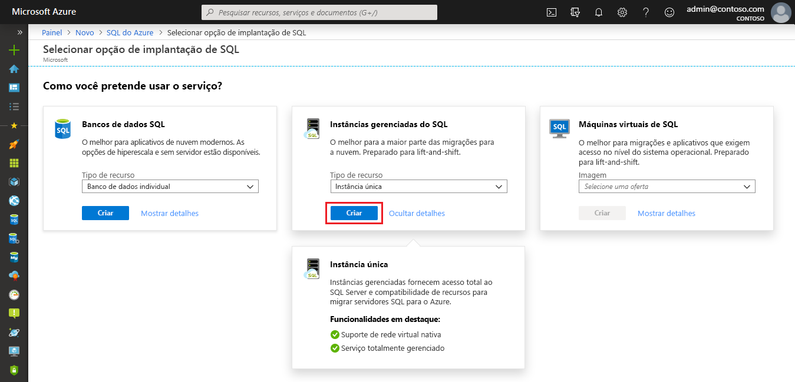

4. Use as guias no formulário de provisionamento **Criar Instância Gerenciada de SQL do Azure** para adicionar informações obrigatórias e opcionais. As seções a seguir descrevem essas guias.

### Guia Básico

- Preencha as informações obrigatórias exigidas na guia **Conceitos Básicos**. Este é um conjunto mínimo de informações exigido para provisionar uma instância gerenciada.

   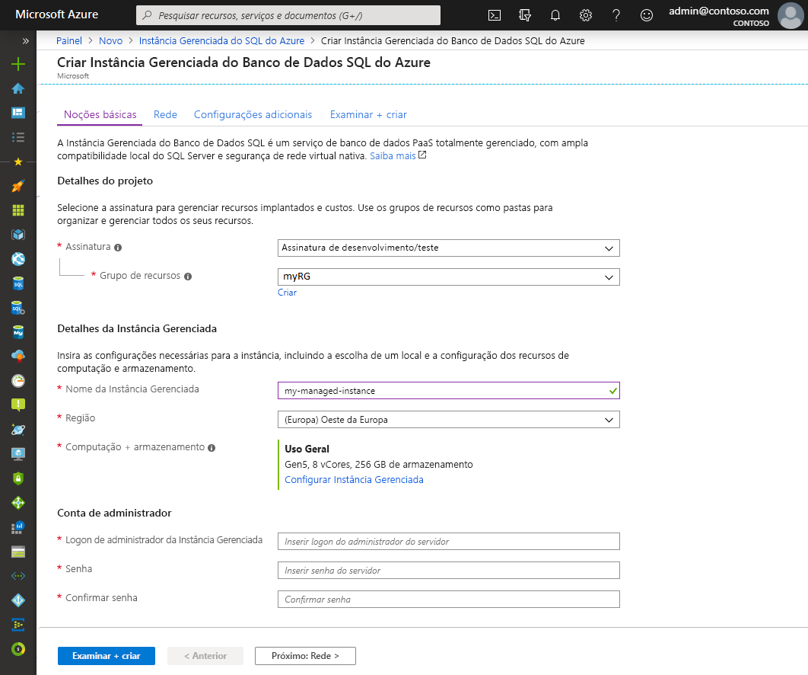

   Use a tabela abaixo como uma referência para obter informações obrigatórias nesta guia.

   | Configuração| Valor sugerido | Descrição |
   | ------ | --------------- | ----------- |
   | **Assinatura** | Sua assinatura. | Uma assinatura que concede a você permissão para criar recursos. |
   | **Grupo de recursos** | Um grupo de recursos novo ou existente.|Para ver os nomes do grupo de recursos válidos, consulte [Regras e restrições de nomenclatura](/azure/architecture/best-practices/resource-naming).|
   | **Nome da Instância Gerenciada** | Qualquer nome válido.|Para ver os nomes válidos, consulte [Regras e restrições de nomenclatura](/azure/architecture/best-practices/resource-naming).|
   | **Região** |A região na qual você deseja criar a instância gerenciada.|Para obter mais informações sobre as regiões, confira [Regiões do Azure](https://azure.microsoft.com/regions/).|
   | **Logon de administrador da Instância Gerenciada** | Qualquer nome de usuário válido. | Para ver os nomes válidos, consulte [Regras e restrições de nomenclatura](/azure/architecture/best-practices/resource-naming). Não use "serveradmin", pois essa é uma função reservada no nível de servidor.|
   | **Senha** | Qualquer senha válida.| A senha deve ter no mínimo 16 caracteres e atender a [requisitos de complexidade definidos](../../virtual-machines/windows/faq.md#what-are-the-password-requirements-when-creating-a-vm).|

- Selecione **Configurar Instância Gerenciada** para dimensionar os recursos de computação e armazenamento e examinar os tipos de preço. Use os controles deslizantes ou as caixas de texto para especificar a quantidade de armazenamento e o número de núcleos virtuais. Quando terminar, selecione **Aplicar** para salvar a seleção. 

   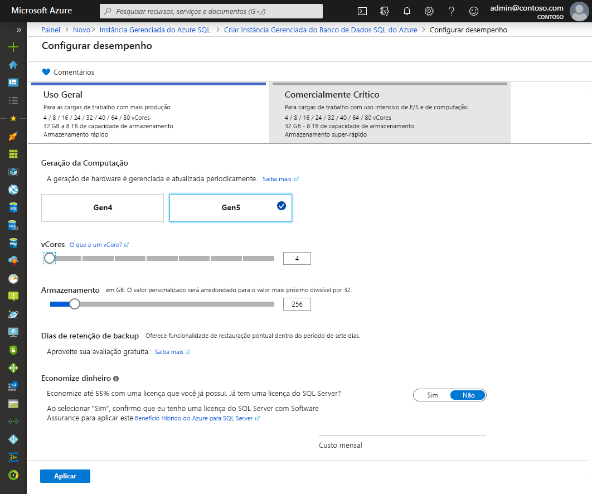

- Para examinar suas escolhas antes de criar uma Instância Gerenciada de SQL, escolha **Examinar + criar**. Ou configure as opções de rede selecionando **Avançar: Rede**.

### Guia Rede

- Preencha as informações opcionais na guia **Rede**. Se você omitir essas informações, o portal aplicará as configurações padrão.

   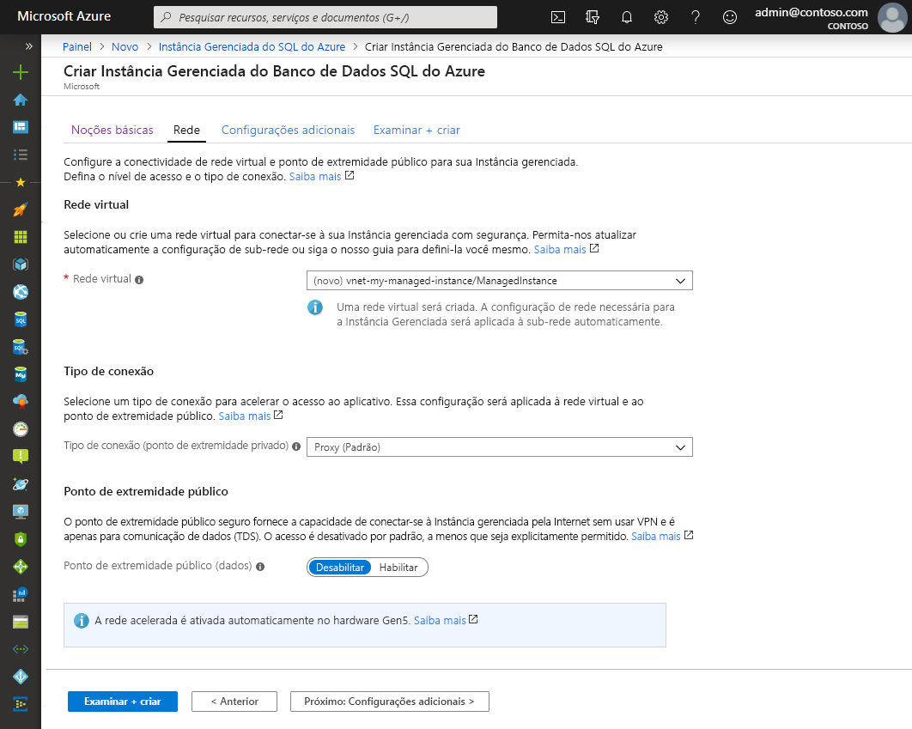

   Use a tabela abaixo como uma referência para obter informações obrigatórias nesta guia.

   | Configuração| Valor sugerido | Descrição |
   | ------ | --------------- | ----------- |
   | **Rede virtual** | Selecione a **Criar nova rede virtual** ou uma rede virtual e uma sub-rede válidas.| Se uma rede ou uma sub-rede não estiver disponível, ela precisará ser [modificada para atender aos requisitos de rede](vnet-existing-add-subnet.md) antes de ser selecionada como um destino para a nova instância gerenciada. Para obter mais informações sobre os requisitos de configuração do ambiente de rede para uma Instância Gerenciada de SQL, confira [Configurar uma rede virtual para uma Instância Gerenciada de SQL](connectivity-architecture-overview.md). |
   | **Tipo de conexão** | Escolha entre um tipo de conexão de proxy e redirecionamento.|Para obter mais informações sobre os tipos de conexão, confira [Tipo de conexão da Instância Gerenciada de SQL do Azure](../database/connectivity-architecture.md#connection-policy).|
   | **Ponto de extremidade público**  | Selecione **Habilitar**. | Para que a instância gerenciada esteja acessível por meio do ponto de extremidade de dados público, você precisa habilitar essa opção. | 
   | **Permitir o acesso de** (se o **Ponto de extremidade público** estiver habilitado) | Selecione uma das opções.   |A experiência do portal permite configurar um grupo de segurança com um ponto de extremidade público.     De acordo com o seu cenário, selecione uma das seguintes opções:   <ul> <li>**Serviços do Azure**: recomendamos essa opção quando você estiver se conectando de Power BI ou de outro serviço multilocatário. </li> <li> **Internet**: use para fins de teste quando desejar criar rapidamente uma instância gerenciada. Não a recomendamos para ambientes de produção. </li> <li> **Sem acesso**: esta opção cria a regra de segurança **Negar**. Modifique essa regra para tornar uma instância gerenciada acessível por meio de um ponto de extremidade público. </li> </ul>   Para obter mais informações sobre a segurança do ponto de extremidade público, confira [Como usar a Instância Gerenciada de SQL do Azure de maneira segura com um ponto de extremidade público](public-endpoint-overview.md).|

- Selecione **Revisar + criar** para revisar suas escolhas antes de criar uma instância gerenciada. Ou defina mais configurações personalizadas selecionando **Avançar: configurações adicionais**.

### Configurações adicionais

- Preencha as informações opcionais na guia **Configurações adicionais**. Se você omitir essas informações, o portal aplicará as configurações padrão.

   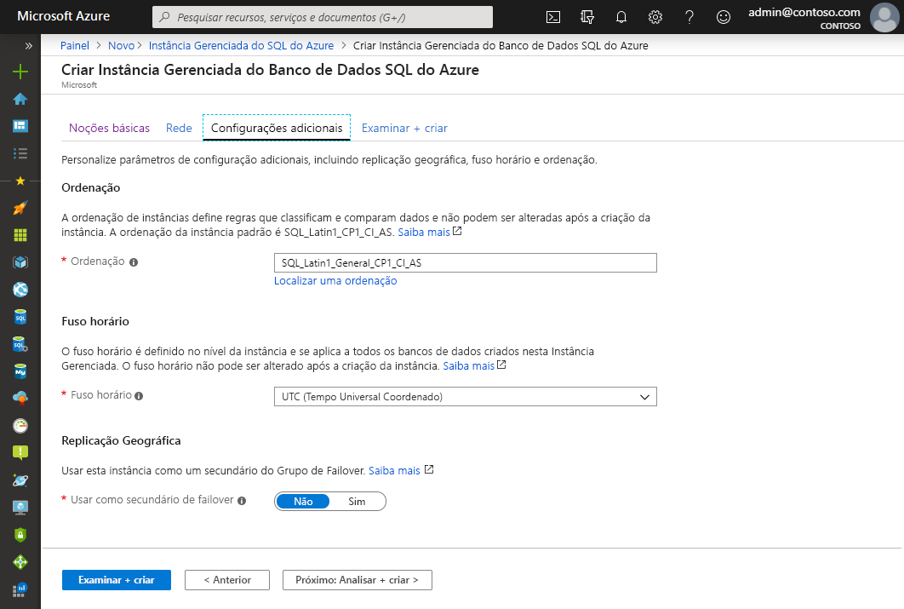

   Use a tabela abaixo como uma referência para obter informações obrigatórias nesta guia.

   | Configuração| Valor sugerido | Descrição |
   | ------ | --------------- | ----------- |
   | **Ordenação** | Escolha a ordenação que deseja usar para a instância gerenciada. Se estiver migrando bancos de dados do SQL Server, verifique a ordenação de origem usando `SELECT SERVERPROPERTY(N'Collation')` e use esse valor.| Para obter informações sobre ordenações, confira [Definir ou alterar a ordenação do servidor](https://docs.microsoft.com/sql/relational-databases/collations/set-or-change-the-server-collation).|   
   | **Fuso horário** | Selecione o fuso horário que sua instância gerenciada observará.|Para obter mais informações, confira [Fusos horários](timezones-overview.md).|
   | **Usar como secundário de failover** | Selecione **Sim**. | Habilite esta opção para usar a instância gerenciada como o secundário de um grupo de failover.|
   | **Instância Gerenciada Primária de SQL** (se a opção **Usar como secundário de failover** estiver definida como **Sim**) | Escolha uma instância gerenciada primária existente que será ingressada na mesma zona DNS que a instância gerenciada que você está criando. | Esta etapa habilitará a configuração pós-criação do grupo de failover. Para saber mais, confira [Tutorial: adicionar uma instância gerenciada a um grupo de failover](failover-group-add-instance-tutorial.md).|

## Examinar + criar

1. Selecione **Examinar + criar** para examinar suas escolhas antes de criar uma instância gerenciada.

   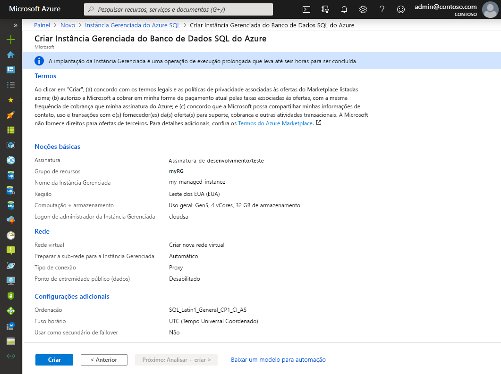

1. Selecione **Criar** para iniciar o provisionamento da instância gerenciada.

> [!IMPORTANT]
> A implantação de uma instância gerenciada é uma operação de execução longa. A implantação da primeira instância na sub-rede normalmente demora muito mais do que a implantação em uma sub-rede com instâncias gerenciadas existentes. Para obter os tempos de provisionamento médios, confira [Operações de gerenciamento da Instância Gerenciada de SQL](sql-managed-instance-paas-overview.md#management-operations).

## Monitorar o progresso da implantação

1. Selecione o ícone **Notificações** para exibir o status da implantação.

   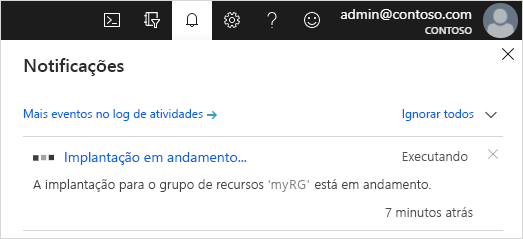

1. Selecione **Implantação em andamento** na notificação para abrir a janela da Instância Gerenciada de SQL e monitorar mais detalhadamente o progresso da implantação. 

> [!TIP]
> Se você fechou o navegador da Web ou saiu da tela de progresso da implantação, siga estas etapas para localizar a tela de progresso da implantação:
> 1. No portal do Azure, abra o grupo de recursos (na guia **Básico**) no qual você está implantando a Instância Gerenciada de SQL.
> 2. Selecione **Implantações**.
> 3. Selecione a operação de implantação da Instância Gerenciada de SQL em andamento.

> [!IMPORTANT]
> Para poder obter o status da criação da instância gerenciada, você precisa ter **permissões de leitura** no grupo de recursos. Se você não tiver essa permissão ou se revogá-la enquanto a instância gerenciada estiver no processo de criação, isso poderá fazer com que a Instância Gerenciada de SQL não fique visível na lista de implantações do grupo de recursos.
>

## Exibir recursos criados

Após a implantação bem-sucedida de uma instância gerenciada, para exibir os recursos criados:

1. Abra o grupo de recursos da instância gerenciada. 

   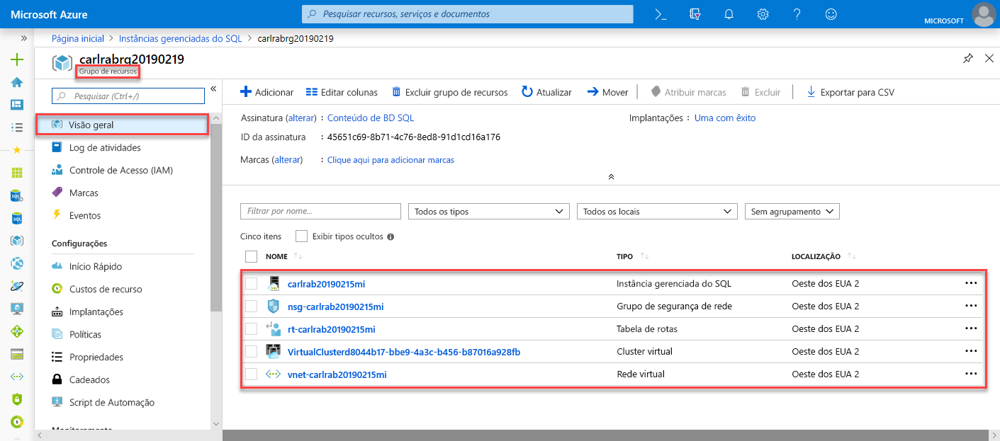

## Exibir e ajustar configurações de rede

Para, opcionalmente, ajustar as configurações de rede, inspecione o seguinte:

1. Selecione a tabela de rotas para revisar a UDR (rota definida pelo usuário) criada para você.

   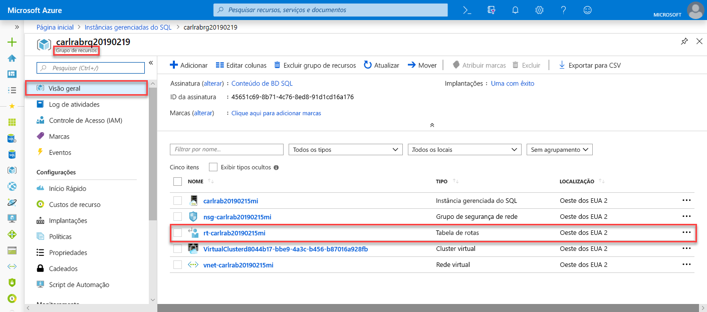

2. Na tabela de rotas, examine as entradas para rotear o tráfego bidirecionalmente na rede virtual da Instância Gerenciada de SQL. Se você criar ou configurar a tabela de rotas manualmente, crie essas entradas na tabela de rotas da Instância Gerenciada de SQL.

   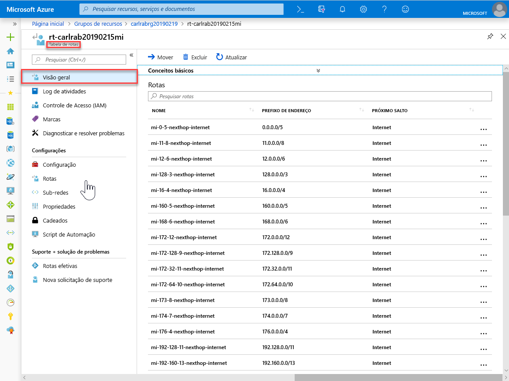

3. Retorne ao grupo de recursos e selecione o grupo de segurança de rede.

   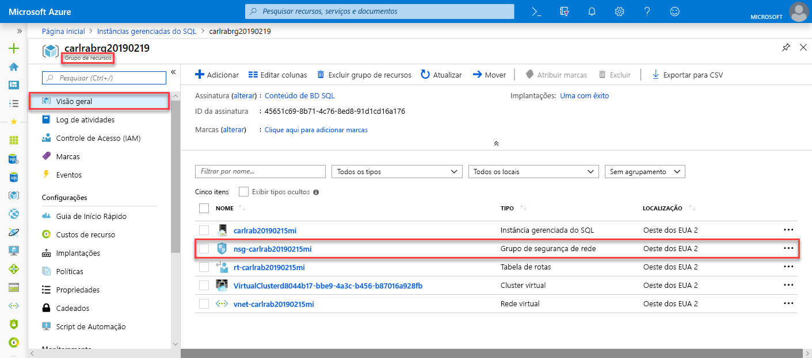

4. Examine as regras de segurança de entrada e saída. 

   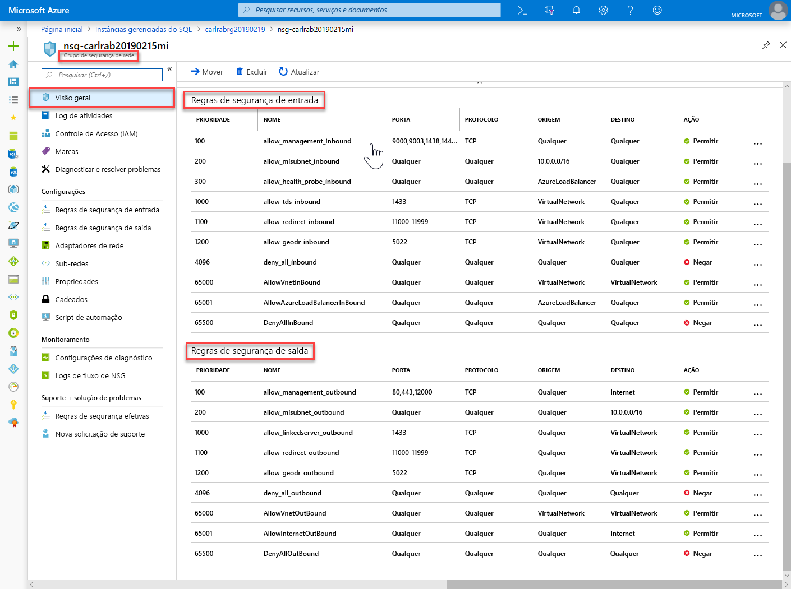

> [!IMPORTANT]
> Se você tiver configurado um ponto de extremidade público para a Instância Gerenciada de SQL, precisará abrir portas para permitir o tráfego de rede que permite conexões com a Instância Gerenciada de SQL na Internet pública. Confira [Configurar ponto de extremidade público na Instância Gerenciada de SQL](public-endpoint-configure.md#allow-public-endpoint-traffic-on-the-network-security-group) para obter mais informações.
>

## Recuperar detalhes da conexão para a Instância Gerenciada de SQL

Para se conectar à Instância Gerenciada de SQL, siga estas etapas para recuperar o nome do host e o FQDN (nome de domínio totalmente qualificado):

1. Retorne ao grupo de recursos e selecione sua instância gerenciada.

   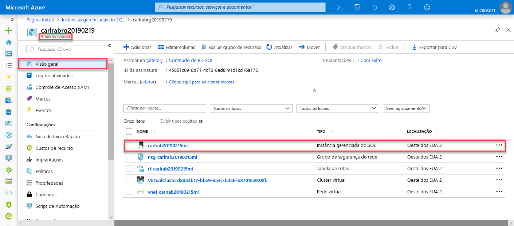

2. Na guia **Visão Geral**, localize a propriedade **Host**. Copie o nome do host da instância gerenciada para uso no próximo início rápido.

   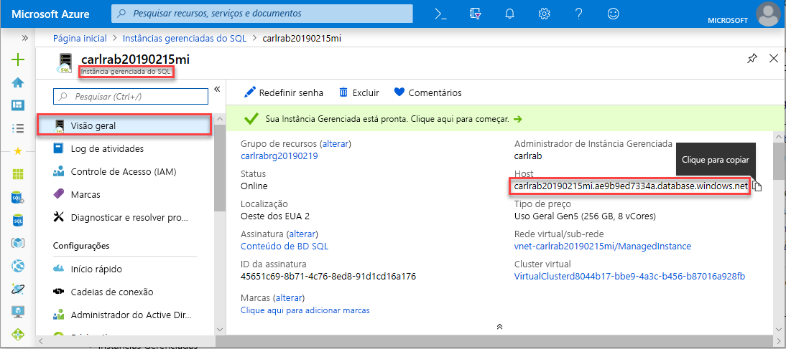

   O valor copiado representa um FQDN (nome de domínio totalmente qualificado) que pode ser usado para se conectar à Instância Gerenciada de SQL. Ele é semelhante ao seguinte endereço de exemplo: *nome_do_seu_host.a1b2c3d4e5f6.database.windows.net*.

## Próximas etapas

Para saber mais sobre como se conectar à Instância Gerenciada de SQL:
- Para obter uma visão geral das opções de conexão para aplicativos, confira [Conectar seus aplicativos à Instância Gerenciada de SQL](connect-application-instance.md).
- Para obter um início rápido que mostra como se conectar a uma Instância Gerenciada de SQL em uma máquina virtual do Azure, confira [Configurar uma conexão com uma máquina virtual do Azure](connect-vm-instance-configure.md).
- Para obter um início rápido que mostra como se conectar à Instância Gerenciada de SQL em um computador cliente local usando uma conexão ponto a site, confira [Configurar uma conexão ponto a site](point-to-site-p2s-configure.md).

Para restaurar um banco de dados existente do SQL Server do local para a Instância Gerenciada de SQL: 
- Use o [Serviço de Migração de Banco de Dados do Azure para migração](../../dms/tutorial-sql-server-to-managed-instance.md) para fazer a restauração de um arquivo de backup de banco de dados. 
- Use o [comando T-SQL RESTORE](restore-sample-database-quickstart.md) para fazer a restauração de um arquivo de backup de banco de dados.

Para obter o monitoramento avançado do desempenho de banco de dados da Instância Gerenciada de SQL com inteligência de solução de problemas interna, confira [Monitorar a Instância Gerenciada de SQL do Azure usando a Análise de SQL do Azure](../../azure-monitor/insights/azure-sql.md).
