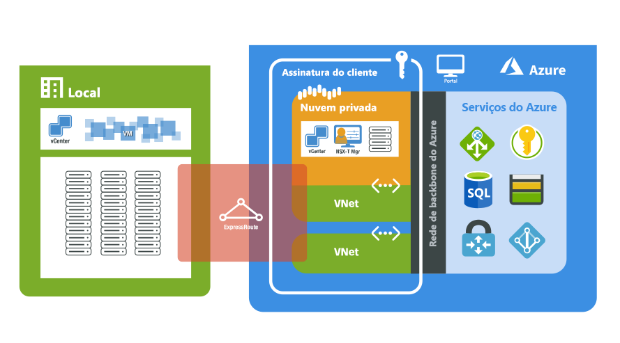

# O que é a Solução VMware no Azure?

A Solução VMware no Azure fornece nuvens privadas que contêm clusters vSphere, criados com base na infraestrutura bare-metal dedicada do Azure. A implantação inicial mínima é de três hosts, mas hosts extras podem ser adicionados um por vez, até, no máximo, 16 hosts por cluster.  Todas as nuvens privadas provisionadas contêm o vCenter Server, o vSAN, o vSphere e o NSX-T. Você pode migrar cargas de trabalho dos ambientes locais, implantar novas VMs (máquinas virtuais) e consumir os serviços do Azure nas suas nuvens privadas.

A Solução VMware no Azure é uma solução validada pela VMware, com validação contínua e testes de aprimoramentos e atualizações. A Microsoft gerencia e mantém o software e a infraestrutura de nuvem privada. Ela permite que você se concentre no desenvolvimento e na execução de cargas de trabalho nas nuvens privadas. 

O diagrama mostra a adjacência entre as nuvens privadas e as VNETs no Azure, nos serviços do Azure e nos ambientes locais. O acesso à rede das nuvens privadas para os serviços do Azure ou VNets fornece integração controlada por SLA dos pontos de extremidade de serviço do Azure. O Alcance Global do ExpressRoute conecta seu ambiente local à nuvem privada da Solução VMware no Azure. 

## Hosts, clusters e nuvens privadas

As nuvens privadas e os clusters da Solução VMware no Azure são criados com base em um host de infraestrutura bare-metal hiperconvergente do Azure. Os hosts de alto nível têm 576 GB de RAM e processadores Intel duplos de 18 núcleos, com 2,3 GHz. Os hosts de alto nível têm dois grupos de discos vSAN com um nível de capacidade bruta do vSAN de 15,36 TB (SSD) e um nível de cache do vSAN de 3,2 TB (NVMe).

Novas nuvens privadas são implantadas por meio do portal do Azure ou da CLI do Azure.

## Rede

[!INCLUDE [avs-networking-description](includes/azure-vmware-solution-networking-description.md)]

Para obter mais informações, confira [Conceitos de rede](concepts-networking.md).

## Acesso e segurança

As nuvens privadas da Solução VMware no Azure usam o controle de acesso baseado em função do vSphere para aumentar a segurança. Você pode integrar as funcionalidades de LDAP do SSO do vSphere ao Azure Active Directory. Para obter mais informações, confira [Conceitos de acesso e identidade](concepts-identity.md).  

A criptografia de dados em repouso do vSAN está habilitada por padrão e é usada para fornecer segurança ao armazenamento de dados do vSAN. Para obter mais informações, confira [Conceitos de armazenamento](concepts-storage.md).

## Manutenção do ciclo de vida do host e do software

As atualizações regulares da nuvem privada da Solução VMware no Azure e do software da VMware garantem que a segurança, a estabilidade e os conjuntos de recursos mais recentes estejam em execução nas suas nuvens privadas. Para obter mais informações, confira [Atualizações da nuvem privada](concepts-upgrades.md).

## Monitoramento da nuvem privada

Os [logs do Azure Monitor](../azure-monitor/overview.md) são gerados automaticamente após a implantação da Solução VMware no Azure na sua assinatura. 

Na sua nuvem privada, você pode:
- Coletar logs em cada uma das suas VMs.
- [Baixar e instalar o agente MMA](../azure-monitor/agents/log-analytics-agent.md#installation-options) em VMs do Linux e do Windows.
- Habilitar a [extensão de diagnóstico do Azure](../azure-monitor/agents/diagnostics-extension-overview.md).
- [Criar e executar novas consultas](../azure-monitor/logs/data-platform-logs.md#log-queries).
- Executar as mesmas consultas que você costuma executar nas suas VMs.

Os padrões de monitoramento da Solução VMware no Azure são semelhantes às VMs do Azure na plataforma IaaS. Para obter mais informações e instruções, confira [Como monitorar VMs do Azure com o Azure Monitor](../azure-monitor/vm/monitor-vm-azure.md).

## Comunicação do cliente
[!INCLUDE [customer-communications](includes/customer-communications.md)]

## Próximas etapas

A próxima etapa é aprender os [conceitos chave do cluster e da nuvem privada](concepts-private-clouds-clusters.md).

<!-- LINKS - external -->

<!-- LINKS - internal -->
[concepts-private-clouds-clusters]: ./concepts-private-clouds-clusters.md

