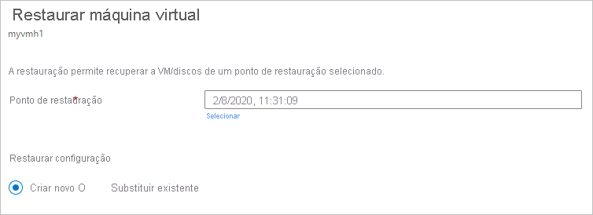
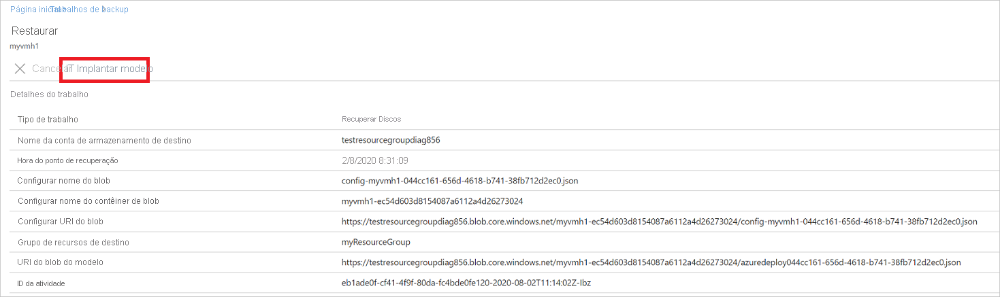
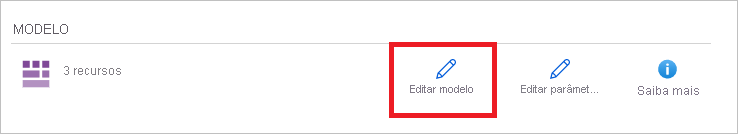
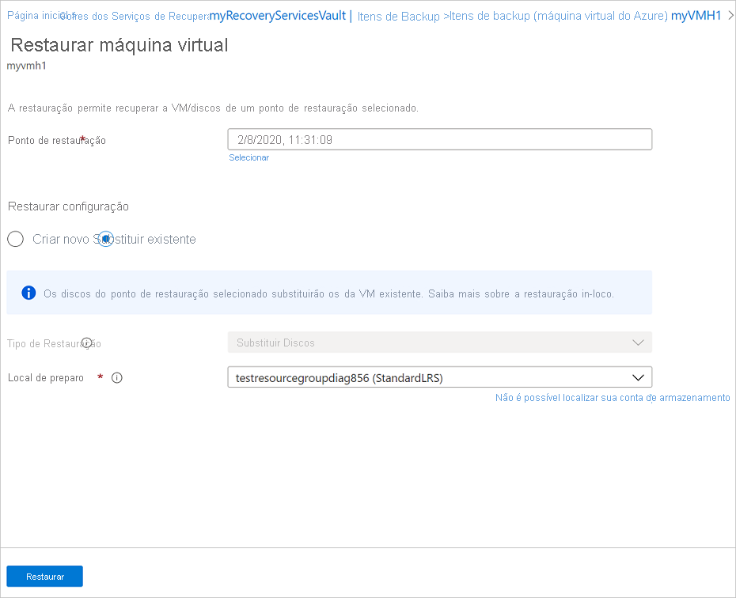
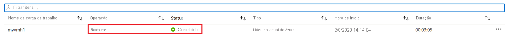

# <a name="how-to-restore-azure-vm-data-in-azure-portal"></a>Como restaurar dados de VM do Azure no portal do Azure

Este artigo descreve como restaurar os dados da VM do Azure a partir dos pontos de recuperação armazenados em cofres dos Serviços de Recuperação do [Backup do Azure](backup-overview.md).

## <a name="restore-options"></a>Opções de restauração

O backup do Azure fornece várias maneiras de restaurar uma VM.

**Opção de restauração** | **Detalhes**
--- | ---
**Criar uma nova VM** | Cria e coloca rapidamente uma VM básica em funcionamento a partir de um ponto de restauração.<br/><br/> Você pode especificar um nome para a VM, selecionar o grupo de recursos e a VNet (rede virtual) em que ela será colocada e especificar uma conta de armazenamento para a VM restaurada. A nova VM precisa ser criada na mesma região que o VM de origem.<br><br>Se uma restauração de VM falhar porque um SKU de VM do Azure não estava disponível na região especificada do Azure, ou devido a outros problemas, o backup do Azure ainda restaura os discos no grupo de recursos especificado.
**Restaurar disco** | Restaura um disco da VM que pode ser usado para criar uma VM.<br/><br/> O Backup do Azure fornece um modelo para ajudá-lo a personalizar e criar uma VM. <br/><br> O trabalho de restauração gera um modelo que você pode baixar e usar para especificar configurações de VM personalizadas e criar uma VM.<br/><br/> Os discos são copiados para o grupo de recursos que você especificar.<br/><br/> Como alternativa, você pode anexar o disco a uma VM existente ou criar uma nova VM usando o PowerShell.<br/><br/> Essa opção é útil se você quiser personalizar a VM, adicionar configurações que não existiam no momento do backup ou adicionar configurações que devem ser definidas usando o modelo ou o PowerShell.
**Substituir existente** | Você pode restaurar um disco e usá-lo para substituir um disco na VM existente.<br/><br/> A VM atual deve existir. Se ela tiver sido excluída, essa opção não poderá ser usada.<br/><br/> O Backup do Azure tira um instantâneo da VM existente antes de substituir o disco e o armazena no local de preparo especificado. Os discos existentes conectados à VM são substituídos pelo ponto de restauração selecionado.<br/><br/> O instantâneo é copiado para o cofre e retido de acordo com a política de retenção. <br/><br/> Após a operação de substituição de disco, o disco original é retido no grupo de recursos. Você pode optar por excluir manualmente os discos originais se eles não forem necessários. <br/><br/>A substituição existente tem suporte para VMs gerenciadas não criptografadas, incluindo VMs [criadas usando imagens personalizadas](https://azure.microsoft.com/resources/videos/create-a-custom-virtual-machine-image-in-azure-resource-manager-with-powershell/). Não há suporte para VMs clássicas e VMs não gerenciadas.<br/><br/> Se o ponto de restauração tem mais ou menos discos do que a VM atual, o número de discos no ponto de restauração reflete apenas a configuração da VM.<br><br> Também há suporte para Replace existing para VMs com recursos vinculados, como [identidade gerenciada pelo usuário](../active-directory/managed-identities-azure-resources/overview.md) ou [Key Vault](../key-vault/general/overview.md).
**Entre regiões (região secundária)** | A restauração entre regiões pode ser usada para restaurar VMs do Azure na região secundária, que é uma [região emparelhada do Azure](../best-practices-availability-paired-regions.md#what-are-paired-regions).<br><br> Você poderá restaurar todas as VMs do Azure para o ponto de recuperação selecionado se o backup for feito na região secundária.<br><br> Durante o backup, os instantâneos não são replicados para a região secundária. Somente os dados armazenados no cofre são replicados. Portanto, as restaurações de região secundária são apenas restaurações da [camada de cofre](about-azure-vm-restore.md#concepts) . O tempo de restauração para a região secundária será quase igual ao tempo de restauração da camada de cofre para a região primária.  <br><br> Esse recurso está disponível para as opções abaixo:<br> <li> [Criar uma máquina virtual](#create-a-vm) <br> <li> [Restaurar discos](#restore-disks) <br><br> No momento, não há suporte para a opção [Substituir os discos existentes](#replace-existing-disks).<br><br> Permissões<br> A operação de restauração na região secundária pode ser executada por administradores de backup e administradores de aplicativos.

> [!NOTE]
> Você também pode recuperar arquivos e pastas específicos em uma VM do Azure. [Saiba mais](backup-azure-restore-files-from-vm.md).

## <a name="storage-accounts"></a>Contas de armazenamento

Alguns detalhes sobre contas de armazenamento:

- **Criar VM**: ao criar uma nova VM, a VM será colocada na conta de armazenamento que você especificar.
- **Restaurar disco**: quando você restaura um disco, o disco é copiado para a conta de armazenamento que você especificar. O trabalho de restauração gera um modelo que você pode baixar e usar para especificar configurações de VM personalizadas. Esse modelo é colocado na conta de armazenamento especificada.
- **Substituir disco**: quando você substitui um disco em uma VM existente, o backup do Azure tira um instantâneo da VM existente antes de substituir o disco. O instantâneo também é copiado para o cofre dos serviços de recuperação por meio da transferência de dados, como um processo em segundo plano. No entanto, depois que a fase de instantâneo for concluída, a operação substituir discos será disparada. Após a operação de substituição de disco, os discos da VM do Azure de origem são deixados no grupo de recursos especificado para sua operação e os VHDs são armazenados na conta de armazenamento especificada. Você pode optar por excluir ou reter esses VHDs e discos.
- **Local da conta de armazenamento**: a conta de armazenamento deve estar na mesma região que o cofre. Somente essas contas são exibidas. Se não houver nenhuma conta de armazenamento no local, você precisará criar uma.
- **Tipo de armazenamento**: não há suporte para o armazenamento de BLOBs.
- **Redundância de armazenamento**: não há suporte para ZRS (armazenamento com redundância de zona). As informações de replicação e redundância para a conta são mostradas entre parênteses após o nome da conta.
- **Armazenamento Premium**:
  - Ao restaurar VMs não Premium, as contas de armazenamento Premium não têm suporte.
  - Ao restaurar VMs gerenciadas, não há suporte para contas de armazenamento Premium configuradas com regras de rede.

## <a name="before-you-start"></a>Antes de começar

Para restaurar uma VM (criar uma nova VM), verifique se você tem as [permissões](backup-rbac-rs-vault.md#mapping-backup-built-in-roles-to-backup-management-actions) corretas do Azure RBAC (controle de acesso baseado em função) do Azure para a operação de restauração de VM.

Se você não tiver permissões, poderá [restaurar um disco](#restore-disks)e, depois que o disco for restaurado, poderá [usar o modelo](#use-templates-to-customize-a-restored-vm) que foi gerado como parte da operação de restauração para criar uma nova VM.

[!INCLUDE [backup-center.md](../../includes/backup-center.md)]

## <a name="select-a-restore-point"></a>Selecione um ponto de restauração

1. No cofre associado à VM que você deseja restaurar, selecione itens de **backup**  >  **máquina virtual do Azure**.
1. Selecione uma VM. Por padrão, os pontos de recuperação dos últimos 30 dias são exibidos no painel da VM. Você pode exibir pontos de recuperação com mais de 30 dias ou filtrar para encontrar pontos de recuperação com base em datas, intervalos de tempo e diferentes tipos de consistência de instantâneos.
1. Para restaurar a VM, selecione **restaurar VM**.

    

1. Selecione um ponto de restauração para usar na recuperação.

## <a name="choose-a-vm-restore-configuration"></a>Escolha uma configuração de restauração de VM

1. Em **restaurar máquina virtual**, selecione uma opção de restauração:
    - **Criar novo**: Use esta opção se desejar criar uma nova VM. Você pode criar uma VM com configurações simples ou restaurar um disco e criar uma VM personalizada.
    - **Substituir existente**: Use esta opção se desejar substituir discos em uma VM existente.

        

1. Especifique as configurações para sua opção de restauração selecionada.

## <a name="create-a-vm"></a>Criar uma máquina virtual

Como uma das [opções de restauração](#restore-options), você pode criar uma VM rapidamente com configurações básicas a partir de um ponto de restauração.

1. Em **restaurar máquina virtual**  >  **criar novo**  >  **tipo de restauração**, selecione **criar uma máquina virtual**.
1. Em **nome da máquina virtual**, ESPECIFIQUE uma VM que não exista na assinatura.
1. No **Grupo de recursos**, selecione um grupo de recursos existente para a nova máquina virtual ou crie um novo com um nome exclusivo globalmente. Se você atribuir um nome que já existe, o Azure atribui ao grupo o mesmo nome da VM.
1. Em **Rede virtual**, selecione a rede virtual na qual a VM será colocada. Todas as redes virtuais associadas à assinatura são exibidas. Escolher a sub-rede. A primeira sub-rede será selecionada por padrão.
1. Em **local de preparo**, especifique a conta de armazenamento para a VM. [Saiba mais](#storage-accounts).

    

1. Selecione **restaurar** para disparar a operação de restauração.

## <a name="restore-disks"></a>Restaurar discos

Como uma das [opções de restauração](#restore-options), você pode criar um disco a partir de um ponto de restauração. Em seguida, com o disco, você pode executar uma das seguintes ações:

- Use o modelo gerado durante a operação de restauração para personalizar as configurações e disparar a implantação da VM. Você edita as configurações de modelo padrão e envia o modelo para implantação da VM.
- [Anexe discos restaurados](../virtual-machines/windows/attach-managed-disk-portal.md) a uma VM existente.
- [Crie uma nova VM](./backup-azure-vms-automation.md#create-a-vm-from-restored-disks) com base nos discos restaurados usando o PowerShell.

1. Em **Restaurar configuração**  >  **criar novo**  >  **tipo de restauração**, selecione **restaurar discos**.
1. No **Grupo de recursos**, selecione um grupo de recursos existente para os discos recuperados ou crie um novo com um nome exclusivo globalmente.
1. Em **local de preparo**, especifique a conta de armazenamento para a qual copiar os VHDs. [Saiba mais](#storage-accounts).

    

1. Selecione **restaurar** para disparar a operação de restauração.

Quando sua máquina virtual usa discos gerenciados e você seleciona a opção **criar máquina virtual** , o backup do Azure não usa a conta de armazenamento especificada. No caso de **restauração de discos** e **restauração instantânea**, a conta de armazenamento é usada somente para armazenar o modelo. Os discos gerenciados são criados no grupo de recursos especificado.
Quando sua máquina virtual usa discos não gerenciados, eles são restaurados como BLOBs para a conta de armazenamento.

### <a name="use-templates-to-customize-a-restored-vm"></a>Usar modelos para personalizar uma VM restaurada

Depois de restaurar o disco, use o modelo gerado como parte da operação de restauração para personalizar e criar uma nova VM:

1. Em **trabalhos de backup**, selecione o trabalho de restauração relevante.

1. Em **restaurar**, selecione **implantar modelo** para iniciar a implantação de modelo.

    

1. Para personalizar a configuração de VM fornecida no modelo, selecione **Editar modelo**. Se você quiser adicionar mais personalizações, selecione **Editar parâmetros**.
    - [Saiba mais](../azure-resource-manager/templates/deploy-portal.md#deploy-resources-from-custom-template) sobre como implantar recursos a partir de um modelo personalizado.
    - [Saiba mais](../azure-resource-manager/templates/template-syntax.md) sobre como criar modelos.

   

1. Insira os valores personalizados para a VM, aceite os **termos e condições** e selecione **comprar**.

   

## <a name="replace-existing-disks"></a>Substituir discos existentes

Como uma das [opções de restauração](#restore-options), você pode substituir um disco de VM existente pelo ponto de restauração selecionado. [Analise](#restore-options) todas as opções de restauração.

1. Em **Restaurar configuração**, selecione **substituir existente**.
1. Em **Tipo de Restauração**, selecione **Substituir disco**. Este é o ponto de restauração que será usado para substituir discos de VM existentes.
1. Em **local de preparo**, especifique onde os instantâneos dos discos gerenciados atuais devem ser salvos durante o processo de restauração. [Saiba mais](#storage-accounts).

   

## <a name="cross-region-restore"></a>Restauração Entre Regiões

Como uma das [Opções de restauração](#restore-options), a CRR (restauração entre regiões) permite que você restaure as VMs do Azure em uma região secundária, que é uma região emparelhada do Azure.

Para começar a usar o recurso, leia a [seção antes de começar](./backup-create-rs-vault.md#set-cross-region-restore).

Para ver se a CRR está habilitada, siga as instruções em [Configurar a restauração entre regiões](backup-create-rs-vault.md#configure-cross-region-restore).

### <a name="view-backup-items-in-secondary-region"></a>Exibir itens de backup na região secundária

Se a CRR estiver habilitada, você poderá exibir os itens de backup na região secundária.

1. No portal, vá para **cofre dos serviços de recuperação**  >  **itens de backup**.
1. Selecione **região secundária** para exibir os itens na região secundária.

>[!NOTE]
>Somente os tipos de gerenciamento de backup que dão suporte ao recurso de CRR serão mostrados na lista. Atualmente, é permitido apenas o suporte para a restauração de dados de região secundária em uma região secundária.


### <a name="restore-in-secondary-region"></a>Restaurar na região secundária

A experiência do usuário de restauração da região secundária será semelhante à experiência do usuário de restauração da região primária. Ao configurar detalhes no painel de configuração de restauração para configurar a restauração, você será solicitado a fornecer somente os parâmetros de região secundária.

Atualmente, o [RPO](azure-backup-glossary.md#rpo-recovery-point-objective) de região secundária é de até 12 horas a partir da região primária, embora a replicação de [armazenamento com REDUNDÂNCIA geográfica (ra-grs) de acesso de leitura](../storage/common/storage-redundancy.md#redundancy-in-a-secondary-region) seja de 15 minutos.


- Para restaurar e criar uma VM, consulte [criar uma VM](#create-a-vm).
- Para restaurar como um disco, consulte [restaurar discos](#restore-disks).

>[!NOTE]
>
>- Depois que a restauração é disparada e na fase de transferência de dados, o trabalho de restauração não pode ser cancelado.
>- O recurso de restauração entre regiões restaura as VMs do Azure habilitadas para CMK (chaves gerenciadas pelo cliente), cujo backup não é feito em um cofre de serviços de recuperação habilitado para o CMK, como VMs não habilitadas para CMK na região secundária.
>- As funções do Azure necessárias para restaurar na região secundária são as mesmas da região primária.

As [VMs fixas da zona do Azure](../virtual-machines/windows/create-portal-availability-zone.md) podem ser restauradas em qualquer [zona de disponibilidade](../availability-zones/az-overview.md) da mesma região.

No processo de restauração, você verá a opção **zona de disponibilidade.** Você verá sua zona padrão primeiro. Para escolher uma zona diferente, escolha o número da zona de sua escolha. Se a zona fixada não estiver disponível, você não poderá restaurar os dados para outra zona, pois os dados de backup não são zonally replicados. A restauração em zonas de disponibilidade é possível somente de pontos de recuperação na camada de cofre.


### <a name="monitoring-secondary-region-restore-jobs"></a>Monitorando trabalhos de restauração de região secundária

1. No portal, acesse **cofre dos serviços de recuperação**  >  **trabalhos de backup**
1. Selecione **região secundária** para exibir os itens na região secundária.

    

## <a name="restoring-unmanaged-vms-and-disks-as-managed"></a>Restaurando VMs e discos não gerenciados como gerenciados

Você receberá uma opção para restaurar [discos não gerenciados](../storage/common/storage-disaster-recovery-guidance.md#azure-unmanaged-disks) como [discos gerenciados](../virtual-machines/managed-disks-overview.md) durante a restauração. Por padrão, as VMs/discos não gerenciados são restaurados como VMs/discos não gerenciados. No entanto, se você optar por restaurar como VMs/discos gerenciados, agora é possível fazer isso. Essas restaurações não são disparadas da fase de instantâneo, mas apenas da fase de cofre. Esse recurso não está disponível para VMs criptografadas não gerenciadas.


## <a name="restore-vms-with-special-configurations"></a>Restaurar VMs com configurações especiais

Há muitos cenários comuns em que talvez seja necessário restaurar as VMs.

**Cenário** | **Diretrizes**
--- | ---
**Restaurar VMs usando Benefícios de uso híbrido** | Se uma VM do Windows usa o [licenciamento do Benefício de uso híbrido (HUB)](../virtual-machines/windows/hybrid-use-benefit-licensing.md), restaure os discos e crie uma nova VM usando o modelo fornecido (com **Tipo de Licença** definido como **Windows_Server**) ou o PowerShell.  Essa configuração também pode ser aplicada após a criação da VM.
**Restaurar VMs durante um desastre de datacenter do Azure** | Se o cofre usa GRS e o datacenter principal da VM ficar inativo, o Backup do Azure oferece suporte à restauração de VMs de backup no datacenter emparelhado. Você seleciona uma conta de armazenamento no datacenter emparelhado e a restaura normalmente. O backup do Azure usa o serviço de computação na região emparelhada para criar a VM restaurada. [Saiba mais](/azure/architecture/resiliency/recovery-loss-azure-region) sobre a resiliência do datacenter.<br><br> Se o cofre usar GRS, você poderá escolher o novo recurso, a [restauração entre regiões](#cross-region-restore). Isso permite que você restaure para uma segunda região em cenários de interrupção totais ou parciais, ou mesmo se não houver nenhuma interrupção.
**Restauração bare-metal** | A principal diferença entre VMs do Azure e hipervisores locais é que não há nenhum console de VM disponível no Azure. Um console é necessário para determinados cenários, como a recuperação usando um backup do tipo BMR (recuperação bare-metal). No entanto, a restauração de VM do cofre é uma substituição completa para a BMR.
**Restaurar VMs com configurações de rede especiais** | Configurações especiais de rede incluem VMs usando balanceamento de carga interno ou externo, usando vários NICS ou vários endereços IP reservados. Restaure essas VMs usando a [opção de disco de restauração](#restore-disks). Essa opção faz uma cópia dos VHDs na conta de armazenamento especificada, e você pode criar uma VM com um balanceador de carga [interno](../load-balancer/quickstart-load-balancer-standard-internal-powershell.md) ou [externo](../load-balancer/quickstart-load-balancer-standard-public-powershell.md) , [várias NICs](../virtual-machines/windows/multiple-nics.md)ou [vários endereços IP reservados](../virtual-network/virtual-network-multiple-ip-addresses-powershell.md), de acordo com sua configuração.
**Grupo de segurança de rede (NSG) na NIC/sub-rede** | O backup de VM do Azure dá suporte a backup e restauração de informações de NSG em nível de rede virtual, sub-rede e NIC.
**VMs fixadas pela zona** | Se você fizer backup de uma VM do Azure fixada em uma zona (com o backup do Azure), poderá restaurá-la na mesma zona em que ela foi fixada. [Saiba mais](../availability-zones/az-overview.md)
**Restaurar a VM em qualquer conjunto de disponibilidade** | Ao restaurar uma VM do portal, não há nenhuma opção para escolher um conjunto de disponibilidade. Uma VM restaurada não tem um conjunto de disponibilidade. Se você usar a opção restaurar disco, poderá [especificar um conjunto de disponibilidade](../virtual-machines/windows/tutorial-availability-sets.md) ao criar uma VM a partir do disco usando o modelo ou o PowerShell fornecido.
**Restaurar VMs especiais, como VMs do SQL** | Se você estiver fazendo backup de uma VM do SQL usando o backup de VM do Azure e, em seguida, usar a opção restaurar VM ou criar uma VM após restaurar discos, a VM recém-criada deverá ser registrada com o provedor SQL, conforme mencionado [aqui](../azure-sql/virtual-machines/windows/sql-agent-extension-manually-register-single-vm.md?tabs=azure-cli%2cbash). Isso converterá a VM restaurada em uma VM do SQL.

### <a name="restore-domain-controller-vms"></a>Restaurar VMs do controlador de domínio

**Cenário** | **Diretrizes**
--- | ---
**Restaurar uma VM do controlador de domínio único em um único domínio** | Restaure a VM como qualquer outra VM. Observe que:<br/><br/> De uma perspectiva Active Directory, a VM do Azure é como qualquer outra VM.<br/><br/> O DSRM (Modo de Restauração dos Serviços de Diretório) também está disponível, portanto, todos os cenários de recuperação do Active Directory são viáveis. [Saiba mais](#post-restore-steps) sobre considerações de backup e restauração para controladores de domínio virtualizados.
**Restaurar várias VMs do controlador de domínio em um único domínio** | Se outros controladores de domínio no mesmo domínio puderem ser acessados pela rede, o controlador de domínio poderá ser restaurado como qualquer VM. Se for o último controlador de domínio restante no domínio, ou uma recuperação em uma rede isolada for executada, use uma [recuperação de floresta](/windows-server/identity/ad-ds/manage/ad-forest-recovery-single-domain-in-multidomain-recovery).
**Restaurar uma VM do controlador de domínio único em uma configuração de vários domínios** |  Restaurar os discos e criar uma VM [usando o PowerShell](backup-azure-vms-automation.md#restore-the-disks)  
**Restaurar vários domínios em uma floresta** | Recomendamos uma [recuperação de floresta](/windows-server/identity/ad-ds/manage/ad-forest-recovery-single-domain-in-multidomain-recovery).

Para obter mais informações, consulte [fazer backup e restaurar Active Directory controladores de domínio](active-directory-backup-restore.md).

## <a name="track-the-restore-operation"></a>Acompanhar a operação de restauração

Após disparar a operação de restauração, o serviço de backup cria um trabalho para acompanhamento. O Backup do Azure exibe notificações sobre o trabalho no portal. Se eles não estiverem visíveis, selecione o símbolo **notificações** e, em seguida, selecione **mais eventos no log de atividades** para ver o status do processo de restauração.


 Acompanhe a restauração da seguinte forma:

1. Para exibir as operações do trabalho, selecione o hiperlink notificações. Como alternativa, no cofre, selecione **trabalhos de backup** e, em seguida, selecione a VM relevante.

    

1. Para monitorar o progresso da restauração, selecione qualquer trabalho de restauração com um status **em andamento**. Isso exibe a barra de progresso, que exibe informações sobre o progresso da restauração:

    - **Tempo estimado de restauração**: inicialmente fornece o tempo necessário para concluir a operação de restauração. À medida que a operação progride, o tempo gasto reduz e chega a zero quando a operação de restauração é concluída.
    - **Porcentagem de restauração**. Mostra a porcentagem concluída da operação de restauração.
    - **Número de bytes transferidos**: se você estiver restaurando com a criação de uma nova VM, ela mostrará os bytes que foram transferidos em relação ao número total de bytes a serem transferidos.

## <a name="post-restore-steps"></a>Etapas pós-restauração

Há algumas coisas a serem observadas após a restauração de uma VM:

- Extensões presentes durante a configuração do backup serão instaladas, mas não habilitadas. Se encontrar um problema, reinstale as extensões.
- Se a VM de backup tiver um endereço IP estático, a VM restaurada terá um endereço IP dinâmico para evitar conflitos. Você pode [adicionar um endereço IP estático à VM restaurada](/powershell/module/az.network/set-aznetworkinterfaceipconfig#description).
- Uma VM restaurada não tem um conjunto de disponibilidade. Se você usar a opção restaurar disco, poderá [especificar um conjunto de disponibilidade](../virtual-machines/windows/tutorial-availability-sets.md) ao criar uma VM a partir do disco usando o modelo ou o PowerShell fornecido.
- Se você usar uma distribuição Linux baseada em inicialização da nuvem, como o Ubuntu, a senha será bloqueada após a restauração por motivos de segurança. Use uma extensão VMAccess na VM restaurada para [redefinir a senha](../virtual-machines/troubleshooting/reset-password.md). Recomendamos o uso de chaves SSH nessas distribuições, para que você não precise redefinir a senha após a restauração.
- Se não for possível acessar uma VM depois de restaurada porque a VM tem uma relação quebrada com o controlador de domínio, siga as etapas abaixo para abrir a VM:
  - Anexe o disco do sistema operacional como um disco de dados a uma VM recuperada.
  - Instale manualmente o agente de VM se o agente do Azure for considerado sem resposta seguindo este [link](../virtual-machines/troubleshooting/install-vm-agent-offline.md).
  - Habilitar o acesso ao console serial na VM para permitir o acesso de linha de comando à VM

  ```cmd
    bcdedit /store <drive letter>:\boot\bcd /enum
    bcdedit /store <VOLUME LETTER WHERE THE BCD FOLDER IS>:\boot\bcd /set {bootmgr} displaybootmenu yes
    bcdedit /store <VOLUME LETTER WHERE THE BCD FOLDER IS>:\boot\bcd /set {bootmgr} timeout 5
    bcdedit /store <VOLUME LETTER WHERE THE BCD FOLDER IS>:\boot\bcd /set {bootmgr} bootems yes
    bcdedit /store <VOLUME LETTER WHERE THE BCD FOLDER IS>:\boot\bcd /ems {<<BOOT LOADER IDENTIFIER>>} ON
    bcdedit /store <VOLUME LETTER WHERE THE BCD FOLDER IS>:\boot\bcd /emssettings EMSPORT:1 EMSBAUDRATE:115200
    ```

  - Quando a VM é recriada, use portal do Azure para redefinir a conta de administrador local e a senha
  - Use Console serial Access e CMD para desassociar a VM do domínio

    ```cmd
    cmd /c "netdom remove <<MachineName>> /domain:<<DomainName>> /userD:<<DomainAdminhere>> /passwordD:<<PasswordHere>> /reboot:10 /Force"
    ```

- Depois que a VM for desassociada e reiniciada, você poderá usar o RDP com êxito para a VM com credenciais de administrador local e reingressar a VM de volta para o domínio com êxito.

## <a name="backing-up-restored-vms"></a>Fazer backup de VMs restauradas

- Se você tiver restaurado uma VM no mesmo grupo de recursos e com o mesmo nome que a VM do backup original, o backup continuará na VM após a restauração.
- Se você tiver restaurado a VM para outro grupo de recursos ou tiver especificado um nome diferente para a VM restaurada, é preciso configurar o backup para a VM restaurada.

## <a name="next-steps"></a>Próximas etapas

- Se você tiver dificuldades durante o processo de restauração, [verifique](backup-azure-vms-troubleshoot.md#restore) os problemas e erros comuns.
- Depois de restaurar a VM, aprenda mais sobre o [gerenciamento de máquinas virtuais](backup-azure-manage-vms.md).