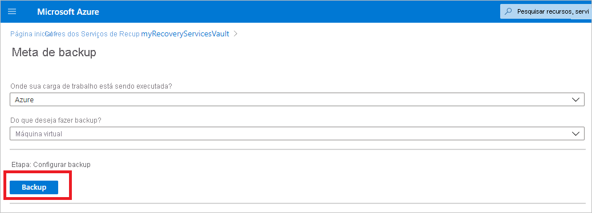
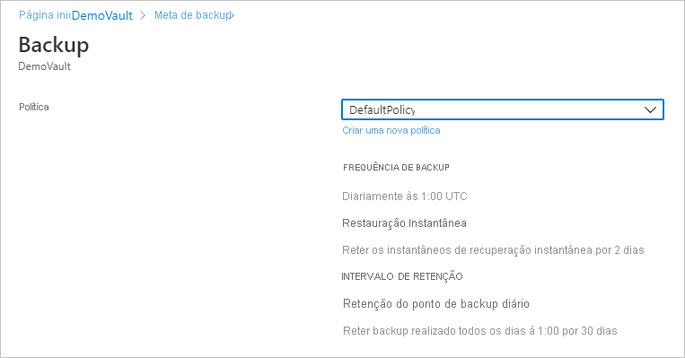
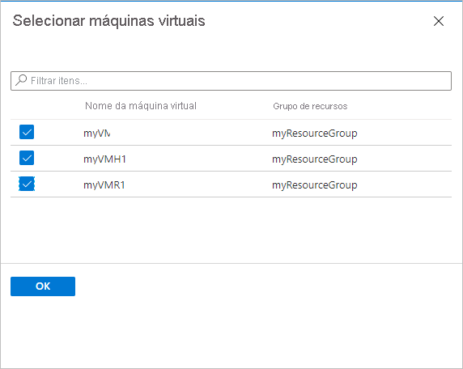
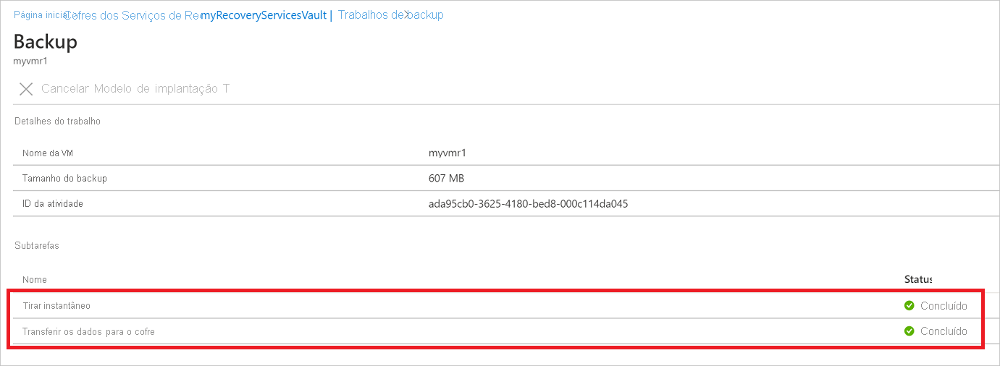

# Fazer backup de máquinas virtuais do Azure em um cofre dos Serviços de Recuperação

Este artigo descreve como fazer backup de VMs do Azure em um cofre dos Serviços de Recuperação, usando o serviço de [Backup do Azure](backup-overview.md).

Neste artigo, você aprenderá como:

> [!div class="checklist"]
>
> * Prepare VMs do Azure.
> * Crie um cofre.
> * Descubra VMs e configure uma política de backup.
> * Habilite o backup para VMs do Azure.
> * Executar o backup inicial.

> [!NOTE]
> Este artigo descreve como configurar um cofre e selecionar VMs para backup. Isso é útil se você quiser fazer backup de várias VMs. Como alternativa, você pode [fazer backup de uma única VM do Azure](backup-azure-vms-first-look-arm.md) diretamente das configurações da VM.

## Antes de começar

* [Examine](backup-architecture.md#architecture-built-in-azure-vm-backup) a arquitetura de backup de VM do Azure.
* [Saiba mais sobre](backup-azure-vms-introduction.md) backup de VM do Azure e a extensão de backup.
* [Examine a matriz de suporte](backup-support-matrix-iaas.md) antes de configurar o backup.

Além disso, há algumas ações que talvez você precise realizar em algumas circunstâncias:

* **Instale o agente de VM na VM**: O Backup do Azure faz backup de VMs do Azure instalando uma extensão para o agente de VM do Azure em execução no computador. Se a sua VM foi criada a partir de uma imagem do Azure Marketplace, o agente está instalado e em execução. Caso você crie uma VM personalizada ou migre um computador local, talvez seja necessário [instalar o agente manualmente](#install-the-vm-agent).

[!INCLUDE [backup-center.md](../../includes/backup-center.md)]

[!INCLUDE [How to create a Recovery Services vault](../../includes/backup-create-rs-vault.md)]

### Modificar a replicação de armazenamento

Por padrão, os cofres usam [GRS (armazenamento com redundância geográfica)](../storage/common/storage-redundancy.md#geo-redundant-storage).

* Se o cofre for seu mecanismo de backup primário, recomendamos que você use GRS.
* Você pode usar o [LRS (armazenamento com redundância local)](../storage/common/storage-redundancy.md#locally-redundant-storage) para uma opção mais barata.
* [O ZRS (armazenamento com redundância de zona)](../storage/common/storage-redundancy.md#zone-redundant-storage) replica seus dados em [zonas de disponibilidade](../availability-zones/az-overview.md#availability-zones), garantindo a residência de dados e a resiliência na mesma região.

Modifique o tipo de replicação de armazenamento da seguinte maneira:

1. No novo cofre, selecione **Propriedades** na seção **configurações** .
2. Em **Propriedades**, em **configuração de backup**, selecione **Atualizar**.
3. Selecione o tipo de replicação de armazenamento e selecione **salvar**.

      

> [!NOTE]
   > Não é possível modificar o tipo de replicação de armazenamento depois que o cofre é configurado e contém itens de backup. Se desejar fazer isso, você precisará recriar o cofre.

## Aplicar uma política de backup

Configure uma política de backup para o cofre.

1. No cofre, selecione **+ backup** na seção **visão geral** .

   

1. Em **Meta de Backup** > **Onde sua carga de trabalho é executada?** , selecione **Azure**. Em **Do que você deseja fazer backup?** , selecione **Máquina virtual** >  **OK**. Isso registra a extensão da VM no cofre.

   

1. Na **Política de Backup**, escolha a política que você deseja associar ao cofre.
    * A política padrão faz o backup da VM uma vez por dia. Os backups diários são mantidos por 30 dias. Instantâneos de recuperação instantânea são mantidos por dois dias.

      

    * Se você não quiser usar a política padrão, selecione **Criar** e crie uma política personalizada, conforme descrito no próximo procedimento.

1. Em **Máquinas virtuais**, selecione **Adicionar**.

      

1. O painel **Selecionar máquinas virtuais** será aberto. Selecione as VMs que você deseja fazer backup usando a política. Depois, selecione **OK**.

   * As VMs selecionadas são validadas.
   * Você só pode escolher máquinas virtuais na mesma região que o cofre.
   * O backup das VMs só pode ser feito em um único cofre.

     

    >[!NOTE]
    > Todas as VMs na mesma região e assinatura que o do cofre estão disponíveis para configurar o backup. Ao configurar o backup, você pode navegar até o nome da máquina virtual e seu grupo de recursos, mesmo que não tenha a permissão necessária nessas VMs. Se sua VM estiver no estado de exclusão reversível, ela não estará visível nessa lista. Se você precisar proteger novamente a VM, precisará aguardar até que o período de exclusão reversível expire ou restaurar a VM da lista de exclusão reversível. Para obter mais informações, consulte [o artigo exclusão reversível para VMs](soft-delete-virtual-machines.md#soft-delete-for-vms-using-azure-portal).

1. Em **Backup**, escolha **Habilitar backup**. Isso implantará a política no cofre e nas VMs e instalará a extensão de backup no agente da VM em execução na VM do Azure.

Depois de habilitar o backup:

* O serviço de Backup instala a extensão de backup independentemente de a VM estar em execução.
* Um backup inicial será executado de acordo com seu agendamento de backup.
* Quando os backups forem executados, observe que:
  * Uma VM em execução tem a maior chance de capturar um ponto de recuperação consistente com o aplicativo.
  * No entanto, mesmo se a VM estiver desativada, o backup será feito. Essa VM é conhecida como VM offline. Nesse caso, o ponto de recuperação será consistente com falhas.
* A conectividade de saída explícita não é necessária para permitir o backup de VMs do Azure.

### Criar uma política personalizada

Se você optou por criar uma política de backup, preencha as configurações de política.

1. Em **Nome da política**, especifique um nome significativo.
2. Em **Agendamento de backup**, especifique quando os backups devem ser feitos. Você pode fazer backups diários ou semanais em VMs do Azure.
3. Em **Restauração Instantânea**, especifique por quanto tempo deseja manter os instantâneos localmente para restauração instantânea.
    * Quando você restaura, os discos da VM de backup são copiados do armazenamento, pela rede para o local de armazenamento de recuperação. Com a restauração instantânea, você pode aproveitar os instantâneos armazenados localmente feitos durante um trabalho de backup, sem esperar que os dados de backup sejam transferidos para o cofre.
    * Você pode reter instantâneos para restauração imediata entre um ou cinco dias. Dois dias é a configuração padrão.
4. Em **Período de retenção**, especifique por quanto tempo deseja manter seus pontos de backup diários ou semanais.
5. Em **retenção de ponto de backup mensal** e **retenção do ponto de backup anual**, especifique se deseja manter um backup mensal ou anual de seus backups diários ou semanais.
6. Selecione **OK** para salvar a política.

    

> [!NOTE]
   > O Backup do Azure não oferece suporte ao ajuste automático do relógio para alterações de horário de verão para backups de VMs do Azure. À medida que ocorrem alterações de tempo, modifique as políticas de backup manualmente, conforme necessário.

## Disparar o backup inicial

O backup inicial será executado de acordo com o agendamento, mas você poderá executá-lo imediatamente da seguinte maneira:

1. No menu do cofre, selecione **itens de backup**.
2. Em **itens de backup**, selecione **máquina virtual do Azure**.
3. Na lista **itens de backup** , selecione as reticências (...).
4. Selecione **fazer backup agora**.
5. Em **Fazer Backup Agora**, use o controle de calendário para selecionar o último dia em que o ponto de recuperação deve ser mantido. Depois, selecione **OK**.
6. Monitorar as notificações do portal. Você pode monitorar o andamento do trabalho no painel do cofre > **Trabalhos de Backup** > **Em Andamento**. Dependendo do tamanho da VM, a criação do backup inicial pode demorar um pouco.

## Verificar o status do trabalho de backup

Os detalhes do trabalho de backup para cada backup de VM consistem em duas fases, a fase de **Instantâneos** seguida pela fase **Transferir dados para o cofre**. 
A fase de instantâneo garante a disponibilidade de um ponto de recuperação armazenado com os discos para **Restaurações Instantâneas** e estão disponíveis por um máximo de cinco dias, dependendo da retenção de instantâneo configurada pelo usuário. Transferir dados para o cofre cria um ponto de recuperação no cofre para retenção de longo prazo. A transferência de dados para o cofre só é iniciada depois que a fase de instantâneo é concluída.

  

Há duas **subtarefas** em execução no back-end, uma para o trabalho de backup de front-ends que pode ser verificada no painel de detalhes do **trabalho de backup** , conforme indicado abaixo:

  

A fase **Transferir dados para o cofre** pode levar vários dias para ser concluída, dependendo do tamanho dos discos, da rotatividade por disco e de vários outros fatores.

O status do trabalho pode variar dependendo dos seguintes cenários:

**Instantâneo** | **Transferir dados para o cofre** | **Status do Trabalho**
--- | --- | ---
Concluído | Em andamento | Em andamento
Concluído | Ignorado | Concluído
Concluído | Concluído | Concluído
Concluído | Falhou | Concluído com aviso
Falhou | Falhou | Falhou

Agora, com esse recurso, dois backups podem ser executados em paralelo para a mesma VM, porém, em qualquer fase (instantâneo, transferir dados para o cofre), apenas uma subtarefa pode estar em execução. Assim, em cenários em que um trabalho de backup em andamento resultou no backup do dia seguinte para falhar, ele será evitado com essa funcionalidade de desacoplamento. Os backups de dias subsequentes podem ter o instantâneo concluído, enquanto a **transferência de dados para o cofre** é ignorada se o trabalho de backup de um dia anterior estiver em estado de andamento.
O ponto de recuperação incremental criado no cofre irá capturar toda a rotatividade do ponto de recuperação mais recente criado no cofre. Não há impacto no custo do usuário.

## Etapas opcionais

### Instalar o agente de VM

O Backup do Azure faz backup de VMs do Azure instalando uma extensão para o agente de VM do Azure em execução no computador. Se a sua VM foi criada a partir de uma imagem do Azure Marketplace, o agente está instalado e em execução. Caso você crie uma VM personalizada ou migre um computador local, talvez seja necessário instalar o agente manualmente, conforme resumido na tabela.

**VM** | **Detalhes**
--- | ---
**Windows** | 1. [Baixe e instale](https://go.microsoft.com/fwlink/?LinkID=394789&clcid=0x409) o arquivo MSI do agente.   2. Instale com permissões de administrador no computador.   3. Verifique a instalação. Em *C:\WindowsAzure\Packages* na VM, clique com o botão direito do mouse em **WaAppAgent.exe** > **Propriedades**. Na guia **Detalhes**, a **Versão do Produto** deve ser 2.6.1198.718 ou posterior.   Se você estiver atualizando o agente, verifique se nenhuma operação de backup está em execução e [reinstale o agente](https://go.microsoft.com/fwlink/?LinkID=394789&clcid=0x409).
**Linux** | Instale usando um pacote RPM ou DEB do repositório de pacotes de sua distribuição. Esse é o método preferencial para instalar e atualizar o agente Linux do Azure. Todos os [provedores de distribuição aprovados](../virtual-machines/linux/endorsed-distros.md) integram o pacote do agente Linux do Azure em suas imagens e repositórios. O agente está disponível no [GitHub](https://github.com/Azure/WALinuxAgent), mas não recomendamos instalá-lo a partir daí.   Se você estiver atualizando o agente, verifique se nenhuma operação de backup está em execução e atualize os binários.

## Próximas etapas

* Solucione quaisquer problemas com os[agentes de VM do Azure](backup-azure-troubleshoot-vm-backup-fails-snapshot-timeout.md) ou o [backup de VM do Azure](backup-azure-vms-troubleshoot.md).
* [Restaure](backup-azure-arm-restore-vms.md) VMs do Azure.