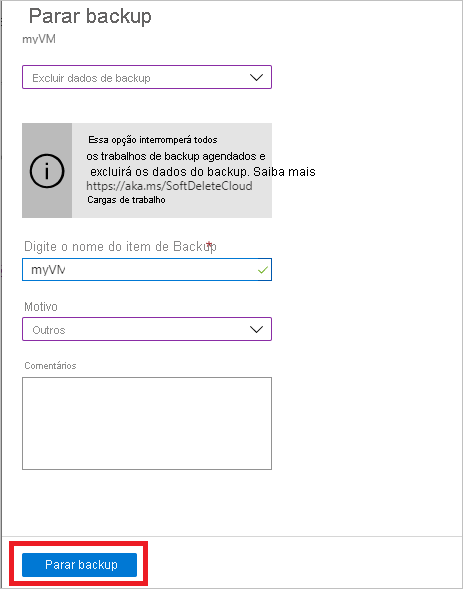

# Gerencie backups do Azure VM com o serviço de backup do Azure

Este artigo descreve como gerenciar as máquinas virtuais (VMs) do Azure que são apoiadas usando o serviço de backup do [Azure](backup-overview.md). O artigo também resume as informações de backup que você pode encontrar no painel do cofre.

No portal Azure, o painel do cofre do Recovery Services fornece acesso às informações do cofre, incluindo:

* O backup mais recente, que também é o ponto de restauração mais recente.
* A política de backup.
* O tamanho total de todos os instantâneos de backup.
* O número de VMs habilitadas para backups.

Você pode gerenciar backups usando o painel de controle e perfurando em VMs individuais. Para iniciar backups da máquina, abra o cofre no painel.

## Ver VMs no painel

Para ver VMs no painel do cofre:

1. Faça login no [portal Azure](https://portal.azure.com/).
2. No menu Hub, selecione **Procurar**. Na lista de recursos, digite **Serviços de Recuperação**. À medida que você digita, a lista é filtrada com base na sua entrada. Selecione **Cofres de Serviços de Recuperação**.

    

3. Para facilitar o uso, clique com o botão direito do mouse no cofre e selecione **Pin para painel**.
4. Abra o painel do cofre.

    

5. No bloco **de itens de backup,** selecione **Azure Virtual Machines**.

    

6. No painel **Itens de backup,** você pode visualizar a lista de VMs protegidas. Neste exemplo, o cofre protege uma máquina virtual: demobackup.  

    

7. No painel do item do cofre, modifique as políticas de backup, execute um backup demanda, pare ou retome a proteção de VMs, exclua dados de backup, visualize pontos de restauração e execute uma restauração.

    

## Gerenciar a política de backup de uma VM

Para gerenciar uma política de backup:

1. Faça login no [portal Azure](https://portal.azure.com/). Abra o painel do cofre.
2. No bloco **de itens de backup,** selecione **Azure Virtual Machines**.

    

3. No painel **Itens de backup,** você pode visualizar a lista de VMs protegidas e o último status de backup com o tempo de pontos de restauração mais recente.

    

4. No painel do item do cofre, você pode selecionar uma política de backup.

   * Para alternar políticas, selecione uma diretiva diferente e selecione **Salvar**. A nova política será aplicada imediatamente no cofre.

     

## Executar um backup sob demanda

Você pode executar um backup demanda de uma VM depois de configurar sua proteção. Tenha esses detalhes em mente:

* Se o backup inicial estiver pendente, o backup demanda criará uma cópia completa da VM no cofre dos Serviços de Recuperação.
* Se o backup inicial estiver concluído, um backup demanda só enviará alterações do snapshot anterior para o cofre dos Serviços de Recuperação. Ou seja, backups posteriores são sempre incrementais.
* O intervalo de retenção de um backup demanda é o valor de retenção que você especifica quando aciona o backup.

Para disparar um backup sob demanda:

1. No painel do [item do cofre,](#view-vms-on-the-dashboard)em **Item Protegido,** selecione **Item de backup**.

    

2. Do **tipo de gerenciamento de backup,** selecione **Azure Virtual Machine**. O **painel Item de backup (Azure Virtual Machine)** é exibido.
3. Selecione uma VM e selecione **Backup Agora** para criar um backup demanda. O **painel Backup Now** aparece.
4. No **campo Reter backup till,** especifique uma data para que o backup seja retido.

    

5. Selecione **OK** para executar o trabalho de backup.

Para acompanhar o progresso do trabalho, no painel do cofre, selecione o bloco **Backup Jobs.**

## Interromper a proteção de uma VM

Existem duas maneiras de parar de proteger uma VM:

* **Pare a proteção e retenha dados de backup**. Essa opção impedirá que todos os futuros trabalhos de backup protejam sua VM; no entanto, o serviço de backup do Azure manterá os pontos de recuperação que foram backup.  Você precisará pagar para manter os pontos de recuperação no cofre (veja [os preços do Azure Backup](https://azure.microsoft.com/pricing/details/backup/) para obter detalhes). Você será capaz de restaurar a VM se necessário. Se você decidir retomar a proteção contra VM, então você pode usar a opção *de backup do Resume.*
* **Pare a proteção e exclua dados de backup**. Essa opção impedirá que todos os trabalhos de backup futuros protejam sua VM e excluam todos os pontos de recuperação. Você não poderá restaurar a VM nem usar a opção *de backup Do currículo.*

>[!NOTE]
>Se você excluir uma fonte de dados sem interromper os backups, os novos backups falharão. Os pontos de recuperação antigos expirarão de acordo com a política, mas um último ponto de recuperação será sempre mantido até que você pare os backups e exclua os dados.
>

### Parar a proteção e reter dados de backup

Para interromper a proteção e reter dados de uma VM:

1. No [painel do item do cofre,](#view-vms-on-the-dashboard)selecione **Stop backup**.
2. Escolha **Reter dados de backup**e confirme sua seleção conforme necessário. Adicione um comentário se quiser. Se você não tiver certeza do nome do item, fique por cima do ponto de exclamação para ver o nome.

    

Uma notificação permite que você saiba que os trabalhos de backup foram interrompidos.

### Parar a proteção e excluir dados de backup

Para interromper a proteção e excluir dados de uma VM:

1. No [painel do item do cofre,](#view-vms-on-the-dashboard)selecione **Stop backup**.
2. Escolha **Excluir dados de backup**e confirme sua seleção conforme necessário. Digite o nome do item de backup e adicione um comentário se quiser.

    

## Retomar a proteção de uma VM

Se você escolheu [Parar de proteger e reter](#stop-protection-and-retain-backup-data) a opção de dados de backup durante a proteção contra a VM, então você poderá usar **o backup do Resume**. Esta opção não está disponível se você escolher [Parar de proteger e excluir](#stop-protection-and-delete-backup-data) a opção de dados de backup ou Excluir dados de [backup](#delete-backup-data).

Para retomar a proteção de uma VM:

1. No [painel do item do cofre,](#view-vms-on-the-dashboard)selecione **Retomar backup**.

2. Siga as etapas em [Gerenciar políticas de backup](#manage-backup-policy-for-a-vm) para atribuir a diretiva para a VM. Você não precisa escolher a política inicial de proteção da VM.
3. Depois de aplicar a diretiva de backup na VM, você verá a seguinte mensagem:

    

## Excluir dados de backup

Existem duas maneiras de excluir os dados de backup de uma VM:

* No painel do item do cofre, selecione Parar de fazer backup e siga as instruções para [proteção de stop e exclua a](#stop-protection-and-delete-backup-data) opção de dados de backup.

  

* No painel do item do cofre, selecione Excluir dados de backup. Esta opção está ativada se você tiver escolhido parar a [proteção e reter](#stop-protection-and-retain-backup-data) a opção de dados de backup durante a proteção de Stop VM

  

  * No painel do [item do cofre,](#view-vms-on-the-dashboard)selecione **Excluir dados de backup**.
  * Digite o nome do item de backup para confirmar se deseja excluir os pontos de recuperação.

    

  * Para excluir os dados de backup do item, **selecione Excluir**. Uma mensagem de notificação permite que você saiba que os dados de backup foram excluídos.

Para proteger seus dados, o Azure Backup inclui o recurso de exclusão suave. Com a exclusão suave, mesmo após o backup (todos os pontos de recuperação) de uma VM ser excluído, os dados de backup são retidos por 14 dias adicionais. Para obter mais informações, consulte [a documentação de exclusão suave](https://docs.microsoft.com/azure/backup/backup-azure-security-feature-cloud).

  > [!NOTE]
  > Quando você exclui dados de backup, você exclui todos os pontos de recuperação associados. Você não pode escolher pontos de recuperação específicos para excluir.

### Item de backup onde a fonte primária de dados não existe mais

* Se as VMs do Azure configuradas para backup do Azure forem excluídas ou movidas sem proteção de interrupção, ambos os trabalhos de backup programados e os trabalhos de backup demanda (ad-hoc) falharão com o erro UserErrorVmNotFoundV2. A pré-verificação de backup aparecerá como crítica apenas para trabalhos de backup demanda com falha (trabalhos agendados com falha não são exibidos).
* Esses itens de backup permanecem ativos no sistema aderindo à política de backup e retenção definida pelo usuário. Os dados de backup dessas VMs do Azure serão retidos de acordo com a política de retenção. Os pontos de recuperação expirados (exceto o último ponto de recuperação) são limpos de acordo com o intervalo de retenção definido na diretiva de backup.
* Recomenda-se aos usuários excluir os itens de backup onde a fonte de dados principal não existe mais para evitar qualquer custo adicional, se o item/dados de backup para os recursos de exclusão não for mais necessário, pois o último ponto de recuperação é retido para sempre e o usuário é cobrado de acordo com o preço de backup aplicável.

## Próximas etapas

* Aprenda a [fazer backup das VMs do Azure a partir das configurações da VM](backup-azure-vms-first-look-arm.md).
* Saiba como [restaurar VMs](backup-azure-arm-restore-vms.md).
* Saiba como [monitorar backups do Azure VM](backup-azure-monitor-vms.md).
