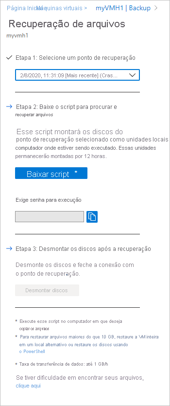
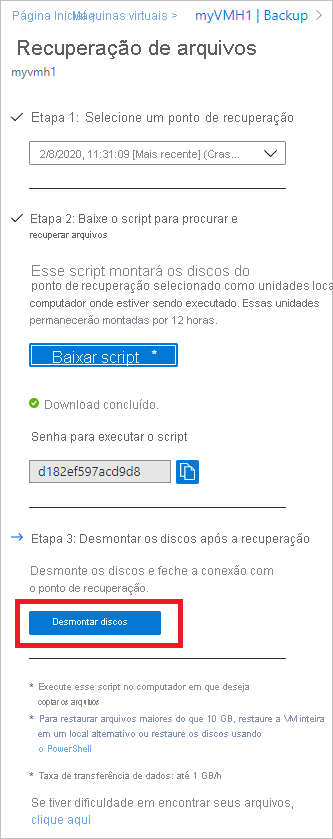

# <a name="recover-files-from-azure-virtual-machine-backup"></a>Recuperar arquivos de um backup de máquina virtual do Azure

O Backup do Azure fornece a capacidade de restaurar [máquinas virtuais (VMs) do Azure e discos](./backup-azure-arm-restore-vms.md) de backups de máquina virtual do Azure, também conhecido como pontos de recuperação. Este artigo explica como recuperar arquivos e pastas de um backup de VM do Azure. A restauração de arquivos e pastas está disponível somente para VMs do Azure implantadas usando o modelo do Resource Manager e protegidas em um cofre dos serviços de recuperação.


> [!NOTE]
> Esse recurso está disponível para máquinas virtuais do Azure implantadas usando o modelo do Resource Manager e protegidas em um cofre dos Serviços de Recuperação.
> Não há suporte para a recuperação de arquivo de um backup de VM criptografado.
>


## <a name="step-1-generate-and-download-script-to-browse-and-recover-files"></a>Etapa 1: gerar e baixar o script para procurar e recuperar arquivos

Para restaurar arquivos ou pastas do ponto de recuperação, vá para a máquina virtual e execute as seguintes etapas:

1. Entre no [portal do Azure](https://portal.Azure.com) e no painel esquerdo, selecione **máquinas virtuais**. Na lista de máquinas virtuais, selecione a máquina virtual para abrir o painel da máquina virtual.

2. No menu da máquina virtual, selecione **backup** para abrir o painel de backup.

    

3. No menu painel de backup, selecione **recuperação de arquivo**.

    

    O menu **Recuperação de Arquivo** é aberto.

    

4. No menu suspenso **Selecionar ponto de recuperação**, selecione o ponto de recuperação que contém os arquivos desejados. Por padrão, o ponto de recuperação mais recente já está selecionado.

5. Selecione **baixar o executável** (para VMs do Windows Azure) ou **baixar o script** (para VMs do Linux Azure, um script Python é gerado) para baixar o software usado para copiar arquivos do ponto de recuperação.

    

    O Azure baixa o arquivo executável ou o script para o computador local.

    

    Para executar o arquivo executável ou o script como um administrador, recomendamos salvar o arquivo baixado no seu computador.

6. O arquivo executável ou o script é protegido por senha e requer uma senha. No menu **recuperação de arquivo** , selecione o botão Copiar para carregar a senha na memória.

    


## <a name="step-2-ensure-the-machine-meets-the-requirements-before-executing-the-script"></a>Etapa 2: Verifique se o computador atende aos requisitos antes de executar o script

Depois que o script for baixado com êxito, verifique se você tem o computador certo para executar esse script. A VM em que você está planejando executar o script não deve ter nenhuma das seguintes configurações sem suporte. Se tiver, escolha uma máquina alternativa preferencialmente da mesma região que atenda aos requisitos.  

### <a name="dynamic-disks"></a>Discos dinâmicos

Você não pode executar o script executável na VM com qualquer uma das seguintes características:

- Volumes que abrangem vários discos (volumes estendidos e distribuídos).
- Volumes tolerantes a falhas (volumes espelhados e RAID-5) em discos dinâmicos.

### <a name="windows-storage-spaces"></a>Espaços de Armazenamento do Windows

Não é possível executar o executável baixado na VM configurada para espaços de armazenamento do Windows.

### <a name="virtual-machine-backups-having-large-disks"></a>Backups de máquina virtual com discos grandes

Se o computador com backup tiver um grande número de discos (>16) ou discos grandes (> 4 TB cada), não é recomendável executar o script no mesmo computador para restauração, pois ele terá um impacto significativo na VM. Em vez disso, é recomendável ter uma VM separada somente para recuperação de arquivos (VMs D2v3 de VM do Azure) e, em seguida, desligá-la quando não for necessário. 

## <a name="step-3-os-requirements-to-successfully-run-the-script"></a>Etapa 3: requisitos do sistema operacional para executar o script com êxito

A VM na qual você deseja executar o script baixado deve atender aos seguintes requisitos.

### <a name="for-windows-os"></a>Para Windows 10

A tabela a seguir mostra a compatibilidade entre os sistemas operacionais de computador e servidor. Ao recuperar arquivos, você não poderá restaurar arquivos para uma versão anterior ou uma versão futura do sistema operacional. Por exemplo, você não pode restaurar um arquivo de uma VM do Windows Server 2016 para um computador Windows Server 2012 ou Windows 8. É possível restaurar arquivos de uma VM para o mesmo sistema operacional do servidor ou para o sistema operacional compatível do cliente.

|Sistema operacional de servidor | Sistema operacional de cliente compatível  |
| --------------- | ---- |
| Windows Server 2019    | Windows 10 |
| Windows Server 2016    | Windows 10 |
| Windows Server 2012 R2 | Windows 8.1 |
| Windows Server 2012    | Windows 8  |
| Windows Server 2008 R2 | Windows 7   |

### <a name="for-linux-os"></a>Para Sistema operacional Linux

No Linux, o SO do computador utilizado para restaurar arquivos deve fornecer suporte para o sistema de arquivos da máquina virtual protegida. Ao selecionar um computador para executar o script, certifique-se de que o computador possui um SO compatível e usa uma das versões identificadas na tabela a seguir:

|Sistema operacional Linux | Versões  |
| --------------- | ---- |
| Ubuntu | 12.04 e acima |
| CentOS | 6.5 e acima  |
| RHEL | 6.7 e acima |
| Debian | 7 e acima |
| Oracle Linux | 6.4 e acima |
| SLES | 12 e acima |
| openSUSE | 42.2 e acima |

> [!NOTE]
> Encontramos alguns problemas na execução do script de recuperação de arquivo em computadores com o sistema operacional SLES 12 SP4 e estamos investigando com a equipe do SLES.
> Atualmente, a execução do script de recuperação de arquivo está funcionando em computadores com versões do sistema operacional SLES 12 SP2 e SP3.
>

O script também exige componentes Python e bash para executar e se conectar com segurança ao ponto de recuperação.

|Componente | Versão  |
| --------------- | ---- |
| bash | 4 e acima |
| python | 2.6.6 e acima  |
| .NET | 4.6.2 e acima |
| TLS | 1.2 deve ser compatível  |

## <a name="step-4-access-requirements-to-successfully-run-the-script"></a>Etapa 4: requisitos de acesso para executar o script com êxito

Se você executar o script em um computador com acesso restrito, verifique se há acesso a:

- `download.microsoft.com`
- URLs do serviço de recuperação (nome geográfico refere-se à região onde reside o cofre dos serviços de recuperação)
  - `https://pod01-rec2.GEO-NAME.backup.windowsazure.com` (Para regiões públicas do Azure)
  - `https://pod01-rec2.GEO-NAME.backup.windowsazure.cn` (Para Azure China 21Vianet)
  - `https://pod01-rec2.GEO-NAME.backup.windowsazure.us` (Para Governo dos EUA para Azure)
  - `https://pod01-rec2.GEO-NAME.backup.windowsazure.de` (Para Azure Alemanha)
- Portas de saída 53 (DNS), 443, 3260

> [!NOTE]
>
> O arquivo de script que você baixou na etapa 1 [acima](#step-1-generate-and-download-script-to-browse-and-recover-files) terá o **nome geográfico** no nome do arquivo. Use esse **nome geográfico** para preencher a URL. O nome do script baixado começará com: \' VMname \' \_ \' geoname \' _ \' GUID \' .<br><br>
> Por exemplo, se o nome de arquivo do script for *ContosoVM_wcus_12345678*, o **nome geográfico** será *wcus* e a URL será:<br> <https://pod01-rec2.wcus.backup.windowsazure.com>
>

Para o Linux, o script exige os componentes 'open-iscsi' e 'lshw' para se conectar ao ponto de recuperação. Se os componentes não existem no computador onde o script é executado, o script solicita a permissão para instalar os componentes. Conceda para instalar os componentes necessários.

É necessário ter acesso a `download.microsoft.com` para fazer download dos componentes usados para criar um canal seguro entre o computador em que o script é executado e os dados no ponto de recuperação.


## <a name="step-5-running-the-script-and-identifying-volumes"></a>Etapa 5: executar o script e identificar os volumes

### <a name="for-windows"></a>Para Windows

Depois de atender a todos os requisitos listados na etapa 2, etapa 3 e etapa 4, copie o script do local baixado (geralmente a pasta downloads), clique com o botão direito do mouse no executável ou no script e execute-o com credenciais de administrador. Quando solicitado, digite a senha ou cole a senha a partir da memória e pressione Enter. Quando a senha válida é inserida, o script conecta-se ao ponto de recuperação.

  


Quando você executa o arquivo executável, o sistema operacional monta os novos volumes e atribui letras de unidade. Você pode usar o Windows Explorer ou o Explorador de arquivos para procurar essas unidades. As letras de unidade atribuídas aos volumes podem não ser as mesmas letras da máquina virtual original. No entanto, o nome do volume é preservado. Por exemplo, se o volume na máquina virtual original fosse “Disco de Dados (E:`\`)”, esse volume poderia ser anexado no computador local como “Disco de Dados (“Qualquer letra”:`\`). Busque em todos os volumes mencionados na saída do script até encontrar seus arquivos ou suas pastas.  

   

#### <a name="for-backed-up-vms-with-large-disks-windows"></a>Para VMs com backup com discos grandes (Windows)

Se o processo de recuperação de arquivo parar depois de executar o script de restauração de arquivo (por exemplo, se os discos nunca estiverem montados ou se estiverem montados, mas os volumes não aparecerem), execute as seguintes etapas:
  
1. Verifique se o sistema operacional é WS 2012 ou superior.
2. Verifique se as chaves do Registro estão definidas conforme sugerido abaixo no servidor de restauração e reinicialize o servidor. O número ao lado do GUID pode variar de 0001 a 0005. No exemplo a seguir, é 0004. Navegue pelo caminho da chave do registro até a seção de parâmetros.

    

```registry
- HKEY_LOCAL_MACHINE\SYSTEM\CurrentControlSet\Services\Disk\TimeOutValue – change this from 60 to 1200
- HKEY_LOCAL_MACHINE\SYSTEM\ControlSet001\Control\Class\{4d36e97b-e325-11ce-bfc1-08002be10318}\0003\Parameters\SrbTimeoutDelta – change this from 15 to 1200
- HKEY_LOCAL_MACHINE\SYSTEM\ControlSet001\Control\Class\{4d36e97b-e325-11ce-bfc1-08002be10318}\0003\Parameters\EnableNOPOut – change this from 0 to 1
- HKEY_LOCAL_MACHINE\SYSTEM\ControlSet001\Control\Class\{4d36e97b-e325-11ce-bfc1-08002be10318}\0003\Parameters\MaxRequestHoldTime - change this from 60 to 1200
```

### <a name="for-linux"></a>Para Linux

Para computadores Linux, um script Python é gerado. Baixe o script e copie-o para o servidor Linux relevante/compatível. Talvez seja necessário modificar as permissões para executá-lo com ```chmod +x <python file name>```. Em seguida, execute o arquivo Python com ```./<python file name>```.


No Linux, os volumes do ponto de recuperação são montados para a pasta onde o script é executado. Os discos anexados, volumes e os caminhos de montagem correspondente são mostrados adequadamente. Esses caminhos de montagem ficam visíveis aos usuários que têm acesso ao nível raiz. Percorra os volumes mencionados na saída do script.

  


#### <a name="for-backed-up-vms-with-large-disks-linux"></a>Para VMs com backup com discos grandes (Linux) * *

Se o processo de recuperação de arquivo parar depois de executar o script de restauração de arquivo (por exemplo, se os discos nunca estiverem montados ou se estiverem montados, mas os volumes não aparecerem), execute as seguintes etapas:

1. No arquivo /etc/iSCSI/iscsid.conf, altere a configuração de:
    - `node.conn[0].timeo.noop_out_timeout = 5`  Para `node.conn[0].timeo.noop_out_timeout = 120`
2. Depois de fazer as alterações acima, execute o script novamente. Se houver falhas transitórias, certifique-se de que há um intervalo de 20 a 30 minutos entre o reexecutar para evitar picos de solicitações sucessivas que afetam a preparação de destino. Esse intervalo entre as reexecuções garantirá que o destino esteja pronto para conexão do script.
3. Após a recuperação de arquivos, verifique se você retornou ao portal e selecione **desmontar discos** para pontos de recuperação em que você não conseguiu montar volumes. Essencialmente, essa etapa limpará todos os processos/sessões existentes e aumentará a chance de recuperação.


#### <a name="lvmraid-arrays-for-linux-vms"></a>Matrizes LVM/RAID (para VMs Linux)

No Linux, o LVM (Gerenciador de volume lógico) e/ou matrizes de RAID de software são usados para gerenciar volumes lógicos em vários discos. Se a VM do Linux protegida utilizar LVM e/ou Matrizes RAID, não será possível executar o script na mesma VM.<br>
Em vez disso, execute o script em qualquer outra máquina com um SO compatível e que forneça suporte ao sistema de arquivos da VM protegida.<br>
A saída de script seguinte exibe os discos de Matrizes RAID e/ou LVM e os volumes com o tipo de partição.

   

Para colocar essas partições online, execute os comandos nas seções a seguir.

#### <a name="for-lvm-partitions"></a>Para partições LVM

Depois que o script é executado, as partições LVM são montadas nos volumes físicos/Disk especificados na saída do script. O processo é para

1. Obter a lista exclusiva de nomes de grupos de volumes dos volumes físicos ou discos
2. Em seguida, liste os volumes lógicos nesses grupos de volumes
3. Em seguida, monte os volumes lógicos em um caminho desejado.

##### <a name="listing-volume-group-names-from-physical-volumes"></a>Listando nomes de grupos de volume de volumes físicos

Para listar os nomes de grupos de volumes:

```bash
pvs -o +vguuid
```

Esse comando listará todos os volumes físicos (incluindo os presentes antes de executar o script), seus nomes de grupos de volumes correspondentes e os UUIDs (IDs de usuário) exclusivos do grupo de volumes. Uma saída de exemplo do comando é mostrada abaixo.

```bash
PV         VG        Fmt  Attr PSize   PFree    VG UUID

  /dev/sda4  rootvg    lvm2 a--  138.71g  113.71g EtBn0y-RlXA-pK8g-de2S-mq9K-9syx-B29OL6

  /dev/sdc   APPvg_new lvm2 a--  <75.00g   <7.50g njdUWm-6ytR-8oAm-8eN1-jiss-eQ3p-HRIhq5

  /dev/sde   APPvg_new lvm2 a--  <75.00g   <7.50g njdUWm-6ytR-8oAm-8eN1-jiss-eQ3p-HRIhq5

  /dev/sdf   datavg_db lvm2 a--   <1.50t <396.50g dhWL1i-lcZS-KPLI-o7qP-AN2n-y2f8-A1fWqN

  /dev/sdd   datavg_db lvm2 a--   <1.50t <396.50g dhWL1i-lcZS-KPLI-o7qP-AN2n-y2f8-A1fWqN
```

A primeira coluna (VP) mostra o volume físico, as colunas subsequentes mostram o nome do grupo de volumes relevante, o formato, os atributos, o tamanho, o espaço livre e a ID exclusiva do grupo de volumes. A saída do comando mostra todos os volumes físicos. Consulte a saída do script e identifique os volumes relacionados ao backup. No exemplo acima, a saída do script teria mostrado/dev/sdf e/dev/sdd. Portanto, o grupo de volume *datavg_db* pertence ao script e o grupo de volume *Appvg_new* pertence ao computador. A ideia final é verificar se um nome de grupo de volumes exclusivo deve ter uma ID exclusiva.

###### <a name="duplicate-volume-groups"></a>Grupos de volumes duplicados

Há cenários em que os nomes de grupos de volumes podem ter dois UUIDs após a execução do script. Isso significa que os nomes do grupo de volumes no computador em que o script é executado e na VM de backup são os mesmos. Em seguida, precisamos renomear os grupos de volumes das VMs com backup. Veja o exemplo abaixo.

```bash
PV         VG        Fmt  Attr PSize   PFree    VG UUID

  /dev/sda4  rootvg    lvm2 a--  138.71g  113.71g EtBn0y-RlXA-pK8g-de2S-mq9K-9syx-B29OL6

  /dev/sdc   APPvg_new lvm2 a--  <75.00g   <7.50g njdUWm-6ytR-8oAm-8eN1-jiss-eQ3p-HRIhq5

  /dev/sde   APPvg_new lvm2 a--  <75.00g   <7.50g njdUWm-6ytR-8oAm-8eN1-jiss-eQ3p-HRIhq5

  /dev/sdg   APPvg_new lvm2 a--  <75.00g  508.00m lCAisz-wTeJ-eqdj-S4HY-108f-b8Xh-607IuC

  /dev/sdh   APPvg_new lvm2 a--  <75.00g  508.00m lCAisz-wTeJ-eqdj-S4HY-108f-b8Xh-607IuC

  /dev/sdm2  rootvg    lvm2 a--  194.57g  127.57g efohjX-KUGB-ETaH-4JKB-MieG-EGOc-XcfLCt
```

A saída do script teria mostrado/dev/SDG,/dev/SDH,/dev/sdm2 como anexado. Assim, os nomes de VG correspondentes são Appvg_new e rootvg. Mas os mesmos nomes também estão presentes na lista VG do computador. Podemos verificar se um nome de VG tem dois UUIDs.

Agora, precisamos renomear os nomes de VG para volumes baseados em script, por exemplo:/dev/SDG,/dev/SDH,/dev/sdm2. Para renomear o grupo de volumes, use o seguinte comando

```bash
vgimportclone -n rootvg_new /dev/sdm2
vgimportclone -n APPVg_2 /dev/sdg /dev/sdh
```

Agora, temos todos os nomes de VG com IDs exclusivos.

###### <a name="active-volume-groups"></a>Grupos de volume ativos

Verifique se os grupos de volumes correspondentes aos volumes do script estão ativos. O comando a seguir é usado para exibir grupos de volume ativos. Verifique se os grupos de volume relacionados do script estão presentes nesta lista.

```bash
vgdisplay -a
```  

Caso contrário, ative o grupo de volumes usando o comando a seguir.

```bash
#!/bin/bash
vgchange –a y  <volume-group-name>
```

##### <a name="listing-logical-volumes-within-volume-groups"></a>Listando volumes lógicos em grupos de volumes

Depois de obtermos a lista exclusiva e ativa de VGs relacionados ao script, os volumes lógicos presentes nesses grupos de volumes poderão ser listados usando o comando a seguir.

```bash
#!/bin/bash
lvdisplay <volume-group-name>
```

Este comando exibe o caminho de cada volume lógico como ' LV path '.

##### <a name="mounting-logical-volumes"></a>Montando volumes lógicos

Para montar os volumes lógicos no caminho de sua escolha:

```bash
#!/bin/bash
mount <LV path from the lvdisplay cmd results> </mountpath>
```

> [!WARNING]
> Não use ' mount-a '. Esse comando monta todos os dispositivos descritos em '/etc/fstab '. Isso pode significar que dispositivos duplicados podem ser montados. Os dados podem ser redirecionados para dispositivos criados por um script, que não persistem os dados e, portanto, podem resultar em perda de dados.

#### <a name="for-raid-arrays"></a>Para matrizes RAID

O comando a seguir exibe detalhes sobre todos os discos raid:

```bash
#!/bin/bash
mdadm –detail –scan
```

 O disco RAID relevante é exibido como `/dev/mdm/<RAID array name in the protected VM>`

Use o comando de montagem se o disco RAID tiver volumes físicos:

```bash
#!/bin/bash
mount [RAID Disk Path] [/mountpath]
```

Se o disco RAID tiver outra LVM configurada, utilize o procedimento anterior para partições de LVM, mas utilize o nome de volume no lugar do nome do RAID Disk.

## <a name="step-6-closing-the-connection"></a>Etapa 6: fechando a conexão

Depois de identificar os arquivos e copiá-los para um local de armazenamento local, remova ou desmonte as unidades adicionais. Para desmontar as unidades, no menu **recuperação de arquivos** na portal do Azure, selecione **desmontar discos**.



Depois que os discos forem desmontados, você receberá uma mensagem. Pode levar alguns minutos até que a conexão seja atualizada para que você possa remover os discos.

No Linux, após a conexão com o ponto de recuperação ser interrompida, o sistema operacional não removerá automaticamente os caminhos de montagem correspondentes. Os caminhos de montagem existem como volumes "órfãos" e são visíveis, mas geram um erro ao acessar/gravar os arquivos. Eles podem ser removidos manualmente. O script, quando executado, identifica esses volumes existentes em qualquer ponto de recuperação anterior e limpa mediante consentimento.

> [!NOTE]
> Certifique-se de que a conexão seja fechada depois que os arquivos necessários forem restaurados. Isso é importante, especialmente no cenário em que o computador no qual o script é executado também é configurado para backup. Se a conexão ainda estiver aberta, o backup subsequente poderá falhar com o erro "UserErrorUnableToOpenMount". Isso acontece porque os volumes/unidades montadas devem estar disponíveis e, quando acessados, eles podem falhar porque o armazenamento subjacente, ou seja, o servidor de destino iSCSI pode não estar disponível. A limpeza da conexão removerá essas unidades/volumes e, portanto, elas não estarão disponíveis durante o backup.

## <a name="security"></a>Segurança

Esta seção aborda várias medidas de segurança tomadas para a implementação da recuperação de arquivos de backups de VM do Azure.

### <a name="feature-flow"></a>Fluxo de recursos

Esse recurso foi criado para acessar os dados da VM sem a necessidade de restaurar toda a VM ou os discos de VM e com o número mínimo de etapas. O acesso aos dados da VM é fornecido por um script (que monta o volume de recuperação quando executado conforme mostrado abaixo) que forma a base de todas as implementações de segurança:

  

### <a name="security-implementations"></a>Implementações de segurança

#### <a name="select-recovery-point-who-can-generate-script"></a>Selecionar o ponto de recuperação (quem pode gerar script)

O script fornece acesso aos dados da VM, portanto, é importante regular quem pode gerá-lo. Você precisa entrar no portal do Azure e ser o [RBAC do Azure autorizado](backup-rbac-rs-vault.md#mapping-backup-built-in-roles-to-backup-management-actions) a gerar o script.

A recuperação de arquivo precisa do mesmo nível de autorização necessário para restauração de VM e restauração de discos. Em outras palavras, somente usuários autorizados podem exibir os dados da VM e podem gerar o script.

O script gerado é assinado com o certificado oficial da Microsoft para o serviço de Backup do Azure. Qualquer violação no script significa que a assinatura foi violada e qualquer tentativa de executar o script é sinalizada como um risco potencial pelo sistema operacional.

#### <a name="mount-recovery-volume-who-can-run-script"></a>Montar o volume de recuperação (quem pode executar o script)

Somente um administrador pode executar o script que deve ser executado no modo elevado. O script executa apenas um conjunto de etapas gerado previamente e não aceita a entrada de qualquer fonte externa.

Para executar o script, é necessária uma senha que só é mostrada para o usuário autorizado no momento da geração de script no portal do Azure ou PowerShell/CLI. Isso é para garantir que o usuário autorizado que baixa o script também seja responsável por executar o script.

#### <a name="browse-files-and-folders"></a>Procurar arquivos e pastas

Para procurar arquivos e pastas, o script usa o iniciador iSCSI no computador e conecta-se ao ponto de recuperação configurado como um destino iSCSI. Aqui você pode imaginar cenários em que alguém está tentando imitar/falsificar um ou todos os componentes.

Usamos um mecanismo de autenticação CHAP mútuo para que cada componente autentique o outro. Isso significa que é extremamente difícil para um iniciador falso se conectar ao destino iSCSI e para que um destino falso seja conectado ao computador na qual o script é executado.

O fluxo de dados entre o serviço de recuperação e o computador é protegido por meio da criação de um túnel TLS seguro sobre TCP ([TLS 1.2 deve ter suporte](#step-3-os-requirements-to-successfully-run-the-script) no computador no qual o script é executado).

Qualquer ACL (lista de controle de acesso) de arquivo presente na VM pai/com backup também é preservada no sistema de arquivos montado.

O script fornece acesso somente leitura a um ponto de recuperação e é válido por apenas 12 horas. Se você quiser remover o acesso anteriormente, entre no portal do Azure/PowerShell/CLI e realize a **desmontagem de discos** para esse ponto de recuperação específico. O script será invalidado imediatamente.


## <a name="next-steps"></a>Próximas etapas

- Saiba como [restaurar arquivos por meio do PowerShell](./backup-azure-vms-automation.md#restore-files-from-an-azure-vm-backup)
- Saiba como [restaurar arquivos por meio da CLI do Azure](./tutorial-restore-files.md)
- Depois que a VM for restaurada, saiba como [gerenciar backups](./backup-azure-manage-vms.md)
