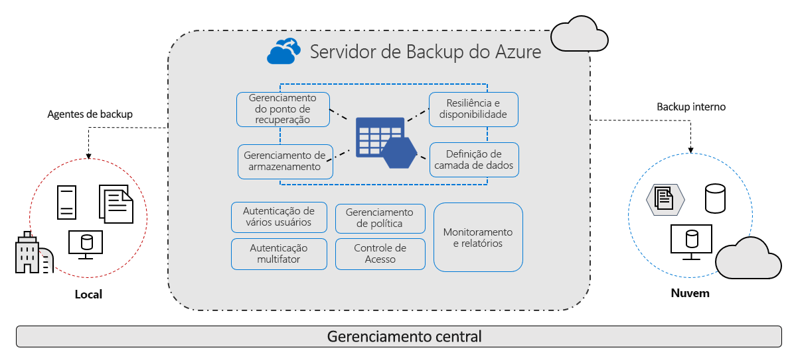

# O que é o serviço de Backup do Azure?

O serviço de Backup do Azure fornece soluções simples, seguras e econômicas para fazer backup de seus dados e recuperá-los da nuvem do Microsoft Azure.

> [!VIDEO https://www.youtube.com/embed/elODShatt-c]

## Do que é possível fazer backup?

- **Local** – faça backup de arquivos, de pastas e do estado do sistema usando o [agente MARS (Serviços de Recuperação do Microsoft Azure)](backup-support-matrix-mars-agent.md). Ou, então, use o Agente do DPM ou do MABS (Servidor de Backup do Azure) para proteger as VMs locais ([Hyper-V](back-up-hyper-v-virtual-machines-mabs.md) e [VMware](backup-azure-backup-server-vmware.md)) e outras [cargas de trabalho locais](backup-mabs-protection-matrix.md)
- **VMs do Azure** - [Faça backup de VMs do Windows/Linux inteiras](backup-azure-vms-introduction.md) (usando extensões de backup) ou faça backup de arquivos, de pastas e do estado do sistema usando o [agente MARS](backup-azure-manage-mars.md).
- **Azure Managed Disks** - [Fazer backup do Azure Managed Disks](backup-managed-disks.md)
- **Compartilhamentos dos Arquivos do Azure** - [Faça backup de compartilhamentos dos Arquivos do Azure para uma conta de armazenamento](backup-afs.md)
- **SQL Server em VMs do Azure** -  [Faça backup de bancos de dados do SQL Server em execução nas VMs do Azure](backup-azure-sql-database.md)
- **Bancos de dados do SAP HANA em VMs do Azure** - [Faça backup de bancos de dados do SAP HANA em execução nas VMs do Azure](backup-azure-sap-hana-database.md)
- **Servidores do Banco de Dados do Azure para PostgreSQL (versão prévia)**  -  [Faça backup dos bancos de dados PostgreSQL do Azure e mantenha os backups por até 10 anos](backup-azure-database-postgresql.md)
- **Blobs do Azure (versão prévia)**  - [Visão geral do backup operacional para Blobs do Azure (na versão prévia)](blob-backup-overview.md)

## Por que usar o Backup do Azure?

O Backup do Azure oferece estes principais benefícios:

- **Descarregue o backup local**: O Backup do Azure oferece uma solução simples para fazer backup de seus recursos locais na nuvem. Obtenha um backup de curto e longo prazo sem a necessidade de implantar soluções complexas de backup local.
- **Faça backup de VMs IaaS do Azure**: O Backup do Azure fornece backups independentes e isolados para proteger contra a destruição acidental de dados originais. Os backups são armazenados em um cofre dos Serviços de Recuperação com gerenciamento interno de pontos de recuperação. A configuração e a escalabilidade são simples, os backups são otimizados e você pode fazer uma restauração com facilidade, conforme necessário.
- **Dimensione com facilidade** – o Backup do Azure usa o poder subjacente e a escala ilimitada da nuvem do Azure para proporcionar alta disponibilidade sem sobrecarga de manutenção ou de monitoramento.
- **Obtenha transferência de dados ilimitados**: O Backup do Azure não limita a quantidade de dados de entrada ou saída transferidos nem cobra pelos dados transferidos.
  - Os dados de saída são aqueles transferidos de um cofre dos Serviços de Recuperação durante uma operação de restauração.
  - Se você fizer um backup inicial offline usando o serviço de Importação/Exportação do Azure para importar grandes quantidades de dados, haverá um custo associado aos dados de entrada.  [Saiba mais](backup-azure-backup-import-export.md).
- **Mantenha os dados seguros**: O Backup do Azure fornece soluções para proteger dados [em trânsito](backup-azure-security-feature.md) e [em repouso](backup-azure-security-feature-cloud.md).
- **Monitoramento e gerenciamento centralizados**: O Backup do Azure oferece [funcionalidades internas de monitoramento e alertas](backup-azure-monitoring-built-in-monitor.md) em um cofre dos Serviços de Recuperação. Essas funcionalidades estão disponíveis sem nenhuma infraestrutura de gerenciamento adicional. Aumente também a escala do monitoramento e dos relatórios [usando o Azure Monitor](backup-azure-monitoring-use-azuremonitor.md).
- **Obtenha backups consistentes com aplicativo**: Um backup consistente com aplicativo significa que um ponto de recuperação tem todos os dados necessários para restaurar a cópia de backup. O Backup do Azure fornece backups consistentes com aplicativos, garantindo que correções adicionais não sejam necessárias para restaurar os dados. Restaurar dados consistentes com aplicativos reduz o tempo de restauração, permitindo que você rapidamente retorne ao estado de execução.
- **Manter os dados de curto e longo prazo**: Use os [cofres dos Serviços de Recuperação](backup-azure-recovery-services-vault-overview.md) para retenção de dados de curto e longo prazo.
- **Gerenciamento automático de armazenamento** - ambientes híbridos geralmente exigem armazenamento heterogêneo, alguns locais e alguns na nuvem. Com o Backup do Azure, não há nenhum custo para o uso de dispositivos de armazenamento local. O Backup do Azure aloca e gerencia automaticamente o armazenamento de backup, com um modelo de pagamento conforme o uso. Você só pagará pelo armazenamento que consumir. [ Saiba mais ](https://azure.microsoft.com/pricing/details/backup) sobre preços.
- **Várias opções de armazenamento** – o Backup do Azure oferece três tipos de replicação para manter seu armazenamento/seus dados altamente disponíveis.
  - O [LRS (armazenamento com redundância local)](../storage/common/storage-redundancy.md#locally-redundant-storage) replica seus dados três vezes (ele cria três cópias dos dados) em uma unidade de escala de armazenamento em um datacenter. Todas as cópias dos dados existem na mesma região. O LRS é uma opção de baixo custo para proteger seus dados contra falhas de hardware local.
  - O [GRS (armazenamento com redundância geográfica)](../storage/common/storage-redundancy.md#geo-redundant-storage) é a opção de replicação padrão e recomendada. O GRS replica seus dados para uma região secundária (a centenas de quilômetros da região primária dos dados de origem). O GRS é mais caro do que o LRS, mas fornece um nível mais alto de durabilidade para seus dados, mesmo quando há uma interrupção regional.
  - [O ZRS (armazenamento com redundância de zona)](../storage/common/storage-redundancy.md#zone-redundant-storage) replica seus dados em [zonas de disponibilidade](../availability-zones/az-overview.md#availability-zones), garantindo a residência de dados e a resiliência na mesma região. O ZRS não tem tempo de inatividade. Portanto, suas cargas de trabalho críticas que exigem [residências de dados](https://azure.microsoft.com/resources/achieving-compliant-data-residency-and-security-with-azure/) e não devem ter nenhum tempo de inatividade, podem ter o backup feito em ZRS.

## Próximas etapas

- [Examine](backup-architecture.md) a arquitetura e os componentes para diferentes cenários de backup.
- [Verifique](backup-support-matrix.md) os requisitos e limitações de suporte para backup e para [backup de VMs do Azure](backup-support-matrix-iaas.md).
