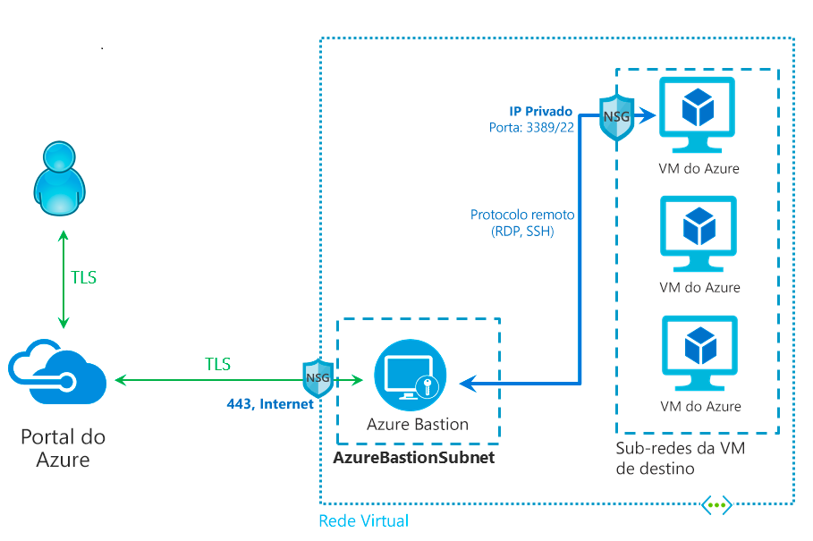

# O que é o Azure Bastion?

O Azure Bastion é um serviço que ao ser implantado permite que você se conecte a uma máquina virtual usando seu navegador e o portal do Azure. O serviço do Azure Bastion é um serviço PaaS totalmente gerenciado por plataforma que pode ser provisionado dentro de sua rede virtual. Ele fornece uma conectividade RDP/SSH segura e contínua para suas máquinas virtuais diretamente do portal do Azure via TLS. Ao se conectar por meio do Azure Bastion, suas máquinas virtuais não precisarão de um endereço IP público, nem de um agente e tampouco de um software cliente especial.

O Bastion fornece conectividade segura de RDP e SSH a todas as VMs na rede virtual em que ele é provisionado. O uso do Azure Bastion protege suas máquinas virtuais contra a exposição das portas RDP/SSH ao mundo externo, fornecendo acesso seguro usando o RDP/o SSH.

## Arquitetura

A implantação do Azure Bastion é feita por rede virtual, não por assinatura/conta ou máquina virtual. Após você provisionar um serviço do Azure Bastion em sua rede virtual, a experiência de RDP/SSH é disponibilizada para todas as suas VMs na mesma rede virtual.

RDP e SSH são alguns dos meios fundamentais pelos quais você pode se conectar às suas cargas de trabalho em execução no Azure. A exposição de portas RDP/SSH pela Internet não é desejada e é vista como uma superfície de ameaça significativa. Isso costuma ocorrer devido a vulnerabilidades de protocolo. Para conter essa superfície de ameaça, você pode implantar hosts de bastiões (também conhecidos como jump-servers) no lado público de sua rede de perímetro. Os servidores de hosts de bastião são projetados e configurados para resistir a ataques. Os servidores de bastião também fornecem conectividade RDP e SSH às cargas de trabalho situadas atrás do bastião, bem como dentro da rede.

Esta figura mostra a arquitetura de uma implantação do Azure Bastion. Neste diagrama:

* O bastion host é implantado na rede virtual que contém a sub-rede AzureBastionSubnet que tem um prefixo mínimo /27.
* O usuário se conecta ao portal do Azure usando qualquer navegador HTML5.
* O usuário seleciona a máquina virtual a qual se conectar.
* Com um único clique, a sessão RDP/SSH é aberta no navegador.
* Nenhum IP público é necessário na VM do Azure.

## Principais recursos

Os seguintes recursos estão disponíveis:

* **RDP e SSH diretamente no portal do Azure:** Você pode obter acesso direto à sessão RDP e SSH no portal do Azure usando uma experiência perfeita de único clique.
* **Sessão remota sobre TLS e passagem de firewall para RDP/SSH:** O Azure Bastion usa um cliente Web baseado em HTML5 que é automaticamente transmitido para o dispositivo local, de modo que você obtenha a sessão RDP/SSH via TLS na porta 443, permitindo atravessar firewalls corporativos com segurança.
* **Não é necessário IP público na VM do Azure:** O Azure Bastion abre a conexão RDP/SSH com sua máquina virtual do Azure usando IP privado em sua VM. Você não precisa de um IP público na sua máquina virtual.
* **Sem problemas de gerenciamento de NSGs:** O Azure Bastion é um serviço PaaS de plataforma totalmente gerenciado do Azure que é protegido internamente para fornecer conectividade RDP/SSH segura. Não é preciso aplicar qualquer NSG na sub-rede do Azure Bastion. Como o Azure Bastion se conecta às suas máquinas virtuais por IP privado, você pode configurar seus NSGs para permitir somente o RDP/SSH do Azure Bastion. Isso acaba com o trabalho de gerenciar NSGs cada vez que você precisa se conectar com segurança às suas máquinas virtuais.
* **Proteção contra a varredura de porta:** Como você não precisa expor suas máquinas virtuais à Internet pública, suas VMs são protegidas contra a varredura de portas por usuários invasores e mal-intencionados localizados fora de sua rede virtual.
* **Protege contra explorações de dia zero. Proteção em um único lugar:** o Azure Bastion é um serviço de PaaS totalmente gerenciado por plataforma. Como ele reside no perímetro de sua rede virtual, você não precisa se preocupar em proteger cada uma das máquinas virtuais da sua rede virtual. A plataforma Azure oferece proteção contra explorações de dia zero, mantendo o Azure Bastion protegido e sempre atualizado para você.

## Novidades

Assine o RSS feed e veja as atualizações mais recentes dos recursos do Azure Bastion na página [Atualizações do Azure](https://azure.microsoft.com/updates/?category=networking&query=Azure%20Bastion).

## Perguntas frequentes

[!INCLUDE [Bastion FAQ](../../includes/bastion-faq-include.md)]

## Próximas etapas

* [Tutorial: como criar um host do Azure Bastion e se conectar a uma VM do Windows](tutorial-create-host-portal.md).
* Saiba mais sobre alguns dos outros principais [recursos de rede](../networking/networking-overview.md) do Azure.
