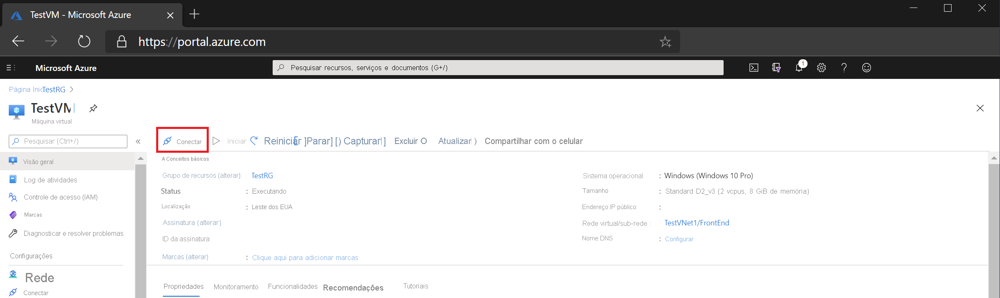

# Início Rápido: Conectar-se a uma máquina virtual usando um endereço IP privado e o Azure Bastion

Este artigo de início rápido mostra como conectar-se a uma máquina virtual usando um endereço IP privado. Quando você se conecta usando o Bastion, suas máquinas virtuais não precisam de um endereço IP público. As etapas neste artigo ajudam você a implantar o Bastion em sua rede virtual por meio da máquina virtual no portal. Depois que o serviço é provisionado, a experiência de RDP/SSH está disponível para todas as máquinas virtuais na mesma rede virtual.

## Pré-requisitos

* Uma rede virtual do Azure.
* Uma máquina virtual do Azure localizada na rede virtual com a porta 3389 aberta.

### Valores de exemplo

|**Nome** | **Valor** |
| --- | --- |
| Nome |  VNet1Bastion |
| Região | eastus |
| Rede virtual |  VNet1 |
| + Nome da Sub-rede | AzureBastionSubnet |
| Endereços da AzureBastionSubnet |  10.1.254.0/27 |
| Endereço IP público |  Criar |
| Nome do endereço IP público | VNet1BastionPIP  |
| SKU do endereço IP público |  Standard  |
| Atribuição  | Estático |

## Criar um bastion host

Quando você cria um bastion host no portal usando uma máquina virtual existente, várias configurações assumirão por padrão valores correspondentes aos da sua máquina virtual e/ou rede virtual.

1. Abra o [Portal do Azure](https://portal.azure.com). Acesse a sua máquina virtual e clique em **Conectar**.

   
1. Na lista suspensa, selecione **Bastion**.
1. Na página Conectar, selecione **Usar o Bastion**.

   

1. Na página Bastion, preencha os seguintes campos de configurações:

   * **Name**: nomear o bastion host
   * **Sub-rede**: a sub-rede na rede virtual na qual o recurso do Bastion será implantado. A sub-rede precisa ser criada com o nome **AzureBastionSubnet**. O nome permite que o Azure saiba em qual sub-rede os recursos do Bastion serão implantados. Isso é diferente de uma sub-rede de gateway. Use uma sub-rede de pelo menos /27 ou maior (/27,/26, /25 e assim por diante).
   
      * Selecione **Gerenciar configuração de sub-rede**, depois **+ Sub-rede**.
      * Na página Adicionar sub-rede, digite **AzureBastionSubnet**.
      * Especifique o intervalo de endereços na notação CIDR. Por exemplo, 10.1.254.0/27.
      * Selecione **OK** para criar a sub-rede. Na parte superior da página, navegue de volta para o Bastion para concluir o restante das configurações.

         
   * **Endereço IP público**: esse é o IP público do recurso do Bastion no qual o RDP/SSH será acessado (pela porta 443). Crie um IP público ou use um existente. O endereço IP público precisa estar na mesma região que o recurso do Bastion que você está criando.
   * **Nome do endereço IP público**: o nome do recurso de endereço IP público.
1. Na tela de validação, clique em **Criar**. Aguarde cerca de 5 minutos para o recurso do Bastion ser criado e implantado.

   

## Conectar

Depois que o Bastion tiver sido implantado na rede virtual, a tela será alterada para a página Conectar.

1. Insira o nome de usuário e a senha da sua máquina virtual. Em seguida, selecione **Conectar**.

   
1. A conexão RDP com essa máquina virtual via Bastion será aberta diretamente no portal do Azure (via HTML5) usando a porta 443 e o serviço Bastion.

   

## Limpar os recursos

Quando terminar de usar a rede virtual e as máquinas virtuais, exclua o grupo de recursos e todos os recursos que ele contém:

1. Insira *TestRG1* na caixa **Pesquisar** na parte superior do portal e selecione **TestRG1** nos resultados da pesquisa.

2. Selecione **Excluir grupo de recursos**.

3. Insira *TestRG1* para **DIGITE O NOME DO GRUPO DE RECURSOS** e selecione **Excluir**.

## Próximas etapas

Neste guia de início rápido, você criou um host do Bastion para sua rede virtual e, em seguida, se conectou a uma máquina virtual com segurança por meio do host do Bastion.

* Para saber mais sobre o Azure Bastion, leia a [Visão geral do Bastion](bastion-overview.md) e as [Perguntas frequentes sobre o Bastion](bastion-faq.md).
* Para usar grupos de segurança de rede com a sub-rede do Azure Bastion, confira [Trabalhar com NSGs](bastion-nsg.md).
* Para obter instruções que contenham explicações das configurações do host do Azure Bastion, confira o [tutorial](bastion-create-host-portal.md).
* Para se conectar a um conjunto de dimensionamento de máquinas virtuais, confira [Conectar a um conjunto de dimensionamento de máquinas virtuais usando o Azure Bastion](bastion-connect-vm-scale-set.md).