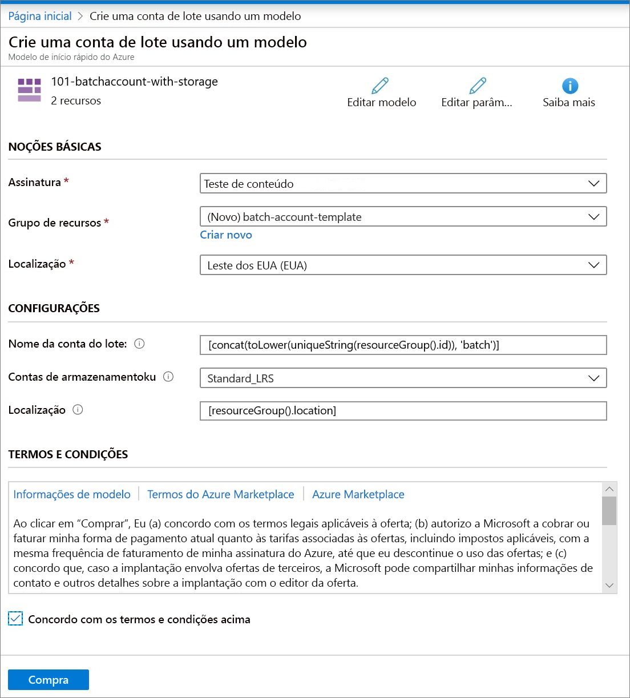

# Início Rápido: Criar uma conta do Lote usando um modelo do Resource Manager

Você precisa de uma conta do Lote para criar recursos de computação (pools de nós de computação) e trabalhos do Lote. Você pode vincular uma conta do Armazenamento do Azure com sua conta do Lote, o que é útil para implantar aplicativos e armazenar dados de entrada e saída para a maioria das cargas de trabalho da vida real. Este guia de início rápido mostra como usar um modelo do Azure Resource Manager para criar uma conta do Lote, incluindo o armazenamento. Depois de concluir este guia de início rápido, você entenderá os conceitos principais do serviço Lote e estará pronto para experimentar o Lote com cargas de trabalho mais realistas em maior escala.

[!INCLUDE [About Azure Resource Manager](../../includes/resource-manager-quickstart-introduction.md)]

Se seu ambiente atender aos pré-requisitos e você estiver familiarizado com o uso de modelos ARM, selecione o botão **Implantar no Azure**. O modelo será aberto no portal do Azure.

## Pré-requisitos

É necessário ter uma assinatura ativa do Azure.

- [!INCLUDE [quickstarts-free-trial-note](../../includes/quickstarts-free-trial-note.md)]

## Examinar o modelo

O modelo usado neste início rápido é proveniente dos [Modelos de Início Rápido do Azure](https://azure.microsoft.com/resources/templates/101-batchaccount-with-storage/).

:::code language="json" source="~/quickstart-templates/101-batchaccount-with-storage/azuredeploy.json":::

Há dois recursos do Azure definidos no modelo:

- [Microsoft.Storage/storageAccounts](/azure/templates/microsoft.storage/storageaccounts): Cria uma conta de armazenamento.
- [Microsoft.Batch/batchAccounts](/azure/templates/microsoft.batch/batchaccounts): Cria uma conta do Lote.

## Implantar o modelo

1. Selecione a imagem a seguir para entrar no Azure e abrir um modelo. O modelo cria uma conta do Lote do Azure e uma conta de Armazenamento.

   

1. Selecione ou insira os seguintes valores.

   

   - **Assinatura**: selecione uma assinatura do Azure.
   - **Grupo de recursos**: selecione **Criar novo**, insira um nome exclusivo para o grupo de recursos e, em seguida, clique em **OK**.
   - **Local**: selecione um local. Por exemplo, **Centro dos EUA**.
   - **Nome da Conta do Lote**: Mantenha o valor padrão.
   - **Accountsku do Armazenamento**: selecione um tipo de conta de armazenamento. Por exemplo, **Standard_LRS**.
   - **Localização**: deixe o padrão para que os recursos fiquem no mesmo local que seu grupo de recursos.
   - Concordo com os termos e as condições acima: **Selecione**.

1. Selecione **Comprar**.

Após alguns minutos, você deverá ver uma notificação de que a conta do Lote foi criada com êxito.

Neste exemplo, o portal do Azure é usado para implantar o modelo. Além do portal do Azure, você também pode usar o Azure PowerShell, a CLI do Azure e a API REST. Para saber mais sobre outros métodos de implantação, confira [Implantar modelos](../azure-resource-manager/templates/deploy-powershell.md).

## Validar a implantação

Você pode validar a implantação no portal do Azure navegando até o grupo de recursos que criou. Na tela **Visão geral**, confirme se a conta do Lote e a conta de armazenamento estão presentes.

## Limpar os recursos

Se desejar continuar trabalhando com os [tutoriais](./tutorial-parallel-dotnet.md) seguintes, deixe esses recursos onde estão. Ou, se não precisar mais deles, você poderá [excluir o grupo de recursos](../azure-resource-manager/management/delete-resource-group.md?tabs=azure-portal#delete-resource-group), o que também excluirá a conta do Lote e a conta de armazenamento que você criou.

## Próximas etapas

Neste início rápido, você criou uma conta do Lote e uma conta de armazenamento. Para saber mais sobre o Lote do Azure, prossiga para os tutoriais do Lote do Azure.

> [!div class="nextstepaction"]
> [Tutoriais do Lote do Azure](./tutorial-parallel-dotnet.md)
