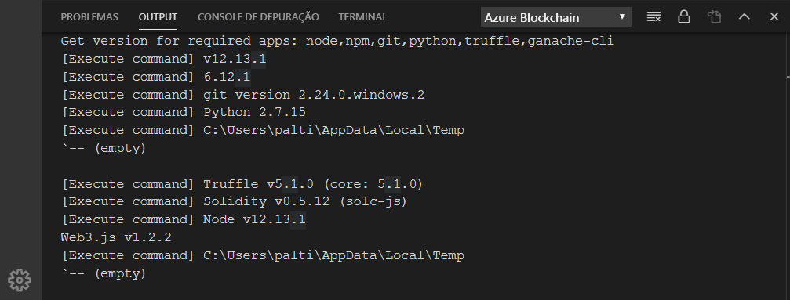
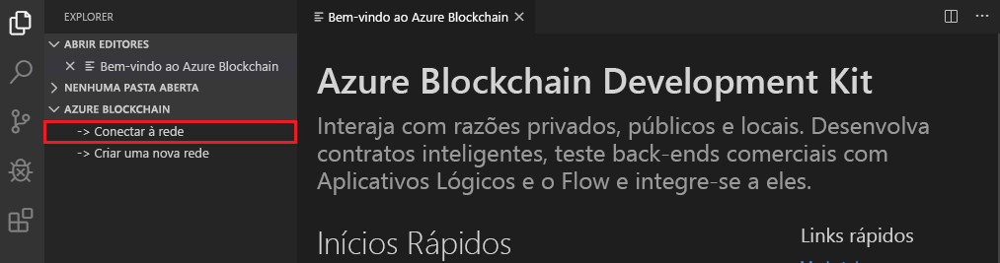
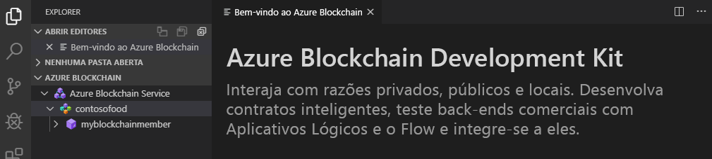

# Início Rápido: usar o Visual Studio Code para se conectar a uma rede de consórcio do Azure Blockchain Service

Neste início rápido, você instala e usa a extensão Azure Blockchain Development Kit para Ethereum no Visual Studio Code (VS Code) para ser anexada a um consórcio no Azure Blockchain Service. O Azure Blockchain Development Kit simplifica a maneira como você cria, conecta e implanta contratos inteligentes em razões de blockchain do Ethereum.

[!INCLUDE [quickstarts-free-trial-note](../../../includes/quickstarts-free-trial-note.md)]

## Pré-requisitos

* Concluir [Início Rápido: Criar um membro do blockchain usando o portal do Azure](create-member.md) ou [Início Rápido: Criar um membro do blockchain do Azure Blockchain Service usando a CLI do Azure](create-member-cli.md)
* [Visual Studio Code](https://code.visualstudio.com/Download)
* [Extensão Azure Blockchain Development Kit for Ethereum](https://marketplace.visualstudio.com/items?itemName=AzBlockchain.azure-blockchain)
* [Node.js 10.15.x ou superior](https://nodejs.org)
* [Git 2.10.x ou superior](https://git-scm.com)
* [Truffle 5.0.0](https://www.trufflesuite.com/docs/truffle/getting-started/installation)
* [CLI do Ganache 6.0.0](https://github.com/trufflesuite/ganache-cli)

No Windows, um compilador C++ instalado é necessário para o módulo node-gyp. Você pode usar as ferramentas do MSBuild:

* Se o Visual Studio 2017 estiver instalado, configure o npm para usar as ferramentas do MSBuild com o comando `npm config set msvs_version 2017 -g`
* Se o Visual Studio 2019 estiver instalado, defina o caminho das ferramentas de MSBuild para o npm. Por exemplo, `npm config set msbuild_path "C:\Program Files (x86)\Microsoft Visual Studio\2019\Community\MSBuild\Current\Bin\MSBuild.exe"`
* Caso contrário, instale as ferramentas de build autônomas do VS usando `npm install --global windows-build-tools` em um shell de comando *Executar como administrador* com privilégios elevados.

Para obter mais informações sobre o node-gyp, confira o [repositório node-gyp no GitHub](https://github.com/nodejs/node-gyp).

### Verificar o ambiente do Azure Blockchain Development Kit

O Azure Blockchain Development Kit verifica se os pré-requisitos do ambiente de desenvolvimento foram atendidos. Para verificar o ambiente de desenvolvimento:

Na paleta de comandos do VS Code, escolha **Blockchain: Mostrar Página de Boas-Vindas**.

O Azure Blockchain Development Kit executa um script de validação que leva cerca de um minuto para ser concluído. Você pode exibir a saída selecionando **Terminal > Novo Terminal**. Na barra de menus do terminal, selecione a guia **Saída** e **Azure Blockchain** na lista suspensa. A validação bem-sucedida tem aparência semelhante à da imagem a seguir:

 Se uma ferramenta necessária estiver ausente, uma nova guia chamada **Azure Blockchain Development Kit – Versão prévia** listará as ferramentas necessárias com os links para baixá-las.

Instale pré-requisitos ausentes antes de continuar com o início rápido.

## Conectar-se a um membro do consórcio

Você pode se conectar a membros do consórcio usando a extensão Azure Blockchain Development Kit do VS Code. Uma vez conectado a um consórcio, você pode criar, compilar e implantar contratos inteligentes em um membro do consórcio do Azure Blockchain Service.

Se você não tem acesso a um membro do consórcio do Azure Blockchain Service, conclua o pré-requisito [Início Rápido: Criar um membro do blockchain usando o portal do Azure](create-member.md) ou [Início Rápido: Criar um membro do blockchain do Azure Blockchain Service usando a CLI do Azure](create-member-cli.md).

1. No painel do gerenciador do VS Code, expanda a extensão **Azure Blockchain Service**.
1. Selecione **Conectar-se à rede**.

   

    Se a autenticação do Azure for solicitada, siga os prompts para autenticar usando um navegador.
1. Escolha **Azure Blockchain Service** no menu suspenso da paleta de comandos.
1. Escolha a assinatura e o grupo de recursos associados ao membro do consórcio do Azure Blockchain Service.
1. Escolha o consórcio na lista.

Os membros do consórcio e do blockchain são listados na barra lateral do Explorer do VS Code.

## Próximas etapas

Neste início rápido, você usou a extensão Azure Blockchain Development Kit para Ethereum no VS Code para ser anexada a um consórcio no Azure Blockchain Service. Experimente o próximo tutorial para usar o Azure Blockchain Development Kit para Ethereum para criar, implantar e executar uma função de contrato inteligente por uma transação.

> [!div class="nextstepaction"]
> [Criar, compilar e implantar contratos inteligentes no Azure Blockchain Service](send-transaction.md)