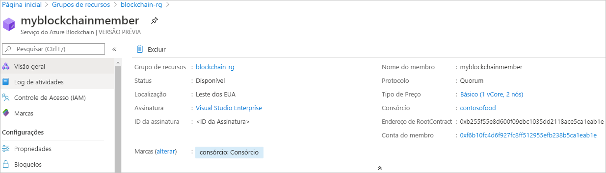

# Início Rápido: Criar um membro do Azure Blockchain Service usando um modelo do Resource Manager

Neste guia de início rápido, você implantará um novo membro do blockchain e o consórcio no Azure Blockchain Service usando um modelo do Azure Resource Manager. Um membro do Azure Blockchain Service é um nó de blockchain em uma rede privada de blockchain de consórcio. Ao provisionar um membro, você pode criar uma rede de consórcio ou ingressar nela. Você precisará de, pelo menos, um membro para uma rede de consórcio. O número de membros de blockchain necessários para os participantes depende do cenário. Os participantes do consórcio podem ter um ou mais membros de blockchain ou podem compartilhar membros com outros participantes. Para obter mais informações sobre os consórcios, confira [Consórcio do Azure Blockchain Service](consortium.md).

[!INCLUDE [About Azure Resource Manager](../../../includes/resource-manager-quickstart-introduction.md)]

Se seu ambiente atender aos pré-requisitos e você estiver familiarizado com o uso de modelos ARM, selecione o botão **Implantar no Azure**. O modelo será aberto no portal do Azure.

## Pré-requisitos

Se você não tiver uma assinatura do Azure, crie uma conta [gratuita](https://azure.microsoft.com/free/) antes de começar.

## Examinar o modelo

O modelo usado neste início rápido é proveniente dos [Modelos de Início Rápido do Azure](https://azure.microsoft.com/resources/templates/201-blockchain-asaservice/).

:::code language="json" source="~/quickstart-templates/201-blockchain-asaservice/azuredeploy.json":::

Os recursos do Azure definidos no modelo:

* [**Microsoft.Blockchain/blockchainMembers**](/azure/templates/microsoft.blockchain/blockchainmembers)

## Implantar o modelo

1. Selecione o link a seguir para entrar no Azure e abrir um modelo.

    

1. Especifique as configurações para o membro do Azure Blockchain Service.

    Configuração | Descrição
    --------|------------
    Subscription | Selecione a assinatura do Azure que deseja usar para o serviço. Se você tem várias assinaturas, escolha a assinatura na qual recebe a cobrança do recurso.
    Resource group | Crie um novo nome do grupo de recursos ou escolha um em sua assinatura.
    Região | Escolha uma região na qual criar o grupo de recursos. Todos os membros do consórcio devem estar na mesma localização. Os locais disponíveis para a implantação são *westeurope, eastus, southeastasia, westeurope, northeurope, westus2* e *japaneast*. Os recursos podem não estar disponíveis em algumas regiões. O Gerenciador de Dados do Azure Blockchain está disponível atualmente nas seguintes regiões do Azure: Leste dos EUA e Europa Ocidental.
    Nome do Membro do Bc | Escolha um nome exclusivo para o membro do Azure Blockchain Service. O nome do membro do blockchain só pode conter letras minúsculas e números. O primeiro caractere precisa ser uma letra. O valor precisa ter entre 2 e 20 caracteres.
    Nome do consórcio | Insira um nome exclusivo. Para obter mais informações sobre os consórcios, confira [Consórcio do Azure Blockchain Service](consortium.md).
    Senha do membro | A senha do nó de transação padrão do membro. Use a senha para a autenticação básica ao se conectar ao ponto de extremidade público do nó de transação padrão do membro do blockchain.
    Senha da conta de gerenciamento do consórcio | A senha da conta do consórcio é usada para criptografar a chave privada para a conta do Ethereum criada para o membro. Ela é usada para gerenciamento do consórcio.
    Camada da SKU | O tipo de preço para seu novo serviço. Escolha entre as camadas **Standard** e **Basic**. Use a camada *Basic* para desenvolvimento, teste e prova de conceitos. Use a camada *Standard* para implantações de nível de produção. Use também a camada *Standard* se estiver usando o Gerenciador de Dados do Blockchain ou enviando um alto volume de transações particulares. Não há suporte para a alteração do tipo de preço entre Básico e Standard após a criação do membro.
    Nome do SKU | A configuração e o custo de nó do novo serviço. Use **B0** para Básico e **S0** para Standard.
    Location | Escolha um local para criar o membro. Por padrão, a localização do grupo de recursos é usado `[resourceGroup().location]`. Todos os membros do consórcio devem estar na mesma localização. Os locais disponíveis para a implantação são *westeurope, eastus, southeastasia, westeurope, northeurope, westus2* e *japaneast*. Os recursos podem não estar disponíveis em algumas regiões. O Gerenciador de Dados do Azure Blockchain está disponível atualmente nas seguintes regiões do Azure: Leste dos EUA e Europa Ocidental.

1. Selecione **Examinar + Criar** para verificar e implantar o modelo.

  O portal do Azure é usado para implantar o modelo. Use também o Azure PowerShell, a CLI do Azure e a API REST. Para saber mais sobre outros métodos de implantação, confira [Implantar modelos](../../azure-resource-manager/templates/deploy-powershell.md).

## Examinar os recursos implantados

Você pode usar o portal do Azure para exibir detalhes do membro do Azure Blockchain Service implantado. No portal, vá para o grupo de recursos que contém o membro do Azure Blockchain Service. Selecione o membro do blockchain que você criou.

## Limpar os recursos

Você pode usar o membro do blockchain criado para o próximo Início Rápido ou tutorial. Quando eles não forem mais necessários, você poderá excluir os recursos excluindo o grupo de recursos criado para o início rápido.

Para excluir o grupo de recursos:

1. No portal do Azure, navegue até **Grupo de recursos** no painel de navegação esquerdo e selecione o grupo de recursos que você deseja excluir.
2. Selecione **Excluir grupo de recursos**. Verifique a exclusão digitando o nome do grupo de recursos e selecione **Excluir**.

## Próximas etapas

Neste início rápido, você implantou um membro do Azure Blockchain Service e um novo consórcio. Experimente o próximo início rápido para usar o Azure Blockchain Development Kit for Ethereum para fazer a anexação a um membro do Azure Blockchain Service.

> [!div class="nextstepaction"]
> [Usar o Visual Studio Code para se conectar ao Azure Blockchain Service](connect-vscode.md)