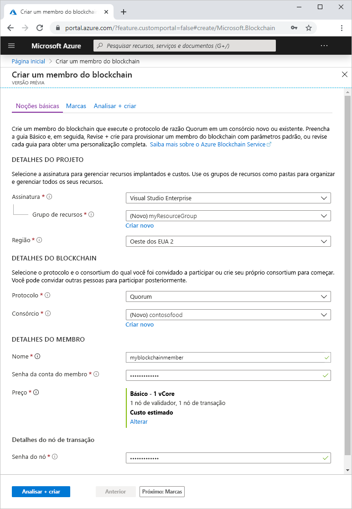
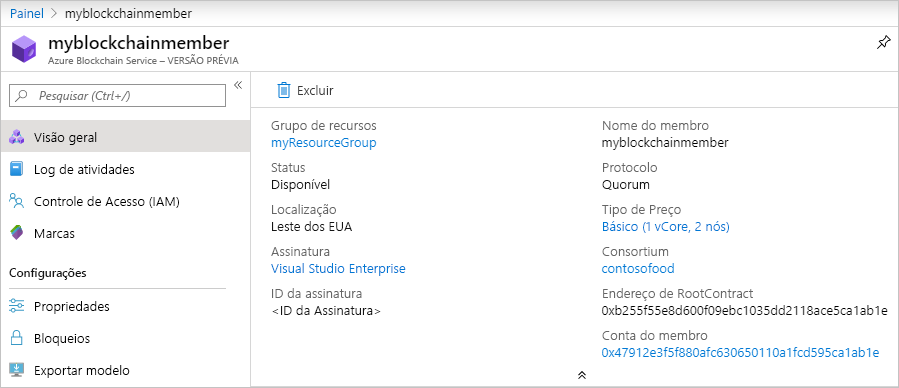

# Início Rápido: Criar um membro do blockchain do Azure Blockchain Service usando o portal do Azure

Neste início rápido, você implanta um novo membro do blockchain e o consórcio no Azure Blockchain Service usando o portal do Azure.

[!INCLUDE [quickstarts-free-trial-note](../../../includes/quickstarts-free-trial-note.md)]

## Criar um membro do blockchain

Crie um membro do blockchain que executa o protocolo de razão do Quorum em um consórcio novo ou existente.

1. Entre no [Portal do Azure](https://portal.azure.com).
1. Selecione **Criar um recurso** no canto superior esquerdo do portal do Azure.
1. Selecione **Blockchain** > **Azure Blockchain Service (versão prévia)** .

    

    Configuração | DESCRIÇÃO
    --------|------------
    Subscription | Selecione a assinatura do Azure que deseja usar para o serviço. Se você tem várias assinaturas, escolha a assinatura na qual recebe a cobrança do recurso.
    Resource group | Crie um novo nome do grupo de recursos ou escolha um em sua assinatura.
    Região | Escolha uma região para criar o membro. Todos os membros do consórcio devem estar na mesma localização.
    Protocolo | No momento, a versão prévia do Azure Blockchain Service é compatível com o protocolo Quorum.
    Consórcio | Para um novo consórcio, insira um nome exclusivo. Se estiver ingressando em um consórcio por meio de um convite, escolha o consórcio no qual você está ingressando.
    NOME | Escolha um nome exclusivo para o membro do Azure Blockchain Service. O nome do membro do blockchain só pode conter letras minúsculas e números. O primeiro caractere precisa ser uma letra. O valor precisa ter entre 2 e 20 caracteres.
    Senha da conta de membro | A senha da conta do membro é usada para criptografar a chave privada para a conta do Ethereum criada para o membro. Use a conta do membro e a senha da conta do membro para o gerenciamento do consórcio.
    DESCRIÇÃO | Descrição do consórcio.
    Preços | A configuração e o custo de nó do novo serviço. Selecione o link **Alterar** para escolher entre as camadas de serviço **Standard** e **Basic**.
    Senha do nó | A senha do nó de transação padrão do membro. Use a senha para a autenticação básica ao se conectar ao ponto de extremidade público do nó de transação padrão do membro do blockchain.

1. Selecione **Examinar + criar** para validar suas configurações. Selecione **Criar** para provisionar o serviço. O provisionamento leva cerca de 10 minutos.
1. Selecione **Notificações** na barra de ferramentas para monitorar o processo de implantação.
1. Após a implantação, navegue para o membro do blockchain.

Selecione **Visão Geral** e exiba as informações básicas sobre seu serviço, incluindo o endereço do RootContract e a conta de membro.

## Limpar recursos

Você pode usar o membro criado para o próximo Início Rápido ou tutorial. Quando eles não forem mais necessários, você poderá excluir os recursos excluindo o grupo de recursos `myResourceGroup` criado para o início rápido.

Para excluir o grupo de recursos:

1. No portal do Azure, navegue até **Grupo de recursos** no painel de navegação esquerdo e selecione o grupo de recursos que você deseja excluir.
2. Selecione **Excluir grupo de recursos**. Verifique a exclusão digitando o nome do grupo de recursos e selecione **Excluir**.

## Próximas etapas

Neste início rápido, você implantou um membro do Azure Blockchain Service e um novo consórcio. Experimente o próximo início rápido para usar o Azure Blockchain Development Kit para Ethereum para anexar a um consórcio no Azure Blockchain Service.

> [!div class="nextstepaction"]
> [Usar o Visual Studio Code para se conectar ao Azure Blockchain Service](connect-vscode.md)
