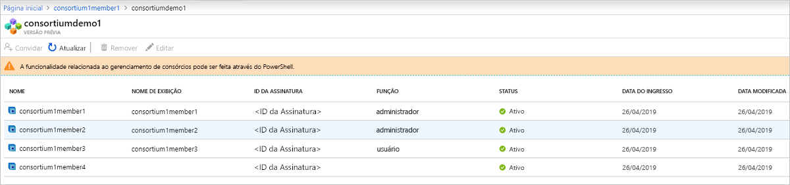

# O que é o Azure Blockchain Service?

O Azure Blockchain Service é um serviço contábil totalmente gerenciado que permite aos usuários ampliar e operar redes de blockchain em escala no Azure. Ao fornecer controle unificado para gerenciamento de infraestrutura e governança de rede de blockchain, o Azure Blockchain Service fornece:

* Implantação e operações de rede simples
* Gerenciamento do consórcio interno
* Desenvolva contratos inteligentes com ferramentas de desenvolvimento conhecidas

O Azure Blockchain Service foi projetado para oferecer suporte a vários protocolos razão. Atualmente, ele fornece suporte ao razão Ethereum [Quorum](https://www.goquorum.com/) usando o mecanismo de consenso [IBFT (Tolerância a falhas Bizantinas de Istambul)](https://docs.goquorum.consensys.net/en/stable/Concepts/Consensus/IBFT/).

Esses recursos não precisam de quase nenhuma administração e todos são fornecidos sem nenhum custo adicional. Você pode se concentrar no desenvolvimento de aplicativos e na lógica comercial, em vez de alocar tempo e recursos para gerenciar máquinas virtuais e infraestrutura. Além disso, você pode continuar desenvolvendo seu aplicativo com as ferramentas de código aberto e a plataforma de sua escolha para fornecer suas soluções sem precisar aprender novas habilidades.

## Implantação e operações de rede

A implantação do Azure Blockchain Service é feita por meio do portal do Azure, da CLI do Azure ou do código do Visual Studio usando a extensão do Azure Blockchain. A implantação é simplificada, incluindo provisionamento de nós de transação e de validador, Redes Virtuais do Azure, para isolamento de segurança, e armazenamento gerenciado por serviços.  Ao implantar um novo membro do blockchain, os usuários também criam ou ingressam em um consórcio.  Os consórcios permitem que vários grupos em diferentes assinaturas do Azure possam se comunicar com segurança uns com os outros em um blockchain compartilhado.  Essa implantação simplificada reduz a implantação da rede de blockchain de dias para minutos.

### Níveis de desempenho e serviço

O Azure Blockchain Service oferece duas camadas de serviço: planos *Básico* e *Standard*. Cada camada oferece desempenho e recursos diferentes para oferecer suporte a cargas de trabalho leves de desenvolvimento e teste até implantações de blockchain de produção em escala maciça. Use a camada *Basic* para desenvolvimento, teste e prova de conceitos. Use a camada *Standard* para implantações de nível de produção. Ambas as camadas incluem pelo menos um nó de transação e um de validador (Básico) ou dois nós de validação (Standard). 

Além de oferecer dois nós de validador, o nível *Standard* fornece dois *vCores* para cada transação e nó de validador, enquanto a camada *Básica* oferece uma configuração de 1 vCore.  Ao oferecer 2 vCores para nós de transação e de validador, 1 vCore pode ser dedicado ao razão do Quorum, enquanto o 1 vCore restante pode ser usado para outros serviços relacionados à infraestrutura, garantindo desempenho ideal para cargas de trabalho de blockchain de produção. Para saber mais sobre detalhes de preços, confira [Preços do Azure Blockchain Service](https://azure.microsoft.com/pricing/details/blockchain-service).

### Segurança e manutenção

Depois de provisionar seu primeiro membro do blockchain, você poderá adicionar nós de transação adicionais ao seu membro.  Por padrão, os nós de transação são protegidos por regras de firewall e precisam de configuração para acesso.  Além disso, todos os nós de transação criptografam dados em movimento via TLS.  Existem várias opções para proteger o acesso ao nó de transação, incluindo regras de firewall, autenticação Básica, chaves de acesso e integração do Azure Active Directory. Para saber mais, confira [configurar nós de transação](configure-transaction-nodes.md) e [configurar o acesso ao Azure Active Directory](configure-aad.md).

Como serviço gerenciado, o Azure Blockchain Service garante que os nós de seus membros do blockchain sejam corrigidos com as atualizações mais recentes da pilha do sistema operacional e do software do razão, configuradas para alta disponibilidade (somente na camada Standard), eliminando grande parte dos DevOps necessários para os nós de blockchain de IaaS tradicionais.  Para saber mais sobre patches e atualizações, confira [versões do razão do Azure Blockchain Service com suporte](ledger-versions.md).

### Monitoramento e registro em log

Além disso, o Azure Blockchain Service fornece métricas avançadas por meio do Serviço do Azure Monitor fornecendo informações sobre a CPU, a memória e o uso de armazenamento dos nós.  O Azure Monitor também fornece informações úteis sobre a atividade de rede do blockchain, como transações e blocos minerados, profundidade da fila de transações e conexões ativas.  As métricas podem ser personalizadas para fornecer visualizações de informações importantes para seu aplicativo blockchain.  Além disso, os limites podem ser definidos por meio de alertas, permitindo que os usuários disparem ações de envio de email ou mensagem de texto, executem um Aplicativo Lógico ou uma Função do Azure ou façam envios para um webhook definido de forma personalizada.

Por meio da análise de logs do Azure, os usuários podem exibir logs relacionados ao razão do Quorum ou outras informações importantes, como tentativas de conexão com os nós de transação.

## Gerenciamento do consórcio interno

Quando implanta seu primeiro membro ao blockchain, você pode ingressar ou criar um novo consórcio.  Um consórcio é um grupo lógico usado para gerenciar a governança e a conectividade entre os membros do blockchain que realizam transações em um processo com múltiplos usuários.  O Azure Blockchain Service fornece controles de governança internos por meio de contratos inteligentes predefinidos, que determinam quais ações os membros do consórcio podem adotar.  Esses controles de governança podem ser personalizados conforme necessário pelo administrador do consórcio. Quando você cria um novo consórcio, o membro do blockchain é o administrador padrão do consórcio, permitindo que ele convide outros usuários a ingressar no consórcio.  Você só poderá ingressar em um consórcio se tiver sido convidado anteriormente.  Ao ingressar em um consórcio, um membro do blockchain está sujeito aos controles de governança implementados pelo administrador do consórcio.

A ações de gerenciamento de consórcio, como adição e remoção de membros, podem ser acessadas por meio do PowerShell e de uma API REST. Você pode gerenciar um consórcio programaticamente usando interfaces comuns, em vez de modificar e enviar contratos inteligentes com base em solidez. Para saber mais, confira [gerenciamento de consórcio](consortium.md).

## Desenvolvimento com ferramentas conhecidas

Com base no razão Quorum Ethereum de código aberto, você pode desenvolver aplicativos para o Azure Blockchain Service da mesma maneira que para aplicativos Ethereum existentes. Trabalhando com os principais parceiros do setor, a extensão Kit de Desenvolvimento do Azure Blockchain do Visual Studio Code permite que os desenvolvedores aproveitem ferramentas conhecidas, como o Truffle Suite, para criar contratos inteligentes. Usando a extensão Visual Studio Code para Azure Blockchain, você pode criar ou conectar-se a um consórcio existente para criar e implantar seus contratos inteligentes, tudo a partir de um IDE. Para saber mais, confira [Azure Blockchain Development Kit no Marketplace do VS Code](https://aka.ms/vscodebcextension) e o [Guia do usuário do Azure Blockchain Development Kit](https://aka.ms/vscodebcextensionwiki).

## Publicar dados do blockchain

O Gerenciador de Dados de Blockchain para o Azure Blockchain Service captura, transforma e entrega dados de transação do Azure Blockchain Service para Tópicos da Grade de Eventos do Azure, fornecendo integração escalonável e confiável do razão de blockchain com os serviços do Azure. Você pode usar o Gerenciador de Dados do Blockchain para integrar aplicativos e armazenamentos de dados fora da cadeia. Para obter mais informações, confira [Gerenciador de Dados do Blockchain para o Azure Blockchain Service](data-manager.md).

## Suporte e comentários

Para novidades do Azure Blockchain, acesse o [blog do Azure Blockchain](https://azure.microsoft.com/blog/topics/blockchain/) para se manter atualizado sobre as ofertas de serviço de blockchain e informações da equipe de engenharia do Azure Blockchain.

Para fornecer comentários sobre o produto ou solicitar novos recursos, poste um vote em uma ideia usando o [fórum de comentários do Azure para blockchain](https://aka.ms/blockchainuservoice).

### Suporte da comunidade

converse com engenheiros da Microsoft e com os especialistas da comunidade do Azure Blockchain.

* [Página de P e R da Microsoft para o Azure Blockchain Service](/answers/topics/azure-blockchain-service.html)
* [Microsoft Tech Community](https://techcommunity.microsoft.com/t5/Blockchain/bd-p/AzureBlockchain)
* [Stack Overflow](https://stackoverflow.com/questions/tagged/azure-blockchain-service)

## Próximas etapas

Para começar, experimente o início rápido ou descubra mais detalhes desses recursos.
* [Criar um membro de blockchain usando o portal do Azure](create-member.md) ou [Criar um membro de blockchain usando a CLI do Azure](create-member-cli.md)
* Siga o caminho do Microsoft Learn [Introdução ao desenvolvimento de blockchain](/learn/paths/ethereum-blockchain-development)
* Assista à [série para iniciantes sobre blockchain](https://channel9.msdn.com/Series/Beginners-Series-to-Blockchain)
* Confira a [página de preços](https://azure.microsoft.com/pricing/details/blockchain-service) para ver comparações de custo e calculadoras
* Crie seu primeiro aplicativo usando o [Azure Blockchain Development Kit](https://github.com/Azure-Samples/blockchain-devkit)
* [Guia do usuário](https://github.com/Microsoft/vscode-azure-blockchain-ethereum/wiki) da extensão VSCode do Azure Blockchain
