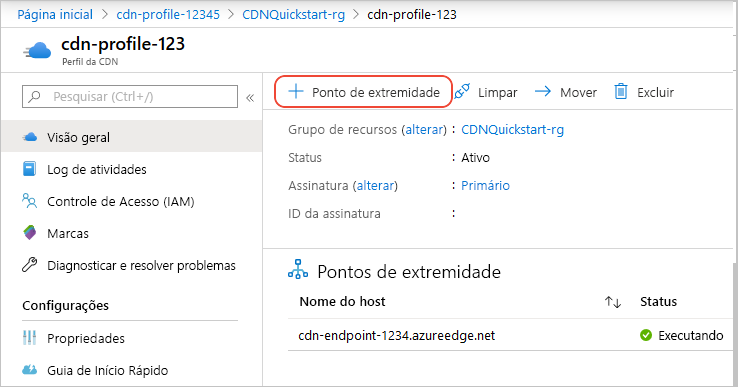
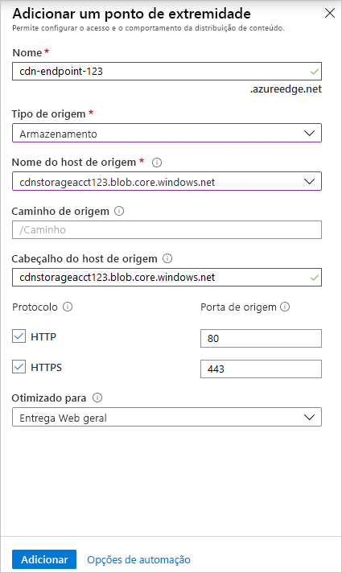
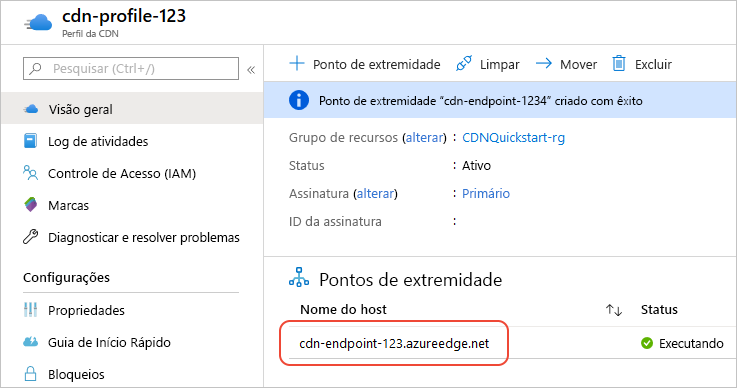

# Início Rápido: Criar um perfil e um ponto de extremidade da CDN do Azure

Neste guia de início rápido, você habilita a CDN (Rede de Distribuição de Conteúdo) do Azure criando um perfil da CDN, que é uma coleção de um ou mais pontos de extremidade CDN. Depois de criar um perfil e um ponto de extremidade, você pode iniciar a distribuição de conteúdo para seus clientes.

## Pré-requisitos

- Uma conta do Azure com uma assinatura ativa. [Crie uma conta gratuitamente](https://azure.microsoft.com/free/?ref=microsoft.com&utm_source=microsoft.com&utm_medium=docs&utm_campaign=visualstudio).
- Uma conta de armazenamento do Azure denominada *cdnstorageacct123*, que você usa para o nome de host de origem. Para concluir esse requisito, confira [Integrar uma conta de Armazenamento do Azure à CDN do Azure](cdn-create-a-storage-account-with-cdn.md).

## Entre no Portal do Azure

Entre no [portal do Azure](https://portal.azure.com) com sua conta do Azure.

[!INCLUDE [cdn-create-profile](../../includes/cdn-create-profile.md)]

## Criar um novo ponto de extremidade CDN

Depois de criar um perfil CDN, você o usa para criar um ponto de extremidade.

1. No portal do Azure, selecione o perfil CDN que você criou em seu painel. Se você não conseguir encontrá-lo, poderá abrir o grupo de recursos no qual você o criou ou usar a barra de pesquisa na parte superior do portal, inserir o nome do perfil e selecionar o perfil nos resultados.
   
1. Na página do perfil da CDN, selecione **+ Ponto de Extremidade**.
   
    
   
    O painel **Adicionar um ponto de extremidade** é exibido.

3. Insira os seguintes valores de configuração:

    | Configuração | Valor |
    | ------- | ----- |
    | **Nome** | Digite *cdn-endpoint-123* para seu nome de host do ponto de extremidade. Esse nome deve ser globalmente exclusivo em todo o Azure. Caso ele já esteja em uso, insira um nome diferente. Esse nome será usado para acessar os recursos armazenados em cache no domínio _&lt;nome do ponto de extremidade&gt;_ .azureedge.net.|
    | **Tipo de origem** | Selecione **Armazenamento**. | 
    | **Nome do host de origem** | Selecione o nome de host da conta de armazenamento do Azure que você está usando na lista suspensa, como *cdnstorageacct123.blob.core.windows.net*. |
    | **Caminho de origem** | Deixe em branco. |
    | **Cabeçalho de host de origem** | Deixe o valor padrão (que é o nome do host para a conta de armazenamento). |  
    | **Protocolo** | Deixe as opções padrão **HTTP** e **HTTPS** selecionadas. |
    | **Porta de origem** | Deixe os valores de porta padrão. | 
    | **Otimizado para** | Deixe a seleção padrão: **Distribuição na Web geral**. |

    

3. Selecione **Adicionar** para criar um novo ponto de extremidade. Depois que o ponto de extremidade é criado, ele aparece na lista de pontos de extremidade do perfil.
    
   
    
   O tempo necessário para que o ponto de extremidade se propague depende do tipo de preço selecionado quando você criou o perfil. O **Standard Akamai** geralmente é concluído em um minuto; o **Standard Microsoft**, em 10 minutos; e o **Standard Verizon** e o **Premium Verizon**, em até 30 minutos.

## Limpar os recursos

Nas etapas anteriores, você criou um perfil CDN e um ponto de extremidade em um grupo de recursos. Salve esses recursos se você deseja ir para as [Próximas etapas](#next-steps) e saiba como adicionar um domínio personalizado em seu ponto de extremidade. No entanto, se você não espera usar esses recursos no futuro, poderá excluí-los ao excluir o grupo de recursos, evitando assim encargos adicionais:

1. No menu à esquerda no portal do Azure, selecione **Grupos de recursos** e, em seguida, selecione **CDNQuickstart-rg**.

2. Na página **Grupo de recursos**, selecione **Excluir grupo de recursos**, digite *CDNQuickstart-rg* na caixa de texto e, em seguida, selecione **Excluir**. Essa ação exclui o grupo de recursos, o perfil e o ponto de extremidade que você criou neste início rápido.

## Próximas etapas

> [!div class="nextstepaction"]
> [Tutorial: usar a CDN para o conteúdo estático do servidor de um aplicativo Web](cdn-add-to-web-app.md)
