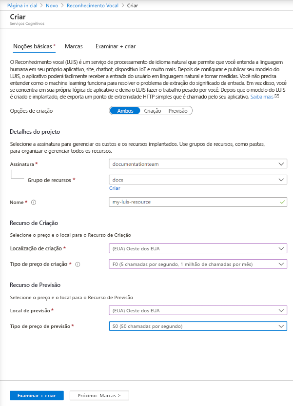

## Criar recursos do LUIS no portal do Azure

1. Use [este link](https://ms.portal.azure.com/#create/Microsoft.CognitiveServicesLUISAllInOne) para começar a criar recursos LUIS no portal do Azure.

1. Insira todas as configurações necessárias:

    |Nome|Finalidade|
    |--|--|
    |Assinatura | A assinatura que será cobrada pelo recurso.|
    |Resource group| O nome de um grupo de recursos personalizado que você escolher ou criar. Os grupos de recursos permitem agrupar os recursos do Azure para acesso e gerenciamento.|
    |Nome| Um nome personalizado à sua escolha. Ele será usado como um subdomínio personalizado para as consultas de ponto de extremidade de criação e previsão.|
    |Localização de criação|A região associada ao seu modelo.|
    |Tipo de preço de criação|Determina o número máximo de transações por segundo e por mês.|
    |Local de previsão|A região associada ao runtime do ponto de extremidade de previsão publicado.|
    |Tipo de preço de previsão|Determina o número máximo de transações por segundo e por mês.|

    > [!div class="mx-imgBorder"]
    > 

1. Clique em **Examinar + criar** e aguarde até que o recurso seja criado.
1. Depois que ambos os recursos forem criados, ainda no portal do Azure, selecione o novo recurso de criação. Em seguida, selecione **Chaves e Ponto de Extremidade** para obter a **URL do ponto de extremidade** e a **chave** de criação para fazer a criação de maneira programática.

> [!TIP]
> Para usar os recursos, no portal do LUIS, [atribua os recursos](../luis-how-to-azure-subscription.md#assign-an-authoring-resource-in-the-luis-portal-for-all-apps).
