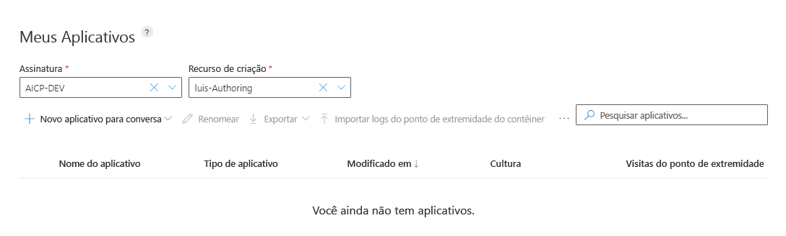

# <a name="quickstart-use-prebuilt-home-automation-app"></a>Início Rápido: Usar o aplicativo de automação Inicial predefinido

Neste início rápido, crie um aplicativo LUIS que use o domínio predefinido `HomeAutomation` para ligar e desligar luzes e dispositivos. Este domínio predefinido fornece intenções, entidades e exemplos de enunciados a você. Quando terminar, você terá um ponto de extremidade do LUIS em execução na nuvem.

[!INCLUDE [Sign in to LUIS](./includes/sign-in-process.md)]

[!INCLUDE [Select authoring resource](./includes/select-authoring-resource.md)]

## <a name="create-a-new-app"></a>Criar um novo aplicativo
Você pode criar e gerenciar seus aplicativos em **Meus Aplicativos**.

1. No portal do LUIS, na lista Meus aplicativos, selecione **+ Criar**.

    

1. Na caixa de diálogo, dê um nome ao seu aplicativo `Home Automation`, em seguida, selecione **Concluído**. LUIS cria o aplicativo. A descrição é opcional e não será usada para criação ou previsão. O recurso de previsão também é opcional ao criar um aplicativo do LUIS. Ao publicar seu aplicativo na produção, você deverá atribuir um recurso de previsão para que o aplicativo possa gerenciar inúmeras solicitações.

    

    >[!NOTE]
    >A cultura não poderá ser alterada depois que o aplicativo for criado.

## <a name="add-prebuilt-domain"></a>Adicionar domínio predefinido

Selecione **Domínios predefinidos**, em seguida, pesquise **HomeAutomation**. Selecione **Adicionar domínio** no cartão HomeAutomation.


Quando o domínio for adicionado com êxito, a caixa de domínio predefinido exibirá um botão **Remover domínio**.

## <a name="intents-and-entities"></a>Intenções e entidades

Selecione **intenções** para examinar as intenções do domínio HomeAutomation. As intenções de domínio pré-criadas têm enunciados de exemplo.


> [!NOTE]
> **None** é uma intenção fornecida por todos os aplicativos LUIS. Você pode usá-la para lidar com enunciados que não correspondem à funcionalidade que seu aplicativo fornece.

Selecione a intenção **HomeAutomation.TurnOff**. Você pode ver que a intenção contém uma lista de enunciados que rotulados com entidades.

[](media/luis-quickstart-new-app/home-automation-turnoff.png)

## <a name="train-the-luis-app"></a>Treinar o aplicativo LUIS

[!INCLUDE [LUIS How to Train steps](includes/howto-train.md)]

## <a name="test-your-app"></a>Testar seu aplicativo
Depois de treinar o aplicativo, você pode testá-lo. Selecione **Testar**. Digite um enunciado de teste, como `Turn off the lights` no painel de teste interativo e pressione Enter.

```
Turn off the lights
```

Verifique se a intenção de pontuação superior corresponde à intenção esperada para cada enunciado de teste.

Neste exemplo, `Turn off the lights` é identificado corretamente como a intenção de pontuação superior de **HomeAutomation.TurnOff**.


Selecione **Inspecionar** para examinar mais informações sobre a previsão.


Selecione **Testar** novamente para recolher o painel de teste.

<a name="publish-your-app"></a>

## <a name="publish-the-app-to-get-the-endpoint-url"></a>Publicar o aplicativo para obter a URL do ponto de extremidade

[!INCLUDE [LUIS How to Publish steps](./includes/howto-publish.md)]

<a name="query-the-v2-api-prediction-endpoint"></a>

## <a name="query-the-v3-api-prediction-endpoint"></a>Consultar o ponto de extremidade de previsão da API V3

[!INCLUDE [LUIS How to get endpoint first step](./includes/v3-prediction-endpoint.md)]

1. Na barra de endereços do navegador, para a cadeia de caracteres de consulta, verifique se as barras de nome e valor a seguir estão na URL. Se elas não estiverem na cadeia de caracteres de consulta, adicione-as:

    |Par chave/valor|
    |--|
    |`verbose=true`|
    |`show-all-intents=true`|

1. Na barra de endereços do navegador, vá até o final da URL e insira `turn off the living room light` para o valor _consulta_ e pressione Enter.

    ```json
    {
        "query": "turn off the living room light",
        "prediction": {
            "topIntent": "HomeAutomation.TurnOff",
            "intents": {
                "HomeAutomation.TurnOff": {
                    "score": 0.984315455
                },
                "HomeAutomation.QueryState": {
                    "score": 0.009912962
                },
                "HomeAutomation.TurnDown": {
                    "score": 0.00626645749
                },
                "HomeAutomation.TurnUp": {
                    "score": 0.00572059769
                },
                "HomeAutomation.SetDevice": {
                    "score": 0.00379381469
                },
                "HomeAutomation.TurnOn": {
                    "score": 0.00366983772
                },
                "None": {
                    "score": 0.000623856
                }
            },
            "entities": {
                "HomeAutomation.Location": [
                    "living room"
                ],
                "HomeAutomation.DeviceName": [
                    [
                        "living room light"
                    ]
                ],
                "HomeAutomation.DeviceType": [
                    [
                        "light"
                    ]
                ],
                "$instance": {
                    "HomeAutomation.Location": [
                        {
                            "type": "HomeAutomation.Location",
                            "text": "living room",
                            "startIndex": 13,
                            "length": 11,
                            "score": 0.907323956,
                            "modelTypeId": 1,
                            "modelType": "Entity Extractor",
                            "recognitionSources": [
                                "model"
                            ]
                        }
                    ],
                    "HomeAutomation.DeviceName": [
                        {
                            "type": "HomeAutomation.DeviceName",
                            "text": "living room light",
                            "startIndex": 13,
                            "length": 17,
                            "modelTypeId": 5,
                            "modelType": "List Entity Extractor",
                            "recognitionSources": [
                                "model"
                            ]
                        }
                    ],
                    "HomeAutomation.DeviceType": [
                        {
                            "type": "HomeAutomation.DeviceType",
                            "text": "light",
                            "startIndex": 25,
                            "length": 5,
                            "modelTypeId": 5,
                            "modelType": "List Entity Extractor",
                            "recognitionSources": [
                                "model"
                            ]
                        }
                    ]
                }
            }
        }
    }
    ```

    Saiba mais sobre o [ponto de extremidade de previsão V3](luis-migration-api-v3.md).


## <a name="clean-up-resources"></a>Limpar os recursos

[!INCLUDE [LUIS How to clean up resources](../../../includes/cognitive-services-luis-tutorial-how-to-clean-up-resources.md)]

## <a name="next-steps"></a>Próximas etapas

Você pode chamar o ponto de extremidade do código:

> [!div class="nextstepaction"]
> [Chamar um ponto de extremidade do LUIS usando código](luis-get-started-cs-get-intent.md)
