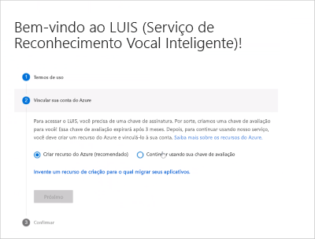

# <a name="create-luis-resources"></a>Criar recursos do LUIS

Os recursos de tempo de execução de previsão de criação e consulta fornecem autenticação para seu aplicativo Reconhecimento vocal (LUIS) e ponto de extremidade de previsão.

<a name="azure-resources-for-luis"></a>
<a name="programmatic-key" ></a>
<a name="endpoint-key"></a>
<a name="authoring-key"></a>

## <a name="luis-resources"></a>Recursos do LUIS

O LUIS permite três tipos de recursos do Azure e um recurso não Azure:

|Recurso|Finalidade|Serviço cognitiva `kind`|Serviço cognitiva `type`|
|--|--|--|--|
|Recurso de criação|Permite criar, gerenciar, treinar, testar e publicar seus aplicativos. [Crie um recurso de criação do Luis](luis-how-to-azure-subscription.md#create-luis-resources-in-the-azure-portal) se você pretende criar aplicativos Luis programaticamente ou no portal do Luis. Você precisa [migrar sua conta do Luis](luis-migration-authoring.md#what-is-migration) antes de vincular os recursos de criação do Azure ao seu aplicativo. Você pode controlar as permissões para o recurso de criação atribuindo às pessoas [a função de colaborador](#contributions-from-other-authors). <br><br> Uma camada está disponível para o recurso de criação de LUIS:<br> <ul> <li>O **recurso de criação do F0 gratuito**, que fornece 1 milhão transações de criação gratuitas e 1.000 solicitações gratuitas de ponto de extremidade de previsão de teste mensalmente. |`LUIS.Authoring`|`Cognitive Services`|
|Recurso de previsão| Depois de publicar o aplicativo LUIS, use o recurso/chave de previsão para consultar solicitações de ponto de extremidade de previsão. Crie um recurso de previsão LUIS antes que seu aplicativo cliente solicite previsões além das 1.000 solicitações fornecidas pela criação ou pelo recurso de início. <br><br> Duas camadas estão disponíveis para o recurso de previsão:<br><ul> <li> **Recurso de previsão de F0 gratuito**, que fornece a você 10.000 solicitações de ponto de extremidade de previsão gratuitas mensalmente.<br> <li> **Recurso de previsão de S0 padrão**, que é a camada paga. [Saiba mais sobre preços.](https://azure.microsoft.com/pricing/details/cognitive-services/language-understanding-intelligent-services/)|`LUIS`|`Cognitive Services`|
|Recurso de avaliação/inicialização|Permite criar, gerenciar, treinar, testar e publicar seus aplicativos. Esse recurso será criado por padrão se você escolher a opção de recurso de início ao entrar no LUIS. A chave inicial será eventualmente preterida. Todos os usuários do LUIS precisarão [migrar suas contas](luis-migration-authoring.md#what-is-migration) e vincular seus aplicativos do Luis a um recurso de criação. Ao contrário do recurso de criação, esse recurso não concede permissões para o controle de acesso baseado em função do Azure. <br><br> Como o recurso de criação, o recurso de início fornece a você 1 milhão transações de criação gratuitas e 1.000 solicitações gratuitas de ponto de extremidade de previsão de teste.|-|Não é um recurso do Azure.|
|[Chave de recurso de multiatendimento de serviços cognitivas](../cognitive-services-apis-create-account-cli.md?tabs=windows#create-a-cognitive-services-resource)|Solicitações de ponto de extremidade de previsão de consulta compartilhadas com LUIS e outros serviços cognitivas com suporte.|`CognitiveServices`|`Cognitive Services`|


> [!Note]
> O LUIS fornece dois tipos de recursos F0 (camada gratuita): um para a criação de transações e outra para transações de previsão. Se você estiver ficando sem cota livre para transações de previsão, verifique se está usando o recurso de previsão F0, que fornece uma 10.000 transações gratuitas mensalmente e não o recurso de criação, que oferece 1.000 transações de previsão mensalmente.

Quando o processo de criação de recursos do Azure for concluído, [atribua o recurso](#assign-a-resource-to-an-app) ao aplicativo no portal do Luis.

> [!important]
> Você deve criar aplicativos LUIS nas [regiões](luis-reference-regions.md#publishing-regions) em que deseja publicar e consultar.

## <a name="resource-ownership"></a>Propriedade do recurso

Um recurso do Azure, como um recurso LUIS, pertence à assinatura que contém o recurso.

Para alterar a propriedade de um recurso, você pode executar uma destas ações:
* Transfira a [Propriedade](../../cost-management-billing/manage/billing-subscription-transfer.md) da sua assinatura.
* Exporte o aplicativo LUIS como um arquivo e, em seguida, importe o aplicativo em uma assinatura diferente. A exportação está disponível na página **meus aplicativos** no portal do Luis.

## <a name="resource-limits"></a>Limites de recursos

### <a name="authoring-key-creation-limits"></a>Limites de criação de chave de criação

Você pode criar até 10 chaves de criação por região, por assinatura. Regiões de publicação são diferentes de regiões de criação. Certifique-se de criar um aplicativo na região de criação que corresponda à região de publicação onde você deseja que seu aplicativo cliente esteja localizado. Para obter informações sobre como as regiões de criação são mapeadas para regiões de publicação, consulte [regiões de criação e publicação](luis-reference-regions.md). 

Para obter mais informações sobre os limites de chave, consulte [limites de chave](luis-limits.md#key-limits).

### <a name="errors-for-key-usage-limits"></a>Erros de limites de uso de chave

Os limites de uso são baseados no tipo de preço.

Se exceder sua cota de transações por segundo (TPS), você receberá um erro HTTP 429. Se você exceder sua cota de transações por mês (TPM), receberá um erro HTTP 403.


### <a name="reset-an-authoring-key"></a>Redefinir uma chave de criação

Para aplicativos do [recurso de criação migrados](luis-migration-authoring.md) : se a sua chave de criação estiver comprometida, redefina a chave no portal do Azure, na página **chaves** do recurso de criação.

Para aplicativos que não foram migrados: a chave é redefinida em todos os seus aplicativos no portal do LUIS. Se você criar seus aplicativos por meio de APIs de criador, você precisa alterar o valor de `Ocp-Apim-Subscription-Key` para a nova chave.

### <a name="regenerate-an-azure-key"></a>Regenerar uma chave do Azure

Você pode regenerar uma chave do Azure na página **chaves** no portal do Azure.


<a name="securing-the-endpoint"></a>

## <a name="app-ownership-access-and-security"></a>Propriedade, acesso e segurança do aplicativo

Um aplicativo é definido por seus recursos do Azure, que são determinados pela assinatura do proprietário.

Você pode mover seu aplicativo LUIS. Use os recursos a seguir para ajudá-lo a fazer isso usando o portal do Azure ou CLI do Azure:

* [Mover um aplicativo entre os recursos de criação do LUIS](https://westus.dev.cognitive.microsoft.com/docs/services/5890b47c39e2bb17b84a55ff/operations/apps-move-app-to-another-luis-authoring-azure-resource)
* [Mover um recurso para um novo grupo de recursos ou assinatura](../../azure-resource-manager/management/move-resource-group-and-subscription.md)
* [Mover um recurso dentro da mesma assinatura ou entre assinaturas](../../azure-resource-manager/management/move-limitations/app-service-move-limitations.md)


### <a name="contributions-from-other-authors"></a>Contribuições de outros autores

Para aplicativos de [recurso de criação migrados](luis-migration-authoring.md) : você pode gerenciar _colaboradores_ para um recurso de criação no portal do Azure usando a página de **controle de acesso (iam)** . Saiba [como adicionar um usuário](luis-how-to-collaborate.md) usando o endereço de email da colaboração e a função de colaborador.

Para aplicativos que ainda não foram migrados: você pode gerenciar todos os _colaboradores_ na página **gerenciar > colaboradores** no portal do Luis.

### <a name="query-prediction-access-for-private-and-public-apps"></a>Acesso de previsão de consulta para aplicativos públicos e privados

Para aplicativos particulares, o acesso ao tempo de execução de previsão de consulta está disponível para proprietários e colaboradores. Para aplicativos públicos, o acesso ao tempo de execução está disponível para usuários que têm seu próprio [serviço cognitiva](../cognitive-services-apis-create-account.md) do Azure ou recurso de tempo de execução [Luis](#create-resources-in-the-azure-portal) e a ID do aplicativo público.

Atualmente, não há um catálogo de aplicativos públicos.

### <a name="authoring-permissions-and-access"></a>Permissões de criação e acesso
O acesso a um aplicativo do portal do [Luis](luis-reference-regions.md#luis-website) ou das [APIs de criação](https://go.microsoft.com/fwlink/?linkid=2092087) é controlado pelo recurso de criação do Azure.

O proprietário e todos os colaboradores têm acesso para criar o aplicativo.

|O acesso de criação inclui:|Observações|
|--|--|
|Adicionar ou remover chaves de ponto de extremidade||
|Exportar versão||
|Exportar logs de ponto de extremidade||
|Importa versão||
|Tornar um aplicativo público|Quando um aplicativo é público, qualquer pessoa que tenha uma chave de criação ou de ponto de extremidade pode consultar o aplicativo.|
|Modificar modelo|
|Publicação|
|Examinar declarações de ponto de extremidade para [aprendizado ativo](luis-how-to-review-endpoint-utterances.md)|
|Treinar|

<a name="prediction-endpoint-runtime-key"></a>

### <a name="prediction-endpoint-runtime-access"></a>Acesso ao tempo de execução de ponto de extremidade de previsão

O acesso para consultar o ponto de extremidade de previsão é controlado por uma configuração na página de **informações do aplicativo** na seção **gerenciar** .

|[Ponto de extremidade privado](#runtime-security-for-private-apps)|[Ponto de extremidade público](#runtime-security-for-public-apps)|
|:--|:--|
|Disponível para o proprietário e os colaboradores|Disponível para o proprietário, colaboradores e qualquer outra pessoa que conheça a ID do aplicativo|

Você pode controlar quem vê sua chave de tempo de execução LUIS chamando-a em um ambiente de servidor para servidor. Se você estiver usando o LUIS de um bot, a conexão entre o bot e o LUIS já será mais segura. Se você estiver chamando o ponto de extremidade LUIS diretamente, deverá criar uma API do lado do servidor (como uma [função](https://azure.microsoft.com/services/functions/)do Azure) com acesso controlado (por algo como o [Azure ad](https://azure.microsoft.com/services/active-directory/)). Quando a API do lado do servidor for chamada e autenticada e a autorização for verificada, passe a chamada para LUIS. Essa estratégia não impede ataques man-in-the-Middle. Mas ele ofusca a chave e a URL do ponto de extremidade dos usuários, permite que você acompanhe o acesso e permite que você adicione o log de resposta do ponto de extremidade (como [Application insights](https://azure.microsoft.com/services/application-insights/)).

### <a name="runtime-security-for-private-apps"></a>Segurança de tempo de execução para aplicativos privados

O tempo de execução de um aplicativo privado está disponível somente para as seguintes chaves:

|Chave e usuário|Explicação|
|--|--|
|Chave de criação do proprietário| Até 1.000 ocorrências de ponto de extremidade|
|Colaboradores/chaves de criação de colaborador| Até 1.000 ocorrências de ponto de extremidade|
|Qualquer chave atribuída a LUIS por um autor ou colaboração/colaborador|Com base na camada de uso da chave|

### <a name="runtime-security-for-public-apps"></a>Segurança de tempo de execução para aplicativos públicos

Quando seu aplicativo é configurado como público, _qualquer_ chave de criação de Luis válida ou Luis de ponto de extremidade de acesso pode consultá-lo, desde que a chave não tenha usado toda a cota de ponto de extremidade.

Um usuário que não seja um proprietário ou colaborador poderá acessar o tempo de execução de um aplicativo público somente se a ID do aplicativo for fornecida. O LUIS não tem um mercado público ou qualquer outra maneira para os usuários procurarem por um aplicativo público.

Um aplicativo público é publicado em todas as regiões. Portanto, um usuário com uma chave de recurso LUIS baseada em região pode acessar o aplicativo em qualquer região associada à chave de recurso.


### <a name="control-access-to-your-query-prediction-endpoint"></a>Controlar o acesso ao ponto de extremidade de previsão de consulta

Você pode controlar quem pode ver sua chave de ponto de extremidade do LUIS de tempo de execução de previsão chamando-a em um ambiente de servidor para servidor. Se você estiver usando o LUIS de um bot, a conexão entre o bot e o LUIS já será mais segura. Se você estiver chamando o ponto de extremidade LUIS diretamente, deverá criar uma API do lado do servidor (como uma [função](https://azure.microsoft.com/services/functions/)do Azure) com acesso controlado (por algo como o [Azure ad](https://azure.microsoft.com/services/active-directory/)). Quando a API do servidor for chamada e a autenticação e a autorização forem verificadas, passe a chamada para o LUIS. Essa estratégia não impede ataques man-in-the-Middle. Mas ele ofusca seu ponto de extremidade de seus usuários, permite que você acompanhe o acesso e permite que você adicione o log de resposta do ponto de extremidade (como [Application insights](https://azure.microsoft.com/services/application-insights/)).

<a name="starter-key"></a>

## <a name="sign-in-to-the-luis-portal-and-begin-authoring"></a>Entre no portal do LUIS e comece a criar

1. Entre no portal do [Luis](https://www.luis.ai) e concorde com os termos de uso.
1. Comece a criar seu aplicativo LUIS escolhendo sua chave de criação do LUIS do Azure:

   

1. Quando você terminar com o processo de seleção de recursos, [crie um novo aplicativo](luis-how-to-start-new-app.md#create-new-app-in-luis).


<a name="create-azure-resources"></a>
<a name="create-resources-in-the-azure-portal"></a>

[!INCLUDE [Create LUIS resource in Azure portal](includes/create-luis-resource.md)]

### <a name="create-resources-in-the-azure-cli"></a>Criar recursos no CLI do Azure

Use o [CLI do Azure](/cli/azure/install-azure-cli) para criar cada recurso individualmente.

Recurso `kind` :

* Criação `LUIS.Authoring`
* Previsão `LUIS`

1. Entre no CLI do Azure:

    ```azurecli
    az login
    ```

    Esse comando abre um navegador para que você possa selecionar a conta correta e fornecer autenticação.

1. Crie um recurso de criação LUIS de tipo `LUIS.Authoring` , chamado `my-luis-authoring-resource` . Crie-o no grupo de recursos _existente_ chamado `my-resource-group` para a `westus` região.

    ```azurecli
    az cognitiveservices account create -n my-luis-authoring-resource -g my-resource-group --kind LUIS.Authoring --sku F0 -l westus --yes
    ```

1. Crie um recurso de ponto de extremidade de previsão LUIS de tipo `LUIS` , chamado `my-luis-prediction-resource` . Crie-o no grupo de recursos _existente_ chamado `my-resource-group` para a `westus` região. Se você quiser uma taxa de transferência maior do que a camada gratuita fornece, altere `F0` para `S0` . [Saiba mais sobre os tipos de preço e a taxa de transferência.](luis-limits.md#key-limits)

    ```azurecli
    az cognitiveservices account create -n my-luis-prediction-resource -g my-resource-group --kind LUIS --sku F0 -l westus --yes
    ```

    > [!Note]
    > Essas chaves não são usadas pelo portal do Luis até que sejam atribuídas na página **gerenciar**  >  **recursos do Azure** no portal do Luis.

<a name="assign-an-authoring-resource-in-the-luis-portal-for-all-apps"></a>

### <a name="assign-resources-in-the-luis-portal"></a>Atribuir recursos no portal do LUIS

Você pode atribuir um recurso de criação para um único aplicativo ou para todos os aplicativos no LUIS. O procedimento a seguir atribui todos os aplicativos a um único recurso de criação.

1. Entre no portal do [LUIS](https://www.luis.ai).
1. No canto superior direito, selecione sua conta de usuário e, em seguida, selecione **configurações**.
1. Na página **configurações do usuário** , selecione **Adicionar recurso de criação** e, em seguida, selecione um recurso de criação existente. Clique em **Salvar**.

## <a name="assign-a-resource-to-an-app"></a>Atribuir um recurso a um aplicativo

>[!NOTE]
>Se você não tiver uma assinatura do Azure, não poderá atribuir ou criar um novo recurso. Você precisará criar uma [conta gratuita do Azure](https://azure.microsoft.com/en-us/free/) e, em seguida, retornar ao Luis para criar um novo recurso no Portal.

Você pode usar este procedimento para criar um recurso de criação ou de previsão ou atribuir um a um aplicativo: 

1. Entre no portal do [LUIS](https://www.luis.ai). Selecione um aplicativo na lista **Meus aplicativos**.
1. Vá para **gerenciar**  >  **recursos do Azure**:

    

1. Na guia **recurso de previsão** ou **recurso de criação** , selecione o botão **Adicionar recurso de previsão** ou **Adicionar recurso de criação** .
1. Use os campos no formulário para localizar o recurso correto e, em seguida, selecione **salvar**.
1. Se você não tiver um recurso existente, poderá criar um selecionando **criar um novo recurso Luis?** na parte inferior da janela.


### <a name="assign-a-query-prediction-runtime-resource-without-using-the-luis-portal"></a>Atribuir um recurso de tempo de execução de previsão de consulta sem usar o portal do LUIS

Para processos automatizados, como pipelines de CI/CD, talvez você queira automatizar a atribuição de um recurso de tempo de execução LUIS para um aplicativo LUIS. Para fazer isso, conclua estas etapas:

1. Obtenha um Azure Resource Manager token deste [site](https://resources.azure.com/api/token?plaintext=true). Esse token expira, portanto, use-o imediatamente. A solicitação retorna um token do Azure Resource Manager.

    ```azurecli
    az account get-access-token --resource=https://management.core.windows.net/ --query accessToken --output tsv
    ```
    
    

1. Use o token para solicitar os recursos de tempo de execução LUIS entre assinaturas. Use a [API Get Luis Azure accounts](https://westus.dev.cognitive.microsoft.com/docs/services/5890b47c39e2bb17b84a55ff/operations/5be313cec181ae720aa2b26c), à qual sua conta de usuário tem acesso.

    Essa API POST requer os seguintes valores:

    |Cabeçalho|Valor|
    |--|--|
    |`Authorization`|O valor de `Authorization` é `Bearer {token}`. O valor do token deve ser precedido pela palavra `Bearer` e um espaço.|
    |`Ocp-Apim-Subscription-Key`|Sua chave de criação.|

    A API retorna uma matriz de objetos JSON que representam suas assinaturas LUIS. Os valores retornados incluem a ID da assinatura, o grupo de recursos e o nome do recurso, retornados como `AccountName` . Localize o item na matriz que é o recurso LUIS que você deseja atribuir ao aplicativo LUIS.

1. Atribua o token ao recurso LUIS usando as [contas atribuir uma Luis do Azure a uma](https://westus.dev.cognitive.microsoft.com/docs/services/5890b47c39e2bb17b84a55ff/operations/5be32228e8473de116325515) API de aplicativo.

    Essa API POST requer os seguintes valores:

    |Type|Configuração|Valor|
    |--|--|--|
    |parâmetro|`Authorization`|O valor de `Authorization` é `Bearer {token}`. O valor do token deve ser precedido pela palavra `Bearer` e um espaço.|
    |parâmetro|`Ocp-Apim-Subscription-Key`|Sua chave de criação.|
    |parâmetro|`Content-type`|`application/json`|
    |Querystring|`appid`|A ID do aplicativo de LUIS.
    |Corpo||{"AzureSubscriptionId":"ddda2925-af7f-4b05-9ba1-2155c5fe8a8e",<br>"ResourceGroup": "resourcegroup-2",<br>"AccountName": "luis-uswest-S0-2"}|

    Quando essa API é bem-sucedida, ela retorna `201 - created status` .

## <a name="unassign-a-resource"></a>Cancelar atribuição de um recurso

1. Entre no portal do [Luis](https://www.luis.ai)e selecione um aplicativo na lista **meus aplicativos** .
1. Vá para **gerenciar**  >  **recursos do Azure**.
1. Na guia **recurso de previsão** ou **recurso de criação** , selecione o botão **Cancelar atribuição de recurso** para o recurso.

Quando você cancelar a atribuição de um recurso, ele não será excluído do Azure. Ele só é desvinculado de LUIS.


## <a name="delete-an-account"></a>Excluir uma conta

Consulte [Armazenamento e remoção de dados](luis-concept-data-storage.md#accounts) para obter informações sobre quais dados são excluídos quando você exclui sua conta.

## <a name="change-the-pricing-tier"></a>Alterar o tipo de preço

1.  Na [portal do Azure](https://portal.azure.com), localize e selecione sua assinatura do Luis:

    
1.  Selecione **tipo de preço** para ver os tipos de preço disponíveis:

    
1.  Selecione o tipo de preço e, em seguida, clique em **selecionar** para salvar sua alteração:

    

    Quando a alteração de preços for concluída, uma janela pop-up verificará a atualização do tipo de preço:

    
1. Lembre-se de [atribuir essa chave do ponto de extremidade](#assign-a-resource-to-an-app) na página **Publicar** e usá-la em todas as consultas de ponto de extremidade.

## <a name="view-azure-resource-metrics"></a>Exibir métricas de recursos do Azure

### <a name="view-a-summary-of-azure-resource-usage"></a>Exibir um resumo do uso de recursos do Azure
Você pode exibir informações de uso do LUIS no portal do Azure. A página **visão geral** mostra um resumo, incluindo chamadas recentes e erros. Se você fizer uma solicitação de ponto de extremidade LUIS, aguarde até cinco minutos para que a alteração seja exibida.


### <a name="customizing-azure-resource-usage-charts"></a>Personalizando gráficos de uso de recursos do Azure
A página **métricas** fornece uma exibição mais detalhada dos dados:


Você pode configurar seus gráficos de métricas para um período de tempo e tipo de métrica específicos:


### <a name="total-transactions-threshold-alert"></a>Alerta de limite total de transações
Se você quiser saber quando atingir um limite de transação específico, por exemplo, 10.000 transações, poderá criar um alerta:


Adicionar um alerta de métrica para a métrica **total de chamadas** para um determinado período de tempo. Adicione endereços de email de todas as pessoas que devem receber o alerta. Adicione WebHooks para todos os sistemas que devem receber o alerta. Você também poderá executar um aplicativo lógico quando o alerta for disparado.

## <a name="next-steps"></a>Próximas etapas

* Saiba [como usar versões](luis-how-to-manage-versions.md) para controlar o ciclo de vida do aplicativo.
* Migre para o novo [recurso de criação](luis-migration-authoring.md).
