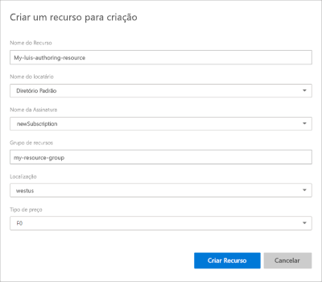

# <a name="steps-to-migrate-to-the-azure-authoring-resource"></a>Etapas para migrar para o recurso de autoria do Azure

A partir do portal Desentender o Idioma (LUIS), migre todos os aplicativos que possui para usar o recurso de autoria do Azure.

## <a name="prerequisites"></a>Pré-requisitos

* **Opcionalmente,** faça backup dos aplicativos da lista de aplicativos do portal LUIS exportando cada aplicativo ou use a [API de exportação](https://westus.dev.cognitive.microsoft.com/docs/services/5890b47c39e2bb17b84a55ff/operations/5890b47c39e2bb052c5b9c40).
* **Opcionalmente,** salve a lista de colaboradores de cada aplicativo. Todos os colaboradores podem enviar um e-mail como parte do processo de migração.
* **Obrigatório,** você precisa ter uma [assinatura do Azure.](https://azure.microsoft.com/free/) Uma parte do processo de assinatura requer informações de cobrança. No entanto, você pode usar níveis de preços gratuitos (F0) quando você usa LUIS. Você pode eventualmente achar que precisa de uma camada paga, à medida que seu uso aumenta.

Se você não tiver uma assinatura do Azure, [inscreva-se](https://azure.microsoft.com/free/).

## <a name="access-the-migration-process"></a>Acesse o processo de migração

Semanalmente, você é solicitado a migrar seus aplicativos. Você pode cancelar esta janela sem migrar. Se você quiser migrar antes do próximo período agendado, você pode iniciar o processo de migração a partir do ícone **Azure** na barra de ferramentas superior do portal LUIS.

> [!div class="mx-imgBorder"]
> 

## <a name="app-owner-begins-the-migration-process"></a>O proprietário do aplicativo inicia o processo de migração

O processo de migração está disponível se você é o proprietário de qualquer aplicativo LUIS.

1. Entre no [portal LUIS](https://www.luis.ai) e concorde com os termos de uso.
1. A janela pop-up de migração permite que você continue a migração ou migre mais tarde. Selecione **Migrar agora**. Se você optar por migrar mais tarde, você tem 9 meses para migrar para a nova chave de autoria no Azure.

    

1. Opcionalmente, se algum de seus aplicativos tiver colaboradores, você é solicitado a **enviar-lhes um e-mail** informando-os sobre a migração. Esta é uma etapa opcional.

    Depois de migrar sua conta para o Azure, seus aplicativos não estarão mais disponíveis para colaboradores.

    Para cada colaborador e aplicativo, o aplicativo de e-mail padrão abre com um e-mail levemente formatado. Você pode editar o e-mail antes de enviá-lo.

    O modelo de e-mail inclui o ID exato do aplicativo e o nome do aplicativo.

    ```html
    Dear Sir/Madam,

    I will be migrating my LUIS account to Azure. Consequently, you will no longer have access to the following app:

    App Id: <app-ID-omitted>
    App name: Human Resources

    Thank you
    ```

1. Escolha criar um recurso de autoria de LUIS selecionando para usar um recurso de criação existente ou para criar um novo recurso de criação.

    > [!div class="mx-imgBorder"]
    > 

1. Na próxima janela, digite suas informações-chave de recursos. Depois de inserir as informações, selecione **Criar recurso**. Você pode ter 10 recursos de autoria grátis por região, por assinatura.

    

    Ao **criar um novo recurso de criação**, forneça as seguintes informações:

    * **Nome do recurso** – um nome personalizado que você escolher, usado como parte da URL para as consultas de ponto de extremidade de criação e previsão.
    * **Locatário** – o locatário ao qual sua assinatura do Azure está associada.
    * **Nome da assinatura** – a assinatura que será cobrada pelo recurso.
    * **Grupo de recursos** – o nome de um grupo de recursos personalizado que você escolher ou criar. Os grupos de recursos permitem agrupar os recursos do Azure para acesso e gerenciamento.
    * **Local** – a escolha de local é baseada na seleção do **grupo de recursos**.
    * **Tipo de preço** – o tipo de preço determina a transação máxima por segundo e mês.

1. Valide seu recurso de autoria e **Migre agora**.

    

1. Quando o recurso de criação é criado, a mensagem de sucesso é mostrada. Selecione **Fechar** para fechar a janela pop-up.

    

    A lista **De aplicativos** mostra que os aplicativos migraram para o novo recurso de autoria.

    Você não precisa saber a chave do recurso de autoria para continuar editando seus aplicativos no portal LUIS. Se você planeja editar seus aplicativos de forma programática, você precisa da autoria de valores-chave. Esses valores são exibidos na página **gerenciar-> recursos do Azure** no portal LUIS e também estão disponíveis no portal Azure na página **Chaves** do recurso.

1. Antes de acessar seus aplicativos, selecione o recurso de assinatura e de autoria do LUIS para ver os aplicativos que você pode escrever.

    


## <a name="app-contributor-begins-the-migration-process"></a>Contribuinte de aplicativos inicia o processo de migração

Siga os mesmos passos do proprietário do aplicativo para migração. O processo cria um novo `LUIS.Authoring`recurso de autoria do tipo.

Você precisa migrar sua conta para ser adicionado como um contribuinte para aplicativos migrados de propriedade de outros.

## <a name="after-the-migration-process-add-contributors-to-your-authoring-resource"></a>Após o processo de migração, adicione colaboradores ao seu recurso de autoria

[!INCLUDE [Manage contributors for the Azure authoring resource for language understanding](./includes/manage-contributors-authoring-resource.md)]

[Aprenda a adicionar colaboradores](luis-how-to-collaborate.md).

## <a name="troubleshooting-errors-with-the-migration-process"></a>Solução de problemas com o processo de migração

Se você `MissingSubscriptionRegistration` receber um erro no portal LUIS com uma barra de notificação vermelha durante o processo de migração, crie um recurso de Serviço Cognitivo no [portal Azure](luis-how-to-azure-subscription.md#create-resources-in-the-azure-portal) ou [no Azure CLI](luis-how-to-azure-subscription.md#create-resources-in-azure-cli). Saiba mais sobre [as causas deste erro](../../azure-resource-manager/templates/error-register-resource-provider.md#cause).

## <a name="next-steps"></a>Próximas etapas


* Revisar [conceitos](luis-concept-keys.md) sobre autoria e chaves de tempo de execução
* [Revisar como atribuir chaves](luis-how-to-azure-subscription.md) e adicionar [colaboradores](luis-how-to-collaborate.md)
