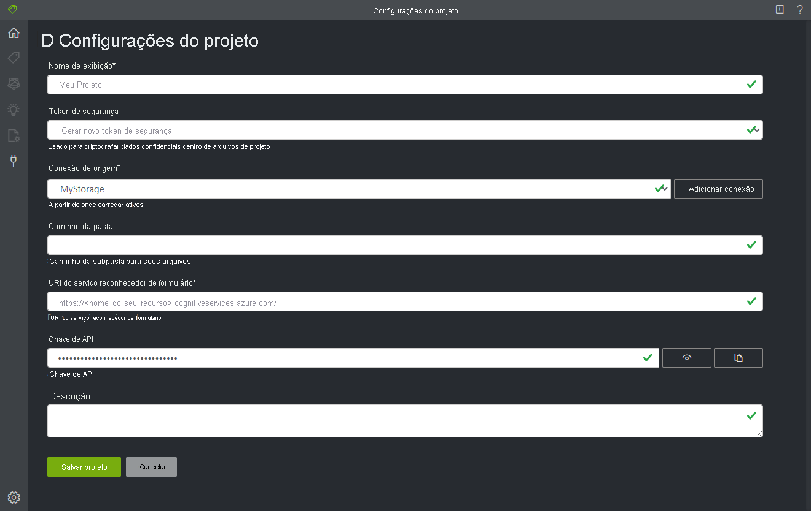

# <a name="train-a-form-recognizer-model-with-labels-using-the-sample-labeling-tool"></a>Treinar um modelo de Reconhecimento de Formulários com rótulos usando a ferramenta de rotulagem de exemplo

Neste início rápido, você usará a API REST do Reconhecimento de Formulários com a ferramenta de rotulagem de exemplo para treinar um modelo personalizado usando dados rotulados manualmente. Confira a seção [Treinar com rótulos](../overview.md#train-with-labels) da visão geral para saber mais sobre esse recurso.

Se você não tiver uma assinatura do Azure, crie uma [conta gratuita](https://azure.microsoft.com/free/?WT.mc_id=A261C142F) antes de começar.

## <a name="prerequisites"></a>Pré-requisitos

Para concluir este início rápido, é necessário ter:

- Um conjunto com pelo menos seis formulários do mesmo tipo. Você usará esses dados para treinar o modelo e testar um formulário. Você pode usar um [conjunto de dados de exemplo](https://go.microsoft.com/fwlink/?linkid=2090451) para este início rápido. Faça upload dos arquivos de treinamento na raiz de um contêiner de Armazenamento de Blobs em uma conta do Armazenamento do Azure.

## <a name="create-a-form-recognizer-resource"></a>Criar um recurso do Reconhecimento de Formulários

[!INCLUDE [create resource](../includes/create-resource.md)]

## <a name="set-up-the-sample-labeling-tool"></a>Configurar a ferramenta de rotulagem de exemplo

Você usará o mecanismo do Docker para executar a ferramenta de rotulagem de exemplo. Siga as etapas a seguir para configurar o contêiner do Docker. Para instruções sobre conceitos básicos do Docker e de contêiner, consulte a [visão geral do Docker](https://docs.docker.com/engine/docker-overview/).

> [!TIP]
> A Ferramenta de Rotulagem de Formulário OCR também está disponível como um projeto de software livre no GitHub. A ferramenta é um aplicativo Web TypeScript criado usando React + Redux. Para saber mais ou contribuir, confira o repositório [Ferramenta de Rotulagem de Formulário OCR](https://github.com/microsoft/OCR-Form-Tools/blob/master/README.md#run-as-web-application). Para experimentar a ferramenta online, acesse o [site do FOTT](https://fott.azurewebsites.net/).   

1. Primeiro, instale o Docker em um computador host. Este guia mostrará como usar o computador local como um host. Se você quiser usar um serviço de hospedagem do Docker no Azure, confira o guia de instruções [Implantar a ferramenta de rótulos de exemplo](../deploy-label-tool.md). 

   O computador host deve atender aos seguintes requisitos de hardware:

    | Contêiner | Mínimo | Recomendadas|
    |:--|:--|:--|
    |Ferramenta de rotulagem de exemplo|2 núcleos, 4 GB de memória|4 núcleos, 8 GB de memória|

   Instale o Docker em seu computador seguindo as instruções apropriadas para seu sistema operacional: 
   * [Windows](https://docs.docker.com/docker-for-windows/)
   * [macOS](https://docs.docker.com/docker-for-mac/)
   * [Linux](https://docs.docker.com/install/)

1. Obtenha o contêiner de ferramentas de rotulagem de exemplo com o comando `docker pull`.
    ```
    docker pull mcr.microsoft.com/azure-cognitive-services/custom-form/labeltool
    ```
1. Agora você está pronto para executar o contêiner com `docker run`.
    ```
    docker run -it -p 3000:80 mcr.microsoft.com/azure-cognitive-services/custom-form/labeltool eula=accept
    ```

   Esse comando disponibilizará a ferramenta de rotulagem de exemplo por meio de um navegador da Web. Ir para `http://localhost:3000`.

> [!NOTE]
> Você também pode rotular documentos e treinar modelos usando a API REST do Reconhecimento de Formulários. Para treinar e analisar com a API REST, confira [Treinar com rótulos usando a API REST e o Python](./python-labeled-data.md).

## <a name="set-up-input-data"></a>Configurar dados de entrada

Primeiro, verifique se todos os documentos de treinamento têm o mesmo formato. Se você tiver formulários em vários formatos, organize-os em subpastas com base no formato comum. Ao treinar, você precisará direcionar a API para uma subpasta.

### <a name="configure-cross-domain-resource-sharing-cors"></a>Configurar CORS (compartilhamento de recursos entre domínios)

Habilite o CORS em sua conta de armazenamento. Selecione a sua conta de armazenamento no portal do Azure e clique na guia **CORS** no painel esquerdo. Na linha inferior, preencha os valores a seguir. Em seguida, clique em **Salvar** na parte superior.

* Origens permitidas = * 
* Métodos permitidos = \[selecionar tudo\]
* Cabeçalhos permitidos = *
* Cabeçalhos expostos = * 
* Idade máx. = 200

> [!div class="mx-imgBorder"]
> 

## <a name="connect-to-the-sample-labeling-tool"></a>Conectar à ferramenta de rotulagem de exemplo

A ferramenta de rotulagem de exemplo conecta-se a uma origem (em que os formulários originais estão) e a um destino (em que ela exporta os rótulos criados e os dados de saída).

As conexões podem ser configuradas e compartilhadas entre projetos. Eles usam um modelo de provedor extensível para que você possa adicionar facilmente novos provedores de origem/destino.

Para criar uma nova conexão, clique no ícone **Novas Conexões** (plug), na barra de navegação à esquerda.

Preencha os campos com os valores a seguir:

* **Nome de Exibição** – o nome de exibição da conexão.
* **Descrição** – a descrição do seu projeto.
* **URL SAS** – a SAS (Assinatura de Acesso Compartilhado) do seu contêiner do Armazenamento de Blobs do Azure. Para recuperar a URL de SAS, abra o Gerenciador de Armazenamento do Microsoft Azure, clique com o botão direito do mouse no seu contêiner e selecione **Obter assinatura de acesso compartilhado**. Defina o tempo de expiração para algum tempo depois de você ter usado o serviço. Verifique se as permissões de **Leitura**, **Gravação**, **Exclusão** e **Lista** estão marcadas e clique em **Criar**. Em seguida, copie o valor na seção **URL**. Deve ter o formato: `https://<storage account>.blob.core.windows.net/<container name>?<SAS value>`.


## <a name="create-a-new-project"></a>Criar um novo projeto

Na ferramenta de rótulo de exemplo, os projetos armazenam as suas configurações. Crie um projeto e preencha os campos com os valores a seguir:

* **Nome de Exibição** – o nome de exibição do projeto
* **Token de Segurança** – algumas configurações de projeto podem incluir valores confidenciais, como chaves de API ou outros segredos compartilhados. Cada projeto gerará um token de segurança que pode ser usado para criptografar/descriptografar configurações confidenciais de projeto. Os tokens de segurança podem ser encontrados nas configurações do aplicativo clicando no ícone de engrenagem na parte inferior da barra de navegação à esquerda.
* **Conexão de Origem** – a conexão do Armazenamento de Blobs do Azure que você criou na etapa anterior e que deseja usar para este projeto.
* **Caminho da Pasta** (opcional) – se os formulários de origem estiverem localizados em uma pasta no contêiner de blob, especifique o nome da pasta aqui
* **URI do serviço de Reconhecimento de Formulários** – URL do ponto de extremidade do Reconhecimento de Formulários.
* **Chave de API** – sua chave de assinatura do Reconhecimento de Formulários.
* **Descrição** (opcional) – descrição do projeto



## <a name="label-your-forms"></a>Rotular seus formulários

Quando você cria ou abre um projeto, a janela principal do editor de marcas é aberta. O editor de marcas consiste em três partes:

* Um painel de visualização redimensionável que contém uma lista rolável de formulários da conexão de origem.
* O painel principal do editor, que permite a você aplicar marcas.
* O painel do editor de marcas, que permite aos usuários modificar, bloquear, reordenar e excluir marcas. 

### <a name="identify-text-elements"></a>Identificar elementos de texto

Clique em **Executar o OCR em todos os arquivos** no painel esquerdo para obter as informações de layout de texto de cada documento. A ferramenta de rotulagem desenhará caixas delimitadoras em volta de cada elemento de texto.

### <a name="apply-labels-to-text"></a>Aplicar rótulos ao texto

Em seguida, você criará marcas (rótulos) e as aplicará aos elementos de texto que você deseja que o modelo reconheça.

1. Primeiro, use o painel editor de marcas para criar as marcas que você deseja identificar.
   1. Clique em **+** para criar uma marca.
   1. Insira o nome da marca.
   1. Pressione Enter para salvar a marca.
1. No editor principal, clique e arraste para selecionar uma ou várias palavras dos elementos de texto realçados.
1. Clique na marca que você deseja aplicar ou pressione a tecla correspondente no teclado. As chaves de número são atribuídas como teclas de atalho para as 10 primeiras marcas. Você pode reordenar suas marcas usando os ícones de seta para cima e para baixo no painel do editor de marcas.
    > [!Tip]
    > Lembre-se das dicas a seguir quando estiver rotulando seus formulários.
    > * Você só pode aplicar uma marca a cada elemento de texto selecionado.
    > * Cada marca só pode ser aplicada uma vez por página. Se um valor aparecer várias vezes no mesmo formulário, crie marcas diferentes para cada instância. Por exemplo: "fatura n º 1", "fatura n º 2" e assim por diante.
    > * As marcas não podem se estender por páginas.
    > * Valores de rótulo como aparecem no formulário. Não tente dividir um valor em duas partes com duas marcas diferentes. Por exemplo, um campo de endereço deve ser rotulado com uma só marca, mesmo que abranja várias linhas.
    > * Não inclua chaves nos campos marcados &mdash; apenas os valores.
    > * Os dados da tabela devem ser detectados automaticamente e estarão disponíveis no arquivo JSON de saída final. No entanto, se o modelo não detectar todos os dados da tabela, você também poderá marcar esses campos manualmente. Marque cada célula na tabela com um rótulo diferente. Se os formulários tiverem tabelas com números variados de linhas, marque pelo menos um formulário com a maior tabela possível.
    > * Use os botões à direita do **+** para pesquisar, renomear, reordenar e excluir as marcas.
    > * Para remover uma marca aplicada sem excluir a marca em si, selecione o retângulo marcado na exibição de documento e selecione a tecla Delete.


Siga as etapas acima para rotular pelo menos cinco de seus formulários.

### <a name="specify-tag-value-types"></a>Especificar tipos de valor de marca

Opcionalmente, você pode definir o tipo de dados esperado para cada marca. Abra o menu de contexto à direita de uma determinada marca e selecione um tipo no menu. Esse recurso permite que o algoritmo de detecção faça determinadas suposições que melhorarão a precisão da detecção de texto. Ele também garante que os valores detectados serão retornados em um formato padronizado na saída JSON final. 

> [!div class="mx-imgBorder"]
> 

Os tipos de valor e as variações a seguir são compatíveis no momento:
* `string`
    * padrão, `no-whitespaces`, `alphanumeric`
* `number`
    * padrão, `currency`
* `date` 
    * padrão, `dmy`, `mdy`, `ymd`
* `time`
* `integer`

> [!NOTE]
> Confira estas regras para a formatação de data:
> 
> Os caracteres a seguir podem ser usados como delimitadores de data DMA: `, - / . \`. O espaço em branco não pode ser usado como um delimitador. Por exemplo:
> * 01,01,2020
> * 01-01-2020
> * 01/01/2020
>
> O dia e o mês podem ser escritos como tendo um ou dois dígitos, e o ano pode ter dois ou quatro dígitos:
> * 1-1-2020
> * 1-01-20
>
> Se uma cadeia de caracteres de data DMA tiver oito dígitos, o delimitador será opcional:
> * 01012020
> * 01 01 2020
>
> O mês também pode ser escrito como nome completo ou curto. Se o nome for usado, os caracteres delimitadores serão opcionais:
> * 01/jan/2020
> * 01jan2020
> * 01 de janeiro de 2020

## <a name="train-a-custom-model"></a>Treinar um modelo personalizado

Clique no ícone Treinar no painel esquerdo para abrir a página Treinamento. Em seguida, clique no botão **Treinar** para começar a treinar o modelo. Quando o processo de treinamento for concluído, você verá as seguintes informações:

* **ID do Modelo** – a ID do modelo que foi criado e treinado. Cada chamada de treinamento cria um novo modelo com sua própria ID. Copie esta cadeia de caracteres para um local seguro. Você precisará dela se quiser fazer chamadas de previsão por meio da API REST.
* **Precisão Média** – a precisão média do modelo. Você pode aprimorar a precisão do modelo rotulando formulários adicionais e treinando novamente para criar outro modelo. É recomendável começar rotulando cinco formulários e adicionando mais formulários conforme necessário.
* A lista de marcas e a precisão estimada por marca.


Após a conclusão do treinamento, examine o valor de **Precisão Média**. Se ele estiver baixo, você deverá adicionar mais documentos de entrada e repetir as etapas acima. Os documentos que você já rotulou permanecerão no índice do projeto.

> [!TIP]
> Você também pode executar o processo de treinamento com uma chamada à API REST. Para saber como fazer isso, confira [treinar com rótulos usando o Python](./python-labeled-data.md).

## <a name="analyze-a-form"></a>Analisar um formulário

Clique no ícone Prever (lâmpada) à esquerda para testar seu modelo. Carregue um documento de formulário que você não usou no processo de treinamento. Em seguida, clique no botão **Prever** à direita para obter previsões de chave-valor para o formulário. A ferramenta aplicará marcas nas caixas delimitadoras e relatará o nível de confiança de cada marca.

> [!TIP]
> Você também pode executar a API de Análise com uma chamada REST. Para saber como fazer isso, confira [treinar com rótulos usando o Python](./python-labeled-data.md).

## <a name="improve-results"></a>Aprimorar os resultados

Dependendo da precisão relatada, talvez você queira realizar mais treinamento para aprimorar o modelo. Depois de fazer uma previsão, examine os valores de confiança para cada uma das marcas aplicadas. Se o valor de treinamento de precisão média for alto, mas as pontuações de confiança forem baixas (ou os resultados são imprecisos), você deverá adicionar o arquivo usado para previsão no conjunto de treinamento, rotulá-lo e treinar novamente.

A precisão média relatada, as pontuações de confiança e a precisão real podem ser inconsistentes quando os documentos que estão sendo analisados são diferentes daqueles usados no treinamento. Tenha em mente que alguns documentos parecem semelhantes quando vistos por pessoas, mas podem parecer distintos para o modelo de IA. Por exemplo, você pode treinar com um tipo de formulário que tem duas variações, em que o conjunto de treinamento consiste em 20% da variação A e 80% da variação B. Durante a previsão, as pontuações de confiança para documentos da variação A provavelmente serão menores.

## <a name="save-a-project-and-resume-later"></a>Salvar um projeto e retomá-lo mais tarde

Para retomar seu projeto em outro momento ou em outro navegador, você precisa salvar o token de segurança do projeto e reinseri-lo mais tarde. 

### <a name="get-project-credentials"></a>Obter credenciais do projeto
Vá para a página de configurações do projeto (ícone do controle deslizante) e anote o nome do token de segurança. Em seguida, vá para as configurações do aplicativo (ícone de engrenagem), que mostra todos os tokens de segurança em sua instância atual do navegador. Localize o token de segurança do seu projeto e copie seu nome e valor de chave para um local seguro.

### <a name="restore-project-credentials"></a>Restaurar credenciais do projeto
Quando desejar retomar seu projeto, primeiro você precisará criar uma conexão com o mesmo contêiner de armazenamento de blobs. Repita as etapas acima para fazer isso. Em seguida, vá para a página de configurações do aplicativo (ícone de engrenagem) e veja se o token de segurança do seu projeto está lá. Se não estiver, adicione um novo token de segurança e copie a chave e o nome do token da etapa anterior. Em seguida, clique em Salvar alterações. 

### <a name="resume-a-project"></a>Retomar um projeto

Por fim, vá para a página principal (ícone da casa) e clique em Abrir Projeto de Nuvem. Em seguida, selecione a conexão de armazenamento de blobs e selecione o arquivo *.vott* do seu projeto. O aplicativo carregará todas as configurações do projeto, porque ele tem o token de segurança.

## <a name="next-steps"></a>Próximas etapas

Neste guia início rápido, você aprendeu a usar a ferramenta de rotulagem de exemplo do Reconhecimento de Formulários para treinar um modelo usando dados rotulados manualmente. Se você quiser integrar a ferramenta de rotulagem em seu próprio aplicativo, use as APIs REST que lidam com o treinamento de dados rotulados.

> [!div class="nextstepaction"]
> [Treinar com rótulos usando o Python](./python-labeled-data.md)
