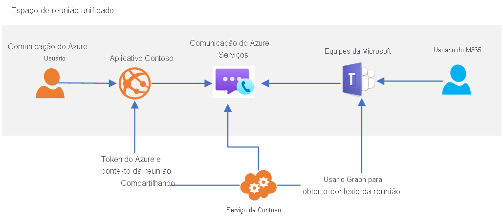

# Interoperabilidade do Teams

> [!IMPORTANT]
> Para habilitar/desabilitar a [interoperabilidade de locatários do Teams](../concepts/teams-interop.md), preencha [este formulário](https://forms.office.com/Pages/ResponsePage.aspx?id=v4j5cvGGr0GRqy180BHbR21ouQM6BHtHiripswZoZsdURDQ5SUNQTElKR0VZU0VUU1hMOTBBMVhESS4u).

Os Serviços de Comunicação do Azure podem ser usados para criar experiências de reunião personalizadas que interagem com o Microsoft Teams. Os usuários das suas soluções dos Serviços de Comunicação podem interagir com os participantes do Teams usando voz, vídeo, chat e compartilhamento de tela.

A interoperabilidade com o Teams permite que você crie aplicativos personalizados do Azure que conectam os usuários às reuniões do Teams. Os usuários dos seus aplicativos personalizados não precisam ter identidades do Azure Active Directory nem licenças do Teams para experimentar essa funcionalidade. Isso é ideal para reunir funcionários (que possam estar familiarizados com o Teams) e usuários externos (que usam uma experiência de aplicativo personalizada) em uma experiência de reunião perfeita. Por exemplo: 

1. Os funcionários usam o Teams para agendar uma reunião 
1. Os detalhes da reunião são compartilhados com usuários externos por meio do aplicativo personalizado.
   * **Usando a API do Graph** Seu aplicativo personalizado dos Serviços de Comunicação usa as APIs do Microsoft Graph para acessar os detalhes da reunião a serem compartilhados. 
   * **Usando outras opções** Por exemplo, seu link de reunião pode ser copiado do seu calendário no Microsoft Teams.
1. Os usuários externos usam seu aplicativo personalizado para participar da reunião do Teams (por meio da biblioteca de clientes de Chamada e Chat dos Serviços de Comunicação)

A arquitetura de alto nível para esse caso de uso tem esta aparência: 

Embora alguns recursos de reunião do Teams, por exemplo, mão levantada, modo conferência e salas para sessão de grupo, só estejam disponíveis para os usuários do Teams, seu aplicativo personalizado terá acesso às principais funcionalidades de áudio, vídeo, chat e compartilhamento de tela da reunião. O chat de reunião ficará acessível para o usuário do aplicativo personalizado enquanto ele estiver na chamada. Ele não poderá enviar nem receber mensagens antes de ingressar ou depois de sair da chamada. 

Quando um usuário dos Serviços de Comunicação participa da reunião do Teams, o nome de exibição fornecido por meio da biblioteca de clientes de Chamada será mostrado aos usuários do Teams. O usuário dos Serviços de Comunicação, de outro modo, será tratado como um usuário anônimo no Teams.  Seu aplicativo personalizado deve considerar a autenticação do usuário e outras medidas de segurança para proteger as reuniões do Teams. Lembre-se das implicações de segurança de permitir que usuários anônimos participem das reuniões e use o [guia de segurança do Teams](/microsoftteams/teams-security-guide#addressing-threats-to-teams-meetings) para configurar as funcionalidades disponíveis para usuários anônimos.

A interoperabilidade do Teams com os Serviços de Comunicação está atualmente em versão prévia privada. Quando estiver em disponibilidade geral, os usuários dos Serviços de Comunicação serão tratados como "Usuários externos de acesso". Saiba mais sobre o acesso externo em [Chamar, conversar por chat e colaborar com pessoas de fora da sua organização no Microsoft Teams](/microsoftteams/communicate-with-users-from-other-organizations).

Os usuários dos Serviços de Comunicação podem participar das reuniões agendadas do Teams, desde que as participações anônimas estejam habilitadas nas [configurações da reunião](/microsoftteams/meeting-settings-in-teams).

## Teams em Nuvens Governamentais (GCC)
No momento, a interoperabilidade com os Serviços de Comunicação do Azure não é compatível com as implantações do Teams usando as [nuvens governamentais (GCC) do Microsoft 365](/MicrosoftTeams/plan-for-government-gcc). 

## Próximas etapas

> [!div class="nextstepaction"]
> [Ingressar seu aplicativo de chamada em uma reunião do Teams](../quickstarts/voice-video-calling/get-started-teams-interop.md)