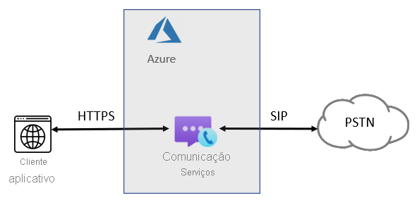
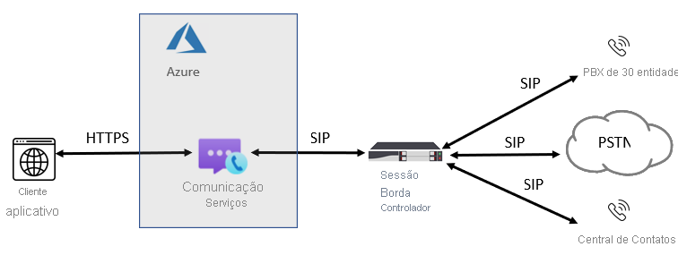

# Conceitos de telefonia

[!INCLUDE [Public Preview Notice](../../includes/public-preview-include-phone-numbers.md)]

[!INCLUDE [Regional Availability Notice](../../includes/regional-availability-include.md)]

Os SDKs de Chamada dos Serviços de Comunicação do Azure podem ser usados para adicionar telefonia e PSTN aos seus aplicativos. Esta página resume os principais conceitos e funcionalidades de telefonia. Confira a [biblioteca de chamada](../../quickstarts/voice-video-calling/calling-client-samples.md) para saber mais sobre as funcionalidades e as linguagens de SDKs específicos.

## Visão geral de telefonia
Sempre que os usuários interagem com um número de telefone tradicional, as chamadas são facilitadas por chamadas de voz PSTN (Rede Telefônica Pública Comutada). Para fazer e receber chamadas PSTN, você precisa adicionar recursos de telefonia ao recurso de Serviços de Comunicação do Azure. Nesse caso, a sinalização e a mídia usam uma combinação de tecnologias baseadas em IP e PSTN para conectar seus usuários. Os Serviços de Comunicação oferecem duas maneiras diferenciadas de atingir a rede PSTN: Chamada de Nuvem do Azure e interface SIP.

### Chamada de Nuvem do Azure

Uma forma fácil de adicionar conectividade PSTN ao seu aplicativo ou serviço, nesse caso a Microsoft, é seu provedor de telecomunicações. Você pode comprar números diretamente da Microsoft. A Chamada de Nuvem do Azure é uma solução de telefonia tudo na nuvem para Serviços de Comunicação. Essa é a opção mais simples que conecta o ACS à PSTN (rede telefônica pública comutada) para habilitar chamadas para telefones fixos e celulares em todo o mundo. Com essa opção, a Microsoft atua como sua operadora PSTN, conforme mostrado no seguinte diagrama:

Se você responder "sim" às seguintes declarações, a Chamada de Nuvem do Azure será a solução certa para você:
- A Chamada de Nuvem do Azure está disponível em sua região.
- Você não precisa manter sua operadora PSTN atual.
- É interessante usar o acesso gerenciado pela Microsoft à PSTN.

Com essa opção:
- Você obtém números diretamente da Microsoft e pode ligar para telefones em todo o mundo.
- Você não precisa de implantação ou manutenção de uma implantação local, pois a chamada à nuvem do Azure é operada dos Serviços de Comunicação do Azure.
- Observação: se necessário, você pode optar por conectar um SBC (Session Border Controller) com suporte por meio da interface SIP para interoperabilidade com PBXs de terceiros, dispositivos analógicos e outros equipamentos de telefonia de terceiros com suporte no SBC.

Essa opção requer uma conexão ininterrupta com os Serviços de Comunicação do Azure.

### Interface SIP

Com essa opção, você pode conectar a telefonia local herdada e sua operadora de escolha aos Serviços de Comunicação do Azure. Ela fornece funcionalidades de chamada PSTN para seus aplicativos ACS mesmo se a chamada de nuvem do Azure não está disponível em seu país/região. 

Se você responder "sim" a qualquer uma das seguintes perguntas, a interface SIP será a solução certa para você:

- É interessante usar o ACS com funcionalidades de chamada PSTN.
- Você precisa manter sua operadora PSTN atual.
- É interessante misturar o roteamento, com algumas chamadas passando pela Chamada de Nuvem do Azure, algumas por meio de sua operadora.
- Você precisa fazer a interoperação com PBXs e/ou equipamentos de terceiros, como pagers de sobrecarga, dispositivos analógicos e assim por diante.

Com essa opção:

- Você conecta o próprio SBC com suporte aos Serviços de Comunicação do Azure sem a necessidade de software local adicional.
- Você pode usar literalmente qualquer operadora de telefonia com o ACS.
- Você pode optar por configurar e gerenciar essa opção ou ela pode ser configurada e gerenciada por sua operadora ou parceiro (pergunte se a sua operadora ou o seu parceiro fornece essa opção).
- Você pode configurar a interoperabilidade entre seus equipamentos de telefonia, como um PBX de terceiros e dispositivos analógicos – e o ACS.

Essa opção requer o seguinte:

- Conexão ininterrupta com o Azure.
- Implantação e manutenção de um SBC com suporte.
- Um contrato com uma operadora de terceiros. (A menos que seja implantado como uma opção para fornecer uma conexão a um PBX de terceiros, dispositivos analógicos ou outros equipamentos de telefonia para usuários que estão nos Serviços de Comunicação.)

## Próximas etapas

### Documentação conceitual

- [Tipos de número de telefone nos Serviços de Comunicação do Azure](./plan-solution.md)
- [Planejar a interface SIP](./sip-interface-infrastructure.md)
- [Preços](../pricing.md)

### Inícios rápidos

- [Obter um número de telefone](../../quickstarts/telephony-sms/get-phone-number.md)
- [Ligar para um telefone](../../quickstarts/voice-video-calling/pstn-call.md)
