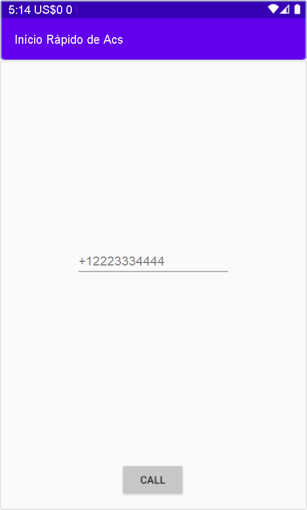

[!INCLUDE [Emergency Calling Notice](../../../includes/emergency-calling-notice-include.md)]
## <a name="prerequisites"></a>Pré-requisitos

- Uma conta do Azure com uma assinatura ativa. [Crie uma conta gratuitamente](https://azure.microsoft.com/free/?WT.mc_id=A261C142F). 
- Um recurso dos Serviços de Comunicação implantado. [Crie um recurso dos Serviços de Comunicação](../../create-communication-resource.md).
- Um número de telefone adquirido no recurso dos Serviços de Comunicação. [como obter um número de telefone](../../telephony-sms/get-phone-number.md).
- Um `User Access Token` para habilitar o cliente de chamada. Para obter mais informações sobre [como obter um `User Access Token`](../../access-tokens.md)
- Conclua o guia de início rápido para [começar a adicionar chamadas ao seu aplicativo](../getting-started-with-calling.md)

### <a name="prerequisite-check"></a>Verificação de pré-requisitos

- Para exibir os números de telefone associados ao seu recurso dos Serviços de Comunicação, entre no [portal do Azure](https://portal.azure.com/), localize o recurso em questão e abra a guia **números de telefone** no painel de navegação esquerdo.

## <a name="setting-up"></a>Configurando

### <a name="add-pstn-functionality-to-your-app"></a>Adicionar a funcionalidade de PSTN ao seu aplicativo

Adicione o tipo `PhoneNumber` ao seu aplicativo modificando **MainActivity.java**:


```java
import com.azure.android.communication.common.PhoneNumberIdentifier;
```

<!--
> [!TBD]
> Namespace based on input from Komivi Agbakpem. But it does not correlates with other use namespaces in Calling Quickstart. E.g: "com.azure.communication.calling.CommunicationUserIdentifier" or "com.azure.communication.common.client.CommunicationTokenCredential". Double-chek this.
-->

## <a name="start-a-call-to-phone"></a>Iniciar uma chamada para um telefone

Especifique o número de telefone que você adquiriu de dentro do recurso dos Serviços de Comunicação. Isso será usado para iniciar a chamada:

> [!WARNING]
> Observe que os números de telefone devem ser fornecidos no formato padrão internacional E.164. (por exemplo: +12223334444)

Modifique o manipulador de eventos `startCall()` em **MainActivity.java** para que ele possa manipular chamadas telefônicas:

```java
    private void startCall() {
        EditText calleePhoneView = findViewById(R.id.callee_id);
        String calleePhone = calleePhoneView.getText().toString();
        PhoneNumberIdentifier callerPhone = new PhoneNumberIdentifier("+12223334444");
        StartCallOptions options = new StartCallOptions();
        options.setAlternateCallerId(callerPhone);
        options.setVideoOptions(new VideoOptions(null));
        call = agent.startCall(
                getApplicationContext(),
                new PhoneNumberIdentifier[] {new PhoneNumberIdentifier(calleePhone)},
                options);
    }
```

## <a name="launch-the-app-and-call-the-echo-bot"></a>Iniciar o aplicativo e chamar o bot de eco

Agora, o aplicativo pode ser iniciado usando o botão "Executar Aplicativo" na barra de ferramentas (Shift+F10). Você pode fazer uma chamada para o telefone fornecendo um número de telefone no campo de texto adicionado e clicando no botão **CHAMAR**.
> [!WARNING]
> Observe que os números de telefone devem ser fornecidos no formato padrão internacional E.164. (por exemplo: +12223334444)


