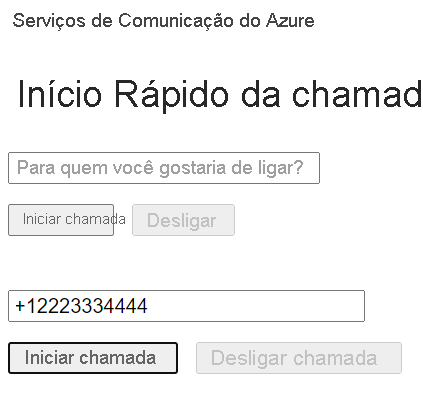

[!INCLUDE [Emergency Calling Notice](../../../includes/emergency-calling-notice-include.md)]
## <a name="prerequisites"></a>Pré-requisitos

- Uma conta do Azure com uma assinatura ativa. [Crie uma conta gratuitamente](https://azure.microsoft.com/free/?WT.mc_id=A261C142F). 
- Um recurso dos Serviços de Comunicação implantado. [Crie um recurso dos Serviços de Comunicação](../../create-communication-resource.md).
- Um número de telefone adquirido no recurso dos Serviços de Comunicação. [como obter um número de telefone](../../telephony-sms/get-phone-number.md).
- Um `User Access Token` para habilitar o cliente de chamada. Para obter mais informações sobre [como obter um `User Access Token`](../../access-tokens.md)
- Conclua o guia de início rápido para [começar a adicionar chamadas ao seu aplicativo](../getting-started-with-calling.md)

### <a name="prerequisite-check"></a>Verificação de pré-requisitos

- Para exibir os números de telefone associados ao seu recurso dos Serviços de Comunicação, entre no [portal do Azure](https://portal.azure.com/), localize o recurso em questão e abra a guia **números de telefone** no painel de navegação esquerdo.
- Você pode compilar e executar seu aplicativo com a biblioteca de clientes de Chamada dos Serviços de Comunicação do Azure para JavaScript:

```console
npx webpack-dev-server --entry ./client.js --output bundle.js
```

## <a name="setting-up"></a>Configurando

### <a name="add-pstn-functionality-to-your-app"></a>Adicionar a funcionalidade de PSTN ao seu aplicativo

Estenda seu layout com controles de discagem telefônica.

Coloque este código no final da seção `<body />` de **index.html**, antes das marcas `<script />`:

```html
<input 
  id="callee-phone-input"
  type="text"
  placeholder="Phone number you would like to dial"
  style="margin-bottom:1em; width: 230px;"
/>
<div>
  <button id="call-phone-button" type="button">
    Start Phone Call
  </button>
  &nbsp;
  <button id="hang-up-phone-button" type="button" disabled="true">
    Hang Up Phone Call
  </button>
</div>
```

Estenda a lógica do aplicativo com a funcionalidade de telefonia.

Adicione este código a **client.js**:

```javascript
const calleePhoneInput = document.getElementById("callee-phone-input");
const callPhoneButton = document.getElementById("call-phone-button");
const hangUpPhoneButton = document.getElementById("hang-up-phone-button");
```

## <a name="start-a-call-to-phone"></a>Iniciar uma chamada para um telefone

Especifique o número de telefone que você adquiriu no recurso dos Serviços de Comunicação, que será usado para iniciar a chamada:
> [!WARNING]
> Observe que os números de telefone devem ser fornecidos no formato padrão internacional E.164. (por exemplo: +12223334444)

Adicione um manipulador de eventos para iniciar uma chamada para o número de telefone que você forneceu quando o `callPhoneButton` receber um clique:


```javascript
callPhoneButton.addEventListener("click", () => {
  // start a call to phone
  const phoneToCall = calleePhoneInput.value;
  call = callAgent.call(
    [{phoneNumber: phoneToCall}], { alternateCallerId: {phoneNumber: '+18336528005'}
  });

  // toggle button states
  hangUpPhoneButton.disabled = false;
  callPhoneButton.disabled = true;
});
```

## <a name="end-a-call-to-phone"></a>Encerrar uma chamada para um telefone

Adicione um ouvinte de eventos para encerrar a chamada atual quando o `hangUpPhoneButton` for clicado:

```javascript
hangUpPhoneButton.addEventListener("click", () => {
  // end the current call
  call.hangUp({
    forEveryone: true
  });

  // toggle button states
  hangUpPhoneButton.disabled = true;
  callPhoneButton.disabled = false;
});
```

A propriedade `forEveryone` encerra a chamada para todos os participantes da chamada.

## <a name="run-the-code"></a>Executar o código

Use `webpack-dev-server` para criar e executar o seu aplicativo. Execute o seguinte comando para empacotar o host de aplicativos em um servidor Web local:


```console
npx webpack-dev-server --entry ./client.js --output bundle.js
```

Abra o navegador e navegue até `http://localhost:8080/`. Você deve ver o seguinte:




Faça uma chamada para um número de telefone real fornecendo um número de telefone no campo de texto adicionado e clicando no botão **Iniciar Chamada Telefônica**.

> [!WARNING]
> Observe que os números de telefone devem ser fornecidos no formato padrão internacional E.164. (por exemplo: +12223334444)
