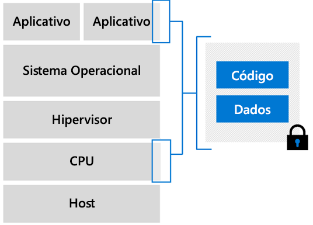

# Visão geral das VMs (máquinas virtuais) de computação confidencial do Azure

O Azure é o primeiro provedor de nuvem a oferecer computação confidencial em um ambiente virtualizado. Desenvolvemos máquinas virtuais que atuam como uma camada de abstração entre o hardware e seu aplicativo. Você pode executar cargas de trabalho em escala e com opções de redundância e disponibilidade.  

## Máquinas Virtuais habilitadas para Intel SGX

Nas máquinas virtuais de computação confidencial do Azure, uma parte do hardware da CPU é reservada para uma porção do código e dos dados de seu aplicativo. Essa parte restrita é a enclave. 

Atualmente, a infraestrutura de computação confidencial do Azure é composta de um SKU especializado de VMs (máquinas virtuais). Essas VMs são executadas em processadores Intel com Software Guard Extension (Intel SGX). [O Intel SGX](https://intel.com/sgx) é o componente que proporciona a maior proteção que nós revelamos com a computação confidencial. 

Atualmente, o Azure oferece a [Série DCsv2](../virtual-machines/dcv2-series.md) baseada na tecnologia Intel SGX para a criação de enclave baseada em hardware. Você pode criar aplicativos seguros baseados em enclave para serem executados na série DCsv2 de VMs para proteger os dados do seu aplicativo e o código em uso. 

[Leia mais](virtual-machine-solutions.md) sobre como implantar máquinas virtuais de computação confidencial do Azure com enclaves confiáveis com base em hardware.

## Enclaves

Enclaves são partes protegidas do processador e da memória do hardware. Não há como ver dados ou código dentro do enclave, mesmo com um depurador. Se as tentativas de código não confiável modificarem o conteúdo na memória enclave, o ambiente será desabilitado e as operações serão negadas.

Fundamentalmente, imagine um enclave como uma caixa protegida. Você coloca o código criptografado e os dados na caixa. De fora da caixa você não consegue ver nada. Você dá ao enclave uma chave para descriptografar os dados; então, os dados são processados e criptografados novamente, antes de serem enviados para fora do enclave.

Cada enclave tem um tamanho definido de cache de página criptografada (EPC) que determina a quantidade de memória que cada enclave pode conter. Máquinas virtuais DCsv2 maiores têm mais memória EPC. Leia a página [especificações do DCsv2](../virtual-machines/dcv2-series.md) para obter o tamanho máximo de EPC por VM.

### Desenvolvendo aplicativos para execução dentro do enclaves
Ao desenvolver aplicativos, você pode usar [ferramentas de software](application-development.md) para blindar partes de do código e dos dados dentro do enclave. Essas ferramentas garantirão que seu código e seus dados não possam ser exibidos nem modificados por ninguém de fora do ambiente confiável. 

## Próximas etapas
- [Leia as práticas recomendadas](virtual-machine-solutions.md) para implantar soluções em máquinas virtuais de computação confidencial do Azure.
- [Implantar uma máquina virtual DCsv2-Series](quick-create-portal.md)
- [Desenvolver um aplicativo com reconhecimento de enclave](application-development.md) usando o SDK do OE