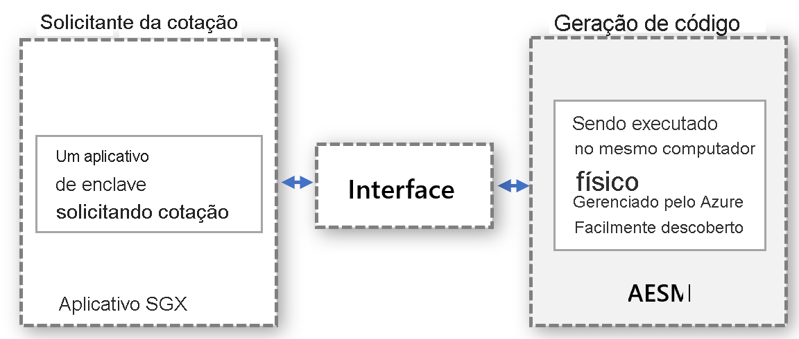

# <a name="platform-software-management-with-sgx-quote-helper-daemon-set-preview"></a>Gerenciamento de Software de Plataforma usando um DaemonSet do auxiliar de cotação do SGX (versão prévia)

Os [aplicativos de enclave](confidential-computing-enclaves.md) que executam o atestado remoto exigem uma COTAÇÃO gerada. Essa COTAÇÃO fornece uma prova criptográfica da identidade e do estado do aplicativo, bem como o ambiente no qual o enclave está sendo executado. A geração da COTAÇÃO requer componentes de software confiáveis que fazem parte do PSW (componentes de software da plataforma).

## <a name="overview"></a>Visão geral
 
A Intel dá suporte a dois modos de atestado para executar a geração de cotação:
- **in-proc**: hospeda os componentes de software confiáveis no processo do aplicativo de enclave

- **out-of-proc**: hospeda os componentes de software confiáveis fora do aplicativo de enclave.
 
Aplicativos SGX criados usando o SDK do Open Enclave por padrão usam o modo de atestado in-proc. Os aplicativos baseados em SGX permitem out-of-proc e exigem hospedagem extra, expondo os componentes obrigatórios, como AESM (Architectural Enclave Service Manager), externos ao aplicativo.

A utilização desse recurso é **altamente recomendável**, pois aprimora o tempo de atividade para seus aplicativos de enclave durante as atualizações de plataforma Intel ou atualizações de driver DCAP.

Para habilitar esse recurso em um Cluster do AKS, modifique a opção Adicionar comando --enable-sgxquotehelper para a CLI ao habilitar um complemento de computação confidencial. Instruções detalhadas da CLI estão disponíveis [aqui](confidential-nodes-aks-get-started.md): 

```azurecli-interactive
# Create a new AKS cluster with system node pool with Confidential Computing addon enabled and SGX Quote Helper
az aks create -g myResourceGroup --name myAKSCluster --generate-ssh-keys --enable-addon confcom --enable-sgxquotehelper
```

## <a name="why-and-what-are-the-benefits-of-out-of-proc"></a>Por que usar e quais são os benefícios do out-of-proc?

-   Nenhuma atualização é necessária para componentes de geração de cotação do PSW para cada aplicativo em contêineres: Com out-of-proc, os proprietários do contêiner não precisam gerenciar atualizações no respectivo contêiner. Em vez disso, os proprietários do contêiner contam com a interface fornecida pelo provedor que invoca o serviço centralizado fora do contêiner, que será atualizado e gerenciado pelo provedor.

-   Não há necessidade de se preocupar com falhas de atestado devido a componentes de PSW desatualizados: A geração de cotação envolve os componentes de SW confiáveis – QE (enclave de cotação) e PCE (enclave de certificado de provisionamento), que fazem parte da TCB (base de computação confiável). Esses componentes de SW devem estar atualizados para manter os requisitos de atestado. Como o provedor gerencia as atualizações para esses componentes, os clientes nunca precisarão lidar com falhas de atestado devido a componentes de SW confiáveis desatualizados dentro do contêiner.

-   Melhor utilização da memória EPC no modo de atestado in-proc, cada aplicativo enclave precisa criar uma instância da cópia de QE e PCE para atestado remoto. Com a opção out-of-proc, não há necessidade de o contêiner hospedar esses enclaves, portanto, ele não consome memória de enclave da cota do contêiner.

-   Proteções contra a imposição de kernel Quando o driver SGX é transmitido para o kernel do Linux, haverá imposição para um enclave ter um privilégio maior. Esse privilégio permite que o enclave invoque o PCE, que interromperá o aplicativo de enclave em execução no modo in-proc. Por padrão, o enclaves não obtêm essa permissão. Conceder esse privilégio a um aplicativo de enclave requer alterações ao processo de instalação do aplicativo. Isso é facilmente processado para o modelo out-of-proc, pois o provedor do serviço que trata as solicitações out-of-proc verificará se o serviço está instalado com esse privilégio.

-   Não é necessário verificar a compatibilidade com versões anteriores com PSW e DCAP. As atualizações para os componentes de geração de cotação do PSW são validadas quanto à compatibilidade com versões anteriores do provedor antes da atualização. Isso ajudará a lidar com problemas de compatibilidade com antecedência e a solucioná-los antes de implantar atualizações a cargas de trabalho confidenciais.

## <a name="how-does-the-out-of-proc-attestation-mode-work-for-confidential-workloads-scenario"></a>Como o modo de atestado out-of-proc funciona para o cenário de cargas de trabalho confidenciais?

O design de alto nível segue o modelo em que o solicitante da cotação e a geração de cotações são executados separadamente, mas no mesmo computador físico. A geração da cotação será feita de maneira centralizada e atenderá a solicitações de COTAÇÕES de todas as entidades. A interface precisa ser definida corretamente e ser detectável para que qualquer entidade solicite cotações.



O modelo abstrato acima se aplica ao cenário de carga de trabalho confidencial aproveitando o serviço AESM já disponível. O AESM é em contêiner e implantado como um daemonSet no cluster do Kubernetes. O Kubernetes garante uma única instância de um contêiner de serviço AESM, encapsulada em um Pod, a ser implantada em cada nó do agente. O novo daemonset da Cotação SGX terá uma dependência do daemonset sgx-device-plugin, pois o contêiner de serviço do AESM solicitaria a memória EPC do sgx-device-plugin para iniciar enclaves do QE e do PCE.

Cada contêiner precisa aceitar para usar a geração de cotação out-of-proc definindo a variável de ambiente **SGX_AESM_ADDR=1** durante a criação. O contêiner também deve incluir o pacote libsgx-quote-ex, que é responsável por direcionar a solicitação para o soquete de domínio UNIX padrão

Um aplicativo ainda pode usar o atestado in-proc como antes, mas não é possível tanto in-proc quanto out-of-proc simultaneamente em um aplicativo. A infraestrutura out-of-proc está disponível por padrão e consome recursos.

## <a name="sample-implementation"></a>Exemplo de implementação

O arquivo do Docker abaixo é um exemplo para um aplicativo baseado em Open Enclave. Defina a variável de ambiente SGX_AESM_ADDR=1 no arquivo do Docker ou no arquivo de implantação. Siga o exemplo abaixo para obter detalhes de YAML de implantação e arquivo do Docker. 

  > [!Note] 
  > O **libsgx-quote-ex** da Intel precisa ser empacotado no contêiner do aplicativo para que o atestado out-of-proc funcione corretamente.
    
```yaml
# Refer to Intel_SGX_Installation_Guide_Linux for detail
FROM ubuntu:18.04 as sgx_base
RUN apt-get update && apt-get install -y \
    wget \
    gnupg

# Add the repository to sources, and add the key to the list of
# trusted keys used by the apt to authenticate packages
RUN echo "deb [arch=amd64] https://download.01.org/intel-sgx/sgx_repo/ubuntu bionic main" | tee /etc/apt/sources.list.d/intel-sgx.list \
    && wget -qO - https://download.01.org/intel-sgx/sgx_repo/ubuntu/intel-sgx-deb.key | apt-key add -
# Add Microsoft repo for az-dcap-client
RUN echo "deb [arch=amd64] https://packages.microsoft.com/ubuntu/18.04/prod bionic main" | tee /etc/apt/sources.list.d/msprod.list \
    && wget -qO - https://packages.microsoft.com/keys/microsoft.asc | apt-key add -

FROM sgx_base as sgx_sample
RUN apt-get update && apt-get install -y \
    clang-7 \
    libssl-dev \
    gdb \
    libprotobuf10 \
    libsgx-dcap-ql \
    libsgx-quote-ex \
    az-dcap-client \
    open-enclave
WORKDIR /opt/openenclave/share/openenclave/samples/remote_attestation
RUN . /opt/openenclave/share/openenclave/openenclaverc \
    && make build
# this sets the flag for out of proc attestation mode. alternatively you can set this flag on the deployment files
ENV SGX_AESM_ADDR=1 

CMD make run
```
Como alternativa, o modo de atestado out-of-proc pode ser definido no arquivo YAML de implantação, conforme mostrado abaixo

```yaml
apiVersion: batch/v1
kind: Job
metadata:
  name: sgx-test
spec:
  template:
    spec:
      containers:
      - name: sgxtest
        image: <registry>/<repository>:<version>
        env:
        - name: SGX_AESM_ADDR
          value: 1
        resources:
          limits:
            kubernetes.azure.com/sgx_epc_mem_in_MiB: 10
        volumeMounts:
        - name: var-run-aesmd
          mountPath: /var/run/aesmd
      restartPolicy: "Never"
      volumes:
      - name: var-run-aesmd
        hostPath:
          path: /var/run/aesmd
```

## <a name="next-steps"></a>Próximas etapas
[Provisionar nós confidenciais (DCsv2-Series) no AKS](./confidential-nodes-aks-get-started.md)

[Contêineres confidenciais de exemplos de início rápido](https://github.com/Azure-Samples/confidential-container-samples)

[Lista de SKUs do DCsv2](../virtual-machines/dcv2-series.md)

<!-- LINKS - external -->
[Azure Attestation]: ../attestation/index.yml


<!-- LINKS - internal -->
[DC Virtual Machine]: /confidential-computing/virtual-machine-solutions
