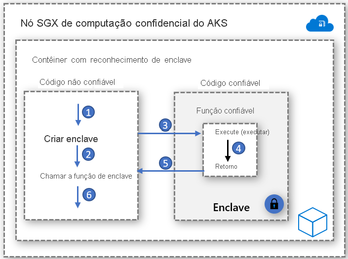

# Contêineres com reconhecimento de enclave

Um enclave é uma região de memória protegida que fornece confidencialidade para a execução de dados e de código. Trata-se de uma instância de um TEE (ambiente de execução confiável) que é protegida por hardware. Os nós de computação confidencial no AKS usam [Extensões do SGX (Intel Software Guard)](https://software.intel.com/sgx) para criar ambientes de enclave isolados nos nós entre cada aplicativo de contêiner.

Assim como as máquinas virtuais do Intel SGX, os aplicativos de contêiner desenvolvidos para execução no enclaves têm dois componentes:

- um componente não confiável (chamado de host) e
- um componente confiável (chamado de enclave).

A arquitetura de aplicativos de contêineres com reconhecimento de enclave oferece a você o máximo controle na implementação, mantendo o volume de código no enclave baixo. Minimizar o código que é executado no enclave ajuda a reduzir as áreas da superfície de ataque.   

## Habilitadores

### Open Enclave SDK
O SDK do Open Enclave é uma biblioteca de software livre independente de hardware para desenvolver aplicativos C, C++ que utilizam ambientes de execução confiável baseados em hardware. A implementação atual fornece suporte para o Intel SGX, bem como suporte de versão prévia para o [SO OP-TEE na TrustZone do Arm](https://optee.readthedocs.io/en/latest/general/about.html).

Veja uma introdução ao aplicativo de contêiner com base em Open Enclave [aqui](https://github.com/openenclave/openenclave/tree/master/docs/GettingStartedDocs)

### SDK do Intel SGX
A Intel mantém o Software Development Kit para criar aplicativos SGX para cargas de trabalho de contêiner do Linux e do Windows. No momento, não há suporte para os contêineres do Windows atualmente nos nós de computação confidencial do AKS.

Veja uma introdução a aplicativos baseados em Intel SGX [aqui](https://software.intel.com/content/www/us/en/develop/topics/software-guard-extensions/sdk.html)

### CCF (Confidential Consortium Framework)
A CCF (Confidential Consortium Framework) é uma estrutura de software livre para criar uma categoria de aplicativos seguros, altamente disponíveis e com alto desempenho que se concentram em dados e computação de vários participantes. A CCF pode habilitar redes confidenciais de grande escala que atendem aos principais requisitos corporativos, oferecendo um meio de acelerar a produção e a adoção corporativa de tecnologia de computação de várias partes e blockchain baseada no consórcio.

Veja uma introdução à computação confidencial do Azure e CCF [aqui](https://github.com/Microsoft/CCF)

### Runtime do ONNX de inferência confidencial

O runtime do ONNX baseado em enclave de software livre estabelece um canal seguro entre o cliente e o serviço de inferência, garantindo que nem a solicitação nem a resposta possam sair do enclave seguro. 

Essa solução permite que você traga o modelo treinado de ML existente e o execute de modo confidencial enquanto fornece confiança entre o cliente e o servidor por meio de atestado e verificações. 

Veja uma introdução ao lift-and-shift do modelo de ML para o runtime do ONNX [aqui](https://aka.ms/confidentialinference)

## Implementações de amostras de contêiner

[Exemplos do Azure para contêineres com reconhecimento de enclave no AKS](https://github.com/Azure-Samples/enclave-aware-container-samples)

<!-- LINKS - external -->
[Azure Attestation]: https://docs.microsoft.com/en-us/azure/attestation/

<!-- LINKS - internal -->
[DC Virtual Machine]: /confidential-computing/virtual-machine-solutions
[Confidential Containers]: /confidential-computing/containercompute/confidential-containers