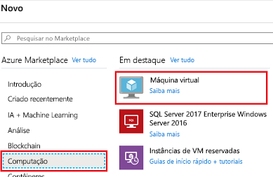
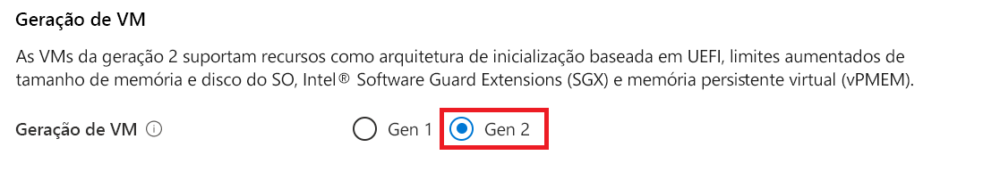
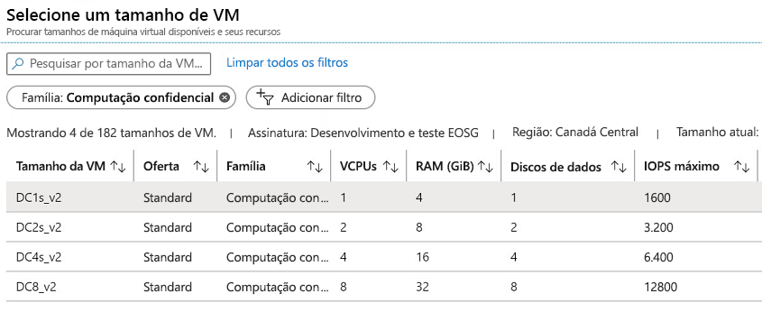
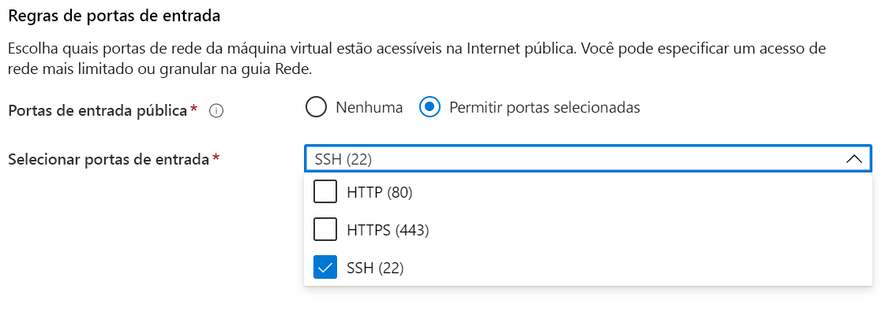

# <a name="quickstart-deploy-an-azure-confidential-computing-vm-in-the-azure-portal"></a>Início Rápido: Implantar uma VM de computação confidencial do Azure no portal do Azure

Comece a usar a computação confidencial do Azure usando o portal do Azure para criar uma VM (máquina virtual) apoiada pelo SGX da Intel. Em seguida, você instalará o Open Enclave SDK (Software Development Kit) para configurar seu ambiente de desenvolvimento. 

Este tutorial é recomendado para você caso esteja interessado em implantar uma máquina virtual de computação confidencial com configuração personalizada. Caso contrário, recomendamos seguir as [etapas de implantação de máquina virtual de computação confidencial para o marketplace comercial da Microsoft](quick-create-marketplace.md).


## <a name="prerequisites"></a>Pré-requisitos

Caso não tenha uma assinatura do Azure, [crie uma conta](https://azure.microsoft.com/pricing/purchase-options/pay-as-you-go/) antes de começar.

> [!NOTE]
> As contas de avaliação gratuita não têm acesso às máquinas virtuais usadas neste tutorial. Atualize para uma assinatura de Pagamento Conforme o Uso.


## <a name="sign-in-to-azure"></a>Entrar no Azure

1. Entre no [portal do Azure](https://portal.azure.com/).

1. Na parte superior, selecione **Criar um recurso**.

1. No painel **Marketplace**, selecione **Computação** à esquerda.

1. Encontre e selecione **Máquina virtual**.

    

1. Na página Máquina virtual, selecione **Criar**.


## <a name="configure-a-confidential-computing-virtual-machine"></a>Configurar uma máquina virtual de computação confidencial

1. Na guia **Informações Básicas**, selecione a **Assinatura** e o **Grupo de Recursos**.

1. Em **Nome da máquina virtual**, insira um nome para a nova VM.

1. Digite ou selecione os valores a seguir:

   * **Região**: Selecione a região do Azure ideal para você.

        > [!NOTE]
        > Máquinas virtuais de computação confidencial só são executadas em hardware especializado disponível em regiões específicas. Para obter as regiões mais recentes disponíveis para VMs da série DCsv2, confira as [regiões disponíveis](https://azure.microsoft.com/global-infrastructure/services/?products=virtual-machines).

1. Configure a imagem do sistema operacional que você deseja usar para sua máquina virtual.

    * **Escolha a imagem**: Para este tutorial, selecione Ubuntu 18.04 LTS. Você também pode selecionar Windows Server 2019, Windows Server 2016 ou Ubuntu 16.04 LTS. Se você optar por fazer isso, será redirecionado neste tutorial adequadamente.
    
    * **Mude a imagem para a Gen 2**: As máquinas virtuais de computação confidencial só são executadas em imagens da [Gen 2](../virtual-machines/generation-2.md). Verifique se a imagem selecionada é uma imagem de Gen 2. Clique na guia **Avançado** acima do local em que você está configurando a máquina virtual. Role para baixo até encontrar a seção chamada "Geração de VM". Selecione Gen 2 e, em seguida, volte para a guia **Noções básicas**.
    

        


        

    * **Retornar para a configuração básica**: Volte para a guia **Noções básicas** usando a navegação na parte superior.

1. Escolha uma máquina virtual com funcionalidades de computação confidencial no seletor de tamanho escolhendo **alterar tamanho**. No seletor de tamanho da máquina virtual, clique em **Limpar todos os filtros**. Escolha **Adicionar filtro**, selecione **Família** para o tipo de filtro e, em seguida, selecione somente **Computação confidencial**.

    

    > [!TIP]
    > Você deverá ver os tamanhos **DC1s_v2**, **DC2s_v2**, **DC4s_V2** e **DC8_v2**. Esses são os únicos tamanhos de máquina virtual que atualmente dão suporte à computação confidencial. [Saiba mais](virtual-machine-solutions.md).

1. Preencha as seguintes informações:

   * **Tipo de autenticação**: Selecione **Chave pública SSH** se você estiver criando uma VM do Linux. 

        > [!NOTE]
        > Você tem a opção de usar uma chave pública SSH ou uma senha para autenticação. SSH é mais seguro. Para obter instruções sobre como gerar uma chave SSH, confira [Criar chaves SSH em Linux e Mac para VMs Linux no Azure](../virtual-machines/linux/mac-create-ssh-keys.md).

    * **Nome de usuário**: Insira o nome do Administrador da VM.

    * **Chave pública SSH**: Se aplicável, insira a chave pública RSA.
    
    * **Senha**: Se aplicável, insira sua senha para autenticação.

    * **Porta de entrada públicas**: Escolha **Permitir portas selecionadas** e selecione **SSH (22)** e **HTTP (80)** na lista **Selecionar portas de entrada públicas**. Se você estiver implantando uma VM do Windows, selecione **HTTP (80)** e **RDP (3389)** . Neste início rápido, esta etapa é necessária para se conectar à VM e concluir a configuração do Open Enclave SDK. 

     


1. Faça alterações na guia **Discos**.

   * Se você escolher uma máquina virtual **DC1s_v2**, **DC2s_v2** ou **DC4s_V2**, escolha um tipo de disco **SSD Standard** ou **SSD Premium**. 
   * Se você escolher uma máquina virtual **DC8_v2**, escolha **SSD Standard** como o tipo de disco.

1. Faça as alterações desejadas nas configurações nas guias a seguir ou mantenha as configurações padrão.

    * **Rede**
    * **Gerenciamento**
    * **Configuração de convidado**
    * **Marcas**

1. Selecione **Examinar + criar**.

1. No painel **Examinar + criar**, selecione **Criar**.

> [!NOTE]
> Vá para a próxima seção e continue com este tutorial se você tiver implantado uma VM do Linux. Se você implantou uma VM do Windows, [siga estas etapas para se conectar à sua VM do Windows](../virtual-machines/windows/connect-logon.md) e, em seguida, [instale o SDK do OE no Windows](https://github.com/openenclave/openenclave/blob/master/docs/GettingStartedDocs/install_oe_sdk-Windows.md).


## <a name="connect-to-the-linux-vm"></a>Conectar-se à VM do Linux

Se você já usa um shell BASH, conecte-se à VM do Azure usando o comando **ssh**. No comando a seguir, substitua o nome de usuário da VM e o endereço IP para se conectar à VM Linux.

```bash
ssh azureadmin@40.55.55.555
```

Você pode localizar o endereço IP público da VM no portal do Azure, na seção Visão geral da máquina virtual.

:::image type="content" source="media/quick-create-portal/public-ip-virtual-machine.png" alt-text="Endereço IP no portal do Azure":::

Se estiver executando no Windows e não tiver um shell Bash, você poderá instalar um cliente SSH, como o PuTTY.

1. [Baixe e instale o PuTTY](https://www.chiark.greenend.org.uk/~sgtatham/putty/download.html).

1. Execute o PuTTY.

1. Na tela de configuração do PuTTY, insira o endereço IP público da VM.

1. Selecione **Abrir** e insira seu nome de usuário e a senha nos prompts.

Para saber mais sobre como se conectar às VMs Linux, confira [Criar uma VM Linux no Azure usando o Portal](../virtual-machines/linux/quick-create-portal.md).

> [!NOTE]
> Se for exibido um alerta de segurança do PuTTY indicando que a chave do host do servidor não está sendo armazenada em cache no Registro, escolha uma das opções a seguir. Se você confia nesse host, selecione **Sim** para adicionar a chave ao cache do PuTTY e continuar a conexão. Caso deseje continuar a conexão apenas uma vez, sem adicionar a chave ao cache, selecione **Não**. Se você não confia nesse host, selecione **Cancelar** para abandonar a conexão.

## <a name="install-the-open-enclave-sdk-oe-sdk"></a>Instalar o OE SDK (Open Enclave SDK) <a id="Install"></a>

Siga as instruções passo a passo para instalar o [OE SDK](https://github.com/openenclave/openenclave) em na máquina virtual da série DCsv2 que executa uma imagem do Ubuntu 18.04 LTS Gen 2. 

Se a máquina virtual for executada no Ubuntu 16.04 LTS Gen 2, você precisará seguir as [instruções de instalação para o Ubuntu 16.04](https://github.com/openenclave/openenclave/blob/master/docs/GettingStartedDocs/install_oe_sdk-Ubuntu_16.04.md).

#### <a name="1-configure-the-intel-and-microsoft-apt-repositories"></a>1. Configurar os repositórios APT da Intel e da Microsoft

```bash
echo 'deb [arch=amd64] https://download.01.org/intel-sgx/sgx_repo/ubuntu bionic main' | sudo tee /etc/apt/sources.list.d/intel-sgx.list
wget -qO - https://download.01.org/intel-sgx/sgx_repo/ubuntu/intel-sgx-deb.key | sudo apt-key add -

echo "deb http://apt.llvm.org/bionic/ llvm-toolchain-bionic-7 main" | sudo tee /etc/apt/sources.list.d/llvm-toolchain-bionic-7.list
wget -qO - https://apt.llvm.org/llvm-snapshot.gpg.key | sudo apt-key add -

echo "deb [arch=amd64] https://packages.microsoft.com/ubuntu/18.04/prod bionic main" | sudo tee /etc/apt/sources.list.d/msprod.list
wget -qO - https://packages.microsoft.com/keys/microsoft.asc | sudo apt-key add -
```

#### <a name="2-install-the-intel-sgx-dcap-driver"></a>2. Instalar o driver DCAP do SGX da Intel

```bash
sudo apt update
sudo apt -y install dkms
wget https://download.01.org/intel-sgx/sgx-dcap/1.9/linux/distro/ubuntu18.04-server/sgx_linux_x64_driver_1.36.2.bin -O sgx_linux_x64_driver.bin
chmod +x sgx_linux_x64_driver.bin
sudo ./sgx_linux_x64_driver.bin
```

> [!WARNING]
> Use o driver DCAP do SGX da Intel mais recente do [site do SGX da Intel](https://01.org/intel-software-guard-extensions/downloads).

#### <a name="3-install-the-intel-and-open-enclave-packages-and-dependencies"></a>3. Instalar os pacotes e as dependências da Intel e do Open Enclave

```bash
sudo apt -y install clang-7 libssl-dev gdb libsgx-enclave-common libsgx-enclave-common-dev libprotobuf10 libsgx-dcap-ql libsgx-dcap-ql-dev az-dcap-client open-enclave
```

> [!NOTE] 
> Essa etapa também instala o pacote [az-dcap-client](https://github.com/microsoft/azure-dcap-client), que é necessário para executar o atestado remoto no Azure.

#### <a name="4-verify-the-open-enclave-sdk-install"></a>4. **Verificar a instalação do Open Enclave SDK**

Confira [Como usar o Open Enclave SDK](https://github.com/openenclave/openenclave/blob/master/docs/GettingStartedDocs/Linux_using_oe_sdk.md) no GitHub para verificar e usar o SDK instalado.

## <a name="clean-up-resources"></a>Limpar os recursos

Quando o grupo de recursos, a máquina virtual e todos os recursos relacionados não forem mais necessários, exclua-os. 

Selecione o grupo de recursos da máquina virtual e, em seguida, selecione **Excluir**. Confirme o nome do grupo de recursos terminar de excluir os recursos.

## <a name="next-steps"></a>Próximas etapas

Neste guia de início rápido, você implantou uma máquina virtual de computação confidencial e instalou o Open Enclave SDK. Para obter mais informações sobre máquinas virtuais de computação confidencial no Azure, confira [Soluções sobre máquinas virtuais](virtual-machine-solutions.md). 

Descubra como você pode criar aplicativos de computação confidenciais prosseguindo para os exemplos do Open Enclave SDK no GitHub. 

> [!div class="nextstepaction"]
> [Como criar amostras do Open Enclave SDK](https://github.com/openenclave/openenclave/blob/master/samples/README.md)