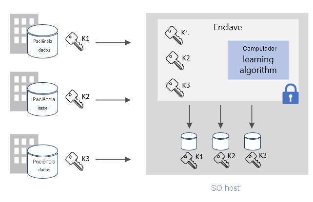
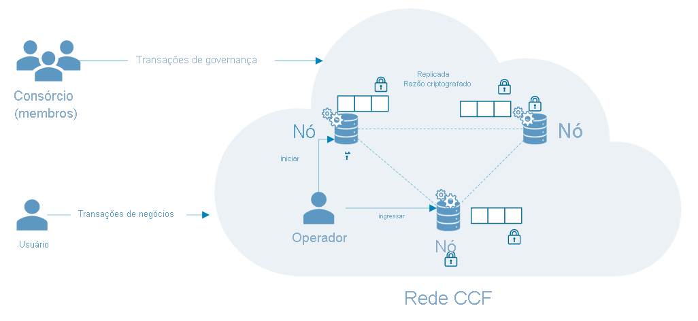

# Cenários comuns de computação confidencial do Azure

Este artigo apresenta uma visão geral de vários cenários comuns para a computação confidencial do Azure. As recomendações neste artigo servem como um ponto de partida à medida que você desenvolve seu aplicativo usando serviços e estruturas de computação confidencial. 

Após ler este artigo, você poderá responder as perguntas a seguir:

- Quais são alguns cenários para a computação confidencial do Azure?-
- Quais são os benefícios de usar a computação confidencial do Azure para cenários de várias entidades?
- Quais são os benefícios de usar a computação confidencial do Azure em uma rede blockchain?

## Computação segura de várias entidades
A computação confidencial do Azure permite processar dados de várias fontes sem expor os dados de entrada a outras entidades. Esse tipo de computação segura permite muitos cenários como: antilavagem de dinheiro, detecção de fraudes e análise segura de dados de saúde.

Várias fontes podem carregar dados para um enclave em uma máquina virtual. Uma entidades diz ao enclave para fazer a computação ou o processamento dos dados. Nenhuma das entidades (nem mesmo a que está executando a análise) pode realmente de fato os dados de terceiros carregados no enclave. 

Em computação segura de várias entidades, os dados criptografados entram no enclave, o enclave descriptografa os dados usando uma chave, executa a análise, obtém um resultado e envia de volta um resultado criptografado que uma entidade pode descriptografar com a chave designada. 

**Proteger dados em uso**: 
- use uma VM (máquina virtual) da DCsv2-Series no Azure com suporte para Intel SGX habilitado. Essas VMs são habilitadas com TEEs (ambientes de execução confiáveis) que protegem e isolam partes de seus dados e códigos de aplicativos.
- Use um SDK com reconhecimento de enclave para criar um enclave dentro da máquina virtual. Dentro do enclave, os dados não serão expostos a ninguém, nem mesmo ao provedor da VM. Os dados no enclave serão criptografados pelo suporte de hardware.
    - Por exemplo, você pode usar o [SDK do OE](https://github.com/openenclave/openenclave) para o processamento do lado do servidor. 

**Proteger dados em trânsito** 
- Use o TLS atestado como um canal protegido para garantir a segurança dos dados em trânsito
- O cliente garante que os dados sejam enviados somente para o mesmo servidor, que é protegido pelo enclave. 

**Proteger dados em repouso**
- Use armazenamentos de dados protegidos e seguros para garantir a segurança dos dados em repouso 

### Antilavagem de dinheiro
Neste exemplo seguro de computação de várias entidades, vários bancos compartilham dados entre si sem expor os dados pessoais dos clientes. Os bancos executam análises acordadas no conjunto de dados confidenciais combinado. A análise no conjunto de dados agregados pode detectar a movimentação de dinheiro por um usuário entre vários bancos sem que os bancos acessem os dados uns dos outros.

Por meio da computação confidencial, essas instituições financeiras podem aumentar as taxas de detecção de fraudes, resolver cenários de lavagem de dinheiro, reduzir falsos positivos e continuar aprendendo com conjuntos de dados maiores. 

### Desenvolvimento de fármacos no setor de saúde
Os recursos de integridade parceiros contribuem com conjuntos de dados de integridade privada para treinar um modelo de ML. Cada instalação só pode ver o próprio conjunto de dados. Nenhuma outra instalação, nem mesmo o provedor de nuvem, pode ver os dados ou o modelo de treinamento. 

Todas as instalações se beneficiam do uso do modelo treinado. Ao criar o modelo com mais dados, o modelo ficou mais preciso. Cada recurso que contribuiu para treinar o modelo pode usá-lo e receber resultados úteis. 

## Blockchain

Uma rede de blockchain é uma rede descentralizada de nós. Esses nós são executados e mantidos por operadores ou validadores que desejam garantir a integridade e chegar a um consenso quanto ao estado da rede. Os nós em si são réplicas de livros razão e são usados para acompanhar transações de blockchain. Cada nó tem uma cópia completa do histórico de transações, garantindo a integridade e a disponibilidade em uma rede distribuída.

As tecnologias de blockchain criadas com base na computação confidencial podem usar a privacidade baseada em hardware para permitir a confidencialidade dos dados e a computação segura. Em alguns casos, todo o livro razão é criptografado para proteger o acesso a dados. Às vezes, a própria transação pode ocorrer em um módulo de computação dentro do enclave no nó.

### CCF (Confidential Consortium Framework)
A [CCF](https://www.microsoft.com/research/project/confidential-consortium-framework/) é um exemplo de uma estrutura de blockchain distribuída criada com base na computação confidencial do Azure. Liderada pela Microsoft Research, essa estrutura aproveita o poder dos TEEs (ambientes de execução confiáveis) para criar uma rede de enclaves remota para atestado. Os nós podem ser executados sobre as máquinas virtuais do Azure ([DCsv2-Series](confidential-computing-enclaves.md)) e aproveitar a infraestrutura do enclave. Por meio de protocolos de atestado, os usuários do blockchain podem verificar a integridade de um nó da CCF e efetivamente verificar toda a rede. 

Na CCF, o livro razão descentralizado é composto por alterações registradas em um repositório de chave-valor que é replicado em todos os nós de rede. Cada um desses nós executa um mecanismo de transação que pode ser disparado por usuários do blockchain sobre TLS. Ao disparar um ponto de extremidade, você modifica o repositório de chave-valor. Antes que a alteração criptografada seja registrada no livro razão descentralizado, ela deve ser acordada por um determinado número de nós para alcançar o consenso. 

## Próximas etapas
[Implante](quick-create-marketplace.md) uma máquina virtual DCsv2-Series.

