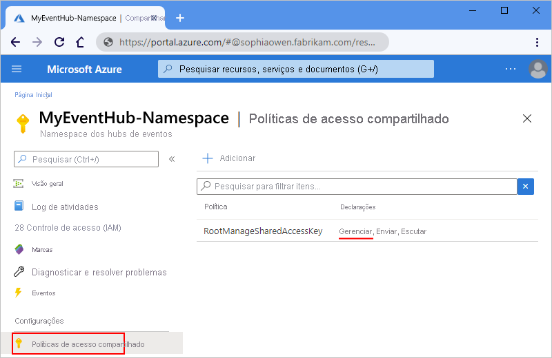
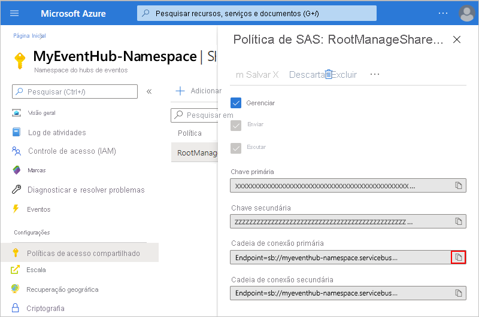
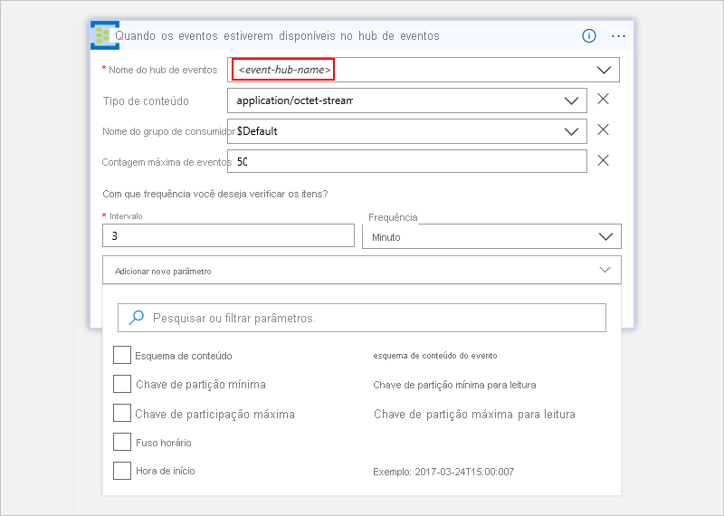
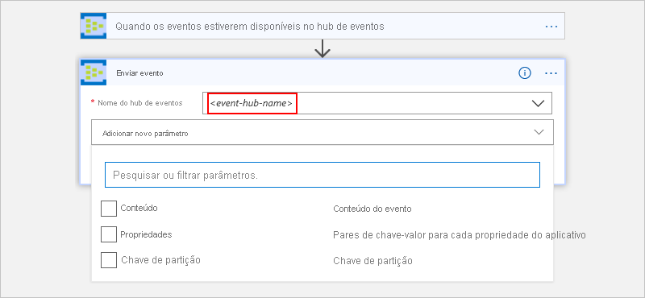
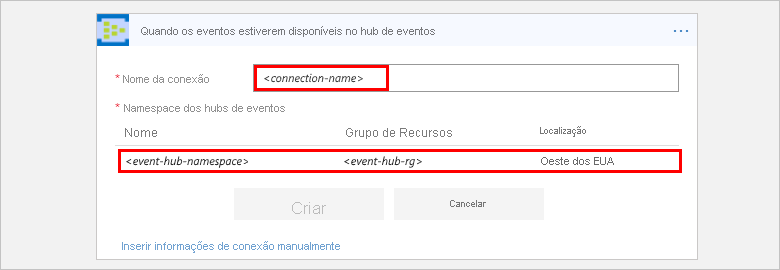
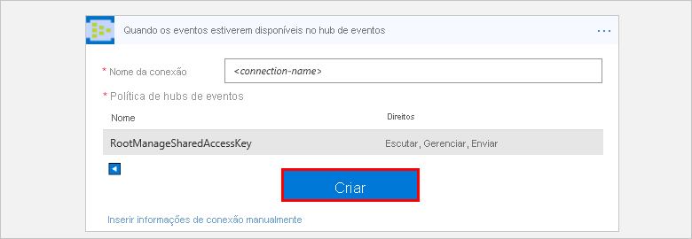

# Monitorar, receber e enviar eventos com Hubs de Eventos do Azure e Aplicativos Lógicos do Azure

Este artigo mostra como é possível monitorar e gerenciar eventos enviados para os [Hubs de Eventos do Azure](../event-hubs/event-hubs-what-is-event-hubs.md) a partir de um aplicativo lógico com o conector de Hubs de Eventos do Azure. Dessa forma, é possível aplicativos lógicos que automatizam tarefas e fluxos de trabalho para verificar, enviar e receber eventos do Hub de Eventos. Para obter informações técnicas específicas do conector, consulte a</a> [referência do conector Azure Event Hubs](https://docs.microsoft.com/connectors/eventhubs/).

## Pré-requisitos

* Uma assinatura do Azure. Se você não tiver uma assinatura do Azure, [inscreva-se em uma conta gratuita do Azure](https://azure.microsoft.com/free/). 

* Um [namespace dos Hubs de Eventos e Hub de Eventos do Azure](../event-hubs/event-hubs-create.md)

* O aplicativo lógico no qual você deseja acessar o Hub de Eventos. Para iniciar o aplicativo lógico com um gatilho dos Hubs de Eventos do Azure, será necessário um [aplicativo lógico em branco](../logic-apps/quickstart-create-first-logic-app-workflow.md).
Se você não estiver familiarizado com os Aplicativos Lógicos, examine [O que são Aplicativos Lógicos do Azure](../logic-apps/logic-apps-overview.md) e [Início rápido: crie seu primeiro aplicativo lógico](../logic-apps/quickstart-create-first-logic-app-workflow.md).

## Verifique as permissões e obtenha a cadeia de conexão

Para garantir que seu aplicativo lógico possa acessar seu Event Hub, verifique suas permissões e obtenha a seqüência de conexões para o seu namespace do Event Hubs.

1. Faça login no [portal Azure](https://portal.azure.com).

1. Acesse o *namespace* de seus Hubs de Eventos, não um Hub de Eventos específico. 

1. No menu namespace, em **Configurações,** selecione **Políticas de acesso compartilhado**. Em **Reclamações,** verifique se você tem permissões **de gerenciamento** para esse namespace.

   

1. Se quiser manualmente inserir suas informações de conexão mais tarde, obtenha a cadeia de caracteres de conexão para o namespace dos Hubs de Eventos.

   1. Em **Política**, escolha **RootManageSharedAccessKey**.

   1. Localize a cadeia de conexão da chave primária. Escolha o botão de cópia e salve a cadeia de conexão para uso posterior.

      

      > [!TIP]
      > Para confirmar se a cadeia de conexão está associada ao namespace de Hubs de Eventos ou a um hub de eventos específico, certifique-se de que a cadeia de conexão não tenha o parâmetro `EntityPath` . Se você encontrar esse parâmetro, a cadeia de conexão servirá para uma "entidade" de Hub de Eventos específica e não será a cadeia de caracteres correta a ser usada com seu aplicativo lógico.

1. Agora continue com o [Adicionar um gatilho de Hubs de Eventos](#add-trigger) ou [Adicionar uma ação de Hubs de Eventos](#add-action).

## Adicionar gatilho de hubs de eventos

Nos Aplicativos Lógicos do Azure, cada aplicativo lógico deve começar com um [gatilho](../logic-apps/logic-apps-overview.md#logic-app-concepts), que é disparado quando um evento específico ocorre ou quando uma condição específica é atendida. Cada vez que o gatilho é acionado, o mecanismo de Aplicativos Lógicos cria uma instância de aplicativo lógico e inicia a execução do fluxo de trabalho do aplicativo.

Este exemplo mostra como é possível iniciar um fluxo de trabalho de aplicativo lógico quando novos eventos são enviados para o Hub de Eventos. 

1. No portal do Azure ou no Visual Studio, crie um aplicativo lógico em branco, que abre o Designer de Aplicativos Lógicos. Este exemplo usa o portal do Azure.

1. Na caixa de pesquisa, insira "hubs de eventos" como filtro. Na lista de gatilhos, selecione este gatilho: **Quando os eventos estiverem disponíveis no Event Hub - Event Hubs**

   

1. Se for solicitado-lhe a fornecer detalhes da conexão, [crie sua conexão de Hubs de Eventos agora](#create-connection). 

1. No gatilho, forneça informações sobre o Event Hub que você deseja monitorar. Para obter mais propriedades, abra a lista **Adicionar novos parâmetros.** Selecionar um parâmetro adiciona essa propriedade ao cartão de gatilho.

   

   | Propriedade | Obrigatório | Descrição |
   |----------|----------|-------------|
   | **Nome do Hub de Eventos** | Sim | O nome do Event Hub que você deseja monitorar |
   | **Tipo de conteúdo** | Não | O tipo de conteúdo do evento. O padrão é `application/octet-stream`. |
   | **Nome do grupo de consumidor** | Não | O [nome para o grupo de consumidores Event Hub](../event-hubs/event-hubs-features.md#consumer-groups) para usar para leitura de eventos. Se não especificado, será usado o grupo de consumidores padrão. |
   | **Contagem de eventos máxima** | Não | O número máximo de eventos. O gatilho retorna entre um e o número de eventos especificado por essa propriedade. |
   | **Intervalo** | Sim | Um inteiro positivo que descreve com que frequência o fluxo de trabalho é executado com base na frequência |
   | **Freqüência** | Sim | A unidade de tempo para a recorrência |
   ||||

   **Propriedades adicionais**

   | Propriedade | Obrigatório | Descrição |
   |----------|----------|-------------|
   | **Esquema de conteúdo** | Não | O esquema de conteúdo JSON para os eventos a serem lidos no Event Hub. Por exemplo, se você especificar o esquema de conteúdo, você pode acionar o aplicativo lógico apenas para aqueles eventos que correspondem ao esquema. |
   | **Chave de participação mínima** | Não | Insira a ID de [partição](../event-hubs/event-hubs-features.md#partitions) mínima para leitura. Por padrão, todas as partições são lidas. |
   | **Chave de participação máxima** | Não | Insira a ID de [participação](../event-hubs/event-hubs-features.md#partitions) para leitura. Por padrão, todas as partições são lidas. |
   | **Fuso horário** | Não | Aplica-se somente quando você especifica uma hora de início, porque o gatilho não aceita diferença UTC. Selecione o fuso horário que você deseja aplicar. 
Para obter mais informações, consulte [Criar e executar tarefas e fluxos de trabalho recorrentes com aplicativos de lógica do Azure](../connectors/connectors-native-recurrence.md). |
   | **Horário de início** | Não | Forneça uma hora de início neste formato: 
AAAA-MM-DDThh:mm:ss se você selecionar um fuso horário
-ou-
AAAA-MM-DDThh:mm:ssZ se você não selecionar um fuso horário
Para obter mais informações, consulte [Criar e executar tarefas e fluxos de trabalho recorrentes com aplicativos de lógica do Azure](../connectors/connectors-native-recurrence.md). |
   ||||

1. Quando terminar, selecione **Salvar** na barra de ferramentas do designer.

1. Agora, continue a adicionar uma ou mais ações ao aplicativo lógico para as tarefas que você deseja executar com os resultados do gatilho. 

   Por exemplo, para filtrar eventos com base em um valor específico, como uma categoria, você pode adicionar uma condição para que a ação **Enviar evento** envie apenas os eventos que atendem à sua condição. 

> [!NOTE]
> Todos os gatilhos de Hub de Eventos são gatilhos de *sondagem longa*, o que significa que quando um gatilho dispara, o gatilho processa todas os eventos e aguarda 30 segundos para que mais eventos apareçam no Hub de Eventos.
> Se nenhum evento for recebido em 30 segundos, a execução do gatilho será ignorada. Caso contrário, o gatilho continuará lendo os eventos até que o Hub de Eventos esteja vazio.
> A próxima pesquisa de gatilhos acontecerá com base no intervalo de recorrência que você especificar nas propriedades do gatilho.

## Adicionar ação do Event Hubs

Em Aplicativos Lógicos do Azure, uma [ação](../logic-apps/logic-apps-overview.md#logic-app-concepts) é uma etapa do fluxo de trabalho que segue um gatilho ou outra ação. Para este exemplo, o aplicativo lógico começa com um gatilho de Hubs de Eventos que verifica novos eventos no Hub de Eventos.

1. No portal do Azure ou no Visual Studio, abra o aplicativo lógico no Designer de Aplicativos Lógicos. Este exemplo usa o portal do Azure.

1. o gatilho ou ação, escolha **Novo passo**.

   Para adicionar uma ação entre etapas existentes, mova o mouse sobre a seta de conexão. 
   Escolha o sinal**+** de adição () que aparece e, em seguida, **selecione Adicionar uma ação**.

1. Na caixa de pesquisa, insira "hubs de eventos" como filtro.
Na lista de ações, selecione esta ação: **Enviar evento - Hubs de Eventos**

   

1. Se for solicitado-lhe a fornecer detalhes da conexão, [crie sua conexão de Hubs de Eventos agora](#create-connection). 

1. Na ação, forneça informações sobre os eventos que deseja enviar. Para obter mais propriedades, abra a lista **Adicionar novos parâmetros.** Selecionar um parâmetro adiciona essa propriedade ao cartão de ação.

   

   | Propriedade | Obrigatório | Descrição |
   |----------|----------|-------------|
   | **Nome do Hub de Eventos** | Sim | O Event Hub para onde você deseja enviar o evento |
   | **Conteúdo** | Não | O conteúdo do evento que você quer enviar |
   | **Propriedades** | Não | As propriedades e os valores do aplicativo a serem enviados |
   | **Chave de partição** | Não | O ID [de partição](../event-hubs/event-hubs-features.md#partitions) para onde enviar o evento |
   ||||

   Por exemplo, você pode enviar a saída do gatilho do Event Hubs para outro Hub de eventos:

   

1. Quando terminar, selecione **Salvar** na barra de ferramentas do designer.

## Conectar ao Hub de Eventos

[!INCLUDE [Create connection general intro](../../includes/connectors-create-connection-general-intro.md)] 

1. Quando for solicitado a fornecer informações de conexão, forneça estes detalhes:

   | Propriedade | Obrigatório | Valor | Descrição |
   |----------|----------|-------|-------------|
   | **Nome da conexão** | Sim | <*nome de conexão*> | O nome a criar para a conexão |
   | **Namespace do Hubs de Eventos** | Sim | <*event-hubs-namespace*> | Selecione o namespace do Hubs de Eventos que você quer usar. |
   |||||  

   Por exemplo: 

   

   Para inserir manualmente a seqüência de conexões, selecione **Inserir manualmente as informações de conexão**. 
   Saiba [como localizar a cadeia de conexão](#permissions-connection-string).

2. Selecione a política de Hubs de Eventos a ser usada, se ainda não estiver selecionada. Escolha **Criar**.

   

3. Depois de criar a conexão, continue com o [gatilho Adicionar Hubs de Eventos](#add-trigger) ou [ação Adicionar Hubs de Eventos](#add-action).

## Referência de conector

Para obter detalhes técnicos, como gatilhos, ações e limites, conforme descrito pelo arquivo de Swagger do conector, confira a [página de referência do conector](https://docs.microsoft.com/connectors/eventhubs/).

> [!NOTE]
> Para aplicativos lógicos em um [ambiente de serviço de integração (ISE),](../logic-apps/connect-virtual-network-vnet-isolated-environment-overview.md)a versão rotulada pelo conector ISE usa os limites de [mensagem ISE.](../logic-apps/logic-apps-limits-and-config.md#message-size-limits)

## Próximas etapas

* Saiba mais sobre outros [conectores de Aplicativos Lógicos](../connectors/apis-list.md)