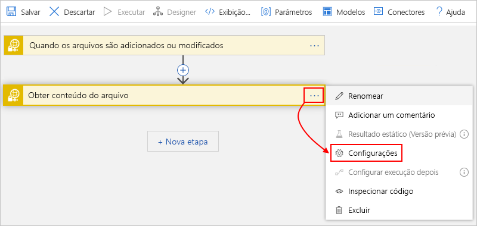

# Crie e gerencie arquivos SFTP usando SSH e os Aplicativos Lógicos do Azure

Para automatizar tarefas que criam e gerenciam arquivos em um servidor [SFTP (Secure File Transfer Protocol)](https://www.ssh.com/ssh/sftp/) usando o protocolo [SSH (Secure Shell)](https://www.ssh.com/ssh/protocol/), você pode criar fluxos de trabalho de integração automatizados usando os Aplicativos Lógicos do Azure e o conector SFTP-SSH. O SFTP é um protocolo de rede que fornece acesso a arquivos, transferência de arquivos e gerenciamento de arquivos em qualquer fluxo de dados confiável.

Aqui estão algumas tarefas de exemplo que você pode automatizar:

* Monitorar quando arquivos são adicionados ou alterados.
* Obter, criar, copiar, renomear, atualizar, listar e excluir arquivos.
* Crie pastas.
* Obter conteúdo e metadados do arquivo.
* Extrair o arquivo para pastas.

No fluxo de trabalho, você pode usar um gatilho que monitora eventos em seu servidor SFTP e disponibiliza a saída para outras ações. Você pode usar ações para executar várias tarefas em seu servidor SFTP. Você também pode incluir outras ações que usam a saída das ações de SFTP-SSH. Por exemplo, se você recuperar regularmente arquivos do servidor SFTP, poderá enviar alertas por email sobre esses arquivos e seu conteúdo usando o conector do Office 365 Outlook ou o conector Outlook.com. Se ainda não estiver familiarizado com os aplicativos lógicos, veja [O que é o Aplicativo Lógico do Azure?](../logic-apps/logic-apps-overview.md)

Para ver as diferenças entre o conector SFTP-SSH e o conector SFTP, examine a seção [Comparar SFTP-SSH vs SFTP](#comparison) mais adiante neste tópico.

## Limites

* O conector SFTP-SSH atualmente não dá suporte a estes servidores SFTP:

  * IBM DataPower
  * MessageWay
  * OpenText Secure MFT
  * OpenText GXS

* As ações do SFTP-SSH que dão suporte à [divisão em partes](../logic-apps/logic-apps-handle-large-messages.md) podem lidar com arquivos de até 1 GB, enquanto as ações de SFTP-SSH que não dão suporte à divisão em partes podem lidar com arquivos de até 50 MB. O tamanho da parte padrão é 15 MB. No entanto, esse tamanho pode mudar dinamicamente, começando de 5 MB e gradualmente aumentando para o máximo de 50 MB. O dimensionamento dinâmico se baseia em fatores como latência de rede, tempo de resposta do servidor e assim por diante.

  > [!NOTE]
  > Para aplicativos lógicos em um [ISE (Ambiente de Serviço de Integração)](../logic-apps/connect-virtual-network-vnet-isolated-environment-overview.md), a versão rotulada do ISE desse conector requer que a divisão em partes use os [limites de mensagem ISE](../logic-apps/logic-apps-limits-and-config.md#message-size-limits).

  Você pode substituir esse comportamento adaptável ao [especificar um tamanho de parte constante](#change-chunk-size) para usar em vez disso. Esse tamanho pode variar de 5 MB a 50 MB. Por exemplo, suponha que você tenha um arquivo de 45 MB e uma rede que possa dar suporte a esse tamanho de arquivo sem latência. A divisão em partes adaptável resulta em várias chamadas, em vez de uma chamada. Para reduzir o número de chamadas, você pode tentar configurar um tamanho de parte de 50 MB. Em um cenário diferente, se o aplicativo lógico estiver atingindo o tempo limite, por exemplo, ao usar partes de 15 MB, você poderá tentar reduzir o tamanho para 5 MB.

  O tamanho da parte está associado a uma conexão. Esse atributo significa que você pode usar a mesma conexão para as duas ações que dão suporte à divisão em partes e ações que não dão suporte à divisão em partes. Nesse caso, o tamanho da parte para ações que não dão suporte a intervalos de divisão em partes de 5 MB a 50 MB. Esta tabela mostra quais ações de SFTP-SSH dão suporte à divisão em partes:

  | Ação | Suporte à divisão em partes | Substituir o suporte ao tamanho da parte |
  |--------|------------------|-----------------------------|
  | **Copiar arquivo** | Não | Não aplicável |
  | **Criar arquivo** | Sim | Sim |
  | **Criar pasta** | Não aplicável | Não aplicável |
  | **Excluir arquivo** | Não aplicável | Não aplicável |
  | **Extrair o arquivo morto para a pasta** | Não aplicável | Não aplicável |
  | **Obter conteúdo do arquivo** | Sim | Sim |
  | **Obter o conteúdo do arquivo usando o caminho** | Sim | Sim |
  | **Obter metadados do arquivo** | Não aplicável | Não aplicável |
  | **Obter Metadados do Arquivo usando o caminho** | Não aplicável | Não aplicável |
  | **Listar arquivos na pasta** | Não aplicável | Não aplicável |
  | **Renomear arquivo** | Não aplicável | Não aplicável |
  | **Atualizar arquivo** | Não | Não aplicável |
  ||||

* Os gatilhos do SFTP-SSH não dão suporte à divisão em partes da mensagem. Ao solicitar o conteúdo do arquivo, os gatilhos selecionam apenas os arquivos de 15 MB ou menos. Para obter arquivos maiores que 15 MB, siga este padrão:

  1. Use um gatilho SFTP-SSH que retorne apenas as propriedades de arquivo. Esses gatilhos têm nomes que incluem a descrição **(somente propriedades)** .

  1. Siga o gatilho com a ação **Obter conteúdo do arquivo** do SFTP-SSH. Essa ação lê o arquivo completo e usa implicitamente a divisão em partes da mensagem.

## Comparar SFTP-SSH vs SFTP

A seguinte lista descreve as principais funcionalidades do SFTP-SSH que diferem do conector SFTP:

* Usa a [biblioteca SSH.NET](https://github.com/sshnet/SSH.NET), que é uma biblioteca SSH (Secure Shell) de software livre com suporte para .NET.

* Fornece a ação **Criar pasta**, que cria uma pasta no caminho especificado no servidor SFTP.

* Fornece a ação **Renomear arquivo**, que renomeia um arquivo no servidor SFTP.

* Armazena em cache a conexão com o servidor SFTP *por até 1 hora*. Essa funcionalidade aprimora o desempenho e reduz a frequência com que o conector tenta se conectar ao servidor. Para definir a duração desse comportamento de armazenamento em cache, edite a [propriedade **ClientAliveInterval**](https://man.openbsd.org/sshd_config#ClientAliveInterval) na configuração do SSH em seu servidor SFTP.

## Pré-requisitos

* Uma assinatura do Azure. Se você não tiver uma assinatura do Azure, [inscreva-se em uma conta gratuita do Azure](https://azure.microsoft.com/free/).

* Seu endereço de servidor SFTP e credenciais de conta, para que seu fluxo de trabalho possa acessar sua conta SFTP. Você também precisa acessar uma chave privada SSH e a senha da chave privada SSH. Para carregar arquivos grandes usando a divisão em partes, você precisa de acesso de leitura e gravação para a pasta raiz em seu servidor SFTP. Caso contrário, você receberá um erro "401 Não autorizado".

  O conector SFTP-SSH dá suporte à autenticação de chave privada e à autenticação de senha. No entanto, o conector SFTP-SSH dá suporte *somente* a estes formatos de chave privada, algoritmos e impressões digitais:

  * **Formatos de chave privada**: Teclas RSA (Rivest Shamir Adleman) e DSA (Algoritmo de Assinatura Digital) nos formatos OpenSSH e ssh.com. Se a sua chave privada estiver no formato de arquivo PuTTY (.ppk), primeiro [converta a chave para o formato de arquivo OpenSSH (.pem)](#convert-to-openssh).
  * **Algoritmos de criptografia**: EDE3-DES-CBC, EDE3 CFB DES, DES-CBC, CBC de AES-128, AES-192-CBC e AES-256-CBC
  * **Impressão digital**: MD5

  Depois de adicionar um gatilho ou uma ação SFTP-SSH ao seu fluxo de trabalho, você precisa fornecer informações de conexão para seu servidor SFTP. Ao fornecer sua chave privada SSH para essa conexão, ***não insira manualmente ou edite a chave** _, o que pode causar falha na conexão. Em vez disso, certifique-se de _*_copiar a chave_*_ de seu arquivo de chave privada SSH e _ *_colar_** essa chave nos detalhes da conexão. Para obter mais informações, confira a seção [Conectar-se ao SFTP com SSH](#connect) posteriormente neste artigo.

* Conhecimento básico sobre [como criar aplicativos lógicos](../logic-apps/quickstart-create-first-logic-app-workflow.md)

* O fluxo de trabalho do aplicativo lógico que você deseja acessar a sua conta SFTP. Para começar com um gatilho SFTP-SSH, [crie um fluxo de trabalho do aplicativo lógico em branco](../logic-apps/quickstart-create-first-logic-app-workflow.md). Para usar uma ação SFTP-SSH, inicie seu fluxo de trabalho com outro gatilho, por exemplo, o gatilho **Recorrência**.

## Como os gatilhos de SFTP-SSH funcionam

### Comportamento de sondagem

Os gatilhos de SFTP-SSH sondam o sistema de arquivos SFTP e procuram por arquivos alterados desde a última sondagem. Algumas ferramentas permitem preservar o registro de data e hora quando os arquivos são alterados. Nesses casos, você precisa desativar esse recurso para que seu gatilho funcione. Aqui estão algumas configurações comuns:

| Cliente SFTP | Ação |
|-------------|--------|
| WinSCP | Vá para **opções** > **preferências** > **transferir** > **editar** > **Preservar o carimbo de hora** > **desabilitar** |
| FileZilla | Ir para **Transferir** > **Preservar registros de data e hora de arquivos transferidos** > **Desativar** |
|||

Quando um gatilho encontra um novo arquivo, o gatilho verifica se ele está concluído e não gravado parcialmente. Por exemplo, um arquivo pode ter alterações em andamento quando o gatilho verifica o servidor de arquivos. Para evitar o retorno de um arquivo gravado parcialmente, o gatilho observa o carimbo de data/hora do arquivo que tem alterações recentes, mas não retorna o arquivo imediatamente. O gatilho retorna o arquivo apenas ao executar a sondagem do servidor novamente. Às vezes, esse comportamento pode causar um atraso que é até duas vezes o intervalo de sondagem do gatilho.

### Disparar o deslocamento e o descompasso da recorrência

Gatilhos baseados em conexão em que você precisa criar uma conexão primeiro, como o gatilho SFTP-SSH, diferem de gatilhos internos que são executados nativamente em Aplicativos Lógicos do Azure, como o [gatilho de recorrência](../connectors/connectors-native-recurrence.md). Em gatilhos baseados em conexão recorrentes, a agenda de recorrência não é o único driver que controla a execução e o fuso horário determina apenas a hora de início inicial. As execuções subsequentes dependem da agenda de recorrência, da última execução do gatilho *e* de outros fatores que podem causar tempos de execução para descompasso ou produzir um comportamento inesperado. Por exemplo, um comportamento inesperado pode incluir falha ao manter a agenda especificada quando o horário de verão é iniciado e encerrado. Para garantir que a hora da recorrência não mude quando o horário de verão entrar em vigor, ajuste manualmente a recorrência. Dessa forma, o fluxo de trabalho continua a ser executado no horário esperado. Caso contrário, a hora de início mudará uma hora para frente quando o horário de verão começar e uma hora para trás quando o horário de verão terminar. Para obter mais informações, confira [Recorrência de gatilhos baseados em conexão](../connectors/apis-list.md#recurrence-for-connection-based-triggers).

## Converter a chave baseada em PuTTY para OpenSSH

O formato PuTTY e o formato OpenSSH usam extensões de nome de arquivo diferentes. O formato PuTTY usa a extensão de nome de arquivo .ppk (ou chave privada PuTTY). O formato OpenSSH usa a extensão de nome de arquivo .pem (ou Privacy Enhanced Mail). Se a sua chave privada estiver no formato PuTTY e você precisar usar o formato OpenSSH, primeiro converta a chave para o formato OpenSSH seguindo estas etapas:

### Sistema operacional baseado em UNIX

1. Se você não tiver as ferramentas de PuTTY instaladas no seu sistema, faça isso agora, por exemplo:

   `sudo apt-get install -y putty`

1. Execute este comando, que cria um arquivo que você pode usar com o conector SFTP-SSH:

   `puttygen <path-to-private-key-file-in-PuTTY-format> -O private-openssh -o <path-to-private-key-file-in-OpenSSH-format>`

   Por exemplo:

   `puttygen /tmp/sftp/my-private-key-putty.ppk -O private-openssh -o /tmp/sftp/my-private-key-openssh.pem`

### Sistema operacional Windows

1. Se você ainda não fez isso, [baixe a ferramenta PuTTY Generator (puttygen.exe) mais recente](https://www.chiark.greenend.org.uk/~sgtatham/putty/latest.html) e inicialize-a.

1. Nesta tela, selecione **Carregar**.

   

1. Navegue até o arquivo de chave privada no formato PuTTY e selecione **Abrir**.

1. No menu **Conversões**, selecione **Exportar chave OpenSSH**.

   

1. Salve o arquivo de chave privada com a extensão de nome de arquivo `.pem`.

## Considerações

Esta seção descreve as considerações a serem examinadas quando você usa os gatilhos e as ações desse conector.

### Usar pastas SFTP diferentes para o carregamento e o processamento de arquivos

Em seu servidor SFTP, use pastas separadas para armazenar arquivos carregados e para que o gatilho monitore esses arquivos para processamento. Caso contrário, o gatilho não será acionado e se comportará de maneira imprevisível, pulando um número de arquivos aleatórios que o gatilho processa. No entanto, esse requisito significa que você precisa de uma forma de mover arquivos entre essas pastas. 

Se esse problema de gatilho ocorrer, remova os arquivos da pasta que o gatilho monitora e use uma pasta diferente para armazenar os arquivos carregados.

### Criar arquivo

Para criar um arquivo em seu servidor SFTP, você pode usar a ação SFTP-SSH **Criar arquivo**. Quando essa ação cria o arquivo, o serviço de Aplicativos Lógicos também chama automaticamente seu servidor SFTP para obter os metadados do arquivo. No entanto, se você mover o arquivo recém-criado antes que o serviço de Aplicativos Lógicos possa fazer a chamada para obter os metadados, receberá uma mensagem de erro `404`, `'A reference was made to a file or folder which does not exist'`. Para ignorar a leitura dos metadados do arquivo após a criação do arquivo, siga as etapas para [adicionar e definir a propriedade **Obter todos os metadados do arquivo** como **Não**](#file-does-not-exist).

## Conectar-se ao SFTP com SSH

[!INCLUDE [Create connection general intro](../../includes/connectors-create-connection-general-intro.md)]

1. Entre no [portal do Azure](https://portal.azure.com) e abra seu aplicativo lógico no Designer de Aplicativo Lógico, se ele ainda não estiver aberto.

1. Para aplicativos lógicos em branco, na caixa de pesquisa, insira `sftp ssh` como filtro. Na lista de gatilhos, selecione o gatilho desejado.

   -ou-

   Para aplicativos lógicos existentes, na última etapa em que deseja adicionar uma ação, selecione **Nova etapa**. Na caixa de pesquisa, insira `sftp ssh` como o filtro. Na lista de ações, selecione a ação desejada.

   Para adicionar uma ação entre as etapas, mova o ponteiro sobre a seta entre as etapas. Selecione o sinal de adição ( **+** ) que aparece e, em seguida, selecione **Adicionar uma ação**.

1. Forneça os detalhes necessários para sua conexão.

   > [!IMPORTANT]
   >
   > Ao inserir sua chave privada SSH na propriedade **chave privada SSH**, siga estas etapas adicionais, que ajudam a fornecer o valor completo e correto para essa propriedade. Uma chave inválida faz com que a conexão falhe.

   Embora você possa usar qualquer editor de texto, aqui estão etapas de exemplo que mostram como copiar e colar corretamente a chave usando o Notepad.exe como exemplo.

   1. Abra seu arquivo de chave privada SSH em um editor de texto. Essas etapas usam o bloco de notas do exemplo.

   1. No menu **Editar** do Bloco de Notas, selecione **Selecionar Tudo**.

   1. Selecione **Editar** > **Copiar**.

   1. No gatilho ou ação SFTP-SSH, *cole a chave copiada completa* na propriedade **Chave privada SSH**, que dá suporte a várias linhas. **_Não insira nem edite a chave manualmente_**.

1. Depois de terminar de inserir os detalhes da conexão, selecione **Criar**.

1. Agora, forneça os detalhes necessários para o acionador ou a ação selecionada e continue criando o fluxo de trabalho do seu aplicativo lógico.

## Substituir tamanho da parte

Para substituir o comportamento adaptável padrão que a divisão em partes usa, você pode especificar um tamanho de parte constante de 5 MB a 50 MB.

1. No canto do superior direito da ação, selecione o botão de reticências ( **...** ) e escolha **Configurações**.

   

1. Em **Transferência de Conteúdo**, na propriedade **Tamanho da parte**, insira um valor inteiro de `5` a `50`, por exemplo: 

   

1. Depois de concluir, selecione **Concluído**.

## Exemplos

### SFTP - Disparador SSH: quando um arquivo é adicionado ou modificado

Esse gatilho inicia um fluxo de trabalho quando um arquivo é adicionado ou alterado em um servidor SFTP. Como ações de acompanhamento de exemplo, o fluxo de trabalho pode usar uma condição para verificar se o conteúdo do arquivo atende aos critérios especificados. Se o conteúdo atender à condição, a ação SFTP-SSH **Obter conteúdo do arquivo** poderá obter o conteúdo e outra ação SFTP-SSH poderá colocar esse arquivo em uma pasta diferente no servidor SFTP.

**Exemplo corporativo**: você pode usar esse gatilho para monitorar uma pasta SFTP para novos arquivos que representam pedidos de clientes. Em seguida, você pode usar uma ação de SFTP-SSH, como **Obter conteúdo de arquivo**, para obter o conteúdo do pedido para processamento posterior e armazenar esse pedido em um banco de dados de pedidos.

### Ação SFTP-SSH: Obter conteúdo do arquivo usando o caminho

Essa ação obtém o conteúdo de um arquivo em um servidor SFTP especificando o caminho do arquivo. Por exemplo, você pode adicionar o gatilho do exemplo anterior e uma condição que o conteúdo do arquivo deve atender. Se a condição for verdadeira, a ação que obtém o conteúdo poderá ser executada.

## Solução de problemas

Esta seção descreve as possíveis soluções para erros ou problemas comuns.

### Erro 504: "falha em uma tentativa de conexão porque a parte conectada não respondeu corretamente após um período ou houve falha na conexão estabelecida devido a uma falha na resposta do host conectado" ou "A solicitação para o servidor SFTP levou mais de '00:00:30' segundos"

Esse erro pode acontecer quando seu aplicativo lógico não consegue estabelecer uma conexão com o servidor SFTP com êxito. Pode haver diferentes motivos para esse problema, portanto, experimente estas opções de solução de problemas:

* O tempo limite da conexão é de 20 segundos. Verifique se o seu servidor SFTP tem um bom desempenho e dispositivos intermediários, como firewalls, não estão adicionando sobrecarga. 

* Se você tiver um firewall configurado, certifique-se de adicionar os endereços **IP do conector gerenciado** à lista aprovada. Para localizar os endereços IP para a região do seu aplicativo lógico, confira [Limites e configuração para Aplicativos Lógicos do Azure](../logic-apps/logic-apps-limits-and-config.md#multi-tenant-azure---outbound-ip-addresses).

* Se esse erro ocorrer intermitentemente, altere a configuração de **Política de repetição** na ação SFTP-SSH para uma contagem de repetição maior do que as quatro tentativas padrão.

* Verifique se o servidor SFTP coloca um limite no número de conexões de cada endereço IP. Se houver um limite, talvez seja necessário limitar o número de instâncias de aplicativo lógico simultâneas.

* Para reduzir o custo de estabelecimento de conexão, na configuração de SSH para seu servidor SFTP, aumente a propriedade [**ClientAliveInterval**](https://man.openbsd.org/sshd_config#ClientAliveInterval) para cerca de uma hora.

* Examine o log do servidor SFTP para verificar se a solicitação do aplicativo lógico alcançou o servidor SFTP. Para obter mais informações sobre o problema de conectividade, você também pode executar um rastreamento de rede em seu firewall e seu servidor SFTP.

### Erro 404: "Uma referência foi feita a um arquivo ou a uma pasta que não existe"

Esse erro pode ocorrer quando o fluxo de trabalho cria um arquivo em seu servidor SFTP com a ação SFTP-SSH **Criar arquivo**, mas move imediatamente esse arquivo antes que o serviço de Aplicativos Lógicos possa obter os metadados do arquivo. Quando o fluxo de trabalho executa a ação **Criar arquivo**, o serviço de Aplicativos Lógicos chama automaticamente seu servidor SFTP para obter os metadados do arquivo. No entanto, se o aplicativo lógico mover o arquivo, o serviço de Aplicativos Lógicos não poderá mais localizar o arquivo para que você receba a mensagem de erro `404`.

Se não for possível evitar ou atrasar a movimentação do arquivo, você poderá ignorar a leitura dos metadados do arquivo após a criação dele seguindo estas etapas:

1. Na ação **Criar arquivo**, abra a lista **Adicionar novo parâmetro**, selecione a propriedade **Obter todos os metadados do arquivo** e defina o valor como **Não**.

1. Se precisar desses metadados do arquivo mais tarde, você poderá usar a ação **Obter metadados de arquivo**.

## Referência de conector

Para mais detalhes técnicos sobre esse conector, como gatilhos, ações e limites, conforme descrito no arquivo Swagger do conector, confira a [página de referência do conector](/connectors/sftpwithssh/).

> [!NOTE]
> Para aplicativos lógicos em um [ISE (Ambiente de Serviço de Integração)](../logic-apps/connect-virtual-network-vnet-isolated-environment-overview.md), a versão rotulada do ISE desse conector requer que a divisão em partes use os [limites de mensagem ISE](../logic-apps/logic-apps-limits-and-config.md#message-size-limits).

## Próximas etapas

* Saiba mais sobre outros [conectores de Aplicativos Lógicos](../connectors/apis-list.md)
