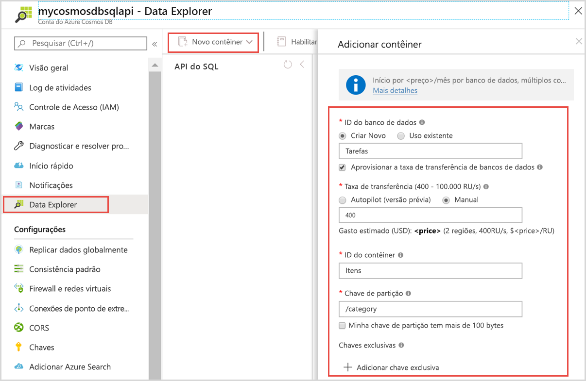
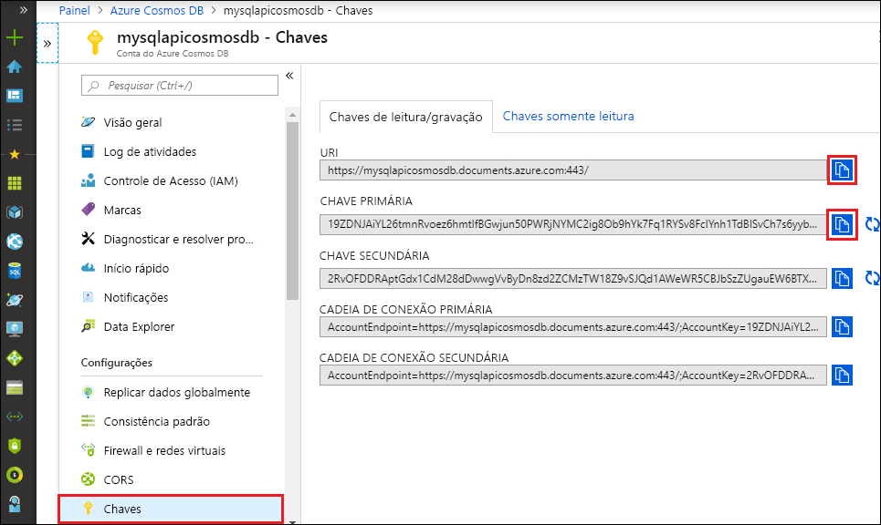

# <a name="quickstart-build-a-python-application-using-an-azure-cosmos-db-sql-api-account"></a>Início Rápido: criar um aplicativo do Python usando uma conta de API de SQL do Azure Cosmos DB

> [!div class="op_single_selector"]
> * [.NET V3](create-sql-api-dotnet.md)
> * [.NET V4](create-sql-api-dotnet-V4.md)
> * [Java](create-sql-api-java.md)
> * [Node.js](create-sql-api-nodejs.md)
> * [Python](create-sql-api-python.md)
> * [Xamarin](create-sql-api-xamarin-dotnet.md)

Este início rápido demonstra como criar uma conta de [API do SQL](sql-api-introduction.md), um banco de dados de documento e um contêiner do Azure Cosmos DB usando o portal do Azure. Em seguida, você compila e executa um aplicativo de console criado com o SDK de Python para a [API do SQL](sql-api-sdk-python.md).

O Azure Cosmos DB é o serviço de banco de dados multimodelo distribuído globalmente da Microsoft. Crie e consulte rapidamente documentos, chave/valor, coluna larga e bancos de dados de grafo. Todas essas operações beneficiam-se da distribuição e da escala do Azure Cosmos DB.

Este início rápido usa a versão 4 do [SDK do Python](https://pypi.org/project/azure-cosmos/#history).

[!INCLUDE [quickstarts-free-trial-note](../../includes/quickstarts-free-trial-note.md)] [!INCLUDE [cosmos-db-emulator-docdb-api](../../includes/cosmos-db-emulator-docdb-api.md)]

## <a name="prerequisites"></a>Prerequisites

* [Python 3.6](https://www.python.org/downloads/), com o `python` executável disponível no seu `PATH`.
* [Visual Studio Code](https://code.visualstudio.com/)
* [Extensão do Python para Visual Studio Code](https://marketplace.visualstudio.com/items?itemName=ms-python.python#overview)

## <a name="create-a-database-account"></a>Criar uma conta de banco de dados

[!INCLUDE [cosmos-db-create-dbaccount](../../includes/cosmos-db-create-dbaccount.md)]

## <a name="add-a-container"></a>Adicionar um contêiner

Agora, você pode usar a ferramenta Data Explorer no portal do Azure para criar um banco de dados e um contêiner. 

1. Selecione **Data Explorer** > **Novo Contêiner**. 
    
    A área **Adicionar Contêiner** é exibida à extrema direita; talvez seja necessário rolar a página para a direita para vê-la.

    

2. Na página **Adicionar contêiner**, insira as configurações do novo contêiner.

    |Configuração|Valor sugerido|Descrição
    |---|---|---|
    |**ID do banco de dados**|Tarefas|Insira *ToDoList* como o nome para o novo banco de dados. Os nomes dos banco de dados devem conter de 1 a 255 caracteres e não podem conter `/, \\, #, ?` nem um espaço à direita. Marque a opção **Provisionar a produtividade do banco de dados**; ela permite que você compartilhe a produtividade provisionada para o banco de dados em todos os contêineres no banco de dados. Essa opção também ajuda na economia de custo. |
    |**Taxa de transferência**|400|Deixe a taxa de transferência em 400 unidades de solicitação por segundo (RU/s). Se quiser reduzir a latência, você poderá escalar verticalmente a taxa de transferência mais tarde.| 
    |**ID do contêiner**|Itens|Insira *Itens* como o nome do novo contêiner. As IDs do contêiner têm os mesmos requisitos de caractere dos nomes de bancos de dados.|
    |**Chave de partição**| /category| O exemplo descrito neste artigo usa */category* como a chave de partição.|
    
    Além das configurações anteriores, opcionalmente, você pode adicionar **Chaves exclusivas** ao contêiner. Vamos deixar o campo vazio neste exemplo. As chaves exclusivas oferecem aos desenvolvedores a capacidade de adicionar uma camada de integridade dos dados ao seu banco de dados. Ao criar uma política de chave exclusiva durante a criação de um contêiner, você garante a exclusividade de um ou mais valores por chave de partição. Para obter mais informações, consulte o artigo [Chaves exclusivas no Azure Cosmos DB](unique-keys.md).
    
    Selecione **OK**. O Data Explorer exibe o novo banco de dados e o contêiner.

## <a name="add-sample-data"></a>Adicionar dados de exemplo

[!INCLUDE [cosmos-db-create-sql-api-add-sample-data](../../includes/cosmos-db-create-sql-api-add-sample-data.md)]

## <a name="query-your-data"></a>Consultar seus dados

[!INCLUDE [cosmos-db-create-sql-api-query-data](../../includes/cosmos-db-create-sql-api-query-data.md)]

## <a name="clone-the-sample-application"></a>Clonar o aplicativo de exemplo

Agora vamos clonar um aplicativo de API do SQL do GitHub, definir a cadeia de conexão e executá-lo.

1. Abra um prompt de comando, crie uma nova pasta chamada exemplos de git e feche o prompt de comando.

    ```cmd
    md "git-samples"
    ```
   Se você estiver usando um prompt do bash, use o seguinte comando:

   ```bash
   mkdir "git-samples"
   ```

2. Abra uma janela de terminal de git, como git bash, e use o comando `cd` para alterar para a nova pasta para instalar o aplicativo de exemplo.

    ```bash
    cd "git-samples"
    ```

3. Execute o comando a seguir para clonar o repositório de exemplo. Este comando cria uma cópia do aplicativo de exemplo no seu computador. 

    ```bash
    git clone https://github.com/Azure-Samples/azure-cosmos-db-python-getting-started.git
    ```  

## <a name="update-your-connection-string"></a>Atualizar sua cadeia de conexão

Agora, volte ao portal do Azure para obter informações sobre a cadeia de conexão e copiá-las para o aplicativo.

1. No [portal do Azure](https://portal.azure.com/), em sua conta do Azure Cosmos, no painel de navegação à esquerda, selecione **Chaves**. Você usará os botões de cópia no lado direito da tela para copiar o **URI** e a **Chave Primária** para o arquivo `cosmos_get_started.py` na próxima etapa.

    

2. Abra o arquivo `cosmos_get_started.py` em \git-samples\azure-cosmos-db-python-getting-started no Visual Studio Code.

3. Copie o valor do **URI** do portal (usando o botão de cópia) e transforme-o no valor da variável do **ponto de extremidade** em ``cosmos_get_started.py``. 

    `endpoint = 'https://FILLME.documents.azure.com',`

4. Em seguida, copie o valor da **CHAVE PRIMÁRIA** do portal e transforme-o no valor da **chave** em ``cosmos_get_started.py``. Agora, você atualizou o aplicativo com todas as informações necessárias para se comunicar com o Azure Cosmos DB. 

    `key = 'FILLME'`

5. Salve o arquivo ``cosmos_get_started.py``.

## <a name="review-the-code"></a>Examine o código

Esta etapa é opcional. Saiba mais sobre os recursos de banco de dados criados no código ou vá para [Atualizar a cadeia de conexão](#update-your-connection-string).

Todos os snippets de código a seguir são retirados do arquivo `cosmos_get_started.py`.

* O CosmosClient é inicializado. Atualize os valores do "ponto de extremidade" e da "chave" conforme descrito na seção [Atualizar sua cadeia de conexão](#update-your-connection-string). 

    [!code-python[](~/azure-cosmos-db-python-getting-started/cosmos_get_started.py?name=create_cosmos_client)]

* Um novo banco de dados é criado.

    [!code-python[](~/azure-cosmos-db-python-getting-started/cosmos_get_started.py?name=create_database_if_not_exists)]

* Um novo contêiner é criado, com 400 RU/s de [taxa de transferência provisionada](request-units.md). Escolhemos `lastName` como a [chave de partição](partitioning-overview.md#choose-partitionkey), que nos permite fazer consultas eficientes que filtram essa propriedade. 

    [!code-python[](~/azure-cosmos-db-python-getting-started/cosmos_get_started.py?name=create_container_if_not_exists)]

* Alguns itens são adicionados ao contêiner. Contêineres são uma coleção de itens (documentos JSON) que podem ter um esquema variado. Os métodos auxiliares ```get_[name]_family_item``` retornam representações de uma família que são armazenadas no Azure Cosmos DB como documentos JSON.

    [!code-python[](~/azure-cosmos-db-python-getting-started/cosmos_get_started.py?name=create_item)]

* As leituras de ponto (pesquisas de valor de chave) são executadas usando o método `read_item`. Imprimimos o [encargo de RU](request-units.md) de cada operação.
    [!code-python[](~/azure-cosmos-db-python-getting-started/cosmos_get_started.py?name=read_item)]

* Uma consulta é executada usando a sintaxe da consulta SQL. Como estamos usando valores de chave de partição iguais a ```lastName``` na cláusula WHERE, o Azure Cosmos DB roteará com eficiência essa consulta para as partições relevantes, melhorando o desempenho.

    [!code-python[](~/azure-cosmos-db-python-getting-started/cosmos_get_started.py?name=query_items)]
   
## <a name="run-the-app"></a>Executar o aplicativo

1. No Visual Studio Code, selecione **Exibir** > **Paleta de Comandos**. 

2. No prompt, digite **Python: Selecione Interpretador** e, em seguida, selecione a versão do Python a ser usada.

    O Rodapé no Visual Studio Code é atualizado para indicar o interpretador selecionado. 

3. Selecione **Exibir** > **Terminal Integrado** para abrir o terminal integrado do Visual Studio Code.

4. Na janela do terminal integrada, verifique se você está na pasta azure-cosmos-db-python-getting-started. Se não estiver, execute o comando a seguir para alternar para a pasta raiz. 

    ```cmd
    cd "\git-samples\azure-cosmos-db-python-getting-started"`
    ```

5. Execute o seguinte comando para instalar o pacote azure-cosmos. 

    ```python
    pip install --pre azure-cosmos
    ```

    Se você receber um erro de acesso negado ao tentar instalar azure-cosmos, precisará [executar o VS Code como administrador](https://stackoverflow.com/questions/37700536/visual-studio-code-terminal-how-to-run-a-command-with-administrator-rights).

6. Execute o seguinte comando executar o exemplo, criar e armazenar novos documentos no Azure Cosmos DB.

    ```python
    python cosmos_get_started.py
    ```

7. Para confirmar se os novos itens foram criados e salvos, no portal do Azure, selecione **Data Explorer** > **AzureSampleFamilyDatabase** > **Itens**. Exiba os itens que foram criados. Por exemplo, aqui está um exemplo de documento JSON para a família Andersen:

```json
{
    "id": "Andersen-1569479288379",
    "lastName": "Andersen",
    "district": "WA5",
    "parents": [
        {
            "familyName": null,
            "firstName": "Thomas"
        },
        {
            "familyName": null,
            "firstName": "Mary Kay"
        }
    ],
    "children": null,
    "address": {
        "state": "WA",
        "county": "King",
        "city": "Seattle"
    },
    "registered": true,
    "_rid": "8K5qAIYtZXeBhB4AAAAAAA==",
    "_self": "dbs/8K5qAA==/colls/8K5qAIYtZXc=/docs/8K5qAIYtZXeBhB4AAAAAAA==/",
    "_etag": "\"a3004d78-0000-0800-0000-5d8c5a780000\"",
    "_attachments": "attachments/",
    "_ts": 1569479288
}
```

## <a name="review-slas-in-the-azure-portal"></a>Examinar SLAs no Portal do Azure

[!INCLUDE [cosmosdb-tutorial-review-slas](../../includes/cosmos-db-tutorial-review-slas.md)]

## <a name="clean-up-resources"></a>Limpar os recursos

[!INCLUDE [cosmosdb-delete-resource-group](../../includes/cosmos-db-delete-resource-group.md)]

## <a name="next-steps"></a>Próximas etapas

Neste início rápido, você aprendeu a criar uma conta do Azure Cosmos, criar um contêiner usando o Data Explorer e executar um aplicativo. Agora, é possível importar outros dados para sua conta do Cosmos DB. 

> [!div class="nextstepaction"]
> [Importar dados no Azure Cosmos DB para a API do SQL](import-data.md)


