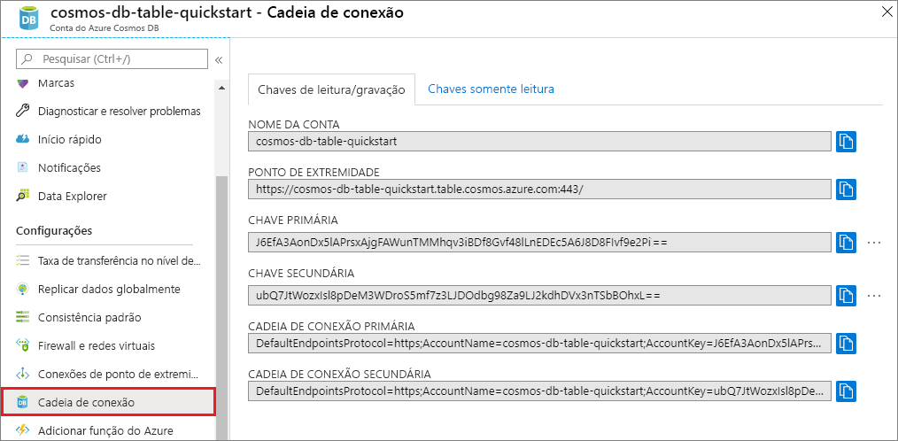

# <a name="quickstart-build-a-table-api-app-with-python-and-azure-cosmos-db"></a>Início Rápido: Criar um aplicativo de API de Tabela com Python e Azure Cosmos DB

> [!div class="op_single_selector"]
> * [.NET](create-table-dotnet.md)
> * [Java](create-table-java.md)
> * [Node.js](create-table-nodejs.md)
> * [Python](create-table-python.md)
> 

Neste início rápido, você criará e gerenciará uma conta da API de Tabela do Azure Cosmos DB no portal do Azure e no Visual Studio com um aplicativo Python clonado do GitHub. O Azure Cosmos DB é um serviço de banco de dados multimodelo que permite criar e consultar rapidamente bancos de dados de documentos, tabelas, pares chave-valor e grafo com funcionalidades de escala horizontal e distribuição global.

## <a name="prerequisites"></a>Prerequisites

- Uma conta do Azure com uma assinatura ativa. [Crie um gratuitamente](https://azure.microsoft.com/free/?ref=microsoft.com&utm_source=microsoft.com&utm_medium=docs&utm_campaign=visualstudio). Ou então [experimente o Azure Cosmos DB gratuitamente](https://azure.microsoft.com/try/cosmosdb/) sem uma assinatura do Azure. Você também pode usar o [Emulador do Azure Cosmos DB](https://aka.ms/cosmosdb-emulator) com um URI de `https://localhost:8081` e a chave `C2y6yDjf5/R+ob0N8A7Cgv30VRDJIWEHLM+4QDU5DE2nQ9nDuVTqobD4b8mGGyPMbIZnqyMsEcaGQy67XIw/Jw==`.
- [Visual Studio 2019](https://www.visualstudio.com/downloads/), com as cargas de trabalho **desenvolvimento do Azure** e **desenvolvimento do Python** selecionadas durante a instalação. 
- [Git](https://git-scm.com/downloads).

## <a name="create-a-database-account"></a>Criar uma conta de banco de dados

> [!IMPORTANT] 
> Você precisa criar uma nova conta de API de tabela para trabalhar com os SDKs de API de tabela disponíveis. Não há suporte para contas de API de tabela criadas durante a versão prévia pelos SDKs disponíveis.
>

[!INCLUDE [cosmos-db-create-dbaccount-table](../../includes/cosmos-db-create-dbaccount-table.md)]

## <a name="add-a-table"></a>Adicionar uma tabela

[!INCLUDE [cosmos-db-create-table](../../includes/cosmos-db-create-table.md)]

## <a name="add-sample-data"></a>Adicionar dados de exemplo

[!INCLUDE [cosmos-db-create-table-add-sample-data](../../includes/cosmos-db-create-table-add-sample-data.md)]

## <a name="clone-the-sample-application"></a>Clonar o aplicativo de exemplo

Agora, clonaremos um aplicativo de Tabela do GitHub, definiremos a cadeia de conexão e o executaremos. Você verá como é fácil trabalhar usando dados de forma programática. 

1. Abra um prompt de comando, crie uma nova pasta chamada exemplos de git e feche o prompt de comando.

    ```bash
    md "C:\git-samples"
    ```

2. Abra uma janela de terminal de git, como git bash, e use o comando `cd` para alterar para a nova pasta para instalar o aplicativo de exemplo.

    ```bash
    cd "C:\git-samples"
    ```

3. Execute o comando a seguir para clonar o repositório de exemplo. Este comando cria uma cópia do aplicativo de exemplo no seu computador. 

    ```bash
    git clone https://github.com/Azure-Samples/storage-python-getting-started.git
    ```

3. Em seguida, abra o arquivo da solução no Visual Studio. 

## <a name="update-your-connection-string"></a>Atualizar sua cadeia de conexão

Agora, volte ao portal do Azure para obter informações sobre a cadeia de conexão e copiá-las para o aplicativo. Isso permite que seu aplicativo se comunique com o banco de dados hospedado. 

1. Em sua conta do Azure Cosmos DB no [portal do Azure](https://portal.azure.com/), selecione **Cadeia de Conexão**. 

    

2. Copie o NOME DA CONTA usando o botão no lado direito.

3. Abra o arquivo *config.py* e cole o NOME DA CONTA do portal no valor de STORAGE_ACCOUNT_NAME na linha 19.

4. Volte ao portal e copie a CHAVE PRIMÁRIA.

5. Cole a CHAVE PRIMÁRIA do portal no valor STORAGE_ACCOUNT_KEY na linha 20.

6. Salve o arquivo *config.py*.

## <a name="run-the-app"></a>Executar o aplicativo

1. No Visual Studio, clique com o botão direito do mouse no projeto no **Gerenciador de Soluções**.

2. Selecione o ambiente atual do Python e, em seguida, clique nele com o botão direito do mouse.

2. Selecione **Instalar Pacote do Python** e, em seguida, insira *azure-storage-table*.

3. Pressione F5 para executar o aplicativo. Seu aplicativo é exibido no navegador. 

Agora, é possível voltar ao Data Explorer e ver, consultar, modificar e trabalhar com esses novos dados. 

## <a name="review-slas-in-the-azure-portal"></a>Examinar SLAs no Portal do Azure

[!INCLUDE [cosmosdb-tutorial-review-slas](../../includes/cosmos-db-tutorial-review-slas.md)]

## <a name="clean-up-resources"></a>Limpar os recursos

[!INCLUDE [cosmosdb-delete-resource-group](../../includes/cosmos-db-delete-resource-group.md)]

## <a name="next-steps"></a>Próximas etapas

Neste início rápido, você aprendeu a criar uma conta do Azure Cosmos DB, criar uma tabela usando o Data Explorer e executar um aplicativo Python no Visual Studio para adicionar dados de tabela.  Agora, você pode consultar os dados usando a API de Tabela.  

> [!div class="nextstepaction"]
> [Importar dados de tabela para a API de Tabela](table-import.md)
