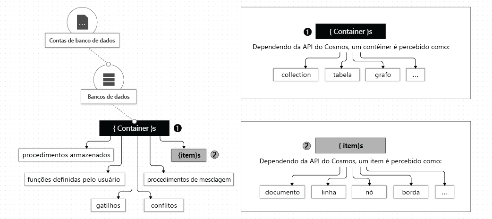

# Trabalhe com bancos de dados, contêineres e itens no Azure Cosmos DB

Depois de criar uma [conta azure Cosmos DB](account-overview.md) sua assinatura do Azure, você pode gerenciar dados em sua conta criando bancos de dados, contêineres e itens. Este artigo descreve cada uma dessas entidades. 

A imagem a seguir mostra a hierarquia de diferentes entidades em uma conta azure Cosmos DB:

## Bancos de dados do Azure Cosmos

Você pode criar um ou vários bancos de dados do Azure Cosmos em sua conta. Um banco de dados é análogo a um namespace. Um banco de dados é a unidade de gerenciamento de um conjunto de contêineres Azure Cosmos. A tabela a seguir mostra como um banco de dados do Azure Cosmos é mapeado para várias entidades específicas a uma API:

| Entidade do Azure Cosmos | API do SQL | API Cassandra | API do Azure Cosmos DB para MongoDB | API do Gremlin | API de Tabela |
| --- | --- | --- | --- | --- | --- |
|Banco de dados do Azure Cosmos | Banco de dados | Keyspace | Banco de dados | Banco de dados | NA |

> [!NOTE]
> Com contas de API de tabela, quando você cria sua primeira tabela, um banco de dados padrão é criado automaticamente em sua conta do Azure Cosmos.

### Operações em um banco de dados do Azure Cosmos

Você pode interagir com um banco de dados do Azure Cosmos com apIs do Azure Cosmos conforme descrito na tabela a seguir:

| Operação | CLI do Azure | API do SQL | API Cassandra | API do Azure Cosmos DB para MongoDB | API do Gremlin | API de Tabela |
| --- | --- | --- | --- | --- | --- | --- |
|Enumerar todos os bancos de dados| Sim | Sim | Sim (o banco de dados é mapeado para um keyspace) | Sim | NA | NA |
|Ler banco de dados| Sim | Sim | Sim (o banco de dados é mapeado para um keyspace) | Sim | NA | NA |
|Criar novo banco de dados| Sim | Sim | Sim (o banco de dados é mapeado para um keyspace) | Sim | NA | NA |
|Atualizar banco de dados| Sim | Sim | Sim (o banco de dados é mapeado para um keyspace) | Sim | NA | NA |

## Contêineres do Azure Cosmos

Um contêiner Azure Cosmos é a unidade de escalabilidade tanto para o armazenamento e o armazenamento provisionados. Um contêiner é particionado horizontalmente e, em seguida, é replicado em várias regiões. Os itens que você adiciona ao contêiner e a taxa de transferência que provisiona nesse contêiner são ambos automaticamente distribuídos em um conjunto de partições lógicas baseado na chave de partição. Para saber mais sobre as teclas de particionamento e partição, consulte [dados de partição](partition-data.md). 

Quando você cria um contêiner Azure Cosmos, você configura throughput em um dos seguintes modos:

* **Modo de throughput provisionado dedicado**: O throughput provisionado em um contêiner é exclusivamente reservado para esse contêiner e é apoiado pelos SLAs. Para saber mais, [consulte Como prover throughput em um contêiner Azure Cosmos](how-to-provision-container-throughput.md).

* **Modo de throughput provisionado compartilhado**: Esses contêineres compartilham o throughput provisionado com os outros contêineres no mesmo banco de dados (excluindo contêineres que foram configurados com throughput provisionado dedicado). Em outras palavras, o throughput provisionado no banco de dados é compartilhado entre todos os contêineres de "throughput compartilhado". Para saber mais, [consulte Como provisionar o throughput em um banco de dados do Azure Cosmos](how-to-provision-database-throughput.md).

> [!NOTE]
> Você pode configurar o throughput compartilhado e dedicado somente ao criar o banco de dados e o contêiner. Para alternar do modo de taxa de transferência dedicada para o modo de taxa de transferência compartilhada (e vice-versa) depois que o contêiner for criado, você precisará criar um novo contêiner e migrar os dados para o novo contêiner. Você pode migrar os dados usando o recurso de feed de alteração Azure Cosmos DB.

Um contêiner Azure Cosmos pode escalar de forma elástica, quer você crie contêineres usando modos de throughput dedicados ou compartilhados.

Um contêiner do Azure Cosmos é um contêiner de itens independente de esquema. Os itens em um recipiente podem ter esquemas arbitrários. Por exemplo, um item que representa uma pessoa e um item que representa um automóvel podem ser colocados no *mesmo recipiente.* Por padrão, todos os itens adicionados a um contêiner são automaticamente indexados sem exigir um gerenciamento explícito de índice ou esquema. Você pode personalizar o comportamento de indexação configurando a [política de indexação](index-overview.md) em um contêiner. 

Você pode definir [O Tempo de Vida (TTL)](time-to-live.md) em itens selecionados em um contêiner Azure Cosmos ou para que todo o contêiner limpe graciosamente esses itens do sistema. O Azure Cosmos DB exclui automaticamente os itens quando expirarem. Também garante que uma consulta realizada no contêiner não devolva os itens vencidos dentro de um limite fixo. Para saber mais, consulte [Configurar TTL no recipiente](how-to-time-to-live.md).

Você pode usar [o feed de alterações](change-feed.md) para assinar o registro de operações gerenciado para cada partição lógica do seu contêiner. O feed de alterações fornece o registro de todas as atualizações realizadas no contêiner, juntamente com as imagens antes e depois dos itens. Para obter mais informações, consulte [Criar aplicativos reativos usando feed de alteração](serverless-computing-database.md). Você também pode configurar a duração de retenção para a alimentação de alteração usando a política de alimentação de alteração no recipiente. 

Você pode registrar [procedimentos armazenados, gatilhos, funções definidas pelo usuário (UDFs)](stored-procedures-triggers-udfs.md)e [mesclar procedimentos](how-to-manage-conflicts.md) para o contêiner Azure Cosmos. 

Você pode especificar uma [restrição de chave única](unique-keys.md) no seu contêiner Azure Cosmos. Ao criar uma política de chave exclusiva, você garante a exclusividade de um ou mais valores por chave de partição lógica. Se você criar um contêiner usando uma diretiva de chave única, nenhum item novo ou atualizado com valores que duplicam os valores especificados pela restrição de chave única pode ser criado. Para obter mais informações, confira [Restrições de chave exclusivas](unique-keys.md).

Um contêiner Azure Cosmos é especializado em entidades específicas da API, conforme mostrado na tabela a seguir:

| Entidade do Azure Cosmos | API do SQL | API Cassandra | API do Azure Cosmos DB para MongoDB | API do Gremlin | API de Tabela |
| --- | --- | --- | --- | --- | --- |
|Contêiner do Azure Cosmos | Contêiner | Tabela | Coleção | Grafo | Tabela |

### Propriedades de um contêiner do Azure Cosmos

Um contêiner Azure Cosmos tem um conjunto de propriedades definidas pelo sistema. Dependendo de qual API você usa, algumas propriedades podem não ser diretamente expostas. A tabela a seguir descreve a lista de propriedades definidas pelo sistema:

| Propriedade definida pelo sistema | Gerado pelo sistema ou configurável pelo usuário | Finalidade | API do SQL | API Cassandra | API do Azure Cosmos DB para MongoDB | API do Gremlin | API de Tabela |
| --- | --- | --- | --- | --- | --- | --- | --- |
|\_Livrar | Gerado pelo sistema | Identificador exclusivo do contêiner | Sim | Não | Não | Não | Não |
|\_Etag | Gerado pelo sistema | Marca da entidade usada para controle de simultaneidade otimista | Sim | Não | Não | Não | Não |
|\_Ts | Gerado pelo sistema | Último carimbo de data/hora atualizado do contêiner | Sim | Não | Não | Não | Não |
|\_self | Gerado pelo sistema | URI endereçável do contêiner | Sim | Não | Não | Não | Não |
|id | Configurável pelo usuário | Nome exclusivo do contêiner definido pelo usuário | Sim | Sim | Sim | Sim | Sim |
|indexingPolicy | Configurável pelo usuário | Fornece a capacidade de alterar o caminho do índice, o tipo de índice e o modo de índice | Sim | Não | Não | Não | Sim |
|timeToLive | Configurável pelo usuário | Fornece a capacidade de excluir itens automaticamente de um contêiner após um período de tempo definido. Para obter detalhes, consulte [Time to Live](time-to-live.md). | Sim | Não | Não | Não | Sim |
|changeFeedPolicy | Configurável pelo usuário | Usado para ler as alterações feitas a itens em um contêiner. Para obter detalhes, consulte [Alterar feed](change-feed.md). | Sim | Não | Não | Não | Sim |
|uniqueKeyPolicy | Configurável pelo usuário | Usado para garantir a singularidade de um ou mais valores em uma partição lógica. Para obter mais informações, consulte [Restrições de tecla Exclusivas](unique-keys.md). | Sim | Não | Não | Não | Sim |

### Operações em um contêiner do Azure Cosmos

Um contêiner Azure Cosmos suporta as seguintes operações quando você usa qualquer uma das APIs do Azure Cosmos:

| Operação | CLI do Azure | API do SQL | API Cassandra | API do Azure Cosmos DB para MongoDB | API do Gremlin | API de Tabela |
| --- | --- | --- | --- | --- | --- | --- |
| Enumerar os contêineres em um banco de dados | Sim | Sim | Sim | Sim | NA | NA |
| Ler um contêiner | Sim | Sim | Sim | Sim | NA | NA |
| Criar um novo contêiner | Sim | Sim | Sim | Sim | NA | NA |
| Atualize um contêiner | Sim | Sim | Sim | Sim | NA | NA |
| Excluir um contêiner | Sim | Sim | Sim | Sim | NA | NA |

## Itens do Azure Cosmos

Dependendo de qual API você usa, um item do Azure Cosmos pode representar um documento em uma coleção, uma linha em uma tabela ou um nó ou borda em um gráfico. A tabela a seguir mostra o mapeamento de entidades específicas da API para um item do Azure Cosmos:

| Entidade do Cosmos | API do SQL | API Cassandra | API do Azure Cosmos DB para MongoDB | API do Gremlin | API de Tabela |
| --- | --- | --- | --- | --- | --- |
|Item do Azure Cosmos | Document | Linha | Document | Nó ou borda | Item |

### Propriedades de um item

Cada item do Azure Cosmos tem as seguintes propriedades definidas pelo sistema. Dependendo de qual API você usa, algumas delas podem não estar diretamente expostas.

| Propriedade definida pelo sistema | Gerado pelo sistema ou configurável pelo usuário| Finalidade | API do SQL | API Cassandra | API do Azure Cosmos DB para MongoDB | API do Gremlin | API de Tabela |
| --- | --- | --- | --- | --- | --- | --- | --- |
|\_Livrar | Gerado pelo sistema | Identificador exclusivo do item | Sim | Não | Não | Não | Não |
|\_Etag | Gerado pelo sistema | Marca da entidade usada para controle de simultaneidade otimista | Sim | Não | Não | Não | Não |
|\_Ts | Gerado pelo sistema | Carimbo de data e hora da última atualização do item | Sim | Não | Não | Não | Não |
|\_self | Gerado pelo sistema | URI endereçável do item | Sim | Não | Não | Não | Não |
|id | Você pode usar o | Nome único definido pelo usuário em uma partição lógica. | Sim | Sim | Sim | Sim | Sim |
|Propriedades arbitrárias definidas pelo usuário | Definido pelo usuário | Propriedades definidas pelo usuário representadas na representação nativa da API (incluindo JSON, BSON e CQL) | Sim | Sim | Sim | Sim | Sim |

> [!NOTE]
> A singularidade `id` da propriedade só é aplicada dentro de cada partição lógica. Vários documentos podem `id` ter a mesma propriedade com diferentes valores de chave de partição.

### Operações em itens

Os itens do Azure Cosmos suportam as seguintes operações. Você pode usar qualquer uma das APIs do Azure Cosmos para executar as operações.

| Operação | CLI do Azure | API do SQL | API Cassandra | API do Azure Cosmos DB para MongoDB | API do Gremlin | API de Tabela |
| --- | --- | --- | --- | --- | --- | --- |
| Inserir, Substituir, Excluir, Upsert, Ler | Não | Sim | Sim | Sim | Sim | Sim |

## Próximas etapas

Conheça essas tarefas e conceitos:

* [Provisionar a taxa de transferência em um banco de dados do Azure Cosmos](how-to-provision-database-throughput.md)
* [Provisionar a taxa de transferência em um contêiner do Azure Cosmos](how-to-provision-container-throughput.md)
* [Trabalhe com partições lógicas](partition-data.md)
* [Configure ttl em um contêiner Azure Cosmos](how-to-time-to-live.md)
* [Construa aplicativos reativos usando feed de alteração](change-feed.md)
* [Configure uma restrição de chave exclusiva no seu contêiner Azure Cosmos](unique-keys.md)
