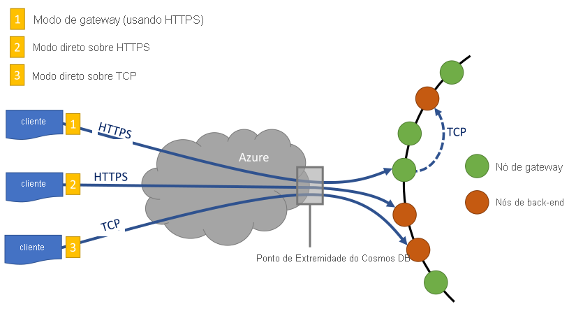

# <a name="performance-tips-for-azure-cosmos-db-and-net"></a>Dicas de desempenho para o Azure Cosmos DB e .NET

> [!div class="op_single_selector"]
> * [Async Java](performance-tips-async-java.md)
> * [Java](performance-tips-java.md)
> * [.NET](performance-tips.md)
> 

O Azure Cosmos DB é um banco de dados distribuído rápido e flexível que pode ser dimensionado perfeitamente com garantia de latência e produtividade. Você não precisa fazer grandes alterações na arquitetura nem escrever código complexo para dimensionar seu banco de dados com Azure Cosmos DB. Aumentar e diminuir a escala é tão fácil quanto fazer uma única chamada de API. Para saber mais, veja [como provisionar a taxa de transferência do contêiner](how-to-provision-container-throughput.md) ou [como provisionar a taxa de transferência do banco de dados](how-to-provision-database-throughput.md). Mas como Azure Cosmos DB é acessado por meio de chamadas de rede, há otimizações do lado do cliente que você pode fazer para obter o máximo de desempenho ao usar o [SDK do .net do SQL](sql-api-sdk-dotnet-standard.md).

Portanto, se você estiver tentando melhorar o desempenho do banco de dados, considere estas opções:

## <a name="hosting-recommendations"></a>Recomendações de hospedagem

**Para cargas de trabalho com uso intensivo de consulta, use o Windows 64-bit em vez do processamento de host Linux ou Windows de 32 bits**

Recomendamos o processamento de host do Windows de 64 bits para melhorar o desempenho. O SDK do SQL inclui um perinterop. dll nativo para analisar e otimizar as consultas localmente. O perinterop. dll tem suporte apenas na plataforma Windows x64. Para Linux e outras plataformas sem suporte em que o perinterop. dll não está disponível, é feita uma chamada de rede adicional ao gateway para obter a consulta otimizada. Os seguintes tipos de aplicativos usam o processamento de host de 32 bits por padrão. Para alterar o processamento de host para o processamento de 64 bits, siga estas etapas, com base no tipo de seu aplicativo:

- Para aplicativos executáveis, você pode alterar o processamento do host definindo o [destino da plataforma](https://docs.microsoft.com/visualstudio/ide/how-to-configure-projects-to-target-platforms?view=vs-2019) para **x64** na janela de **Propriedades do projeto** , na guia **Compilar** .

- Para projetos de teste baseados em VSTest, você pode alterar o processamento de host selecionando **testar** > **configurações** > **de teste arquitetura de processador padrão como x64** no menu de **teste** do Visual Studio.

- Para aplicativos Web ASP.net implantados localmente, você pode alterar o processamento de host selecionando **usar a versão de 64 bits do IIS Express para sites e projetos** em **ferramentas** > **Opções** > **projetos e soluções** > **projetos da Web**.

- Para aplicativos Web ASP.NET implantados no Azure, você pode alterar o processamento de host selecionando a plataforma de **64 bits** nas **configurações do aplicativo** na portal do Azure.

> [!NOTE] 
> Por padrão, novos projetos do Visual Studio são definidos para **qualquer CPU**. Recomendamos que você defina seu projeto como **x64** para que ele não mude para **x86**. Um projeto definido para **qualquer CPU** pode mudar facilmente para **x86** se uma dependência somente x86 for adicionada.<br/>
> O perinterop. dll precisa estar na pasta da qual a DLL do SDK está sendo executada. Isso deve ser uma preocupação apenas se você copiar DLLs manualmente ou se tiver sistemas de compilação/implantação personalizados.
    
**Ativar coleta de lixo do lado do servidor (GC)**

Reduzir a frequência de coleta de lixo pode ajudar em alguns casos. No .NET, defina [gcServer](https://msdn.microsoft.com/library/ms229357.aspx) como `true`.

**Escalar horizontalmente a carga de trabalho do cliente**

Se você estiver testando em níveis altos de taxa de transferência (mais de 50.000 RU/s), o aplicativo cliente poderá se tornar o afunilamento devido à máquina que está capping a utilização da CPU ou da rede. Se você chegar a este ponto, poderá continuar aumentando a conta do Azure Cosmos DB ainda mais distribuindo seus aplicativos cliente entre vários servidores.

> [!NOTE] 
> Alto uso da CPU pode causar maior latência e exceções de tempo limite de solicitação.

## <a name="networking"></a>Rede
<a id="direct-connection"></a>

**Política de conexão: usar o modo de conexão direta**

Como um cliente se conecta a Azure Cosmos DB tem implicações de desempenho importantes, especialmente para latência observada no lado do cliente. Há duas definições de configuração principais disponíveis para configurar a política de conexão do cliente: o *modo* de conexão e o *protocolo*de conexão.  Os dois modos disponíveis são:

   * Modo de gateway
      
     O modo Gateway tem suporte em todas as plataformas SDK e é o padrão configurado para o [SDK Microsoft. Azure. DocumentDB](sql-api-sdk-dotnet.md). Se seu aplicativo for executado em uma rede corporativa com restrições de firewall estritas, o modo de gateway será a melhor opção, pois ele usa a porta HTTPS padrão e um único ponto de extremidade. No entanto, a compensação de desempenho é que o modo de gateway envolve um salto de rede adicional toda vez que os dados são lidos ou gravados em Azure Cosmos DB. Portanto, o modo direto oferece melhor desempenho porque há menos saltos de rede. Também recomendamos o modo de conexão de gateway quando você executa aplicativos em ambientes que têm um número limitado de conexões de soquete.

     Ao usar o SDK no Azure Functions, especialmente no plano de [consumo](../azure-functions/functions-scale.md#consumption-plan), esteja ciente dos limites atuais das [conexões](../azure-functions/manage-connections.md). Nesse caso, o modo de gateway poderá ser melhor se você também estiver trabalhando com outros clientes baseados em HTTP em seu aplicativo Azure Functions.

   * Modo direto

     O modo direto dá suporte à conectividade por meio do protocolo TCP e é o modo de conectividade padrão se você estiver usando o [SDK Microsoft. Azure. Cosmos/. net v3](sql-api-sdk-dotnet-standard.md).

No modo de gateway, Azure Cosmos DB usa a porta 443 e as portas 10250, 10255 e 10256 quando você está usando a API de Azure Cosmos DB para MongoDB. A porta 10250 é mapeada para uma instância padrão do MongoDB sem replicação geográfica. As portas 10255 e 10256 são mapeadas para a instância do MongoDB que tem replicação geográfica.
     
Ao usar o TCP no modo direto, além das portas de gateway, você precisa garantir que o intervalo de portas entre 10000 e 20000 esteja aberto porque o Azure Cosmos DB usa portas TCP dinâmicas. Se essas portas não estiverem abertas e você tentar usar TCP, você receberá um erro 503 Serviço indisponível. Esta tabela mostra os modos de conectividade disponíveis para várias APIs e as portas de serviço usadas para cada API:

|Modo da conexão  |Protocolo com Suporte  |SDKs com suporte  |Porta/serviço de API  |
|---------|---------|---------|---------|
|Gateway  |   HTTPS    |  Todos os SDKs    |   SQL (443), MongoDB (10250, 10255, 10256), tabela (443), Cassandra (10350), grafo (443)    |
|Direto    |     TCP    |  SDK .NET    | Portas no intervalo de 10000 a 20000 |

O Azure Cosmos DB oferece um modelo de programação RESTful simples e aberto por HTTPS. Além disso, ele oferece um protocolo TCP eficiente que também é RESTful em seu modelo de comunicação e está disponível por meio do SDK do cliente .NET. O protocolo TCP usa TLS para autenticação inicial e criptografia de tráfego. Para ter um melhor desempenho, use o protocolo TCP quando possível.

Para o SDK v3, você configura o modo de conexão ao criar `CosmosClient` a instância do `CosmosClientOptions`, no. Lembre-se de que o modo direto é o padrão.

```csharp
var serviceEndpoint = new Uri("https://contoso.documents.net");
var authKey = "your authKey from the Azure portal";
CosmosClient client = new CosmosClient(serviceEndpoint, authKey,
new CosmosClientOptions
{
    ConnectionMode = ConnectionMode.Gateway // ConnectionMode.Direct is the default
});
```

Para o SDK do Microsoft. Azure. DocumentDB, você configura o modo de conexão durante a construção `DocumentClient` da instância usando o `ConnectionPolicy` parâmetro. Se você usar o modo direto, também poderá definir o `Protocol` usando o `ConnectionPolicy` parâmetro.

```csharp
var serviceEndpoint = new Uri("https://contoso.documents.net");
var authKey = "your authKey from the Azure portal";
DocumentClient client = new DocumentClient(serviceEndpoint, authKey,
new ConnectionPolicy
{
   ConnectionMode = ConnectionMode.Direct, // ConnectionMode.Gateway is the default
   ConnectionProtocol = Protocol.Tcp
});
```

Como o TCP tem suporte apenas no modo direto, se você usar o modo de gateway, o protocolo HTTPS sempre será usado para se comunicar com `Protocol` o gateway `ConnectionPolicy` e o valor em será ignorado.



**Chamar OpenAsync para evitar a latência de inicialização na primeira solicitação**

Por padrão, a primeira solicitação tem maior latência porque ela precisa buscar a tabela de roteamento de endereços. Ao usar o [SDK v2](sql-api-sdk-dotnet.md), chame `OpenAsync()` uma vez durante a inicialização para evitar essa latência de inicialização na primeira solicitação:

    await client.OpenAsync();

> [!NOTE] 
> `OpenAsync`o irá gerar solicitações para obter a tabela de roteamento de endereços para todos os contêineres na conta. Para contas que têm muitos contêineres, mas cujo aplicativo acessa um subconjunto deles `OpenAsync` , o geraria uma quantidade desnecessária de tráfego, o que tornaria a inicialização lenta. Portanto, `OpenAsync` o uso do pode não ser útil nesse cenário porque torna a inicialização do aplicativo mais lenta.

   <a id="same-region"></a>
**Para desempenho, colocar clientes na mesma região do Azure**

Quando possível, coloque todos os aplicativos que chamam Azure Cosmos DB na mesma região que o banco de dados Azure Cosmos DB. Veja uma comparação aproximada: as chamadas para Azure Cosmos DB na mesma região são concluídas dentro de 1 ms a 2 ms, mas a latência entre a costa oeste e a leste dos EUA é mais de 50 ms. Essa latência pode variar de solicitação a solicitação, dependendo da rota realizada pela solicitação à medida que ela passa do cliente para o limite de datacenter do Azure. Você pode obter a menor latência possível garantindo que o aplicativo de chamada esteja localizado na mesma região do Azure que o ponto de extremidade de Azure Cosmos DB provisionado. Para obter uma lista de regiões disponíveis, consulte [Regiões do Azure](https://azure.microsoft.com/regions/#services).

 de conexão Azure Cosmos DB<a id="increase-threads"></a>

**Aumentar o número de threads/tarefas**

Como as chamadas para Azure Cosmos DB são feitas pela rede, talvez seja necessário variar o grau de paralelismo de suas solicitações para que o aplicativo cliente aguarde o tempo mínimo de espera entre as solicitações. Por exemplo, se você estiver usando a [biblioteca paralela de tarefas](https://msdn.microsoft.com//library/dd460717.aspx)do .net, crie na ordem de centenas de tarefas que lêem ou gravam em Azure Cosmos DB.

**Habilitar rede acelerada**
 
 Para reduzir a latência e a tremulação da CPU, recomendamos que você habilite a rede acelerada nas máquinas virtuais do cliente. Consulte [criar uma máquina virtual do Windows com rede acelerada](../virtual-network/create-vm-accelerated-networking-powershell.md) ou [criar uma máquina virtual Linux com rede acelerada](../virtual-network/create-vm-accelerated-networking-cli.md).

## <a name="sdk-usage"></a>Uso do SDK
**Instalar o SDK mais recente**

Os SDKs do Azure Cosmos DB estão constantemente sendo aprimorados para fornecer o melhor desempenho. Consulte as páginas do [SDK do Azure Cosmos DB](sql-api-sdk-dotnet-standard.md) para determinar o SDK mais recente e examinar as melhorias.

**Usar APIs de fluxo**

O [SDK do .net v3](sql-api-sdk-dotnet-standard.md) contém APIs de fluxo que podem receber e retornar dados sem serialização. 

Os aplicativos de camada intermediária que não consomem respostas diretamente do SDK, mas retransmitem-los para outras camadas de aplicativo podem se beneficiar das APIs de fluxo. Consulte os exemplos de [Gerenciamento de itens](https://github.com/Azure/azure-cosmos-dotnet-v3/blob/master/Microsoft.Azure.Cosmos.Samples/Usage/ItemManagement) para obter exemplos de manipulação de fluxo.

**Usar um cliente Azure Cosmos DB singleton durante o tempo de vida do seu aplicativo**

Cada `DocumentClient` instância `CosmosClient` do e do é thread-safe e executa o gerenciamento de conexão eficiente e o cache de endereços ao operar no modo direto. Para permitir o gerenciamento de conexão eficiente e melhor desempenho do cliente SDK, recomendamos que você use uma `AppDomain` única instância por tempo de vida do aplicativo.

   <a id="max-connection"></a>

**Aumentar o System.Net MaxConnections por host ao usar o modo de gateway**

Azure Cosmos DB solicitações são feitas por HTTPS/REST quando você usa o modo de gateway. Eles estão sujeitos ao limite de conexão padrão por nome de host ou endereço IP. Talvez seja necessário definir `MaxConnections` como um valor mais alto (100 a 1.000) para que a biblioteca de cliente possa usar várias conexões simultâneas para Azure Cosmos DB. No SDK do .NET 1.8.0 e posterior, o valor padrão de [ServicePointManager. DefaultConnectionLimit](https://msdn.microsoft.com/library/system.net.servicepointmanager.defaultconnectionlimit.aspx) é 50. Para alterar o valor, você pode definir [Documents. Client. ConnectionPolicy. MaxConnectionLimit](https://msdn.microsoft.com/library/azure/microsoft.azure.documents.client.connectionpolicy.maxconnectionlimit.aspx) para um valor mais alto.

**Ajustar consultas paralelas para coleções particionadas**

O SDK do SQL .NET 1.9.0 e versões posteriores dão suporte a consultas paralelas, que permitem consultar uma coleção particionada em paralelo. Para obter mais informações, consulte [exemplos de código](https://github.com/Azure/azure-documentdb-dotnet/blob/master/samples/code-samples/Queries/Program.cs) relacionados ao trabalho com os SDKs. As consultas paralelas são projetadas para fornecer melhor latência de consulta e taxa de transferência do que o equivalente em série. As consultas paralelas fornecem dois parâmetros que você pode ajustar para atender às suas necessidades: 
- `MaxDegreeOfParallelism`controla o número máximo de partições que podem ser consultadas em paralelo. 
- `MaxBufferedItemCount`controla o número de resultados previamente buscados.

***Grau de ajuste do paralelismo***

A consulta paralela funciona consultando várias partições em paralelo. Mas os dados de uma partição individual são buscados em série em relação à consulta. A `MaxDegreeOfParallelism` configuração no [SDK v2](sql-api-sdk-dotnet.md) ou `MaxConcurrency` no [SDK v3](sql-api-sdk-dotnet-standard.md) para o número de partições tem a melhor chance de alcançar a consulta de melhor desempenho, desde que todas as outras condições do sistema permaneçam as mesmas. Se você não souber o número de partições, poderá definir o grau de paralelismo como um número alto. O sistema escolherá o mínimo (número de partições, entrada fornecida pelo usuário) como o grau de paralelismo.

Observe que as consultas paralelas produzirão mais benefícios se os dados forem distribuídos uniformemente entre todas as partições em relação à consulta. Se a coleção particionada for particionada para que todos ou a maioria dos dados retornados por uma consulta se concentrasse em algumas partições (uma partição é o pior caso), essas partições causarão um afunilamento do desempenho da consulta.

***Ajustando MaxBufferedItemCount***
    
A consulta paralela foi projetada para buscar antecipadamente resultados enquanto o lote atual de resultados está sendo processado pelo cliente. Essa pré-busca ajuda a melhorar a latência geral de uma consulta. O `MaxBufferedItemCount` parâmetro limita o número de resultados previamente buscados. Defina `MaxBufferedItemCount` como o número esperado de resultados retornados (ou um número mais alto) para permitir que a consulta receba o benefício máximo da busca prévia.

A busca prévia funciona da mesma maneira, independentemente do grau de paralelismo, e há um único buffer para os dados de todas as partições.  

**Implementar a retirada em intervalos de RetryAfter**

Durante o teste de desempenho, você deve aumentar a carga até que uma pequena taxa de solicitações seja limitada. Se as solicitações forem limitadas, o aplicativo cliente deverá fazer o logoff no limite para o intervalo de repetição especificado pelo servidor. Respeitar a retirada garante que você gaste uma quantidade mínima de tempo esperando entre repetições. 

O suporte à política de repetição está incluído nesses SDKs:
- Versão 1.8.0 e posterior do [SDK do .net para SQL](sql-api-sdk-dotnet.md) e o [SDK do Java para SQL](sql-api-sdk-java.md)
- Versão 1.9.0 e posterior do [SDK do node. js para SQL](sql-api-sdk-node.md) e o [SDK do Python para SQL](sql-api-sdk-python.md)
- Todas as versões com suporte dos SDKs do [.NET Core](sql-api-sdk-dotnet-core.md) 

Para obter mais informações, consulte [RetryAfter](https://msdn.microsoft.com/library/microsoft.azure.documents.documentclientexception.retryafter.aspx).
    
Na versão 1,19 e posterior do SDK do .NET, há um mecanismo para registrar informações de diagnóstico adicionais e solucionar problemas de latência, conforme mostrado no exemplo a seguir. Você pode registrar a cadeia de caracteres de diagnóstico para solicitações que tenham uma latência de leitura mais alta. A cadeia de caracteres de diagnóstico capturada ajudará você a entender quantas vezes você recebeu erros 429 para uma determinada solicitação.

```csharp
ResourceResponse<Document> readDocument = await this.readClient.ReadDocumentAsync(oldDocuments[i].SelfLink);
readDocument.RequestDiagnosticsString 
```

**Armazenar em cache os URIs do documento para uma menor latência de leitura**

Armazene em cache os URIs do documento sempre que possível para ter o melhor desempenho de leitura. Você precisa definir a lógica para armazenar em cache a ID do recurso ao criar um recurso. As pesquisas baseadas em IDs de recurso são mais rápidas do que as pesquisas baseadas em nome, portanto, armazenar esses valores em cache melhora o desempenho.

   <a id="tune-page-size"></a>
**Ajustar o tamanho da página para consultas/ler feeds para melhorar o desempenho**

Quando você faz uma leitura em massa de documentos usando a funcionalidade de feed de leitura ( `ReadDocumentFeedAsync`por exemplo,) ou quando você emite uma consulta SQL, os resultados são retornados de uma maneira segmentada se o conjunto de resultados for muito grande. Por padrão, os resultados são retornados em blocos de 100 itens ou 1 MB, o limite que for atingido primeiro.

Para reduzir o número de viagens de ida e volta da rede necessárias para recuperar todos os resultados aplicáveis, você pode aumentar o tamanho da página usando [x-MS-Max-item-Count](https://docs.microsoft.com/rest/api/cosmos-db/common-cosmosdb-rest-request-headers) para solicitar até 1.000 cabeçalhos. Quando você precisar exibir apenas alguns resultados, por exemplo, se a interface do usuário ou a API do aplicativo retornar apenas 10 resultados por vez, você também poderá diminuir o tamanho da página para 10 para reduzir a taxa de transferência consumida para leituras e consultas.

> [!NOTE] 
> A `maxItemCount` propriedade não deve ser usada apenas para paginação. Seu principal uso é melhorar o desempenho das consultas, reduzindo o número máximo de itens retornados em uma única página.  

Você também pode definir o tamanho da página usando os SDKs de Azure Cosmos DB disponíveis. A propriedade [MaxItemCount](/dotnet/api/microsoft.azure.documents.client.feedoptions.maxitemcount?view=azure-dotnet) no `FeedOptions` permite que você defina o número máximo de itens a serem retornados na operação de enumeração. Quando `maxItemCount` é definido como-1, o SDK localiza automaticamente o valor ideal, dependendo do tamanho do documento. Por exemplo:
    
```csharp
IQueryable<dynamic> authorResults = client.CreateDocumentQuery(documentCollection.SelfLink, "SELECT p.Author FROM Pages p WHERE p.Title = 'About Seattle'", new FeedOptions { MaxItemCount = 1000 });
```
    
Quando uma consulta é executada, os dados resultantes são enviados em um pacote TCP. Se você especificar um valor muito baixo para `maxItemCount`, o número de viagens necessárias para enviar os dados no pacote TCP será alto, o que afetará o desempenho. Portanto, se você não tiver certeza de qual valor definir para `maxItemCount` a propriedade, é melhor defini-lo como-1 e permitir que o SDK escolha o valor padrão.

**Aumentar o número de threads/tarefas**

Consulte [aumentar o número de threads/tarefas](#increase-threads) na seção de rede deste artigo.

## <a name="indexing-policy"></a>Política de indexação
 
**Excluir caminhos não utilizados da indexação para gravações mais rápidas**

A política de indexação de Azure Cosmos DB também permite especificar quais caminhos de documento incluir ou excluir da indexação usando caminhos de indexação (IndexingPolicy. IncludedPaths e IndexingPolicy. ExcludedPaths). Os caminhos de indexação podem melhorar o desempenho de gravação e reduzir o armazenamento de índice para cenários nos quais os padrões de consulta são conhecidos com antecedência. Isso ocorre porque os custos de indexação se correlacionam diretamente com o número de caminhos exclusivos indexados. Por exemplo, este código mostra como excluir uma seção inteira dos documentos (uma subárvore) da indexação usando o curinga "*":

```csharp
var collection = new DocumentCollection { Id = "excludedPathCollection" };
collection.IndexingPolicy.IncludedPaths.Add(new IncludedPath { Path = "/*" });
collection.IndexingPolicy.ExcludedPaths.Add(new ExcludedPath { Path = "/nonIndexedContent/*");
collection = await client.CreateDocumentCollectionAsync(UriFactory.CreateDatabaseUri("db"), excluded);
```

Para obter mais informações, consulte [Políticas de indexação do Azure Cosmos DB](index-policy.md).

## <a name="throughput"></a>Produtividade
<a id="measure-rus"></a>

**Medir e ajustar para unidades de solicitação menores/segundo uso**

O Azure Cosmos DB oferece um conjunto avançado de operações de banco de dados. Essas operações incluem consultas relacionais e hierárquicas com UDFs, procedimentos armazenados e gatilhos, todos operando nos documentos em uma coleção de banco de dados. O custo associado a cada uma dessas operações varia dependendo da CPU, da e/s e da memória necessária para concluir a operação. Em vez de pensar e gerenciar recursos de hardware, você pode pensar em uma RU (unidade de solicitação) como uma medida única para os recursos necessários para executar várias operações de banco de dados e atender a uma solicitação de aplicativo.

A taxa de transferência é provisionada com base no número de [unidades de solicitação](request-units.md) definidas para cada contêiner. O consumo de unidade de solicitação é avaliado como uma taxa por segundo. Os aplicativos que excedem a taxa de unidade de solicitação provisionada para seu contêiner são limitados até que a taxa fique abaixo do nível provisionado para o contêiner. Se seu aplicativo exigir um nível mais alto de taxa de transferência, você poderá aumentar sua taxa de transferência Provisionando unidades de solicitação adicionais.

A complexidade de uma consulta afeta quantas unidades de solicitação são consumidas para uma operação. O número de predicados, a natureza dos predicados, o número de UDFs e o tamanho do conjunto de código de origem influenciam o custo das operações de consulta.

Para medir a sobrecarga de qualquer operação (criar, atualizar ou excluir), inspecione o cabeçalho [x-MS-Request-encharge](https://docs.microsoft.com/rest/api/cosmos-db/common-cosmosdb-rest-response-headers) (ou a propriedade `RequestCharge` equivalente no `ResourceResponse\<T>` ou `FeedResponse\<T>` no SDK do .net) para medir o número de unidades de solicitação consumidas pelas operações:

```csharp
// Measure the performance (Request Units) of writes
ResourceResponse<Document> response = await client.CreateDocumentAsync(collectionSelfLink, myDocument);
Console.WriteLine("Insert of document consumed {0} request units", response.RequestCharge);
// Measure the performance (Request Units) of queries
IDocumentQuery<dynamic> queryable = client.CreateDocumentQuery(collectionSelfLink, queryString).AsDocumentQuery();
while (queryable.HasMoreResults)
    {
        FeedResponse<dynamic> queryResponse = await queryable.ExecuteNextAsync<dynamic>();
        Console.WriteLine("Query batch consumed {0} request units", queryResponse.RequestCharge);
    }
```             

O encargo de solicitação retornado neste cabeçalho é uma fração de sua taxa de transferência provisionada (ou seja, 2.000 RUs/segundo). Por exemplo, se a consulta anterior retornar documentos de 1.000 1 KB, o custo da operação será 1.000. Portanto, dentro de um segundo, o servidor honra apenas duas solicitações desse tipo antes de limitar a taxa de solicitações posteriores. Para obter mais informações, consulte [unidades de solicitação](request-units.md) e a calculadora de unidade de [solicitação](https://www.documentdb.com/capacityplanner).
<a id="429"></a>

**Lidar com uma limitação da taxa/taxa de solicitação muito grande**

Quando um cliente tenta exceder a taxa de transferência reservada para uma conta, não há degradação de desempenho no servidor e nenhum uso da capacidade de taxa de transferência além do nível reservado. O servidor encerrará de forma preventiva a solicitação com RequestRateTooLarge (código de status HTTP 429). Ele retornará um cabeçalho [x-MS-Retry-After-MS](https://docs.microsoft.com/rest/api/cosmos-db/common-cosmosdb-rest-response-headers) que indica a quantidade de tempo, em milissegundos, que o usuário deve aguardar antes de tentar a solicitação novamente.

    HTTP Status 429,
    Status Line: RequestRateTooLarge
    x-ms-retry-after-ms :100

Os SDKs irão capturar implicitamente essa resposta, respeitarão o cabeçalho server-specified retry-after e repetirão a solicitação. A menos que sua conta esteja sendo acessada simultaneamente por vários clientes, a próxima tentativa será bem-sucedida.

Se você tiver mais de um cliente operando de forma cumulativa consistentemente acima da taxa de solicitação, a contagem de repetição padrão definida atualmente como 9 internamente pelo cliente pode não ser suficiente. Nesse caso, o cliente gera um DocumentClientException com o código de status 429 para o aplicativo. 

Você pode alterar a contagem de repetição padrão definindo o `RetryOptions` na `ConnectionPolicy` instância. Por padrão, a DocumentClientException com o código de status 429 será retornada após uma espera cumulativa de 30 segundos se a solicitação continuar a operar acima da taxa de solicitação. Esse erro retorna mesmo quando a contagem de repetições atual é menor que a contagem máxima de repetições, se o valor atual é o padrão de 9 ou um valor definido pelo usuário.

O comportamento de repetição automatizado ajuda a melhorar a resiliência e a usabilidade para a maioria dos aplicativos. Mas pode não ser o melhor comportamento quando você estiver fazendo benchmarks de desempenho, especialmente quando estiver medindo a latência. A latência observada pelo cliente terá um pico se o teste atingir a limitação do servidor e fizer com que o SDK do cliente repita silenciosamente. Para evitar picos de latência durante os testes de desempenho, meça o custo retornado por cada operação e verifique se as solicitações estão operando abaixo da taxa de solicitação reservada. Para obter mais informações, consulte [unidades de solicitação](request-units.md).

**Para maior taxa de transferência, design para documentos menores**

O encargo da solicitação (ou seja, o custo de processamento da solicitação) de uma determinada operação se correlaciona diretamente com o tamanho do documento. As operações em documentos grandes custam mais do que as operações em documentos pequenos.

## <a name="next-steps"></a>Próximas etapas
Para um aplicativo de exemplo que é usado para avaliar Azure Cosmos DB para cenários de alto desempenho em alguns computadores cliente, consulte [teste de desempenho e escala com Azure Cosmos DB](performance-testing.md).

Para saber mais sobre como projetar seu aplicativo para escala e alto desempenho, consulte [Particionamento e escala no Azure Cosmos DB](partition-data.md).
