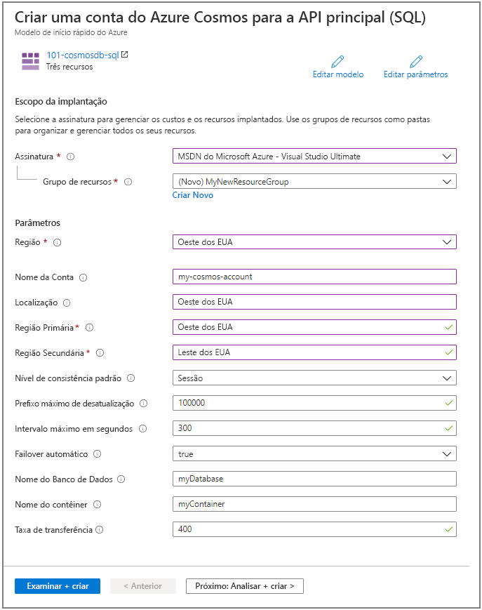
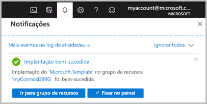

# <a name="quickstart-create-an-azure-cosmos-db-and-a-container-by-using-azure-resource-manager-template"></a>Início Rápido: Criar um Azure Cosmos DB e um contêiner usando um modelo do Azure Resource Manager

O Azure Cosmos DB é o serviço de banco de dados multimodelo distribuído globalmente da Microsoft. É possível usar o Azure Cosmos DB para criar e consultar rapidamente bancos de dados de chave/valor, de documentos e de grafo. Este início rápido concentra-se no processo de implantação de um modelo do Resource Manager para criar um banco de dados do Azure Cosmos e um contêiner dentro desse banco de dados. Posteriormente, você poderá armazenar dados nesse contêiner.

[!INCLUDE [About Azure Resource Manager](../../includes/resource-manager-quickstart-introduction.md)]

Se você não tiver uma assinatura do Azure, crie uma [conta gratuita](https://azure.microsoft.com/free/?WT.mc_id=A261C142F) antes de começar.

## <a name="prerequisites"></a>Pré-requisitos

Uma assinatura do Azure ou uma conta de avaliação gratuita do Azure Cosmos DB

- [!INCLUDE [quickstarts-free-trial-note](../../includes/quickstarts-free-trial-note.md)]

- [!INCLUDE [cosmos-db-emulator-docdb-api](../../includes/cosmos-db-emulator-docdb-api.md)]

## <a name="create-an-azure-cosmos-account-database-container"></a>Crie uma conta, um banco de dados e um contêiner do Azure Cosmos

### <a name="review-the-template"></a>Examinar o modelo

O modelo usado neste início rápido é proveniente dos [modelos de Início Rápido do Azure](https://azure.microsoft.com/resources/templates/101-cosmosdb-create/).

:::code language="json" source="~/quickstart-templates/101-cosmosdb-create/azuredeploy.json":::

Há três recursos do Azure definidos no modelo:

* [Microsoft.DocumentDB/databaseAccounts](/azure/templates/microsoft.documentdb/databaseaccounts): criar uma conta do Azure Cosmos.

* [Microsoft.DocumentDB/databaseAccounts/sqlDatabases](/azure/templates/microsoft.documentdb/databaseaccounts/sqldatabases): Criar um banco de dados do Azure Cosmos.

* [Microsoft.DocumentDB/databaseAccounts/sqlDatabases/containers](/azure/templates/microsoft.documentdb/databaseaccounts/sqldatabases/containers): Criar um contêiner do Azure Cosmos.

Mais exemplos de modelos do Azure Cosmos DB podem ser encontrados na [galeria de modelos de início rápido](https://azure.microsoft.com/resources/templates/?resourceType=Microsoft.Documentdb).

### <a name="deploy-the-template"></a>Implantar o modelo

1. Selecione a imagem a seguir para entrar no Azure e abrir um modelo. O modelo cria uma conta, um banco de dados e um contêiner do Azure Cosmos.

   <a href="https://portal.azure.com/#create/Microsoft.Template/uri/https%3A%2F%2Fraw.githubusercontent.com%2FAzure%2Fazure-quickstart-templates%2Fmaster%2F101-cosmosdb-create%2Fazuredeploy.json"></a>

2. Selecione ou insira os seguintes valores.

   

    A menos que seja especificado, use os valores padrão para criar os recursos do Azure Cosmos.

    * **Assinatura**: selecione uma assinatura do Azure.
    * **Grupo de recursos**: selecione **Criar novo**, insira um nome exclusivo para o grupo de recursos e, em seguida, clique em **OK**.
    * **Local**: selecione um local.  Por exemplo, **Centro dos EUA**.
    * **Nome da Conta**: o nome da conta do Azure Cosmos. Deve ser globalmente exclusivo.
    * **Localização**: insira uma localização em que você deseja criar sua conta do Azure Cosmos. A conta do Azure Cosmos pode estar na mesma localização que o grupo de recursos.
    * **Região Primária**: a região da réplica primária para a conta do Azure Cosmos.
    * **Região secundária**: a região da réplica secundária para a conta do Azure Cosmos.
    * **Nome do Banco de Dados**: o nome do banco de dados do Azure Cosmos.
    * **Nome do Contêiner**: o nome do contêiner do Azure Cosmos.
    * **Taxa de transferência**:  a taxa de transferência do contêiner, cujo valor mínimo é de 400 RU/s.
    * **Concordo com os termos e condições declarados acima**: selecione.

3. Selecione **Comprar**. Depois que a conta do Azure Cosmos for implantada com êxito, você receberá uma notificação:

   

O portal do Azure é usado para implantar o modelo. Além do portal do Azure, você também pode usar o Azure PowerShell, a CLI do Azure e a API REST. Para saber mais sobre outros métodos de implantação, confira [Implantar modelos](../azure-resource-manager/templates/deploy-powershell.md).

## <a name="validate-the-deployment"></a>Validar a implantação

Você pode usar o portal do Azure para verificar a conta do Azure Cosmos, o banco de dados e o contêiner ou usar o script da CLI do Azure ou do Azure PowerShell a seguir para listar o segredo criado.

# <a name="cli"></a>[CLI](#tab/CLI)

```azurecli-interactive
echo "Enter your Azure Cosmos account name:" &&
read cosmosAccountName &&
echo "Enter the resource group where the Azure Cosmos account exists:" &&
read resourcegroupName &&
az cosmosdb show -g $resourcegroupName -n $cosmosAccountName
```

# <a name="powershell"></a>[PowerShell](#tab/PowerShell)

```azurepowershell-interactive
$resourceGroupName = Read-Host -Prompt "Enter the resource group name where your Azure Cosmos account exists"
(Get-AzResource -ResourceType "Microsoft.DocumentDB/databaseAccounts" -ResourceGroupName $resourceGroupName).Name
 Write-Host "Press [ENTER] to continue..."
```

---

## <a name="clean-up-resources"></a>Limpar os recursos

Se desejar continuar trabalhando com os tutoriais seguintes, deixe esses recursos onde estão.
Quando não for mais necessário, exclua o grupo de recursos, o que excluirá a conta do Azure Cosmos e os recursos relacionados. Para excluir o grupo de recursos usando a CLI do Azure ou o Azure PowerShell:

# <a name="cli"></a>[CLI](#tab/CLI)

```azurecli-interactive
echo "Enter the Resource Group name:" &&
read resourceGroupName &&
az group delete --name $resourceGroupName &&
echo "Press [ENTER] to continue ..."
```

# <a name="powershell"></a>[PowerShell](#tab/PowerShell)

```azurepowershell-interactive
$resourceGroupName = Read-Host -Prompt "Enter the Resource Group name"
Remove-AzResourceGroup -Name $resourceGroupName
Write-Host "Press [ENTER] to continue..."
```

---

## <a name="next-steps"></a>Próximas etapas

Neste início rápido, você criou uma conta do Azure Cosmos, um banco de dados e um contêiner usando um modelo do Azure Resource Manager e validou a implantação. Para saber mais sobre o Azure Cosmos DB e o Azure Resource Manager, continue com os artigos abaixo.

- Leia uma [Visão geral do Azure Cosmos DB](introduction.md)
- Saiba mais sobre o [Azure Resource Manager](../azure-resource-manager/management/overview.md)
- Obtenha outros [Modelos do Azure Resource Manager para o Azure Cosmos DB](resource-manager-samples.md)