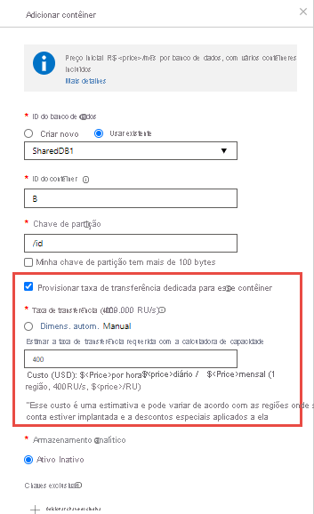

# Aprovisionar a taxa de transferência para contêineres e bancos de dados

Um banco de dados do Azure Cosmos é uma unidade de gerenciamento para um conjunto de contêineres. Um banco de dados é composto por um conjunto de contêineres independentes de esquema. Um contêiner do Azure Cosmos é a unidade de escalabilidade para taxa de transferência e armazenamento. Um contêiner é particionado horizontalmente em um conjunto de máquinas em uma região do Azure e é distribuído em todas as regiões do Azure associadas à sua conta do Azure Cosmos.

Com Azure Cosmos DB, você pode provisionar a taxa de transferência em duas granularidades:
 
- Contêineres do Azure Cosmos
- Bancos de dados do Azure Cosmos

## Definir taxa de transferência em um contêiner  

A taxa de transferência provisionada em um contêiner Cosmos do Azure é reservada exclusivamente para esse contêiner. O contêiner recebe a taxa de transferência provisionada o tempo todo. A taxa de transferência provisionada em um contêiner é respaldada financeiramente por SLAs. Para saber como configurar a taxa de transferência em um contêiner, confira [provisionar taxa de transferência em um contêiner Cosmos do Azure](how-to-provision-container-throughput.md).

Definir a taxa de transferência provisionada em um contêiner é a opção usada com mais frequência. Você pode dimensionar de forma elástica a taxa de transferência para um contêiner Provisionando qualquer quantidade de taxa de transferência usando as [unidades de solicitação (RUs)](request-units.md). 

A taxa de transferência provisionada em um contêiner do Azure Cosmos é distribuída uniformemente em todas as partições lógicas do contêiner. Não é possível especificar seletivamente a taxa de transferência para partições lógicas. Como uma ou mais partições lógicas de um contêiner são hospedadas por uma partição física, as partições físicas pertencem exclusivamente ao contêiner e dão suporte à taxa de transferência provisionada no contêiner. 

Se a carga de trabalho em execução em uma partição lógica consumir mais do que a taxa de transferência alocada para essa partição lógica, suas operações obterão uma taxa limitada. Quando a limitação de taxa ocorre, você pode aumentar a taxa de transferência provisionada para todo o contêiner ou tentar novamente as operações. Para saber mais sobre particionamento, confira [Partições lógicas](partition-data.md).

É recomendável configurar a taxa de transferência na granularidade do contêiner quando você quiser desempenho garantido para o contêiner.

A imagem a seguir mostra como uma partição física hospeda uma ou mais partições lógicas de um contêiner:

## Definir taxa de transferência em um banco de dados

Quando você provisiona a produtividade em um banco de dados Cosmos do Azure, a taxa de transferência é compartilhada entre todos os contêineres (chamados de contêineres de banco de dados compartilhados) no banco de dados. Uma exceção é se você especificou uma taxa de transferência provisionada em contêineres específicos no banco de dados. O compartilhamento da taxa de transferência provisionada no nível de banco de dados entre seus contêineres é análogo à Hospedagem de um banco de dados em um cluster de máquinas. Como todos os contêineres de um banco de dados compartilham os recursos disponíveis em um computador, evidentemente você não obtém o desempenho previsível em qualquer contêiner específico. Para saber como configurar a taxa de transferência provisionada em um banco de dados, consulte [Configurar a taxa de transferência provisionada em um banco de dados Cosmos do Azure](how-to-provision-database-throughput.md).

Definir a taxa de transferência em um banco de dados Cosmos do Azure garante que você receba a taxa de transferência provisionada para esse banco de dados o tempo todo. Como todos os contêineres do banco de dados compartilham a taxa de transferência provisionada, o Azure Cosmos DB não fornece nenhuma garantia de taxa de transferência previsível para um contêiner específico nesse banco de dados. A parte da taxa de transferência que um contêiner específico pode receber depende do seguinte:

* Número de contêineres.
* Escolha de chaves de partição para vários contêineres.
* Da distribuição da carga de trabalho entre várias partições lógicas dos contêineres. 

É recomendável que você configure a taxa de transferência em um banco de dados quando quiser compartilhar a taxa de transferência em vários contêineres, mas não quer dedicar a taxa de transferência a nenhum contêiner específico. 

Os exemplos a seguir demonstram onde é preferível provisionar a taxa de transferência no nível do banco de dados:

* Compartilhar a taxa de transferência provisionada de um banco de dados em um conjunto de contêineres é útil para um aplicativo multilocatário. Cada usuário pode ser representado por um contêiner do Azure Cosmos distinto.

* Compartilhar a taxa de transferência provisionada de um banco de dados em um conjunto de contêineres é útil quando você migra um banco de dados NoSQL, como MongoDB ou Cassandra, hospedado em um cluster de VMs ou de servidores físicos locais para o Azure Cosmos DB. Pense na taxa de transferência provisionada configurada no banco de dados do Azure Cosmos como um equivalente lógico, porém mais econômico e elástico, ao da capacidade de computação do cluster do MongoDB ou Cassandra.  

Todos os contêineres criados dentro de um banco de dados com taxa de transferência provisionada devem ser criados com uma [chave de partição](partition-data.md). Em qualquer momento determinado, a taxa de transferência alocada para um contêiner em um banco de dados é distribuída entre todas as partições lógicas desse contêiner. Quando você tem contêineres que compartilham a taxa de transferência provisionada configurada em um banco de dados, não é possível aplicar seletivamente a taxa de transferência a um contêiner específico ou a uma partição lógica. 

Se a carga de trabalho em uma partição lógica consumir mais do que a taxa de transferência alocada para uma partição lógica específica, suas operações serão limitadas por taxa. Quando a limitação de taxa ocorre, você pode aumentar a taxa de transferência do banco de dados inteiro ou tentar novamente as operações. Para saber mais sobre particionamento, confira [Partições lógicas](partition-data.md).

A taxa de transferência provisionada em um banco de dados pode ser compartilhada pelos contêineres dentro desse banco de dados. Cada novo contêiner na taxa de transferência compartilhada no nível do banco de dados exigirá 100 RU/s. Ao provisionar contêineres com oferta de banco de dados compartilhado:

* Cada 25 contêineres é agrupado em um conjunto de partições e a taxa de transferência do banco de dados (D) é compartilhada entre os contêineres no conjunto de partições. Se houver até 25 contêineres no banco de dados e em qualquer ponto no tempo, se você estiver usando apenas um contêiner, esse contêiner poderá usar uma taxa de transferência máxima de ' d'.

* Para cada novo contêiner criado após 25 contêineres, um novo conjunto de partições é criado e a taxa de transferência do banco de dados é dividida entre os novos conjuntos de partições criados (ou seja, D/2 para 2 conjuntos de partições, D/3 para 3 conjuntos de partições...). Em qualquer momento, se você estiver usando apenas um contêiner do banco de dados, ele poderá usar um máximo de (D/2, D/3, D/4... taxa de transferência), respectivamente. Dada a taxa de transferência reduzida, é recomendável que você não crie mais do que 25 contêineres em um banco de dados.

**Exemplo**

* Se você criar um banco de dados chamado "MyDB" com uma taxa de transferência provisionada de 10K RU/s.

* Se você provisionar 25 contêineres em "MyDB", todos os contêineres serão agrupados em um conjunto de partições. Em qualquer momento, se você estiver usando apenas um contêiner do banco de dados, ele poderá usar um máximo de 10K RU/s (D).

* Quando você provisiona o contêiner 26, um novo conjunto de partições é criado e a taxa de transferência é dividida igualmente entre os dois conjuntos de partições. Portanto, em qualquer ponto no tempo, se você estiver usando apenas um contêiner do banco de dados, ele poderá usar um máximo de 5K RU/s (D/2). Como há dois conjuntos de partições, o fator de compartilhamento de produtividade é dividido em D/2.

   A imagem a seguir demonstra o exemplo anterior graficamente:

   

Se suas cargas de trabalho envolvem excluir e recriar todas as coleções em um banco de dados, é recomendável descartar o banco de dados vazio e recriar um novo banco de dados antes da criação da coleção. A imagem a seguir mostra como uma partição física pode hospedar uma ou mais partições lógicas que pertencem a contêineres diferentes dentro de um banco de dados:

## Definir taxa de transferência em um banco de dados e um contêiner

É possível combinar os dois modelos. É permitido provisionar a taxa de transferência tanto no banco de dados como no contêiner. O exemplo a seguir mostra como provisionar a taxa de transferência em um banco de dados do Azure Cosmos e em um contêiner:

* Você pode criar um banco de dados Cosmos do Azure chamado *Z* com taxa de transferência provisionada de *"K"* RUs. 
* Em seguida, crie cinco contêineres chamados *a*, *B*, *C*, *D*e *e no banco de dados* . Ao criar o contêiner B, certifique-se de habilitar **provisionar taxa de transferência dedicada para essa** opção de contêiner e configurar explicitamente *"P"* RUs de taxa de transferência provisionada neste contêiner. Observe que você pode configurar a taxa de transferência compartilhada e dedicada somente ao criar o banco de dados e o contêiner. 

   

* A taxa de transferência de RUs *"K"* é compartilhada entre os quatro contêineres *a*, *C*, *D*e *e*. A quantidade exata de taxa de transferência disponível para *a*, *C*, *D*ou *E E* varia. Não há SLAs para taxa de transferência de cada contêiner individual.
* O contêiner chamado *B* tem a garantia de obter a taxa de transferência de RUs *"P"* o tempo todo. É respaldado por SLAs.

> [!NOTE]
> Um contêiner com taxa de transferência provisionada não pode ser convertido para o contêiner de banco de dados compartilhado. Por outro lado, um contêiner de banco de dados compartilhado não pode ser convertido para ter uma taxa de transferência dedicada.

## Atualizar a taxa de transferência em um banco de dados ou em um contêiner

Depois de criar um contêiner Cosmos do Azure ou um banco de dados, você pode atualizar a taxa de transferência provisionada. Não há limite para a taxa de transferência máxima provisionada que você pode configurar no banco de dados ou no contêiner. A taxa de transferência mínima provisionada depende dos seguintes fatores: 

* O tamanho máximo de dados que você já armazenou no contêiner
* A taxa de transferência máxima que você já provisiona no contêiner
* O número máximo de contêineres de Cosmos do Azure que você já criou em um banco de dados com taxa de transferência compartilhada. 

Você pode recuperar a taxa de transferência mínima de um contêiner ou de um banco de dados programaticamente usando os SDKs ou exibir o valor no portal do Azure. Ao usar o SDK do .NET, o método [DocumentClient. ReplaceOfferAsync](https://docs.microsoft.com/dotnet/api/microsoft.azure.documents.client.documentclient.replaceofferasync?view=azure-dotnet) permite que você dimensione o valor da taxa de transferência provisionada. Ao usar o SDK do Java, o método [Requestoptions. setOfferThroughput](sql-api-java-samples.md#offer-examples) permite que você dimensione o valor de taxa de transferência provisionado. 

Ao usar o SDK do .NET, o método [DocumentClient. ReadOfferAsync](https://docs.microsoft.com/dotnet/api/microsoft.azure.documents.client.documentclient.readofferasync?view=azure-dotnet) permite que você recupere a taxa de transferência mínima de um contêiner ou de um banco de dados. 

Você pode dimensionar a taxa de transferência provisionada de um contêiner ou de um banco de dados a qualquer momento. Quando uma operação de dimensionamento é executada para aumentar a taxa de transferência, ela pode levar mais tempo devido às tarefas do sistema para provisionar os recursos necessários. Você pode verificar o status da operação de dimensionamento em portal do Azure ou programaticamente usando os SDKs. Ao usar o SDK do .net, você pode obter o status da operação de dimensionamento usando o método `DocumentClient.ReadOfferAsync`.

## Comparação de modelos

|**Parâmetro**  |**Taxa de transferência provisionada em um banco de dados**  |**Taxa de transferência provisionada em um contêiner**|
|---------|---------|---------|
|Mínimo de RUs |400 (após os primeiros quatro contêineres, cada contêiner adicional irá exigir um mínimo de 100 RUs por segundo.) |400|
|Mínimo de RUs por contêiner|100|400|
|Máximo de RUs|Ilimitado, no banco de dados.|Ilimitado, no contêiner.|
|RUs atribuídas ou disponíveis para um contêiner específico|Sem garantias. RUs atribuídas a um determinado contêiner dependem das propriedades. As propriedades podem ser a escolha de chaves de partição de contêineres que compartilham a taxa de transferência, a distribuição da carga de trabalho e o número de contêineres. |Todas as RUs configuradas no contêiner são reservadas exclusivamente ao contêiner.|
|Armazenamento máximo para um contêiner|Ilimitado.|Ilimitado.|
|Taxa de transferência máxima por partição lógica de um contêiner|10 mil RUs|10 mil RUs|
|Taxa de transferência máxima (dados + índice) por partição lógica de um contêiner|10 GB|10 GB|

## Próximas etapas

* Saiba mais sobre [partições lógicas](partition-data.md).
* Saiba como [provisionar taxa de transferência em um contêiner do Azure Cosmos](how-to-provision-container-throughput.md).
* Saiba como [provisionar taxa de transferência em um banco de dados do Azure Cosmos DB](how-to-provision-database-throughput.md).

