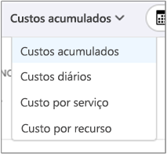
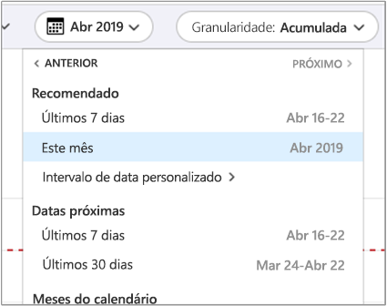
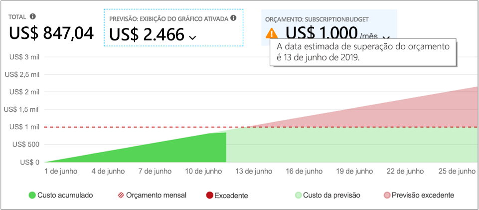
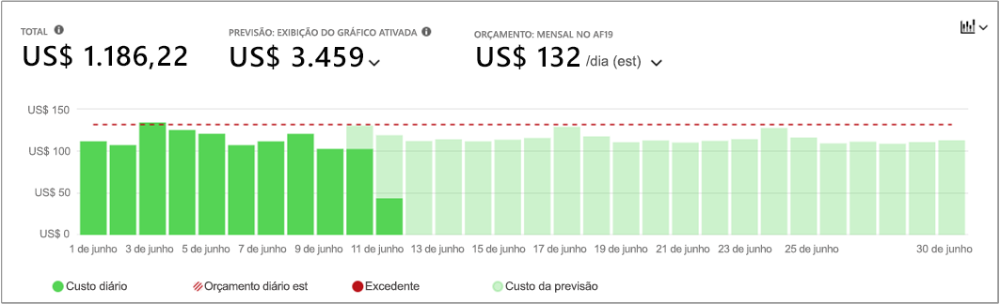
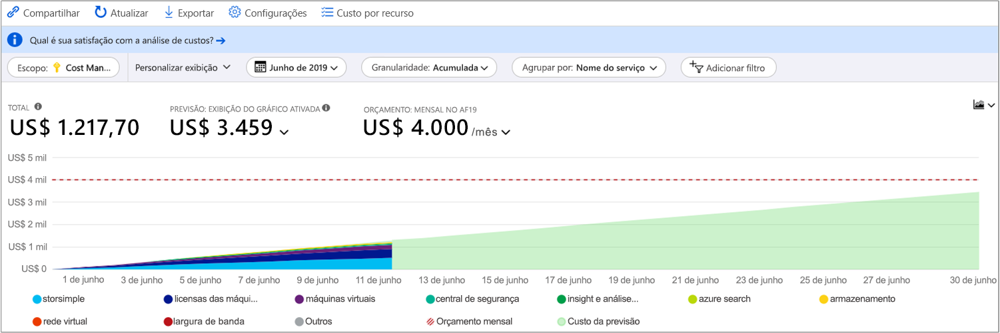
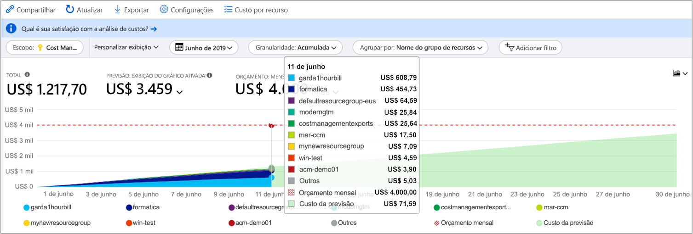
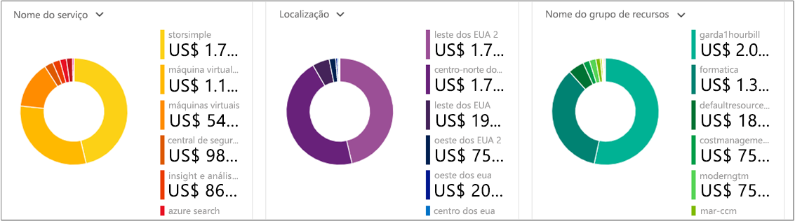
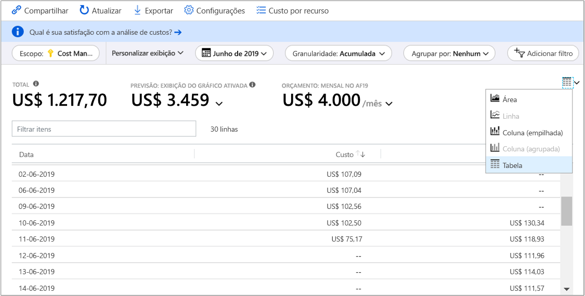

# <a name="quickstart-explore-and-analyze-costs-with-cost-analysis"></a>Início Rápido: Explorar e analisar os custos com a análise de custo

Antes de poder controlar e otimizar adequadamente seus custos do Azure, você precisa entender onde os custos se originaram em sua organização. Também é útil saber quanto custam os seus serviços e quais ambientes e sistemas recebem suporte. A visibilidade em todo o espectro de custos é fundamental para entender com precisão os padrões de gastos da organização. Você pode usar padrões de gastos para impor mecanismos de controle de custos, como orçamentos.

Neste início rápido, você usa a análise de custo para explorar e analisar seus custos organizacionais. Você pode visualizar os custos agregados por organização para entender onde os custos ocorrem ao longo do tempo e identificar tendências de gastos. Você pode visualizar os custos acumulados ao longo do tempo para estimar as tendências de custo mensais, trimestrais ou mesmo anuais em comparação a um orçamento. Um orçamento ajuda a fornecer aderência às restrições financeiras. E um orçamento é usado para visualizar os custos diários ou mensais para isolar as irregularidades de gastos. E, então, você pode baixar dados do relatório atual para análise posterior ou para usar em um sistema externo.

Neste guia de início rápido, você aprende a:

- Examine os custos de análise de custo
- Personalizar as exibições de custo
- Baixar dados de análise de custo

## <a name="prerequisites"></a>Pré-requisitos

A análise de custo dá suporte a diferentes tipos de conta do Azure. Para exibir a lista completa dos tipos de contas compatíveis, confira [Entender os dados do Gerenciamento de Custos](understand-cost-mgt-data.md). Para exibir os dados de custo, você precisará de, pelo menos, acesso de leitura em sua conta do Azure.

Para obter informações sobre como atribuir o acesso aos dados do Gerenciamento de Custos do Azure, confira [Atribuir acesso aos dados](./assign-access-acm-data.md).

Se você tiver uma nova assinatura, não poderá usar imediatamente os recursos do Gerenciamento de Custos. Poderá levar até 48 horas para você poder usar todos os recursos do Gerenciamento de Custos.

## <a name="sign-in-to-azure"></a>Entrar no Azure

- Entre no Portal do Azure em https://portal.azure.com.

## <a name="review-costs-in-cost-analysis"></a>Examine os custos de análise de custo

Para examinar os custos de análise de custo, abra o escopo no portal do Azure e selecione **Análise de custo** no menu. Por exemplo, navegue até **Inscrições**, selecione uma assinatura na lista e depois escolha **Análise de custo** no menu. Use o item **Escopo** para alterar para um escopo diferente na análise de custo.

O escopo que você seleciona é usado em todo o Gerenciamento de Custos para fornecer a consolidação de dados e para controlar o acesso a informações de custo. Ao usar escopos, você não faz multisseleção. Em vez disso, selecione um escopo mais amplo em que os outros fiquem acumulados e, em seguida, filtre os escopos aninhados de que você precisa. É importante compreender essa abordagem pois algumas pessoas podem não ter acesso a um escopo pai único, que abranja vários escopos aninhados.

Assista ao vídeo [como usar o Gerenciamento de Custos no portal do Azure](https://www.youtube.com/watch?v=mfxysF-kTFA) para saber mais sobre como usar a análise de custo. Para assistir a outros vídeos, visite o [Canal do YouTube do Gerenciamento de Custos](https://www.youtube.com/c/AzureCostManagement).

>[!VIDEO https://www.youtube.com/embed/mfxysF-kTFA]

A exibição inicial da análise de custos inclui as áreas a seguir.

**Exibição Custo acumulado**: representa a configuração de exibição de análise de custo predefinida. Cada exibição inclui as configurações de intervalo de datas, granularidade, agrupar por e filtrar. A exibição padrão mostra os custos acumulados para o período de cobrança atual, mas pode ser alterada para outras exibições internas.

**Custo real**: mostra os custos totais de uso e de compra para o mês atual, uma vez que eles são acumulados e serão exibidos na sua fatura.

**Previsão**: mostra o total de custos previstos para o período escolhido.

**Orçamento**: mostra o limite de gastos planejados para o escopo selecionado, se disponível.

**Granularidade acumulada**: mostra os custos diários totais agregados desde o início do período de cobrança. Depois que você criar um orçamento para sua conta de faturamento ou assinatura, poderá ver rapidamente sua tendência de gastos em relação ao orçamento. Passe o mouse sobre uma data para visualizar o custo acumulado desse dia.

**Gráficos dinâmicos (rosca)** : fornecem gráficos dinâmicos que dividem o custo total por um conjunto comum de propriedades padrão. Mostram dos maiores para os menores custos do mês atual. Você pode alterar gráficos dinâmicos a qualquer momento selecionando um pivô diferente. Os custos são categorizados por serviço (categoria do medidor), localização (região) e escopo filho por padrão. Por exemplo, contas de inscrição ficam em contas de faturamento, grupos de recursos ficam em assinaturas e recursos estão em grupos de recursos.


### <a name="understand-forecast"></a>Entender a previsão

A previsão de custos mostra uma projeção dos custos estimados para o período de tempo selecionado. O modelo tem base em um modelo de regressão de série temporal. Ele exige pelo menos 10 dias de dados de uso e de custo recentes para prever custos com precisão. Para um determinado período de tempo, o modelo de previsão exige partes iguais de dados de treinamento para o período de previsão. Por exemplo, uma projeção de três meses exige pelo menos três meses de dados de custo e de uso recentes.

O modelo usa no máximo seis meses de dados de treinamento para projetar os custos de um ano. No mínimo, ele precisa de sete dias de dados de treinamento para alterar sua previsão. A previsão tem base em mudanças drásticas, como picos e quedas, em padrões de custo e de uso. A previsão não gera projeções individuais para cada item nas propriedades **Agrupar por**. Ela fornece apenas uma previsão para os custos totais acumulados. Se você usar várias moedas, o modelo fornecerá a previsão apenas dos custos em USD.

Devido à dependência do modelo em picos e quedas de dados, grandes compras, como instâncias reservadas, farão com que sua previsão se torne artificialmente inflada. O período de previsão e o tamanho das compras afetam o tempo da previsão. A previsão retorna ao normal quando o gasto é estabilizado.

## <a name="customize-cost-views"></a>Personalizar as exibições de custo

A análise de custo tem quatro modos de exibição internos, otimizados para os objetivos mais comuns:

Visualizar | Responder a perguntas como
--- | ---
Custo acumulado | Quanto gastei até o momento neste mês? Será permanecer dentro do meu orçamento?
Custo diário | Houve algum aumento nos custos diários nos últimos 30 dias?
Custo por serviço | Qual foi a variação do meu uso mensal nas últimas três faturas?
Custo por recurso | Quais recursos custam mais até o momento neste mês?
Detalhes da fatura | Quais foram os custos na minha última fatura?



No entanto, existem muitos casos em que você precisa de uma análise mais profunda. A personalização começa no topo da página, com a seleção da data.

Análise de custo mostra os dados para o mês atual por padrão. Use o seletor de data para alternar para os intervalos de datas comuns rapidamente. Os exemplos incluem os últimos sete dias, o último mês, o ano atual ou um intervalo de datas personalizado. As assinaturas para pagamento conforme o uso também incluem os intervalos de datas com base em seu período de cobrança, que não está associado ao mês do calendário, como o período de cobrança atual ou a última fatura. Use os links **<ANTERIOR** e **PRÓXIMO>** na parte superior do menu para saltar para o período anterior ou seguinte, respectivamente. Por exemplo, **<ANTERIOR** alterna dos **Últimos sete dias** para **8 a 14 dias atrás** e, em seguida, **15 a 21 dias atrás**. Ao selecionar um intervalo de datas personalizado, tenha em mente que você pode selecionar até um ano inteiro (por exemplo, 1º de janeiro a 31 de dezembro).



A análise de custo mostra **custos acumulados** por padrão. Os custos acumulados incluem todos os custos para cada dia mais os dias anteriores, para uma visão em constante crescimento de seus custos diários agregados. Essa visualização é otimizada para mostrar como você está tendendo contra um orçamento para o período selecionado.

Ao usar a exibição de gráfico de previsão, você consegue identificar possíveis violações de orçamento. Quando há uma possível violação de orçamento, o excesso de gastos projetados é mostrado em vermelho. Um símbolo indicador também é mostrado no gráfico. Focalizar o símbolo mostra a data estimada da violação de orçamento.



Há também a visualização **diária** mostrando os custos para cada dia. O modo de exibição de diário não mostra uma tendência de crescimento. A exibição é projetada para mostrar irregularidades como picos de custos ou quedas diárias. Se você selecionar um orçamento, a visualização diária também mostra uma estimativa do orçamento diário.

Quando seus custos diários estão consistentemente acima do orçamento diário estimado, você pode esperar que seu orçamento mensal seja ultrapassado. O orçamento diário estimado é um meio de ajudar a visualizar seu orçamento em um nível inferior. Quando você tem flutuações nos custos diários, a comparação do orçamento diário estimado com o orçamento mensal é menos precisa.

Aqui está uma exibição diária dos gastos recentes com a previsão de gastos ativada.


Ao desligar a previsão de gastos, você não vê os gastos projetados para datas futuras. Além disso, quando você examina os custos para os períodos anteriores, a previsão de custo não mostra os custos.

Em geral, você pode esperar ver dados ou notificações para os recursos consumidos de 8 a 12 horas.

**Agrupar por** propriedades comuns para dividir os custos e identificar os principais colaboradores. Para agrupar por marcas de recurso, por exemplo, selecione a chave de marca pela qual deseja agrupar. Os custos estão divididos por cada valor de marca, com um segmento extra para recursos sem essa marca aplicada.

A maioria dos recursos do Azure permitem marcas. No entanto, algumas marcas não estão disponíveis no Gerenciamento de Custos e Cobrança. Além disso, não há suporte para marcas do grupo de recursos. O suporte para marcas aplica-se ao uso relatado *depois* da aplicação da marca ao recurso. As marcas não são aplicadas retroativamente para rollups de custo.

Assista ao vídeo [How to review tag policies with Azure Cost Management](https://www.youtube.com/watch?v=nHQYcYGKuyw) (Como revisar as políticas de marcação com o Gerenciamento de Custos do Azure) para saber mais sobre como usar a política de marcação do Azure a fim de melhorar a visibilidade dos dados de custo.

Aqui está uma exibição dos custos de serviço do Azure para o mês atual.



Por padrão, a análise de custo mostra todos os custos de uso e compra conforme eles são acumulados e serão exibidos na sua fatura, também conhecido como **Custo real**. A exibição do custo real é ideal para reconciliar sua fatura. No entanto, picos de compra no custo podem ser alarmantes quando você está atento a anomalias de gastos e outras alterações no custo. Para nivelar os picos causados pelos custos de compra de reserva, mude para **Custo amortizado**.


O custo amortizado detalha as compras de reserva em partes diárias e as distribui ao longo da duração do termo de reserva. Por exemplo, em vez de ver uma compra de US$ 365 em 1º de janeiro, você verá uma compra de US$ 1 todos os dias de 1º de janeiro a 31 de dezembro. Além da amortização básica, esses custos também são realocados e associados ao usar os recursos específicos que usaram a reserva. Por exemplo, se esse preço diário de US$ 1 for dividido entre duas máquinas virtuais, você verá dois preços de US$ 0,50 para o dia. Se parte da reserva não for utilizada para o dia, você verá um preço de US$ 0,50 associado à máquina virtual aplicável e outro preço de US$ 0,50 com um tipo de preço de `UnusedReservation`. Os custos de reserva não utilizados só podem ser vistos na exibição do custo amortizado.

Devido à alteração em como os custos são representados, é importante observar que o custo real e as exibições de custo amortizado mostram números totais diferentes. Em geral, o custo total de meses com uma compra de reserva diminuirá ao exibir os custos amortizados e os meses após a uma compra de reserva aumentarão. A amortização só está disponível para compras de reserva e não se aplica a compras do Azure Marketplace no momento.

A imagem a seguir mostra nomes de grupo de recursos. Você pode agrupar por tag para exibir os custos totais por tag ou usar a exibição **Custo por recurso** para ver todas as marcas para um recurso específico.



Ao agrupar os custos segundo um atributo específico, os 10 principais colaboradores de custo são mostrados do mais alto para o mais baixo. Se houver mais de 10, os nove principais colaboradores de custo serão mostrados com um grupo **Outros** que representa todos os grupos restantes combinados. Ao agrupar por marcas, você também poderá ver que o grupo **Sem marca** é exibido para custos sem a chave de marca aplicada. Os custos **Sem marca** aparecem sempre por último, mesmo que os custos sem marca sejam maiores do que os com marca. Os custos sem marca farão parte da categoria **Outros** se houver 10 ou mais valores de marca. Alterne para o modo de exibição de tabela e mude a granularidade para **Nenhum** para ver todos os valores classificados do maior para o menor custo.

As máquinas virtuais clássicas, as redes e os recursos de armazenamento não compartilham dados detalhados de cobrança. Eles são mesclados como **Serviços clássicos** quando os custos são agrupados.

Os gráficos dinâmicos sob os gráficos principais exibem diferentes agrupamentos para dar uma visão mais ampla dos custos gerais para o período de tempo e filtros selecionados. Selecione uma propriedade ou uma marca para exibir os custos agregados em qualquer dimensão.



Você pode exibir o conjunto de dados completo de qualquer exibição. As seleções ou os filtros aplicados afetam os dados apresentados. Para ver o conjunto de dados completo, selecione a lista **tipo de gráfico** e a exibição **Tabela**.



## <a name="saving-and-sharing-customized-views"></a>Como salvar e compartilhar exibições personalizadas

Salve e compartilhe exibições personalizadas com outras pessoas fixando a análise de custo ao painel do portal do Azure ou copiando um link para análise de custo.

Assista ao vídeo [Como compartilhar e salvar exibições no Gerenciamento de Custos do Azure](https://www.youtube.com/watch?v=kQkXXj-SmvQ) para saber mais sobre como usar o portal para compartilhar conhecimento sobre custos em toda a sua organização. Para assistir a outros vídeos, visite o [Canal do YouTube do Gerenciamento de Custos](https://www.youtube.com/c/AzureCostManagement).

>[!VIDEO https://www.youtube.com/embed/kQkXXj-SmvQ]

Para fixar a análise de custo, selecione o ícone de fixação no canto superior direito ou logo após "<Subscription Name> | Análise de custo". Fixar a análise de custo salvará apenas a exibição principal de gráfico ou a tabela. Compartilhe o painel para dar a outras pessoas acesso ao bloco. Isso apenas compartilha a configuração do painel e não permite acesso a outras pessoas aos dados subjacentes. Se você não tiver acesso aos custos, mas tiver acesso a um painel compartilhado, verá a mensagem "acesso negado".

Para compartilhar um link para a análise de custo, selecione **Compartilhar** na parte superior da janela. Uma URL personalizada será mostrada, abrindo a exibição específica para esse escopo específico. Se você não tiver acesso aos custos e receber essa URL, verá a mensagem de "acesso negado".

## <a name="download-usage-data"></a>Baixar os dados de uso

### <a name="portal"></a>[Portal](#tab/azure-portal)

Às vezes você precisa baixar os dados para análise posterior, mesclá-lo com seus próprios dados ou integrá-los a seus próprios sistemas. O Gerenciamento de Custos oferece algumas opções diferentes. Como ponto de partida, se você precisar de um resumo rápido de alto nível, como o que se obtém na análise de custo, crie a exibição necessária. Em seguida, baixe-a selecionando **Exportar** e depois **Baixar dados como CSV** ou **Baixar dados no Excel**. O download para Excel fornece mais contexto sobre a exibição que você usou para gerar o download, como escopo, configuração de consulta, totais e data da geração.

Se você precisar do conjunto de dados completo não agregado, baixe-o da conta de cobrança. Em seguida, na lista de serviços no painel de navegação esquerdo do portal, acesse **Gerenciamento de Custos + Cobrança**. Selecione a conta de cobrança, se aplicável. Acesse **Uso + encargos** e selecione o ícone **Baixar** do período de cobrança.

### <a name="azure-cli"></a>[CLI do Azure](#tab/azure-cli)

Comece preparando seu ambiente para a CLI do Azure:

[!INCLUDE [azure-cli-prepare-your-environment-no-header.md](../../../includes/azure-cli-prepare-your-environment-no-header.md)]

Depois de entrar, use o comando [az costmanagement query](/cli/azure/ext/costmanagement/costmanagement#ext_costmanagement_az_costmanagement_query) para consultar as informações de uso do mês atual da sua assinatura:

```azurecli
az costmanagement query --timeframe MonthToDate --type Usage \
   --scope "subscriptions/00000000-0000-0000-0000-000000000000"
```

Restrinja também a consulta usando o parâmetro **--dataset-filter** ou outros parâmetros:

```azurecli
az costmanagement query --timeframe MonthToDate --type Usage \
   --scope "subscriptions/00000000-0000-0000-0000-000000000000" \
   --dataset-filter "{\"and\":[{\"or\":[{\"dimension\":{\"name\":\"ResourceLocation\",\"operator\":\"In\",\"values\":[\"East US\",\"West Europe\"]}},{\"tag\":{\"name\":\"Environment\",\"operator\":\"In\",\"values\":[\"UAT\",\"Prod\"]}}]},{\"dimension\":{\"name\":\"ResourceGroup\",\"operator\":\"In\",\"values\":[\"API\"]}}]}"
```

O parâmetro **--dataset-filter** usa uma cadeia de caracteres JSON ou `@json-file`.

Você também tem a opção de usar os comandos [az costmanagement export](/cli/azure/ext/costmanagement/costmanagement/export) para exportar os dados de uso para uma conta de armazenamento do Azure. Baixe os dados nela.

1. Crie um grupo de recursos ou use um existente. Para criar um grupo de recursos, execute o comando [az group create](/cli/azure/group#az_group_create):

   ```azurecli
   az group create --name TreyNetwork --location "East US"
   ```

1. Crie uma conta de armazenamento para receber as exportações ou use uma conta de armazenamento existente. Para criar uma conta, use o comando [az storage account create](/cli/azure/storage/account#az_storage_account_create):

   ```azurecli
   az storage account create --resource-group TreyNetwork --name cmdemo
   ```

1. Execute o comando [az costmanagement export create](/cli/azure/ext/costmanagement/costmanagement/export#ext_costmanagement_az_costmanagement_export_create) para criar a exportação:

   ```azurecli
   az costmanagement export create --name DemoExport --type Usage \
   --scope "subscriptions/00000000-0000-0000-0000-000000000000" --storage-account-id cmdemo \
   --storage-container democontainer --timeframe MonthToDate --storage-directory demodirectory
   ```

---

## <a name="clean-up-resources"></a>Limpar os recursos

- Se você fixou uma exibição personalizada para análise de custo e não precisa mais dela, acesse o painel em que a fixou e exclua a exibição fixada.
- Se você baixou os arquivos de dados de uso e não precisa mais deles, lembre-se de excluí-los.

## <a name="next-steps"></a>Próximas etapas

Avance para o primeiro tutorial para aprender como criar e gerenciar orçamentos.

> [!div class="nextstepaction"]
> [Crie e gerencie orçamentos](tutorial-acm-create-budgets.md)