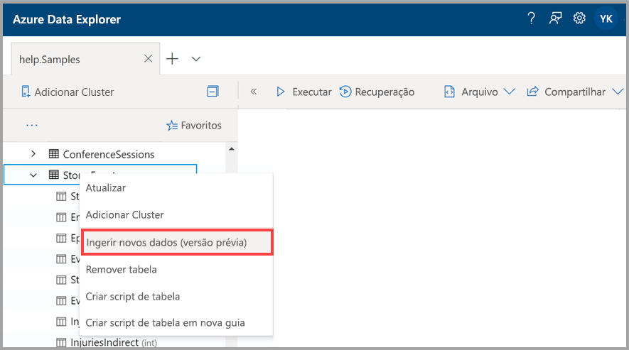
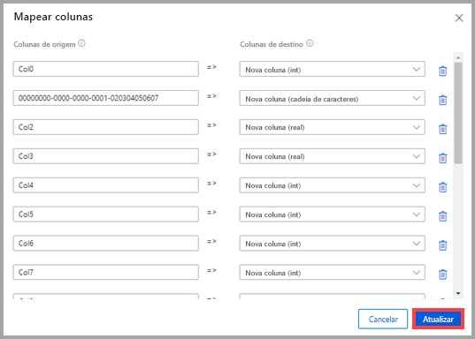
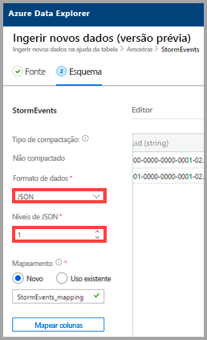
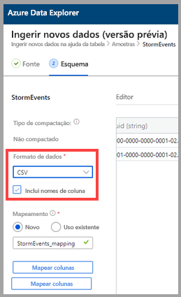
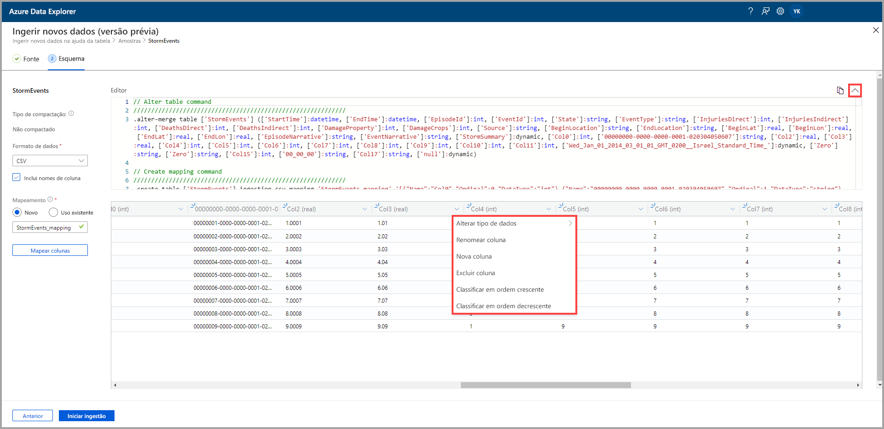
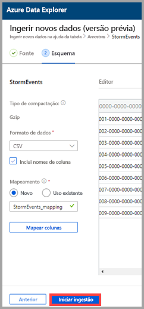

# Usar a ingestão com um clique para ingerir dados em uma tabela existente no Azure Data Explorer

A ingestão com um clique permite ingerir rapidamente dados em JSON, CSV e outros formatos em uma tabela. Usando a interface do usuário da Web do Azure Data Explorer, você pode ingerir dados do armazenamento, de um arquivo local ou de um contêiner. 

Este documento descreve como usar o assistente intuitivo com um clique para ingerir dados JSON de um arquivo em uma tabela existente. Em seguida, você poderá editar a tabela e executar consultas com a interface do usuário da Web do Azure Data Explorer.

A ingestão com um clique é particularmente útil ao ingerir dados pela primeira vez ou quando o esquema dos dados não é conhecido para você. 

Para obter uma visão geral da ingestão com um clique e uma lista de pré-requisitos, confira [Ingestão com um clique](ingest-data-one-click.md).
Para obter informações sobre a ingestão de dados em uma nova tabela do Azure Data Explorer, confira [Ingestão com um clique em uma nova tabela](one-click-ingestion-new-table.md)

## Ingerir novos dados

1. No menu à esquerda da interface do usuário da Web, clique com o botão direito do mouse em um *banco de dados* ou uma *tabela* e selecione **Ingerir novos dados (versão prévia)** .

       
 
1. Na janela **Ingerir novos dados (versão prévia)** , a guia **Origem** é selecionada automaticamente.

1. Se o campo **Tabela** não for preenchido automaticamente, selecione um nome de tabela existente no menu suspenso.
    > [!TIP]
    > Se você selecionar **Ingerir novos dados (versão prévia)** em uma linha de *tabela*, o nome da tabela selecionada será exibido nos **Detalhes do Projeto**.

[!INCLUDE [data-explorer-one-click-ingestion-types](../../includes/data-explorer-one-click-ingestion-types.md)]
    
Selecione **Editar esquema** para ver e editar a configuração da coluna da tabela.

## Editar o esquema

1. A caixa de diálogo **Mapear colunas** será aberta e você poderá mapear colunas dos dados de origem para colunas da tabela de destino. 
    * Nos campos **Colunas de origem**, insira nomes de colunas a serem mapeados com as **Colunas de destino**.
    * Para excluir um mapeamento, selecione o ícone de lixeira.

    

1. Selecione **Atualização**.
1. Na guia **Esquema**:
    1. Selecione **Tipo de compactação** e, em seguida, **Descompactado** ou **GZip**.

        [!INCLUDE [data-explorer-one-click-ingestion-edit-schema](../../includes/data-explorer-one-click-ingestion-edit-schema.md)]
        
    1. Se você escolher **JSON**, também deverá escolher **Níveis de JSON**, de 1 a 10. Os níveis afetam a representação de dados da coluna de tabela.

    

    * Se você selecionar um formato diferente de JSON, marque a caixa de seleção **Incluir nomes de coluna** para ignorar a linha do título do arquivo.
        
    

    > [!Note]
    > Os formatos de tabela podem ingerir dados de coluna em apenas uma coluna em uma tabela do Azure Data Explorer. 

    * Novos mapeamentos são definidos automaticamente, mas você pode alterá-los para usar um existente. 
    * Selecione **Mapear colunas** para abrir a janela **Mapear colunas**.

## Copiar e colar consultas

1. Acima do painel do **Editor**, selecione o botão **v** para abrir o editor. No editor, você pode ver e copiar os comandos automáticos gerados com base nas entradas. 
1. Na tabela: 
    * Selecione novos cabeçalhos de coluna para adicionar uma **Nova coluna**, **Excluir colunas**, **Classificar em ordem crescente** ou **Classificar em ordem decrescente**. Nas colunas existentes, somente a classificação de dados está disponível.

    > [!Note]
    > * Não é possível atualizar o nome e o tipo de dados das tabelas existentes.
    > * Os comandos DROP só reverterão as alterações feitas pelo fluxo de ingestão (novas extensões e colunas). Nada mais será removido.

 

## Iniciar ingestão

Selecione **Iniciar ingestão** para criar uma tabela e um mapeamento e para iniciar a ingestão de dados.

## Ingestão de dados concluída

Na janela **Ingestão de dados concluída**, todas as três etapas serão assinaladas com marcas de seleção verdes se a ingestão de dados for concluída com êxito.
 

[!INCLUDE [data-explorer-one-click-ingestion-query-data](../../includes/data-explorer-one-click-ingestion-query-data.md)]

## Próximas etapas

* [Consultar dados na interface do usuário da Web do Azure Data Explorer](/azure/data-explorer/web-query-data)
* [Escrever consultas para o Azure Data Explorer usando a linguagem de consulta Kusto](/azure/data-explorer/write-queries)
