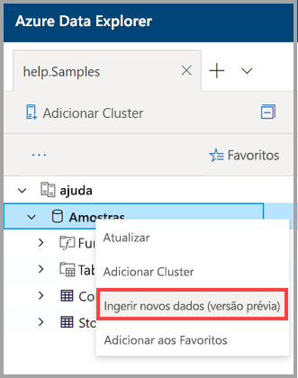
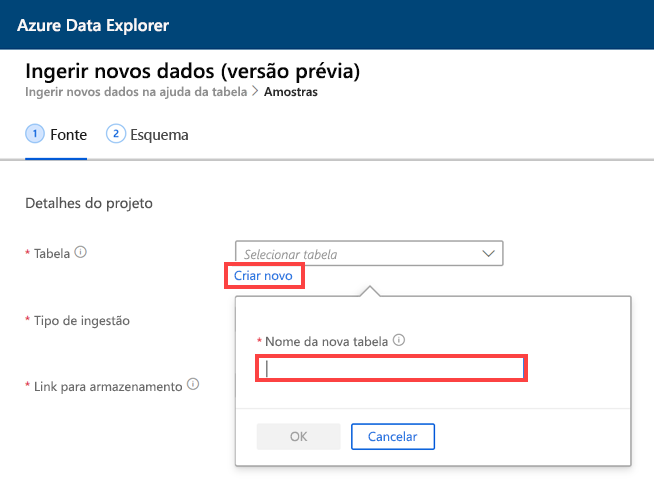
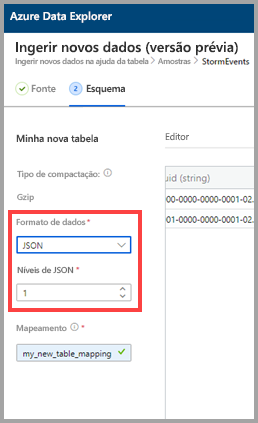
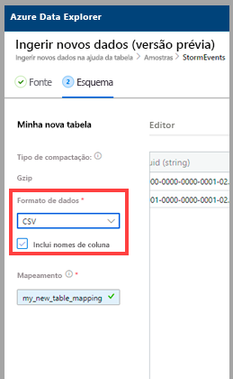
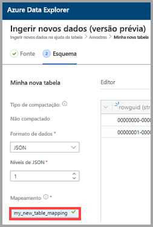
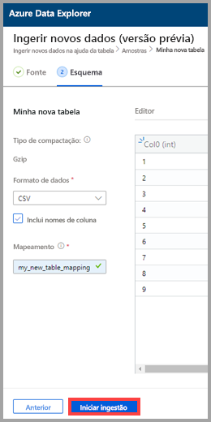
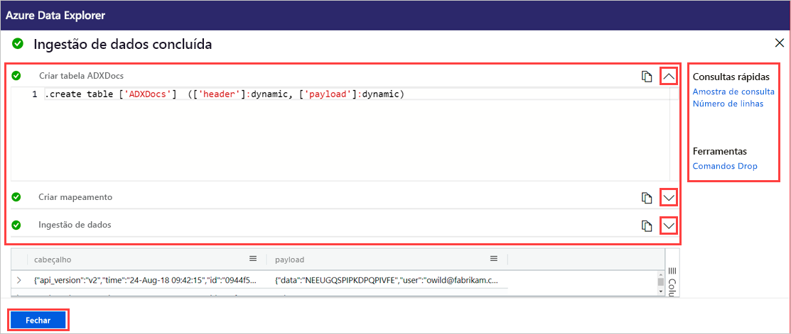

# Usar a ingestão com um clique para ingerir dados em uma nova tabela no Azure Data Explorer

A ingestão com um clique permite ingerir rapidamente dados em JSON, CSV e outros formatos em uma tabela. Usando a interface do usuário da Web do Azure Data Explorer, você pode ingerir dados do armazenamento, de um arquivo local ou de um contêiner. 

Este documento descreve como usar o assistente intuitivo com um clique para ingerir dados CSV de um contêiner em uma nova tabela. Em seguida, você poderá editar a tabela e executar consultas com a interface do usuário da Web do Azure Data Explorer. Defina também a ingestão contínua para ingerir dados automaticamente na tabela quando os dados de origem forem atualizados.

A ingestão com um clique é particularmente útil ao ingerir dados pela primeira vez ou quando o esquema dos dados não é conhecido para você. 

Para obter uma visão geral da ingestão com um clique e uma lista de pré-requisitos, confira [Ingestão com um clique](ingest-data-one-click.md).
Para obter informações sobre a ingestão de dados em uma tabela existente do Azure Data Explorer, confira [Ingestão com um clique em uma tabela existente](one-click-ingestion-existing-table.md)

## Ingerir novos dados

1. No menu à esquerda da interface do usuário da Web, clique com o botão direito do mouse em um *banco de dados* e selecione **Ingerir novos dados (versão prévia)** .

       
 
1. Na janela **Ingerir novos dados (versão prévia)** , a guia **Origem** é selecionada automaticamente. 

1. Selecione **Criar tabela** e insira um nome para a nova tabela. Você pode usar caracteres alfanuméricos, hifens e sublinhados. Não há suporte para caracteres especiais.

 

[!INCLUDE [data-explorer-one-click-ingestion-types](../../includes/data-explorer-one-click-ingestion-types.md)]

Selecione **Editar esquema** para ver e editar a configuração da coluna da tabela. O sistema selecionará um dos blobs aleatoriamente e o esquema será gerado com base nesse blob. Ao examinar o nome da origem, o serviço identifica automaticamente se ele está compactado ou não.

## Editar o esquema

1. Na guia **Esquema**:

    1. Selecione **Formato de dados**:

        [!INCLUDE [data-explorer-one-click-ingestion-edit-schema](../../includes/data-explorer-one-click-ingestion-edit-schema.md)]

    1. Se você escolher **JSON**, também deverá escolher **Níveis de JSON**, de 1 a 10. Os níveis afetam a representação de dados da coluna de tabela. 

    

    * Se você selecionar um formato diferente de JSON, marque a caixa de seleção **Incluir nomes de coluna** para ignorar a linha do título do arquivo.

        
        
1. No campo **Nome do mapeamento**, insira um nome de mapeamento. Você pode usar caracteres alfanuméricos e sublinhados. Não há suporte para espaços, caracteres especiais nem hifens.
    
    

## Copiar e colar consultas

1. Acima do painel do **Editor**, selecione o botão **v** para abrir o editor. No editor, você pode ver e copiar as consultas automáticas geradas com base nas entradas. 
1. Na tabela: 
    * Clique duas vezes no nome da nova coluna a ser editada.
    * Selecione novos cabeçalhos de coluna e siga um dos seguintes procedimentos:
    
|Ação         |Descrição                                  |
|-----------------|-------------------------------------------|
|Alterar tipo de dados |Alterar o tipo de dados de um selecionado automaticamente pelo serviço para um dos outros [tipos de dados compatíveis](#edit-the-schema)|
|Renomear coluna    |Alterar o nome da coluna |
|Nova coluna       |Adicionar uma nova coluna|
|Excluir coluna    |Excluir a coluna selecionada|
|Classificar em ordem crescente   |Classificar a tabela pela coluna selecionada em ordem crescente (somente as colunas existentes)|
|Classificar em ordem decrescente  |Classificar a tabela pela coluna selecionada em ordem decrescente (somente as colunas existentes) |

> [!Note]
> Para formatos de tabela, cada coluna pode ser ingerida em uma coluna do Azure Data Explorer.
> Você pode criar colunas de diferentes níveis de JSON.

 

## Iniciar ingestão

Selecione **Iniciar ingestão** para criar uma tabela e um mapeamento e para iniciar a ingestão de dados.

## Ingestão de dados concluída

Na janela **Ingestão de dados concluída**, todas as três etapas serão assinaladas com marcas de seleção verdes se a ingestão de dados for concluída com êxito.
 

[!INCLUDE [data-explorer-one-click-ingestion-query-data](../../includes/data-explorer-one-click-ingestion-query-data.md)]

**Ingestão contínua**

A ingestão contínua permite que você crie uma grade de eventos que escuta o contêiner de origem. Qualquer novo blob que atenda aos critérios dos parâmetros predefinidos (prefixo, sufixo etc.) será automaticamente ingerido na tabela de destino.

> [!Note]
> A ingestão contínua só é relevante durante a ingestão de um contêiner.

1. Selecione **Ingestão contínua** para abrir o portal do Azure. A página de conexão de dados é aberta com o conector de dados da grade de eventos aberto e com os parâmetros de origem e destino já inseridos (contêiner de origem, tabelas e mapeamentos).

1. Selecione **Criar** para criar uma conexão de dados que escutará as alterações no contêiner desse contêiner. 

## Próximas etapas

* [Consultar dados na interface do usuário da Web do Azure Data Explorer](/azure/data-explorer/web-query-data)
* [Escrever consultas para o Azure Data Explorer usando a linguagem de consulta Kusto](/azure/data-explorer/write-queries)
