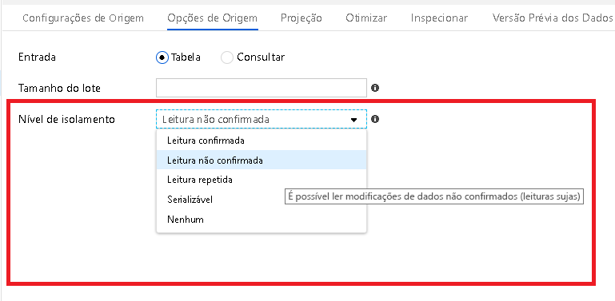
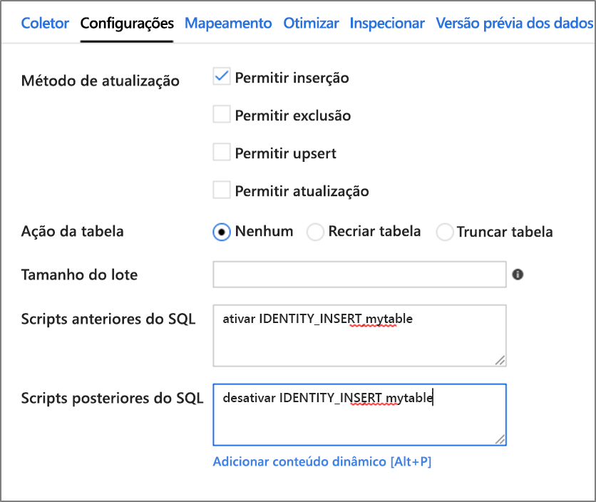

# <a name="copy-and-transform-data-in-azure-synapse-analytics-by-using-azure-data-factory"></a>Copiar e transformar dados no Azure Synapse Analytics usando Azure Data Factory

> [!div class="op_single_selector" title1="Selecione a versão do serviço Data Factory que você está usando:"]
>
> - [Versão 1](v1/data-factory-azure-sql-data-warehouse-connector.md)
> - [Versão atual](connector-azure-sql-data-warehouse.md)

[!INCLUDE[appliesto-adf-asa-md](includes/appliesto-adf-asa-md.md)]

Este artigo descreve como usar a atividade de cópia no Azure Data Factory para copiar dados de e para o Azure Synapse Analytics e usar o Fluxo de Dados para transformar dados no Azure Data Lake Storage Gen2. Para saber mais sobre o Azure Data Factory, leia as [artigo introdutório](introduction.md).

## <a name="supported-capabilities"></a>Funcionalidades com suporte

Este conector do Azure Synapse Analytics é compatível com as seguintes atividades:

- [Atividade de cópia](copy-activity-overview.md) com tabela de [matriz de origem/coletor compatível](copy-activity-overview.md)
- [Fluxo de dados de mapeamento](concepts-data-flow-overview.md)
- [Atividade de pesquisa](control-flow-lookup-activity.md)
- [Atividade GetMetadata](control-flow-get-metadata-activity.md)

Para a atividade de cópia, este conector do Azure Synapse Analytics é compatível com estas funções:

- Copie os dados usando a autenticação de token do Aplicativo Azure AD (Azure Active Directory) e autenticação do SQL com uma entidade de serviço ou identidades gerenciadas para recursos do Azure.
- Como uma fonte, recupere dados usando uma consulta SQL ou procedimento armazenado. Você também pode optar por copiar paralelamente de uma fonte do Azure Synapse Analytics, consulte a seção [cópia paralela do Azure Synapse Analytics](#parallel-copy-from-azure-synapse-analytics) para obter detalhes.
- Como um coletor, carregue dados usando o [polybase](#use-polybase-to-load-data-into-azure-synapse-analytics) ou a [instrução de cópia](#use-copy-statement) ou BULK INSERT. Recomendamos o polybase ou a instrução de cópia para melhor desempenho de cópia. O conector também dá suporte à criação automática da tabela de destino se não existir com base no esquema de origem.

> [!IMPORTANT]
> Se você copiar dados usando Azure Data Factory Integration Runtime, configure uma [regra de firewall no nível de servidor](../azure-sql/database/firewall-configure.md) para que os serviços do Azure possam acessar o [SQL Server lógico](../azure-sql/database/logical-servers.md).
> Se você copiar dados usando um tempo de execução de integração auto-hospedado, configure o firewall para permitir o intervalo de IP apropriado. Esse intervalo inclui o IP do computador usado para se conectar ao Azure Synapse Analytics.

## <a name="get-started"></a>Introdução

> [!TIP]
> Para obter o melhor desempenho, use o polybase ou a instrução de cópia para carregar dados no Azure Synapse Analytics. O [uso do polybase para carregar dados no Azure Synapse Analytics](#use-polybase-to-load-data-into-azure-synapse-analytics) e [use a instrução Copy para carregar dados em seções do Azure Synapse Analytics](#use-copy-statement) têm detalhes. Para ver um passo a passo com um caso de uso, confira [Carregar 1 TB no Azure Synapse Analytics em menos de 15 minutos com o Azure Data Factory](load-azure-sql-data-warehouse.md).

[!INCLUDE [data-factory-v2-connector-get-started](../../includes/data-factory-v2-connector-get-started.md)]

As seções a seguir fornecem detalhes sobre propriedades que definem entidades do Data Factory específicas para um conector do Azure Synapse Analytics.

## <a name="linked-service-properties"></a>Propriedades do serviço vinculado

As seguintes propriedades são compatíveis com um serviço vinculado do Azure Synapse Analytics:

| Propriedade            | Descrição                                                  | Obrigatório                                                     |
| :------------------ | :----------------------------------------------------------- | :----------------------------------------------------------- |
| type                | A propriedade type deve ser definida como  **AzureSqlDW**.             | Sim                                                          |
| connectionString    | Especifique as informações necessárias para conectar-se à instância do Azure Synapse Analytics para a propriedade **connectionString**. <br/>Marque esse campo como SecureString para armazená-lo com segurança no Data Factory. Você também pode colocar uma senha/chave da entidade de serviço no Azure Key Vault e se sua autenticação do SQL efetua pull da configuração da `password` da cadeia de conexão. Veja o exemplo de JSON abaixo da tabela e o artigo [Armazenar credenciais no Azure Key Vault](store-credentials-in-key-vault.md) que fornece mais detalhes. | Sim                                                          |
| servicePrincipalId  | Especifique a ID do cliente do aplicativo.                         | Sim, quando você usa a autenticação do Azure AD com uma entidade de serviço. |
| servicePrincipalKey | Especifique a chave do aplicativo. Marque este campo como uma SecureString para armazená-la com segurança no Data Factory ou [faça referência a um segredo armazenado no Azure Key Vault](store-credentials-in-key-vault.md). | Sim, quando você usa a autenticação do Azure AD com uma entidade de serviço. |
| locatário              | Especifique as informações de locatário (domínio nome ou ID do Locatário) em que o aplicativo reside. É possível recuperá-lo focalizando o canto superior direito do portal do Azure. | Sim, quando você usa a autenticação do Azure AD com uma entidade de serviço. |
| azureCloudType | Para autenticação de entidade de serviço, especifique o tipo de ambiente de nuvem do Azure no qual seu aplicativo do Azure AD está registrado. <br/> Os valores permitidos são `AzurePublic` ,, `AzureChina` `AzureUsGovernment` e `AzureGermany` . Por padrão, o ambiente de nuvem do data factory é usado. | Não |
| connectVia          | O [runtime de integração](concepts-integration-runtime.md) a ser usado para se conectar ao armazenamento de dados. Você pode usar o Azure Integration runtime ou um runtime de integração auto-hospedada (se o seu armazenamento de dados estiver localizado em uma rede privada). Se não for especificado, ele usa o Integration Runtime padrão do Azure. | Não                                                           |

Para diferentes tipos de autenticação, consulte as seções a seguir sobre pré-requisitos e amostras JSON, respectivamente:

- [Autenticação do SQL](#sql-authentication)
- Uso da autenticação de token do aplicativo Azure Active Directory: [Entidade de serviço](#service-principal-authentication)
- Uso da autenticação de token do aplicativo Azure Active Directory: [Identidades gerenciadas para os recursos do Azure](#managed-identity)

>[!TIP]
>Ao criar um serviço vinculado para o pool SQL sem **servidor** do Azure Synapse da interface do usuário, escolha "inserir manualmente" em vez de navegar pela assinatura.

>[!TIP]
>Se ocorrer erro com código de erro como "UserErrorFailedToConnectToSqlServer" e mensagem como "O limite da sessão para o banco de dados é XXX e foi atingido.", adicione `Pooling=false` à cadeia de conexão e tente novamente.

### <a name="sql-authentication"></a>Autenticação SQL

#### <a name="linked-service-example-that-uses-sql-authentication"></a>Exemplo de serviço vinculado que usa autenticação SQL

```json
{
    "name": "AzureSqlDWLinkedService",
    "properties": {
        "type": "AzureSqlDW",
        "typeProperties": {
            "connectionString": "Server=tcp:<servername>.database.windows.net,1433;Database=<databasename>;User ID=<username>@<servername>;Password=<password>;Trusted_Connection=False;Encrypt=True;Connection Timeout=30"
        },
        "connectVia": {
            "referenceName": "<name of Integration Runtime>",
            "type": "IntegrationRuntimeReference"
        }
    }
}
```

**Senha no Azure Key Vault:**

```json
{
    "name": "AzureSqlDWLinkedService",
    "properties": {
        "type": "AzureSqlDW",
        "typeProperties": {
            "connectionString": "Server=tcp:<servername>.database.windows.net,1433;Database=<databasename>;User ID=<username>@<servername>;Trusted_Connection=False;Encrypt=True;Connection Timeout=30",
            "password": {
                "type": "AzureKeyVaultSecret",
                "store": {
                    "referenceName": "<Azure Key Vault linked service name>",
                    "type": "LinkedServiceReference"
                },
                "secretName": "<secretName>"
            }
        },
        "connectVia": {
            "referenceName": "<name of Integration Runtime>",
            "type": "IntegrationRuntimeReference"
        }
    }
}
```

### <a name="service-principal-authentication"></a>Autenticação de entidade de serviço

Para usar a autenticação de token de aplicativo do Azure AD com base em entidade de serviço, siga estas etapas:

1. **[Crie um aplicativo do Azure Active Directory](../active-directory/develop/howto-create-service-principal-portal.md#register-an-application-with-azure-ad-and-create-a-service-principal)** no portal do Azure. Anote o nome do aplicativo e os seguintes valores que definem o serviço vinculado:

   - ID do aplicativo
   - Chave do aplicativo
   - ID do locatário

2. **[Provisione um administrador de Azure Active Directory](../azure-sql/database/authentication-aad-configure.md#provision-azure-ad-admin-sql-database)** para seu servidor no portal do Azure se ainda não tiver feito isso. O administrador do Azure AD pode ser um usuário ou um grupo do Azure AD. Se você conceder uma função de administrador ao grupo com a identidade gerenciada, ignore as etapas 3 e 4. O administrador terá acesso completo ao banco de dados.

3. **[ Crie usuários de banco de dados contidos](../azure-sql/database/authentication-aad-configure.md#create-contained-users-mapped-to-azure-ad-identities)** para o diretor de serviços. Conecte-se ao data warehouse de ou para o qual você deseja copiar dados usando ferramentas como SSMS, com uma identidade do Azure AD que tenha pelo menos a permissão ALTER ANY USER. Execute o seguinte T-SQL:
  
    ```sql
    CREATE USER [your application name] FROM EXTERNAL PROVIDER;
    ```

4. **Conceda ao principal de serviço as permissões necessárias**, como faria normalmente para usuários do SQL ou outros. Execute o código a seguir ou veja mais opções [aqui](/sql/relational-databases/system-stored-procedures/sp-addrolemember-transact-sql). Se você quiser usar o PolyBase para carregar os dados, aprenda a [permissão de banco de dados necessária](#required-database-permission).

    ```sql
    EXEC sp_addrolemember db_owner, [your application name];
    ```

5. **Configure um serviço vinculado do Azure Synapse Analytics** no Azure Data Factory.

#### <a name="linked-service-example-that-uses-service-principal-authentication"></a>Exemplo de serviço vinculado que usa autenticação principal de serviço

```json
{
    "name": "AzureSqlDWLinkedService",
    "properties": {
        "type": "AzureSqlDW",
        "typeProperties": {
            "connectionString": "Server=tcp:<servername>.database.windows.net,1433;Database=<databasename>;Connection Timeout=30",
            "servicePrincipalId": "<service principal id>",
            "servicePrincipalKey": {
                "type": "SecureString",
                "value": "<service principal key>"
            },
            "tenant": "<tenant info, e.g. microsoft.onmicrosoft.com>"
        },
        "connectVia": {
            "referenceName": "<name of Integration Runtime>",
            "type": "IntegrationRuntimeReference"
        }
    }
}
```

### <a name="managed-identities-for-azure-resources-authentication"></a><a name="managed-identity"></a> Identidades gerenciadas para autenticação de recursos do Azure

Um data factory pode ser associado a uma [identidade gerenciada para recursos do Azure](data-factory-service-identity.md), que representa o factory específico. Você pode usar essa identidade gerenciada para a autenticação do Azure Synapse Analytics. A fábrica designada pode acessar e copiar dados de ou para seu data warehouse usando essa identidade.

Para usar a autenticação de identidade gerenciada, siga estas etapas:

1. **[Provisione um administrador de Azure Active Directory](../azure-sql/database/authentication-aad-configure.md#provision-azure-ad-admin-sql-database)** para seu servidor no portal do Azure se ainda não tiver feito isso. O administrador do Azure AD pode ser um usuário ou um grupo do Azure AD. Se você conceder uma função de administrador ao grupo com a identidade gerenciada, ignore as etapas 3 e 4. O administrador terá acesso completo ao banco de dados.

2. **[Criar usuários de banco de dados independente](../azure-sql/database/authentication-aad-configure.md#create-contained-users-mapped-to-azure-ad-identities)** para a identidade gerenciada pelo data factory. Conecte-se ao data warehouse de ou para o qual você deseja copiar dados usando ferramentas como SSMS, com uma identidade do Azure AD que tenha pelo menos a permissão ALTER ANY USER. Execute o seguinte T-SQL.
  
    ```sql
    CREATE USER [your Data Factory name] FROM EXTERNAL PROVIDER;
    ```

3. **Conceda à identidade gerenciada pelo data factory as permissões necessárias**, como faria normalmente para usuários do SQL e outros. Execute o código a seguir ou veja mais opções [aqui](/sql/relational-databases/system-stored-procedures/sp-addrolemember-transact-sql). Se você quiser usar o PolyBase para carregar os dados, aprenda a [permissão de banco de dados necessária](#required-database-permission).

    ```sql
    EXEC sp_addrolemember db_owner, [your Data Factory name];
    ```

4. **Configure um serviço vinculado do Azure Synapse Analytics** no Azure Data Factory.

**Exemplo:**

```json
{
    "name": "AzureSqlDWLinkedService",
    "properties": {
        "type": "AzureSqlDW",
        "typeProperties": {
            "connectionString": "Server=tcp:<servername>.database.windows.net,1433;Database=<databasename>;Connection Timeout=30"
        },
        "connectVia": {
            "referenceName": "<name of Integration Runtime>",
            "type": "IntegrationRuntimeReference"
        }
    }
}
```

## <a name="dataset-properties"></a>Propriedades do conjunto de dados

Para obter uma lista completa das seções e propriedades disponíveis para definir os conjuntos de dados, confira o artigo sobre [Conjuntos de Dados](concepts-datasets-linked-services.md).

As seguintes propriedades são compatíveis com um conjunto de dados do Azure Synapse Analytics:

| Propriedade  | Descrição                                                  | Obrigatório                    |
| :-------- | :----------------------------------------------------------- | :-------------------------- |
| type      | A propriedade **tipo** do conjunto de dados deve ser definida como  **AzureSqlDWTable**. | Sim                         |
| esquema | Nome do esquema. |Não para fonte, Sim para o coletor  |
| tabela | Nome da tabela/exibição. |Não para fonte, Sim para o coletor  |
| tableName | Nome da tabela/exibição com esquema. Essa propriedade é compatível com versões anteriores. Para uma nova carga de trabalho, use `schema` e `table`. | Não para fonte, Sim para o coletor |

### <a name="dataset-properties-example"></a>Exemplo de propriedades do conjunto de dados

```json
{
    "name": "AzureSQLDWDataset",
    "properties":
    {
        "type": "AzureSqlDWTable",
        "linkedServiceName": {
            "referenceName": "<Azure Synapse Analytics linked service name>",
            "type": "LinkedServiceReference"
        },
        "schema": [ < physical schema, optional, retrievable during authoring > ],
        "typeProperties": {
            "schema": "<schema_name>",
            "table": "<table_name>"
        }
    }
}
```

## <a name="copy-activity-properties"></a>Propriedades da Atividade de Cópia

Para obter uma lista completa das seções e propriedades disponíveis para definir atividades, confia o artigo [Pipelines](concepts-pipelines-activities.md). Esta seção fornece uma lista de propriedades compatíveis com a origem e o coletor do Azure Synapse Analytics.

### <a name="azure-synapse-analytics-as-the-source"></a>Azure Synapse Analytics como a origem

>[!TIP]
>Para carregar dados do Azure Synapse Analytics com eficiência usando o particionamento de dados, saiba mais em [cópia paralela da análise de Synapse do Azure](#parallel-copy-from-azure-synapse-analytics).

Para copiar dados do Azure Synapse Analytics, defina a propriedade **type** na origem da Atividade de Cópia para **SqlDWSource**. As seguintes propriedades são suportadas na seção **source** da atividade de cópia:

| Propriedade                     | Descrição                                                  | Obrigatório |
| :--------------------------- | :----------------------------------------------------------- | :------- |
| type                         | A propriedade **tipo** da origem da Atividade de Cópia deve ser configurada para **SqlDWSource**. | Sim      |
| sqlReaderQuery               | Utiliza a consulta SQL personalizada para ler os dados. Exemplo: `select * from MyTable`. | Não       |
| sqlReaderStoredProcedureName | O nome do procedimento armazenado que lê dados da tabela de origem. A última instrução SQL deve ser uma instrução SELECT no procedimento armazenado. | Não       |
| storedProcedureParameters    | Parâmetros para o procedimento armazenado.<br/>Valores permitidos são pares de nome ou valor. Nomes e uso de maiúsculas e minúsculas de parâmetros devem corresponder aos nomes e o uso de maiúsculas e minúsculas dos parâmetros do procedimento armazenado. | Não       |
| isolationLevel | Especifica o comportamento de bloqueio de transação para a origem do SQL. Os valores permitidos são: **ReadCommitted**, **READUNCOMMITTED**, **REPEATABLEREAD**, **Serializable**, **snapshot**. Se não for especificado, o nível de isolamento padrão do banco de dados será usado. Para obter mais informações, consulte [System. Data. IsolationLevel](/dotnet/api/system.data.isolationlevel). | Não |
| partitionOptions | Especifica as opções de particionamento de dados usadas para carregar dados do Azure Synapse Analytics. <br>Os valores permitidos são: **None** (padrão), **PhysicalPartitionsOfTable** e **DynamicRange**.<br>Quando uma opção de partição é habilitada (ou seja, não `None` ), o grau de paralelismo para carregar dados simultaneamente de uma análise de Synapse do Azure é controlado pela [`parallelCopies`](copy-activity-performance-features.md#parallel-copy) configuração na atividade de cópia. | Não |
| partitionSettings | Especifique o grupo de configurações para o particionamento de dados. <br>Aplicar quando a opção de partição não estiver `None` . | Não |
| ***Em `partitionSettings` :*** | | |
| partitionColumnName | Especifique o nome da coluna de origem **no tipo inteiro ou de data/hora** ( `int` , `smallint` , `bigint` ,,,, `date` `smalldatetime` `datetime` `datetime2` ou `datetimeoffset` ) que será usado pelo particionamento de intervalo para cópia paralela. Se não for especificado, o índice ou a chave primária da tabela será detectado automaticamente e usado como a coluna de partição.<br>Aplicar quando a opção de partição for `DynamicRange`. Se você usar uma consulta para recuperar os dados de origem, conecte-se  `?AdfDynamicRangePartitionCondition ` à cláusula WHERE. Para obter um exemplo, consulte a seção [cópia paralela do banco de dados SQL](#parallel-copy-from-azure-synapse-analytics) . | Não |
| partitionUpperBound | O valor máximo da coluna de partição para divisão de intervalo de partição. Esse valor é usado para decidir o stride da partição, não para filtrar as linhas na tabela. Todas as linhas da tabela ou do resultado da consulta serão particionadas e copiadas. Se não for especificado, a atividade de cópia detectará o valor automaticamente.  <br>Aplicar quando a opção de partição for `DynamicRange`. Para obter um exemplo, consulte a seção [cópia paralela do banco de dados SQL](#parallel-copy-from-azure-synapse-analytics) . | Não |
| partitionLowerBound | O valor mínimo da coluna de partição para divisão de intervalo de partição. Esse valor é usado para decidir o stride da partição, não para filtrar as linhas na tabela. Todas as linhas da tabela ou do resultado da consulta serão particionadas e copiadas. Se não for especificado, a atividade de cópia detectará o valor automaticamente.<br>Aplicar quando a opção de partição for `DynamicRange`. Para obter um exemplo, consulte a seção [cópia paralela do banco de dados SQL](#parallel-copy-from-azure-synapse-analytics) . | Não |

**Observe o seguinte ponto:**

- Ao usar o procedimento armazenado na origem para recuperar dados, observe que, se o procedimento armazenado for projetado como retornando um esquema diferente quando um valor de parâmetro diferente for passado, você poderá encontrar uma falha ou conferir um resultado inesperado ao importar o esquema da interface do usuário ou ao copiar dados para o SQL Database com a criação automática de tabela.

#### <a name="example-using-sql-query"></a>Exemplo: usando a consulta SQL

```json
"activities":[
    {
        "name": "CopyFromAzureSQLDW",
        "type": "Copy",
        "inputs": [
            {
                "referenceName": "<Azure Synapse Analytics input dataset name>",
                "type": "DatasetReference"
            }
        ],
        "outputs": [
            {
                "referenceName": "<output dataset name>",
                "type": "DatasetReference"
            }
        ],
        "typeProperties": {
            "source": {
                "type": "SqlDWSource",
                "sqlReaderQuery": "SELECT * FROM MyTable"
            },
            "sink": {
                "type": "<sink type>"
            }
        }
    }
]
```

#### <a name="example-using-stored-procedure"></a>Exemplo: usando o procedimento armazenado

```json
"activities":[
    {
        "name": "CopyFromAzureSQLDW",
        "type": "Copy",
        "inputs": [
            {
                "referenceName": "<Azure Synapse Analytics input dataset name>",
                "type": "DatasetReference"
            }
        ],
        "outputs": [
            {
                "referenceName": "<output dataset name>",
                "type": "DatasetReference"
            }
        ],
        "typeProperties": {
            "source": {
                "type": "SqlDWSource",
                "sqlReaderStoredProcedureName": "CopyTestSrcStoredProcedureWithParameters",
                "storedProcedureParameters": {
                    "stringData": { "value": "str3" },
                    "identifier": { "value": "$$Text.Format('{0:yyyy}', <datetime parameter>)", "type": "Int"}
                }
            },
            "sink": {
                "type": "<sink type>"
            }
        }
    }
]
```

#### <a name="sample-stored-procedure"></a>Exemplo de procedimento armazenado:

```sql
CREATE PROCEDURE CopyTestSrcStoredProcedureWithParameters
(
    @stringData varchar(20),
    @identifier int
)
AS
SET NOCOUNT ON;
BEGIN
    select *
    from dbo.UnitTestSrcTable
    where dbo.UnitTestSrcTable.stringData != stringData
    and dbo.UnitTestSrcTable.identifier != identifier
END
GO
```

### <a name="azure-synapse-analytics-as-sink"></a><a name="azure-sql-data-warehouse-as-sink"></a> Azure Synapse Analytics como coletor

O Azure Data Factory dá suporte a três maneiras de carregar dados no Azure Synapse Analytics.


- [Usar o PolyBase](#use-polybase-to-load-data-into-azure-synapse-analytics)
- [Usar instrução de cópia](#use-copy-statement)
- Usar Bulk Insert

A maneira mais rápida e escalonável de carregar dados é por meio do [polybase](/sql/relational-databases/polybase/polybase-guide) ou da [instrução de cópia](/sql/t-sql/statements/copy-into-transact-sql).

Para copiar dados para o Azure Synapse Analytics, defina o tipo de coletor na atividade de cópia como **SqlDWSink**. As seguintes propriedades são suportadas na seção Copy Activity **sink**:

| Propriedade          | Descrição                                                  | Obrigatório                                      |
| :---------------- | :----------------------------------------------------------- | :-------------------------------------------- |
| type              | A propriedade **tipo** do coletor de Atividade de Cópia deve ser definida como **SqlDWSink**. | Sim                                           |
| allowPolyBase     | Indica se o polybase deve ser usado para carregar dados no Azure Synapse Analytics. `allowCopyCommand` e `allowPolyBase` não podem ser ambos verdadeiros. <br/><br/>Confira [a seção usar o polybase para carregar dados na análise de Synapse do Azure](#use-polybase-to-load-data-into-azure-synapse-analytics) para obter restrições e detalhes.<br/><br/>Os valores permitidos são **True** e **False** (padrão). | Não.<br/>Aplicar ao usar o PolyBase.     |
| polyBaseSettings  | Um grupo de propriedades que pode ser especificado quando a propriedade `allowPolybase` está definida como **true**. | Não.<br/>Aplicar ao usar o PolyBase. |
| allowCopyCommand | Indica se a [instrução de cópia](/sql/t-sql/statements/copy-into-transact-sql) deve ser usada para carregar dados no Azure Synapse Analytics. `allowCopyCommand` e `allowPolyBase` não podem ser ambos verdadeiros. <br/><br/>Consulte [usar a instrução Copy para carregar dados na seção do Azure Synapse Analytics](#use-copy-statement) para obter restrições e detalhes.<br/><br/>Os valores permitidos são **True** e **False** (padrão). | Não.<br>Aplicar ao usar a instrução COPY. |
| copyCommandSettings | Um grupo de propriedades que pode ser especificado quando a propriedade `allowCopyCommand` está definida como TRUE. | Não.<br/>Aplicar ao usar a instrução COPY. |
| writeBatchSize    | Número de linhas a serem inseridas na tabela SQL **por lote**.<br/><br/>O valor permitido é **inteiro** (número de linhas). Por padrão, o Data Factory determina dinamicamente o tamanho do lote apropriado com base no tamanho da linha. | Não.<br/>Aplicar ao usar Bulk Insert.     |
| writeBatchTimeout | Tempo de espera para a operação de inserção em lote ser concluída antes de expirar.<br/><br/>O valor permitido é **timespan**. Exemplo: "00:30:00" (30 minutos). | Não.<br/>Aplicar ao usar Bulk Insert.        |
| preCopyScript     | Especifique uma consulta SQL para que a atividade de cópia seja executada antes de gravar dados no Azure Synapse Analytics em cada execução. Use essa propriedade para limpar os dados pré-carregados. | Não                                            |
| tableOption | Especifica se a [tabela do coletor deve ser criada automaticamente](copy-activity-overview.md#auto-create-sink-tables) se não existir com base no esquema de origem. Os valores permitidos são `none` (padrão) e `autoCreate`. |Não |
| disableMetricsCollection | Data Factory coleta métricas como o Azure Synapse Analytics DWUs para otimização e recomendações de desempenho de cópia, que introduzem acesso de BD mestre adicional. Se você estiver preocupado com esse comportamento, especifique `true` para desativá-lo. | Não (o padrão é `false`) |

#### <a name="azure-synapse-analytics-sink-example"></a>Exemplo de coletor de análise do Azure Synapse

```json
"sink": {
    "type": "SqlDWSink",
    "allowPolyBase": true,
    "polyBaseSettings":
    {
        "rejectType": "percentage",
        "rejectValue": 10.0,
        "rejectSampleValue": 100,
        "useTypeDefault": true
    }
}
```

## <a name="parallel-copy-from-azure-synapse-analytics"></a>Cópia paralela do Azure Synapse Analytics

O conector do Azure Synapse Analytics na atividade de cópia fornece particionamento de dados interno para copiar dados em paralelo. Você pode encontrar opções de particionamento de dados na guia **origem** da atividade de cópia.


Quando você habilita a cópia particionada, a atividade de cópia executa consultas paralelas em sua origem do Azure Synapse Analytics para carregar dados por partições. O grau paralelo é controlado pela configuração do [`parallelCopies`](copy-activity-performance-features.md#parallel-copy) na atividade de cópia. Por exemplo, se você definir `parallelCopies` como quatro, data Factory gera e executa quatro consultas de maneira simultânea com base na opção de partição e nas configurações especificadas, e cada consulta recupera uma parte dos dados de sua análise de Synapse do Azure.

É recomendável habilitar a cópia paralela com o particionamento de dados, especialmente quando você carrega grandes quantidades de dados de sua análise de Synapse do Azure. Veja a seguir as configurações sugeridas para cenários diferentes. Ao copiar dados para o armazenamento de dados baseado em arquivo, é recomendável gravar em uma pasta como vários arquivos (apenas especifique o nome da pasta). nesse caso, o desempenho é melhor do que gravar em um único arquivo.

| Cenário                                                     | Configurações sugeridas                                           |
| ------------------------------------------------------------ | ------------------------------------------------------------ |
| Carga total de uma tabela grande, com partições físicas.        | **Opção de partição**: partições físicas da tabela. <br><br/>Durante a execução, Data Factory detecta automaticamente as partições físicas e copia os dados por partições. <br><br/>Para verificar se a tabela tem uma partição física ou não, você pode fazer referência a [essa consulta](#sample-query-to-check-physical-partition). |
| Carga total de uma tabela grande, sem partições físicas, enquanto com uma coluna de número inteiro ou de data e hora para o particionamento de dados. | **Opções de partição**: partição de intervalo dinâmico.<br>**Coluna de partição** (opcional): Especifique a coluna usada para particionar dados. Se não for especificado, a coluna índice ou chave primária será usada.<br/>**Limite superior** da partição e **limite inferior da partição** (opcional): especifique se você deseja determinar o stride da partição. Isso não é para filtrar as linhas na tabela, todas as linhas da tabela serão particionadas e copiadas. Se não for especificado, a atividade de cópia detectará automaticamente os valores.<br><br>Por exemplo, se a coluna de partição "ID" tiver valores varia de 1 a 100, e você definir o limite inferior como 20 e o limite superior como 80, com cópia paralela como 4, Data Factory recuperará dados por 4 partições-IDs no intervalo <= 20, [21, 50], [51, 80] e >= 81, respectivamente. |
| Carregue uma grande quantidade de dados usando uma consulta personalizada, sem partições físicas, enquanto com uma coluna de número inteiro ou data/hora para o particionamento de dados. | **Opções de partição**: partição de intervalo dinâmico.<br>**Consulta**: `SELECT * FROM <TableName> WHERE ?AdfDynamicRangePartitionCondition AND <your_additional_where_clause>`.<br>**Coluna de partição**: especifique a coluna usada para particionar dados.<br>**Limite superior** da partição e **limite inferior da partição** (opcional): especifique se você deseja determinar o stride da partição. Isso não é para filtrar as linhas na tabela, todas as linhas no resultado da consulta serão particionadas e copiadas. Se não for especificado, a atividade de cópia detectará o valor automaticamente.<br><br>Durante a execução, Data Factory substitui `?AdfRangePartitionColumnName` o nome real da coluna e os intervalos de valores de cada partição e envia ao Azure Synapse Analytics. <br>Por exemplo, se a coluna de partição "ID" tiver valores varia de 1 a 100, e você definir o limite inferior como 20 e o limite superior como 80, com cópia paralela como 4, Data Factory recuperará dados por 4 partições-IDs no intervalo <= 20, [21, 50], [51, 80] e >= 81, respectivamente. <br><br>Aqui estão mais exemplos de consultas para cenários diferentes:<br> 1. consulte a tabela inteira: <br>`SELECT * FROM <TableName> WHERE ?AdfDynamicRangePartitionCondition`<br> 2. consulta de uma tabela com seleção de coluna e filtros de cláusula WHERE adicionais: <br>`SELECT <column_list> FROM <TableName> WHERE ?AdfDynamicRangePartitionCondition AND <your_additional_where_clause>`<br> 3. consultar com subconsultas: <br>`SELECT <column_list> FROM (<your_sub_query>) AS T WHERE ?AdfDynamicRangePartitionCondition AND <your_additional_where_clause>`<br> 4. consulta com partição na subconsulta: <br>`SELECT <column_list> FROM (SELECT <your_sub_query_column_list> FROM <TableName> WHERE ?AdfDynamicRangePartitionCondition) AS T`
|

Práticas recomendadas para carregar dados com a opção de partição:

1. Escolha coluna distinta como coluna de partição (como chave primária ou chave exclusiva) para evitar a distorção de dados. 
2. Se a tabela tiver uma partição interna, use a opção de partição "partições físicas da tabela" para obter um melhor desempenho.
3. Se você usar Azure Integration Runtime para copiar dados, poderá definir "[unidades de integração de dados (DIU)](copy-activity-performance-features.md#data-integration-units)" maiores (>4) para utilizar mais recursos de computação. Verifique os cenários aplicáveis ali.
4. O "[grau de paralelismo de cópia](copy-activity-performance-features.md#parallel-copy)" controla os números de partição, definindo esse número muito grande em algum momento que afeta o desempenho, recomenda definir esse número como (DIU ou número de nós de ir de hospedagem interna) * (2 a 4).
5. Observe que o Azure Synapse Analytics pode executar no máximo 32 consultas em um momento, a definição de "grau de paralelismo de cópia" muito grande pode causar um problema de limitação de Synapse.

**Exemplo: carregamento completo de uma tabela grande com partições físicas**

```json
"source": {
    "type": "SqlDWSource",
    "partitionOption": "PhysicalPartitionsOfTable"
}
```

**Exemplo: consulta com a partição do intervalo dinâmico**

```json
"source": {
    "type": "SqlDWSource",
    "query": "SELECT * FROM <TableName> WHERE ?AdfDynamicRangePartitionCondition AND <your_additional_where_clause>",
    "partitionOption": "DynamicRange",
    "partitionSettings": {
        "partitionColumnName": "<partition_column_name>",
        "partitionUpperBound": "<upper_value_of_partition_column (optional) to decide the partition stride, not as data filter>",
        "partitionLowerBound": "<lower_value_of_partition_column (optional) to decide the partition stride, not as data filter>"
    }
}
```

### <a name="sample-query-to-check-physical-partition"></a>Exemplo de consulta para verificar a partição física

```sql
SELECT DISTINCT s.name AS SchemaName, t.name AS TableName, c.name AS ColumnName, CASE WHEN c.name IS NULL THEN 'no' ELSE 'yes' END AS HasPartition
FROM sys.tables AS t
LEFT JOIN sys.objects AS o ON t.object_id = o.object_id
LEFT JOIN sys.schemas AS s ON o.schema_id = s.schema_id
LEFT JOIN sys.indexes AS i ON t.object_id = i.object_id
LEFT JOIN sys.index_columns AS ic ON ic.partition_ordinal > 0 AND ic.index_id = i.index_id AND ic.object_id = t.object_id
LEFT JOIN sys.columns AS c ON c.object_id = ic.object_id AND c.column_id = ic.column_id
LEFT JOIN sys.types AS y ON c.system_type_id = y.system_type_id
WHERE s.name='[your schema]' AND t.name = '[your table name]'
```

Se a tabela tiver uma partição física, você verá "HasPartition" como "Sim".

## <a name="use-polybase-to-load-data-into-azure-synapse-analytics"></a>Usar o polybase para carregar dados no Azure Synapse Analytics

Usar o [PolyBase](/sql/relational-databases/polybase/polybase-guide) é uma forma eficiente de carregar uma grande quantidade de dados no Azure Synapse Analytics com taxa de transferência alta. Você verá um grande ganho na taxa de transferência usando PolyBase em vez do mecanismo BULKINSERT padrão. Para obter um passo a passo com um caso de uso, confira [Carregar 1 TB no Azure Synapse Analytics](v1/data-factory-load-sql-data-warehouse.md).

- Se os dados de origem estiverem no **blob do Azure, Azure data Lake Storage Gen1 ou Azure data Lake Storage Gen2** e o **formato for compatível com o polybase**, você poderá usar a atividade de cópia para invocar diretamente o polybase para permitir que o Azure Synapse Analytics receba os dados da origem. Para detalhes, veja **[ Cópia direta usando PolyBase](#direct-copy-by-using-polybase)** .
- Se o armazenamento e o formato de dados de origem não forem originalmente suportados pelo PolyBase, use a **[cópia Staged usando o recurso PolyBase](#staged-copy-by-using-polybase)** . O recurso de cópia preparada também oferece melhor rendimento. Ele converte automaticamente os dados em formato compatível com o polybase, armazena os dados no armazenamento de BLOBs do Azure e, em seguida, chama o polybase para carregar dados no Azure Synapse Analytics.

> [!TIP]
> Saiba mais sobre as [Melhores práticas para usar o PolyBase](#best-practices-for-using-polybase). Ao usar o polybase com Azure Integration Runtime, [DIU (unidades de integração de dados)](copy-activity-performance-features.md#data-integration-units) em vigor para o armazenamento direto ou preparado para o Synapse é sempre 2. O ajuste do DIU não afeta o desempenho, já que carregar dados do armazenamento é alimentado pelo mecanismo do Synapse.

As seguintes configurações do PolyBase são compatíveis em `polyBaseSettings` na atividade de cópia:

| Propriedade          | Descrição                                                  | Obrigatório                                      |
| :---------------- | :----------------------------------------------------------- | :-------------------------------------------- |
| rejectValue       | Especifica o número ou o percentual de linhas que podem ser rejeitadas antes de a consulta falhar.<br/><br/>Saiba mais sobre as opções de rejeição do PolyBase na seção Argumentos de [CREATE EXTERNAL TABLE (Transact-SQL)](/sql/t-sql/statements/create-external-table-transact-sql). <br/><br/>Os valores permitidos são 0 (padrão), 1, 2 etc. | Não                                            |
| rejectType        | Especifica se a opção **rejectValue** é um valor literal ou uma porcentagem.<br/><br/>Os valores permitidos são **Valor** (padrão) e **Porcentagem**. | Não                                            |
| rejectSampleValue | Determina o número de linhas a serem recuperadas antes que o PolyBase recalcule a porcentagem de linhas rejeitadas.<br/><br/>Os valores permitidos são 1, 2 etc. | Sim, se o **rejectType** for  **porcentagem**. |
| useTypeDefault    | Especifica como tratar valores ausentes em arquivos de texto delimitados quando o PolyBase recuperar dados do arquivo de texto.<br/><br/>Saiba mais sobre essa propriedade na seção Argumentos em [CRIAR FORMATO DE ARQUIVO EXTERNO (Transact-SQL)](/sql/t-sql/statements/create-external-file-format-transact-sql).<br/><br/>Os valores permitidos são **True** e **False** (padrão).<br><br> | Não                                            |

### <a name="direct-copy-by-using-polybase"></a>Cópia direta usando PolyBase

O polybase do Azure Synapse Analytics dá suporte direto ao blob do Azure, Azure Data Lake Storage Gen1 e Azure Data Lake Storage Gen2. Se os dados de origem atenderem aos critérios descritos nesta seção, use o PolyBase para copiar diretamente do armazenamento de dados de origem para o Azure Synapse Analytics. Caso contrário, use [cópia Staged usando PolyBase](#staged-copy-by-using-polybase).

> [!TIP]
> Para copiar dados com eficiência na análise de Synapse do Azure, saiba mais em [Azure data Factory torna ainda mais fácil e conveniente descobrir informações de dados ao usar data Lake Store com a análise de Synapse do Azure](/archive/blogs/azuredatalake/azure-data-factory-makes-it-even-easier-and-convenient-to-uncover-insights-from-data-when-using-data-lake-store-with-sql-data-warehouse).

Se os requisitos não forem atendidos, o Azure Data Factory verificará as configurações e retornará automaticamente ao mecanismo BULKINSERT para a movimentação de dados.

1. O **serviço vinculado de origem** acompanha os seguintes tipos e métodos de autenticação:

    | Tipo de armazenamento de dados de origem compatíveis                             | Tipos de autenticação de origem compatíveis                        |
    | :----------------------------------------------------------- | :---------------------------------------------------------- |
    | [Blob do Azure](connector-azure-blob-storage.md)                | Autenticação de chave de conta, autenticação de identidade gerenciada |
    | [Azure Data Lake Storage Gen1](connector-azure-data-lake-store.md) | Autenticação de entidade de serviço                            |
    | [Azure Data Lake Storage Gen2](connector-azure-data-lake-storage.md) | Autenticação de chave de conta, autenticação de identidade gerenciada |

    >[!IMPORTANT]
    >- Ao usar a autenticação de identidade gerenciada para o serviço vinculado de armazenamento, conheça as configurações necessárias para o [blob do Azure](connector-azure-blob-storage.md#managed-identity) e [Azure data Lake Storage Gen2](connector-azure-data-lake-storage.md#managed-identity) respectivamente.
    >- Se o armazenamento do Azure estiver configurado com o ponto de extremidade do serviço VNet, você deverá usar a autenticação de identidade gerenciada com "permitir serviço Microsoft confiável" habilitado na conta de armazenamento, consulte o [impacto de usar pontos de extremidade do serviço de VNet com o armazenamento do Azure](../azure-sql/database/vnet-service-endpoint-rule-overview.md#impact-of-using-virtual-network-service-endpoints-with-azure-storage).

2. O **formato de dados de origem** é de **Parquet**, **ORC** ou **Texto delimitado**, com as seguintes configurações:

   1. O caminho da pasta não contém o filtro curinga.
   2. O nome do arquivo está vazio ou aponta para apenas um arquivo. Se você especificar o nome de arquivo curinga na atividade de cópia, ele só poderá ser `*` ou `*.*`.
   3. `rowDelimiter` é **padrão**, **\n**, **\r\n** ou **\r**.
   4. `nullValue` é deixado como padrão ou definido como **cadeia de caracteres vazia** ("") e `treatEmptyAsNull` é deixado como padrão ou definido como true.
   5. `encodingName` é deixado como padrão ou definido como **utf-8**.
   6. `quoteChar`, `escapeChar` e `skipLineCount` não são especificadas. O PolyBase é compatível com a opção de ignorar a linha de cabeçalho, que pode ser configurada como `firstRowAsHeader` no ADF.
   7. `compression` pode ser **sem compactação**, **GZip** ou **Deflate**.

3. Se a sua origem for uma pasta, `recursive` na atividade de cópia precisará ser definida como true.

4. `wildcardFolderPath` ,,,,, `wildcardFilename` `modifiedDateTimeStart` `modifiedDateTimeEnd` `prefix` `enablePartitionDiscovery` e `additionalColumns` não são especificados.

>[!NOTE]
>Se a sua origem for uma pasta, o PolyBase recuperará arquivos da pasta e de todas as respectivas subpastas e não recuperará dados de arquivos para os quais o nome do arquivo começa com um sublinhado (_) ou um ponto final (.), conforme documentado [aqui – argumento LOCATION](/sql/t-sql/statements/create-external-table-transact-sql#arguments-2).

```json
"activities":[
    {
        "name": "CopyFromAzureBlobToSQLDataWarehouseViaPolyBase",
        "type": "Copy",
        "inputs": [
            {
                "referenceName": "ParquetDataset",
                "type": "DatasetReference"
            }
        ],
        "outputs": [
            {
                "referenceName": "AzureSQLDWDataset",
                "type": "DatasetReference"
            }
        ],
        "typeProperties": {
            "source": {
                "type": "ParquetSource",
                "storeSettings":{
                    "type": "AzureBlobStorageReadSettings",
                    "recursive": true
                }
            },
            "sink": {
                "type": "SqlDWSink",
                "allowPolyBase": true
            }
        }
    }
]
```

### <a name="staged-copy-by-using-polybase"></a>Cópia organizada usando PolyBase

Quando os dados de origem não são nativamente compatíveis com o polybase, habilite a cópia de dados por meio de um blob do Azure de preparo provisório ou Azure Data Lake Storage Gen2 (não pode ser o armazenamento Premium do Azure). Nesse caso, o Azure Data Factory converte automaticamente os dados para atender aos requisitos de formato de dados do PolyBase. Em seguida, ele invoca o polybase para carregar dados no Azure Synapse Analytics. Por fim, ele limpa os dados temporários do armazenamento. Confira [cópia em etapas](copy-activity-performance-features.md#staged-copy) para obter detalhes sobre como copiar dados por meio de um preparo.

Para usar esse recurso, crie um [serviço vinculado do armazenamento de BLOBs do Azure](connector-azure-blob-storage.md#linked-service-properties) ou [Azure data Lake Storage Gen2 serviço vinculado](connector-azure-data-lake-storage.md#linked-service-properties) com a **chave de conta ou a autenticação de identidade gerenciada** que se refere à conta de armazenamento do Azure como o armazenamento provisório.

>[!IMPORTANT]
>- Ao usar a autenticação de identidade gerenciada para o serviço vinculado de preparo, conheça as configurações necessárias para o [blob do Azure](connector-azure-blob-storage.md#managed-identity) e [Azure data Lake Storage Gen2](connector-azure-data-lake-storage.md#managed-identity) respectivamente.
>- Se o armazenamento do Azure de preparo estiver configurado com o ponto de extremidade de serviço de VNet, você deverá usar a autenticação de identidade gerenciada com "permitir serviço Microsoft confiável" habilitado na conta de armazenamento, consulte o [impacto de usar pontos de extremidade de serviço de VNet com o armazenamento do Azure](../azure-sql/database/vnet-service-endpoint-rule-overview.md#impact-of-using-virtual-network-service-endpoints-with-azure-storage). 

>[!IMPORTANT]
>Se o armazenamento do Azure de preparo estiver configurado com um ponto de extremidade privado gerenciado e tiver o firewall de armazenamento habilitado, você deverá usar a autenticação de identidade gerenciada e conceder permissões de leitor de dados de blob de armazenamento para o SQL Server Synapse para garantir que ele possa acessar os arquivos preparados durante a carga do polybase.

```json
"activities":[
    {
        "name": "CopyFromSQLServerToSQLDataWarehouseViaPolyBase",
        "type": "Copy",
        "inputs": [
            {
                "referenceName": "SQLServerDataset",
                "type": "DatasetReference"
            }
        ],
        "outputs": [
            {
                "referenceName": "AzureSQLDWDataset",
                "type": "DatasetReference"
            }
        ],
        "typeProperties": {
            "source": {
                "type": "SqlSource",
            },
            "sink": {
                "type": "SqlDWSink",
                "allowPolyBase": true
            },
            "enableStaging": true,
            "stagingSettings": {
                "linkedServiceName": {
                    "referenceName": "MyStagingStorage",
                    "type": "LinkedServiceReference"
                }
            }
        }
    }
]
```

### <a name="best-practices-for-using-polybase"></a>Práticas recomendadas para usar o PolyBase

As seções a seguir fornecem as práticas recomendadas, além dessas práticas mencionadas nas [práticas recomendadas para o Azure Synapse Analytics](../synapse-analytics/sql/best-practices-sql-pool.md).

#### <a name="required-database-permission"></a>Permissão de banco de dados obrigatória

Para usar o polybase, o usuário que carrega dados no Azure Synapse Analytics deve ter [permissão de "controle"](/sql/relational-databases/security/permissions-database-engine) no banco de dados de destino. Uma maneira de conseguir isso é adicionar o usuário como membro da função **db_owner**. Saiba como fazer isso na [visão geral da análise de Synapse do Azure](../synapse-analytics/sql-data-warehouse/sql-data-warehouse-overview-manage-security.md#authorization).

#### <a name="row-size-and-data-type-limits"></a>Limites de tamanho de linha e tipo de dados

As cargas do PolyBase são limitadas a linhas menores que 1 MB. Ele não pode ser usado para carregar para VARCHR (MAX), NVARCHAR (MAX) ou VARBINARY (MAX). Para obter mais informações, consulte [limites de capacidade de serviço do Azure Synapse Analytics](../synapse-analytics/sql-data-warehouse/sql-data-warehouse-service-capacity-limits.md#loads).

Quando os dados de origem tiverem linhas maiores que 1 MB, talvez você queira dividir verticalmente as tabelas de origem em várias pequenas. Certifique-se de que o maior tamanho de cada linha não exceda o limite. As tabelas menores podem ser carregadas por meio de PolyBase e mescladas no Azure Synapse Analytics.

Como alternativa, para dados com colunas tão largas assim, você pode carregar os dados usando o ADF, sem o PolyBase. Para isso, desative a configuração "permitir PolyBase".

#### <a name="azure-synapse-analytics-resource-class"></a>Classe de recurso do Azure Synapse Analytics

Para obter a melhor taxa de transferência possível, atribua uma classe de recurso maior ao usuário que carrega dados no Azure Synapse Analytics por meio do polybase.

#### <a name="polybase-troubleshooting"></a>Solucionando problemas do PolyBase

#### <a name="loading-to-decimal-column"></a>Carregando na coluna Decimal

Se os dados de origem estiverem em formato de texto ou outros repositórios compatíveis com polybase (usando cópia preparada e polybase) e contiverem um valor vazio a ser carregado na coluna decimal da análise de Synapse do Azure, você poderá obter o seguinte erro:

```output
ErrorCode=FailedDbOperation, ......HadoopSqlException: Error converting data type VARCHAR to DECIMAL.....Detailed Message=Empty string can't be converted to DECIMAL.....
```

A solução é desmarcar a opção "**Usar o tipo padrão**" (como false) no coletor da atividade de cópia -> configurações do PolyBase. "[USE_TYPE_DEFAULT](/sql/t-sql/statements/create-external-file-format-transact-sql#arguments)" é uma configuração nativa do PolyBase, que especifica como tratar valores ausentes em arquivos de texto delimitados quando o PolyBase recupera dados do arquivo de texto.

#### <a name="check-the-tablename-property-in-azure-synapse-analytics"></a>Verificar a Propriedade TableName no Azure Synapse Analytics

A tabela a seguir fornece exemplos de como especificar o **tableName** propriedade no conjunto de dados JSON. Ele mostra as várias combinações de nomes de esquema e tabela.

| Esquema do BD | Nome da tabela | **tableName** propriedade JSON               |
| --------- | ---------- | ----------------------------------------- |
| dbo       | MyTable    | MyTable ou dbo.MyTable ou [dbo].[MyTable] |
| dbo1      | MyTable    | dbo1.MyTable ou [dbo1].[MyTable]          |
| dbo       | My.Table   | [My.Table] ou [dbo].[My.Table]            |
| dbo1      | My.Table   | [dbo1]. [My.Table]                         |

Se você vir o erro a seguir, o problema pode ser o valor especificado para o **tableName** propriedade. Consulte a tabela anterior para a maneira correta especificar valores para o **tableName** propriedade JSON.

```output
Type=System.Data.SqlClient.SqlException,Message=Invalid object name 'stg.Account_test'.,Source=.Net SqlClient Data Provider
```

#### <a name="columns-with-default-values"></a>Colunas com valores padrão

No momento, o recurso PolyBase na fábrica de dados aceita apenas o mesmo número de colunas da tabela de destino. Um exemplo é uma tabela com quatro colunas em que uma delas é definida com um valor padrão. Os dados de entrada ainda precisam ter quatro colunas. Um conjunto de dados de entrada de três colunas produz um erro semelhante à seguinte mensagem:

```output
All columns of the table must be specified in the INSERT BULK statement.
```

O valor NULL é uma forma especial do valor padrão. Se a coluna permite valor nulo, os dados de entrada no blob para essa coluna podem estar vazios. Mas não pode estar ausente do conjunto de dados de entrada. O PolyBase insere NULL para valores ausentes no Azure Synapse Analytics.

#### <a name="external-file-access-failed"></a>Falha no acesso ao arquivo externo

Se você receber o erro a seguir, certifique-se de que você está usando a autenticação de identidade gerenciada e concedeu permissões de leitor de dados de blob de armazenamento à identidade gerenciada do espaço de trabalho Synapse do Azure.

```output
Job failed due to reason: at Sink '[SinkName]': shaded.msdataflow.com.microsoft.sqlserver.jdbc.SQLServerException: External file access failed due to internal error: 'Error occurred while accessing HDFS: Java exception raised on call to HdfsBridge_IsDirExist. Java exception message:\r\nHdfsBridge::isDirExist 
```

Para obter mais informações, consulte [conceder permissões para identidade gerenciada após a criação do espaço de trabalho](../synapse-analytics/security/how-to-grant-workspace-managed-identity-permissions.md#grant-permissions-to-managed-identity-after-workspace-creation).

## <a name="use-copy-statement-to-load-data-into-azure-synapse-analytics"></a><a name="use-copy-statement"></a> Usar a instrução de cópia para carregar dados no Azure Synapse Analytics

A instrução de [cópia](/sql/t-sql/statements/copy-into-transact-sql) do Azure Synapse Analytics dá suporte diretamente ao carregamento de dados do **blob do Azure e Azure data Lake Storage Gen2**. Se os dados de origem atendem aos critérios descritos nesta seção, você pode optar por usar a instrução de cópia no ADF para carregar dados no Azure Synapse Analytics. O Azure Data Factory verificará as configurações e falhará na execução da atividade de cópia se os critérios não forem atendidos.

>[!NOTE]
>Atualmente, o Data Factory só dá suporte à cópia de origens compatíveis com a instrução COPY, conforme mencionado abaixo.

>[!TIP]
>Ao usar a instrução de cópia com Azure Integration Runtime, as [DIU (unidades de integração de dados)](copy-activity-performance-features.md#data-integration-units) efetivas são sempre 2. O ajuste do DIU não afeta o desempenho, já que carregar dados do armazenamento é alimentado pelo mecanismo do Synapse.

O uso da instrução COPY dá suporte à seguinte configuração:

1. O **serviço vinculado de origem e o formato** acompanham os seguintes tipos e métodos de autenticação:

    | Tipo de armazenamento de dados de origem compatíveis                             | Formato compatível           | Tipos de autenticação de origem compatíveis                         |
    | :----------------------------------------------------------- | -------------------------- | :----------------------------------------------------------- |
    | [Blob do Azure](connector-azure-blob-storage.md)                | [Texto delimitado](format-delimited-text.md)             | Autenticação de chave de conta, autenticação de assinatura de acesso compartilhado, autenticação de entidade de serviço, autenticação de identidade gerenciada |
    | &nbsp;                                                       | [Parquet](format-parquet.md)                    | Autenticação de chave de conta, autenticação de assinatura de acesso compartilhado |
    | &nbsp;                                                       | [ORC](format-orc.md)                        | Autenticação de chave de conta, autenticação de assinatura de acesso compartilhado |
    | [Azure Data Lake Storage Gen2](connector-azure-data-lake-storage.md) | [Texto delimitado](format-delimited-text.md)<br/>[Parquet](format-parquet.md)<br/>[ORC](format-orc.md) | Autenticação de chave de conta, autenticação de entidade de serviço, autenticação de identidade gerenciada |

    >[!IMPORTANT]
    >- Ao usar a autenticação de identidade gerenciada para o serviço vinculado de armazenamento, conheça as configurações necessárias para o [blob do Azure](connector-azure-blob-storage.md#managed-identity) e [Azure data Lake Storage Gen2](connector-azure-data-lake-storage.md#managed-identity) respectivamente.
    >- Se o armazenamento do Azure estiver configurado com o ponto de extremidade do serviço VNet, você deverá usar a autenticação de identidade gerenciada com "permitir serviço Microsoft confiável" habilitado na conta de armazenamento, consulte o [impacto de usar pontos de extremidade do serviço de VNet com o armazenamento do Azure](../azure-sql/database/vnet-service-endpoint-rule-overview.md#impact-of-using-virtual-network-service-endpoints-with-azure-storage).

2. As configurações de formato têm as seguintes particularidades:

   1. Para **Parquet**: `compression` pode ser **sem compactação**, **Snappy** ou **GZip**.
   2. Para **ORC**: `compression` pode ser **sem compactação**, **```zlib```** ou **Snappy**.
   3. Para **Texto delimitado**:
      1. `rowDelimiter` é definido explicitamente como **caractere único** ou " **\r\n**", o valor padrão não é compatível.
      2. `nullValue` é deixado como padrão ou definido como **cadeia de caracteres vazia** ("").
      3. `encodingName` é deixado como padrão ou definido como **utf-8 ou utf-16**.
      4. `escapeChar` precisa ser o mesmo que `quoteChar` e não está vazio.
      5. `skipLineCount` é deixado como padrão ou definido como 0.
      6. `compression` pode ser **nenhuma compactação** ou **GZip**.

3. Se a sua origem for uma pasta, `recursive` na atividade de cópia precisará ser definida como true e `wildcardFilename` precisará ser `*`. 

4. `wildcardFolderPath` , `wildcardFilename` (diferente de `*` ),,, `modifiedDateTimeStart` `modifiedDateTimeEnd` `prefix` `enablePartitionDiscovery` e `additionalColumns` não são especificados.

As seguintes configurações da instrução COPY são compatíveis em `allowCopyCommand` na atividade de cópia:

| Propriedade          | Descrição                                                  | Obrigatório                                      |
| :---------------- | :----------------------------------------------------------- | :-------------------------------------------- |
| defaultValues | Especifica os valores padrão para cada coluna de destino no Azure Synapse Analytics.  Os valores padrão na propriedade substituem a restrição DEFAULT definida no data warehouse e a coluna de identidade não pode ter um valor padrão. | Não |
| additionalOptions | Opções adicionais que serão passadas para uma instrução de cópia do Azure Synapse Analytics diretamente na cláusula "with" na [instrução Copy](/sql/t-sql/statements/copy-into-transact-sql). Coloque o valor entre aspas conforme necessário para alinhar com os requisitos da instrução COPY. | Não |

```json
"activities":[
    {
        "name": "CopyFromAzureBlobToSQLDataWarehouseViaCOPY",
        "type": "Copy",
        "inputs": [
            {
                "referenceName": "ParquetDataset",
                "type": "DatasetReference"
            }
        ],
        "outputs": [
            {
                "referenceName": "AzureSQLDWDataset",
                "type": "DatasetReference"
            }
        ],
        "typeProperties": {
            "source": {
                "type": "ParquetSource",
                "storeSettings":{
                    "type": "AzureBlobStorageReadSettings",
                    "recursive": true
                }
            },
            "sink": {
                "type": "SqlDWSink",
                "allowCopyCommand": true,
                "copyCommandSettings": {
                    "defaultValues": [
                        {
                            "columnName": "col_string",
                            "defaultValue": "DefaultStringValue"
                        }
                    ],
                    "additionalOptions": {
                        "MAXERRORS": "10000",
                        "DATEFORMAT": "'ymd'"
                    }
                }
            },
            "enableSkipIncompatibleRow": true
        }
    }
]
```

## <a name="mapping-data-flow-properties"></a>Mapeamento de propriedades de fluxo de dados

Ao transformar dados no fluxo de dados de mapeamento, você pode ler e gravar em tabelas do Azure Synapse Analytics. Para obter mais informações, confira [transformação de origem](data-flow-source.md) e [transformação do coletor](data-flow-sink.md) nos fluxos de dados de mapeamento.

### <a name="source-transformation"></a>Transformação de origem

Configurações específicas para o Azure Synapse Analytics estão disponíveis na guia **Opções de Origem** da transformação de origem.

**Entrada** do Selecione se você apontar sua fonte em uma tabela (equivalente de ```Select * from <table-name>``` ) ou inserir uma consulta SQL personalizada.

**Habilitar preparo** É altamente recomendável que você use essa opção em cargas de trabalho de produção com as fontes do Azure Synapse Analytics. Quando você executa uma [atividade de fluxo de dados](control-flow-execute-data-flow-activity.md) com fontes do Azure Synapse Analytics de um pipeline, o ADF solicitará uma conta de armazenamento de local de preparo e usará isso para o carregamento de dados em etapas. É o mecanismo mais rápido para carregar dados do Azure Synapse Analytics.

- Ao usar a autenticação de identidade gerenciada para o serviço vinculado de armazenamento, conheça as configurações necessárias para o [blob do Azure](connector-azure-blob-storage.md#managed-identity) e [Azure data Lake Storage Gen2](connector-azure-data-lake-storage.md#managed-identity) respectivamente.
- Se o armazenamento do Azure estiver configurado com o ponto de extremidade do serviço VNet, você deverá usar a autenticação de identidade gerenciada com "permitir serviço Microsoft confiável" habilitado na conta de armazenamento, consulte o [impacto de usar pontos de extremidade do serviço de VNet com o armazenamento do Azure](../azure-sql/database/vnet-service-endpoint-rule-overview.md#impact-of-using-virtual-network-service-endpoints-with-azure-storage).
- Quando você usa o pool SQL sem **servidor** do Azure Synapse como fonte, não há suporte para habilitar o preparo.

**Consulta**: se você selecionar Consulta no campo de entrada, insira uma consulta SQL para sua origem. Essa configuração substitui qualquer tabela que você tenha escolhido no conjunto de dados. Cláusulas **Order By** não são compatíveis aqui, mas você pode definir uma instrução SELECT FROM completa. Também pode usar funções de tabela definidas pelo usuário. **select * from udfGetData()** é um UDF no SQL que retorna uma tabela. Essa consulta produzirá uma tabela de origem que você pode usar em seu fluxo de dados. O uso de consultas também é uma ótima maneira de reduzir linhas para testes ou pesquisas.

Exemplo do SQL: ```Select * from MyTable where customerId > 1000 and customerId < 2000```

**Tamanho do lote**: insira um tamanho de lote para dividir dados grandes em leituras. Em fluxos de dados, o ADF usará essa configuração para definir o cache de coluna do Spark. Esse é um campo de opção, que usará padrões do Spark se ele for deixado em branco.

**Nível de isolamento**: o padrão para as origens SQL no fluxo de dados de mapeamento é leitura não confirmada. Você pode alterar o nível de isolamento aqui para um destes valores:

- Leitura Confirmada
- Leitura Não Confirmada
- Leitura repetida
- Serializável
- Nenhum (ignorar o nível de isolamento)



### <a name="sink-transformation"></a>Transformação de coletor

Configurações específicas para o Azure Synapse Analytics estão disponíveis na guia **Configurações** da transformação de coletor.

**Método Update:** determina quais operações são permitidas no destino do banco de dados. O padrão é permitir apenas inserções. Para atualizar, fazer upsert ou excluir linhas, uma transformação alter-row é necessária para marcar as linhas para essas ações. Para atualizações, upserts e exclusões, é necessário selecionar uma coluna de chave ou colunas para determinar qual linha alterar.

**Ação de tabela:** determina se deve-se recriar ou remover todas as linhas da tabela de destino antes da gravação.

- Nenhuma: nenhuma ação será feita na tabela.
- Recriar: a tabela será descartada e recriada. Necessário ao criar uma tabela dinamicamente.
- Truncar: todas as linhas da tabela de destino serão removidas.

**Habilitar preparo:** Determina se o [polybase](/sql/relational-databases/polybase/polybase-guide) deve ou não ser usado ao gravar no Azure Synapse Analytics. O armazenamento de preparo é configurado na [atividade executar fluxo de dados](control-flow-execute-data-flow-activity.md). 

- Ao usar a autenticação de identidade gerenciada para o serviço vinculado de armazenamento, conheça as configurações necessárias para o [blob do Azure](connector-azure-blob-storage.md#managed-identity) e [Azure data Lake Storage Gen2](connector-azure-data-lake-storage.md#managed-identity) respectivamente.
- Se o armazenamento do Azure estiver configurado com o ponto de extremidade do serviço VNet, você deverá usar a autenticação de identidade gerenciada com "permitir serviço Microsoft confiável" habilitado na conta de armazenamento, consulte o [impacto de usar pontos de extremidade do serviço de VNet com o armazenamento do Azure](../azure-sql/database/vnet-service-endpoint-rule-overview.md#impact-of-using-virtual-network-service-endpoints-with-azure-storage).

**Tamanho do lote**: controla quantas linhas estão sendo gravadas em cada bucket. Tamanhos de lote maiores aprimoram a compactação e a otimização de memória, mas geram risco de exceções de memória insuficiente ao armazenar dados em cache.

**Scripts SQL prévios e posteriores**: Insira scripts SQL de várias linhas que serão executados antes (pré-processamento) e após (pós-processamento) os dados serem gravados no banco de dados do coletor



## <a name="lookup-activity-properties"></a>Pesquisar propriedades de atividade

Para saber detalhes sobre as propriedades, verifique [Atividade de pesquisa](control-flow-lookup-activity.md).

## <a name="getmetadata-activity-properties"></a>Propriedades de atividade GetMetadata

Para saber detalhes sobre as propriedades, verifique [Atividade GetMetadata](control-flow-get-metadata-activity.md)

## <a name="data-type-mapping-for-azure-synapse-analytics"></a>Mapeamento do tipo de dados para o Azure Synapse Analytics

Quando você copia dados de ou para o Azure Synapse Analytics, os mapeamentos a seguir são usados dos tipos de dados do Azure Synapse Analytics para os tipos de dados temporários do Azure Data Factory. Consulte [mapeamentos de tipo de esquema e dados](copy-activity-schema-and-type-mapping.md) para saber como a atividade de cópia mapeia o tipo de esquema e os dados de origem para o coletor.

>[!TIP]
>Consulte o artigo [tipos de dados de tabela no Azure Synapse Analytics](../synapse-analytics/sql/develop-tables-data-types.md) em tipos de dados com suporte do Azure Synapse Analytics e as soluções alternativas para os que não têm suporte.

| Tipo de dados do Azure Synapse Analytics    | Tipo de dados provisório do Data Factory |
| :------------------------------------ | :----------------------------- |
| BIGINT                                | Int64                          |
| binary                                | Byte[]                         |
| bit                                   | Boolean                        |
| char                                  | String, Char[]                 |
| date                                  | Datetime                       |
| Datetime                              | Datetime                       |
| datetime2                             | Datetime                       |
| Datetimeoffset                        | DateTimeOffset                 |
| Decimal                               | Decimal                        |
| FILESTREAM attribute (varbinary(max)) | Byte[]                         |
| Float                                 | Double                         |
| image                                 | Byte[]                         |
| INT                                   | Int32                          |
| money                                 | Decimal                        |
| NCHAR                                 | String, Char[]                 |
| numeric                               | Decimal                        |
| NVARCHAR                              | String, Char[]                 |
| real                                  | Single                         |
| rowversion                            | Byte[]                         |
| smalldatetime                         | Datetime                       |
| SMALLINT                              | Int16                          |
| SMALLMONEY                            | Decimal                        |
| time                                  | TimeSpan                       |
| TINYINT                               | Byte                           |
| UNIQUEIDENTIFIER                      | Guid                           |
| varbinary                             | Byte[]                         |
| varchar                               | String, Char[]                 |

## <a name="next-steps"></a>Próximas etapas

Para obter uma lista de repositórios de dados com suporte como fontes e repositórios por Atividade de Cópia no Azure Data Factory, consulte [ repositórios de dados e formatos suportados ](copy-activity-overview.md#supported-data-stores-and-formats).
