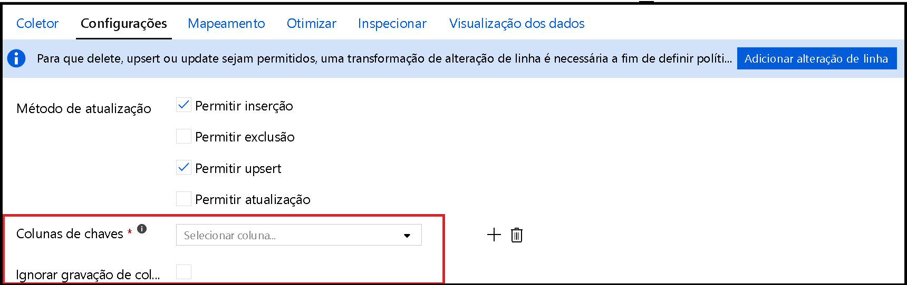

# <a name="copy-and-transform-data-in-azure-sql-database-by-using-azure-data-factory"></a>Copiar e transformar dados no banco de dados SQL do Azure usando Azure Data Factory

> [!div class="op_single_selector" title1="Selecione a versão do Azure Data Factory que você está usando:"]
>
> - [Versão 1](v1/data-factory-azure-sql-connector.md)
> - [Versão atual](connector-azure-sql-database.md)

[!INCLUDE[appliesto-adf-asa-md](includes/appliesto-adf-asa-md.md)]

Este artigo descreve como usar a atividade de cópia em Azure Data Factory para copiar dados de e para o banco de dados SQL do Azure e usar o fluxo de dados para transformar dados no banco de dado SQL do Azure. Para saber mais sobre o Azure Data Factory, leia as [artigo introdutório](introduction.md).

## <a name="supported-capabilities"></a>Funcionalidades com suporte

Este conector do banco de dados SQL do Azure tem suporte para as seguintes atividades:

- [Atividade de cópia](copy-activity-overview.md) com tabela de [matriz de origem/coletor compatível](copy-activity-overview.md)
- [Fluxo de dados de mapeamento](concepts-data-flow-overview.md)
- [Atividade de pesquisa](control-flow-lookup-activity.md)
- [Atividade GetMetadata](control-flow-get-metadata-activity.md)

Para a atividade de cópia, este conector do banco de dados SQL do Azure dá suporte a essas funções:

- Copiar dados usando a autenticação do SQL e a autenticação do token de aplicativo do Azure Active Directory (Azure AD) com uma entidade de serviço ou identidades gerenciadas para recursos do Azure.
- Como fonte, recuperar dados usando uma consulta SQL ou um procedimento armazenado.
- Como um coletor, criar automaticamente a tabela de destino se não existir com base no esquema de origem; acrescentar dados a uma tabela ou invocar um procedimento armazenado com lógica personalizada durante a cópia.

>[!NOTE]
> O banco de dados SQL do Azure [Always Encrypted](https://docs.microsoft.com/sql/relational-databases/security/encryption/always-encrypted-database-engine?view=azuresqldb-current) não tem suporte neste conector agora. Para solucionar o trabalho, você pode usar um [conector ODBC genérico](connector-odbc.md) e um SQL Server driver ODBC por meio de um Integration Runtime auto-hospedado. Saiba mais [usando Always Encrypted](#using-always-encrypted) seção. 

> [!IMPORTANT]
> Se você copiar dados usando o tempo de execução de integração do Azure, configure uma [regra de firewall no nível de servidor](https://docs.microsoft.com/azure/sql-database/sql-database-firewall-configure) para que os serviços do Azure possam acessar o servidor.
> Se você copiar dados usando um tempo de execução de integração auto-hospedado, configure o firewall para permitir o intervalo de IP apropriado. Esse intervalo inclui o IP do computador que é usado para se conectar ao banco de dados SQL do Azure.

## <a name="get-started"></a>Introdução

[!INCLUDE [data-factory-v2-connector-get-started](../../includes/data-factory-v2-connector-get-started.md)]

As seções a seguir fornecem detalhes sobre as propriedades que são usadas para definir Azure Data Factory entidades específicas para um conector do banco de dados SQL do Azure.

## <a name="linked-service-properties"></a>Propriedades do serviço vinculado

Essas propriedades são suportadas por um serviço vinculado ao Banco de Dados SQL do Azure:

| Propriedade | Descrição | Obrigatório |
|:--- |:--- |:--- |
| type | A propriedade ** tipo** deve ser definida como **AzureSqlDatabase**. | Sim |
| connectionString | Especifique as informações necessárias para se conectar à instância do Banco de Dados SQL do Azure para a propriedade **connectionString**. <br/>Você também pode colocar uma senha ou chave de entidade de serviço em Azure Key Vault. Se for a autenticação do SQL, extraia a `password` configuração da cadeia de conexão. Para obter mais informações, consulte o exemplo de JSON após a tabela e [armazenar as credenciais em Azure Key Vault](store-credentials-in-key-vault.md). | Sim |
| servicePrincipalId | Especifique a ID do cliente do aplicativo. | Sim, quando você usa a autenticação do Azure AD com uma entidade de serviço |
| servicePrincipalKey | Especifique a chave do aplicativo. Marque este campo como **SecureString** para armazená-lo com segurança em Azure data Factory ou [fazer referência a um segredo armazenado em Azure Key Vault](store-credentials-in-key-vault.md). | Sim, quando você usa a autenticação do Azure AD com uma entidade de serviço |
| locatário | Especifique as informações do locatário, como o nome de domínio ou a ID do locatário, sob a qual seu aplicativo reside. Recupere-as passando o mouse no canto superior direito do Portal do Azure. | Sim, quando você usa a autenticação do Azure AD com uma entidade de serviço |
| connectVia | Esse [Integration Runtime](concepts-integration-runtime.md) é usado para se conectar ao armazenamento de dados. Você poderá usar o runtime de integração do Azure ou um runtime de integração auto-hospedada se o seu armazenamento de dados estiver localizado em uma rede privada. Se não especificado, o Azure Integration Runtime padrão será usado. | Não |

Para diferentes tipos de autenticação, consulte as seções a seguir sobre pré-requisitos e amostras JSON, respectivamente:

- [Autenticação do SQL](#sql-authentication)
- [Autenticação de token de aplicativo do Azure AD: entidade de serviço](#service-principal-authentication)
- [Autenticação de token de aplicativo do Azure AD: identidades gerenciadas para recursos do Azure](#managed-identity)

>[!TIP]
>Se você encontrar um erro com o código de erro "UserErrorFailedToConnectToSqlServer" e uma mensagem como "o limite de sessão para o banco de dados é XXX e foi atingido", adicione `Pooling=false` à sua cadeia de conexão e tente novamente.

### <a name="sql-authentication"></a>Autenticação do SQL

**Exemplo: usando a autenticação do SQL**

```json
{
    "name": "AzureSqlDbLinkedService",
    "properties": {
        "type": "AzureSqlDatabase",
        "typeProperties": {
            "connectionString": "Data Source=tcp:<servername>.database.windows.net,1433;Initial Catalog=<databasename>;User ID=<username>@<servername>;Password=<password>;Trusted_Connection=False;Encrypt=True;Connection Timeout=30"
        },
        "connectVia": {
            "referenceName": "<name of Integration Runtime>",
            "type": "IntegrationRuntimeReference"
        }
    }
}
```

**Exemplo: senha em Azure Key Vault**

```json
{
    "name": "AzureSqlDbLinkedService",
    "properties": {
        "type": "AzureSqlDatabase",
        "typeProperties": {
            "connectionString": "Data Source=tcp:<servername>.database.windows.net,1433;Initial Catalog=<databasename>;User ID=<username>@<servername>;Trusted_Connection=False;Encrypt=True;Connection Timeout=30",
            "password": {
                "type": "AzureKeyVaultSecret",
                "store": {
                    "referenceName": "<Azure Key Vault linked service name>",
                    "type": "LinkedServiceReference"
                },
                "secretName": "<secretName>"
            }
        },
        "connectVia": {
            "referenceName": "<name of Integration Runtime>",
            "type": "IntegrationRuntimeReference"
        }
    }
}
```

### <a name="service-principal-authentication"></a>Autenticação de entidade de serviço

Para usar uma autenticação de token de aplicativo do Azure AD baseada no serviço principal, siga estas etapas:

1. [Crie um aplicativo do Azure Active Directory](../active-directory/develop/howto-create-service-principal-portal.md#register-an-application-with-azure-ad-and-create-a-service-principal) no portal do Azure. Anote o nome do aplicativo e os seguintes valores que definem o serviço vinculado:

    - ID do aplicativo
    - Chave do aplicativo
    - ID do locatário

2. [Provisione um administrador de Azure Active Directory](../azure-sql/database/authentication-aad-configure.md#provision-azure-ad-admin-sql-database) para seu servidor no portal do Azure se ainda não tiver feito isso. O administrador do Azure AD deve ser um usuário do Azure AD ou um grupo do Azure AD, mas não pode ser um diretor de serviços. Essa etapa é feita para que, na próxima etapa, você possa usar uma identidade do Azure AD para criar um usuário de banco de dados contido para a entidade de serviço.

3. [ Crie usuários de banco de dados contidos](../azure-sql/database/authentication-aad-configure.md#create-contained-users-mapped-to-azure-ad-identities) para o diretor de serviços. Conecte-se ao banco de dados a partir do ou para o qual você deseja copiá-los usando ferramentas como SQL Server Management Studio, com uma identidade do Azure AD que tenha pelo menos a permissão ALTER ANY USER. Execute o seguinte T-SQL:
  
    ```sql
    CREATE USER [your application name] FROM EXTERNAL PROVIDER;
    ```

4. Conceda ao principal de serviço as permissões necessárias, como faria normalmente para usuários do SQL ou outros. Execute o código a seguir. Para mais opções, confira [este documento](https://docs.microsoft.com/sql/relational-databases/system-stored-procedures/sp-addrolemember-transact-sql?view=sql-server-2017).

    ```sql
    ALTER ROLE [role name] ADD MEMBER [your application name];
    ```

5. Configure um serviço vinculado do Banco de Dados SQL do Azure no Azure Data Factory.

#### <a name="linked-service-example-that-uses-service-principal-authentication"></a>Exemplo de serviço vinculado que usa autenticação principal de serviço

```json
{
    "name": "AzureSqlDbLinkedService",
    "properties": {
        "type": "AzureSqlDatabase",
        "typeProperties": {
            "connectionString": "Data Source=tcp:<servername>.database.windows.net,1433;Initial Catalog=<databasename>;Connection Timeout=30",
            "servicePrincipalId": "<service principal id>",
            "servicePrincipalKey": {
                "type": "SecureString",
                "value": "<service principal key>"
            },
            "tenant": "<tenant info, e.g. microsoft.onmicrosoft.com>"
        },
        "connectVia": {
            "referenceName": "<name of Integration Runtime>",
            "type": "IntegrationRuntimeReference"
        }
    }
}
```

### <a name="managed-identities-for-azure-resources-authentication"></a><a name="managed-identity"></a> Identidades gerenciadas para autenticação de recursos do Azure

Um data factory pode ser associado a uma [identidade gerenciada para recursos do Azure](data-factory-service-identity.md), que representa esse data factory específico. Você pode usar essa identidade gerenciada para autenticação do banco de dados SQL do Azure. O factory designado pode acessar dados do banco de dados e copiá-los para o banco de dados usando essa identidade.

Para usar a autenticação de identidade gerenciada, siga estas etapas.

1. [Provisione um administrador de Azure Active Directory](../azure-sql/database/authentication-aad-configure.md#provision-azure-ad-admin-sql-database) para seu servidor no portal do Azure se ainda não tiver feito isso. O administrador do Azure AD pode ser um usuário do Azure AD ou um grupo do Azure AD. Se você conceder uma função de administrador ao grupo com a identidade gerenciada, ignore as etapas 3 e 4. O administrador tem acesso completo ao banco de dados.

2. [Crie usuários de banco de dados independente](../azure-sql/database/authentication-aad-configure.md#create-contained-users-mapped-to-azure-ad-identities) para a identidade gerenciada Azure data Factory. Conecte-se ao banco de dados a partir do ou para o qual você deseja copiá-los usando ferramentas como SQL Server Management Studio, com uma identidade do Azure AD que tenha pelo menos a permissão ALTER ANY USER. Execute o seguinte T-SQL:
  
    ```sql
    CREATE USER [your Data Factory name] FROM EXTERNAL PROVIDER;
    ```

3. Conceda à identidade gerenciada Data Factory permissões necessárias como faria normalmente para usuários do SQL e outros. Execute o código a seguir. Para mais opções, confira [este documento](https://docs.microsoft.com/sql/relational-databases/system-stored-procedures/sp-addrolemember-transact-sql?view=sql-server-2017).

    ```sql
    ALTER ROLE [role name] ADD MEMBER [your Data Factory name];
    ```

4. Configure um serviço vinculado do Banco de Dados SQL do Azure no Azure Data Factory.

**Exemplo**

```json
{
    "name": "AzureSqlDbLinkedService",
    "properties": {
        "type": "AzureSqlDatabase",
        "typeProperties": {
            "connectionString": "Data Source=tcp:<servername>.database.windows.net,1433;Initial Catalog=<databasename>;Connection Timeout=30"
        },
        "connectVia": {
            "referenceName": "<name of Integration Runtime>",
            "type": "IntegrationRuntimeReference"
        }
    }
}
```

## <a name="dataset-properties"></a>Propriedades do conjunto de dados

Para obter uma lista completa de seções e propriedades disponíveis para definir conjuntos de valores, consulte [DataSets](https://docs.microsoft.com/azure/data-factory/concepts-datasets-linked-services).

As propriedades a seguir têm suporte para o conjunto de dados do Azure SQL Database:

| Propriedade | Descrição | Obrigatório |
|:--- |:--- |:--- |
| type | A propriedade **Type** do conjunto de conjuntos deve ser definida como **AzureSqlTable**. | Sim |
| esquema | Nome do esquema. |Não para fonte, Sim para o coletor  |
| tabela | Nome da tabela/exibição. |Não para fonte, Sim para o coletor  |
| tableName | Nome da tabela/exibição com esquema. Essa propriedade é compatível com versões anteriores. Para uma nova carga de trabalho, use `schema` e `table`. | Não para fonte, Sim para o coletor |

### <a name="dataset-properties-example"></a>Exemplo de propriedades do conjunto de dados

```json
{
    "name": "AzureSQLDbDataset",
    "properties":
    {
        "type": "AzureSqlTable",
        "linkedServiceName": {
            "referenceName": "<Azure SQL Database linked service name>",
            "type": "LinkedServiceReference"
        },
        "schema": [ < physical schema, optional, retrievable during authoring > ],
        "typeProperties": {
            "schema": "<schema_name>",
            "table": "<table_name>"
        }
    }
}
```

## <a name="copy-activity-properties"></a>Propriedades da atividade de cópia

Para obter uma lista completa das seções e propriedades disponíveis para definir as atividades, veja [Pipelines](concepts-pipelines-activities.md). Esta seção fornece uma lista de propriedades suportadas pela origem e pelo coletor do Banco de Dados SQL do Azure.

### <a name="azure-sql-database-as-the-source"></a>Banco de Dados SQL do Azure como a origem

Para copiar dados do Azure SQL Database, há suporte para as seguintes propriedades na seção **origem** da atividade de cópia:

| Propriedade | Descrição | Obrigatório |
|:--- |:--- |:--- |
| type | A propriedade **Type** da fonte da atividade de cópia deve ser definida como **AzureSqlSource**. O tipo "sqlsource" ainda tem suporte para compatibilidade com versões anteriores. | Sim |
| sqlReaderQuery | Essa propriedade usa a consulta SQL personalizada para ler dados. Um exemplo é `select * from MyTable`. | Não |
| sqlReaderStoredProcedureName | O nome do procedimento armazenado que lê dados da tabela de origem. A última instrução SQL deve ser uma instrução SELECT no procedimento armazenado. | Não |
| storedProcedureParameters | Parâmetros para o procedimento armazenado.<br/>Valores permitidos são pares de nome ou valor. Os nomes e maiúsculas e minúsculas dos parâmetros devem corresponder aos nomes e maiúsculas e minúsculas dos parâmetros do procedimento armazenado. | Não |
| isolationLevel | Especifica o comportamento de bloqueio de transação para a origem do SQL. Os valores permitidos são: **ReadCommitted**, **READUNCOMMITTED**, **REPEATABLEREAD**, **Serializable**, **snapshot**. Se não for especificado, o nível de isolamento padrão do banco de dados será usado. Veja [este documento](https://docs.microsoft.com/dotnet/api/system.data.isolationlevel) para obter mais detalhes. | Não |

**Pontos a serem observados:**

- Se **sqlReaderQuery** for especificado para **AzureSqlSource**, a atividade de cópia executará essa consulta em relação à fonte do banco de dados SQL do Azure para obter os dados. Você também pode especificar um procedimento armazenado especificando o **sqlReaderStoredProcedureName** e o **storedProcedureParameters** se o procedimento armazenado usa parâmetros.
- Se você não especificar **sqlReaderQuery** ou **sqlReaderStoredProcedureName**, as colunas definidas na seção "Structure" do conjunto de dados JSON serão usadas para construir uma consulta. A consulta `select column1, column2 from mytable` é executada no banco de dados SQL do Azure. Se a definição de conjunto de dados não tiver "structure", todas as colunas serão selecionadas da tabela.

#### <a name="sql-query-example"></a>Exemplo de consulta SQL

```json
"activities":[
    {
        "name": "CopyFromAzureSQLDatabase",
        "type": "Copy",
        "inputs": [
            {
                "referenceName": "<Azure SQL Database input dataset name>",
                "type": "DatasetReference"
            }
        ],
        "outputs": [
            {
                "referenceName": "<output dataset name>",
                "type": "DatasetReference"
            }
        ],
        "typeProperties": {
            "source": {
                "type": "AzureSqlSource",
                "sqlReaderQuery": "SELECT * FROM MyTable"
            },
            "sink": {
                "type": "<sink type>"
            }
        }
    }
]
```

#### <a name="stored-procedure-example"></a>Exemplo de procedimento armazenado

```json
"activities":[
    {
        "name": "CopyFromAzureSQLDatabase",
        "type": "Copy",
        "inputs": [
            {
                "referenceName": "<Azure SQL Database input dataset name>",
                "type": "DatasetReference"
            }
        ],
        "outputs": [
            {
                "referenceName": "<output dataset name>",
                "type": "DatasetReference"
            }
        ],
        "typeProperties": {
            "source": {
                "type": "AzureSqlSource",
                "sqlReaderStoredProcedureName": "CopyTestSrcStoredProcedureWithParameters",
                "storedProcedureParameters": {
                    "stringData": { "value": "str3" },
                    "identifier": { "value": "$$Text.Format('{0:yyyy}', <datetime parameter>)", "type": "Int"}
                }
            },
            "sink": {
                "type": "<sink type>"
            }
        }
    }
]
```

### <a name="stored-procedure-definition"></a>Definição do procedimento armazenado

```sql
CREATE PROCEDURE CopyTestSrcStoredProcedureWithParameters
(
    @stringData varchar(20),
    @identifier int
)
AS
SET NOCOUNT ON;
BEGIN
     select *
     from dbo.UnitTestSrcTable
     where dbo.UnitTestSrcTable.stringData != stringData
    and dbo.UnitTestSrcTable.identifier != identifier
END
GO
```

### <a name="azure-sql-database-as-the-sink"></a>Banco de Dados SQL do Azure como o coletor

> [!TIP]
> Saiba mais sobre os comportamentos de gravação com suporte, as configurações e as práticas recomendadas da [prática recomendada para carregar dados no banco de dado SQL do Azure](#best-practice-for-loading-data-into-azure-sql-database).

Para copiar os dados para o Azure SQL Database, há suporte para as seguintes propriedades na seção **coletor** de atividade de cópia:

| Propriedade | Descrição | Obrigatório |
|:--- |:--- |:--- |
| type | A propriedade **Type** do coletor da atividade de cópia deve ser definida como **AzureSqlSink**. O tipo "sqlsink" ainda tem suporte para compatibilidade com versões anteriores. | Sim |
| preCopyScript | Especifique uma consulta SQL para que a atividade de cópia seja executada antes de gravar os dados no Azure SQL Database. É chamado apenas uma vez por execução de cópia. Use essa propriedade para limpar os dados pré-carregados. | Não |
| tableOption | Especifica se a [tabela do coletor deve ser criada automaticamente](copy-activity-overview.md#auto-create-sink-tables) se não existir com base no esquema de origem. <br>Não há suporte para a criação automática de tabela quando o coletor especifica o procedimento armazenado ou a cópia preparada está configurada na atividade de cópia. <br>Os valores permitidos são `none` (padrão) e `autoCreate`. | Não |
| sqlWriterStoredProcedureName | O nome do procedimento armazenado que define como aplicar dados de origem em uma tabela de destino. <br/>Este procedimento armazenado é *chamado por lote*. Para operações que são executadas apenas uma vez e não têm nada a ver com os dados de origem, por exemplo, excluir ou truncar, use a `preCopyScript` propriedade.<br>Consulte o exemplo de [invocar um procedimento armazenado de um coletor SQL](#invoke-a-stored-procedure-from-a-sql-sink). | Não |
| storedProcedureTableTypeParameterName |O nome do parâmetro do tipo de tabela especificado no procedimento armazenado.  |Não |
| sqlWriterTableType |O nome do tipo de tabela a ser usado no procedimento armazenado. A atividade de cópia disponibiliza aqueles dados sendo movidos em uma tabela temporária com esse tipo de tabela. O código de procedimento armazenado pode mesclar os dados que estão sendo copiados com os dados existentes. |Não |
| storedProcedureParameters |Parâmetros para o procedimento armazenado.<br/>Valores permitidos são pares de nome e valor. Nomes e uso de maiúsculas e minúsculas de parâmetros devem corresponder aos nomes e o uso de maiúsculas e minúsculas dos parâmetros do procedimento armazenado. | Não |
| writeBatchSize | Número de linhas a serem inseridas na tabela SQL *por lote*.<br/> O valor permitido é **inteiro** (número de linhas). Por padrão, Azure Data Factory determina dinamicamente o tamanho do lote apropriado com base no tamanho da linha. | Não |
| writeBatchTimeout | O tempo de espera para o lote inserir operação seja concluída antes de expirar.<br/> O valor permitido é **timespan**. Um exemplo é "00:30:00" (30 minutos). | Não |
| disableMetricsCollection | Data Factory coleta métricas como DTUs do banco de dados SQL do Azure para otimização e recomendações de desempenho de cópia. Se você estiver preocupado com esse comportamento, especifique `true` para desativá-lo. | Não (o padrão é `false`) |

**Exemplo 1: acrescentar dados**

```json
"activities":[
    {
        "name": "CopyToAzureSQLDatabase",
        "type": "Copy",
        "inputs": [
            {
                "referenceName": "<input dataset name>",
                "type": "DatasetReference"
            }
        ],
        "outputs": [
            {
                "referenceName": "<Azure SQL Database output dataset name>",
                "type": "DatasetReference"
            }
        ],
        "typeProperties": {
            "source": {
                "type": "<source type>"
            },
            "sink": {
                "type": "AzureSqlSink",
                "tableOption": "autoCreate",
                "writeBatchSize": 100000
            }
        }
    }
]
```

**Exemplo 2: invocar um procedimento armazenado durante a cópia**

Saiba mais detalhes em [Invocar um procedimento armazenado de um coletor SQL](#invoke-a-stored-procedure-from-a-sql-sink).

```json
"activities":[
    {
        "name": "CopyToAzureSQLDatabase",
        "type": "Copy",
        "inputs": [
            {
                "referenceName": "<input dataset name>",
                "type": "DatasetReference"
            }
        ],
        "outputs": [
            {
                "referenceName": "<Azure SQL Database output dataset name>",
                "type": "DatasetReference"
            }
        ],
        "typeProperties": {
            "source": {
                "type": "<source type>"
            },
            "sink": {
                "type": "AzureSqlSink",
                "sqlWriterStoredProcedureName": "CopyTestStoredProcedureWithParameters",
                "storedProcedureTableTypeParameterName": "MyTable",
                "sqlWriterTableType": "MyTableType",
                "storedProcedureParameters": {
                    "identifier": { "value": "1", "type": "Int" },
                    "stringData": { "value": "str1" }
                }
            }
        }
    }
]
```

## <a name="best-practice-for-loading-data-into-azure-sql-database"></a>Prática recomendada para carregar dados no banco de dado SQL do Azure

Quando você copia dados para o Azure SQL Database, pode ser necessário um comportamento de gravação diferente:

- [Append](#append-data): meus dados de origem têm apenas registros novos.
- [Upsert](#upsert-data): meus dados de origem têm inserções e atualizações.
- [Substituir](#overwrite-the-entire-table): Eu quero recarregar uma tabela de dimensão inteira a cada vez.
- [Gravar com lógica personalizada](#write-data-with-custom-logic): preciso de processamento extra antes da inserção final na tabela de destino.

Consulte as respectivas seções sobre como configurar o em Azure Data Factory e as práticas recomendadas.

### <a name="append-data"></a>Acrescentar dados

A anexação de dados é o comportamento padrão desse conector do coletor de banco de dados SQL do Azure. Azure Data Factory faz uma inserção em massa para gravar em sua tabela com eficiência. Você pode configurar a origem e o coletor de acordo com a atividade de cópia.

### <a name="upsert-data"></a>Upsert data

**Opção 1:** Quando você tem uma grande quantidade de dados a serem copiados, você pode carregar em massa todos os registros em uma tabela de preparo usando a atividade de cópia e, em seguida, executar uma atividade de procedimento armazenado para aplicar uma instrução [Merge](https://docs.microsoft.com/sql/t-sql/statements/merge-transact-sql?view=azuresqldb-current) ou Insert/Update em uma única imagem. 

Atualmente, a atividade de cópia não dá suporte nativo ao carregamento de dados em uma tabela temporária de banco de dado. Há uma maneira avançada de configurá-lo com uma combinação de várias atividades, consulte [otimizar cenários de Upsert em massa do banco de dados SQL do Azure](https://github.com/scoriani/azuresqlbulkupsert). Abaixo mostra um exemplo de como usar uma tabela permanente como preparo.

Por exemplo, em Azure Data Factory, você pode criar um pipeline com uma **atividade de cópia** encadeada com uma **atividade de procedimento armazenado**. O primeiro copia os dados do seu repositório de origem para uma tabela de preparo do banco de dados SQL do Azure, por exemplo, **UpsertStagingTable**, como o nome da tabela no DataSet. Em seguida, o último invoca um procedimento armazenado para mesclar dados de origem da tabela de preparo na tabela de destino e limpar a tabela de preparo.


No banco de dados, defina um procedimento armazenado com lógica de MESCLAgem, como o exemplo a seguir, que é apontado da atividade de procedimento armazenado anterior. Suponha que o destino seja a tabela de **marketing** com três colunas: **ProfileId**, **estado**e **categoria**. Faça o Upsert com base na coluna **ProfileId** .

```sql
CREATE PROCEDURE [dbo].[spMergeData]
AS
BEGIN
   MERGE TargetTable AS target
   USING UpsertStagingTable AS source
   ON (target.[ProfileID] = source.[ProfileID])
   WHEN MATCHED THEN
      UPDATE SET State = source.State
    WHEN NOT matched THEN
       INSERT ([ProfileID], [State], [Category])
      VALUES (source.ProfileID, source.State, source.Category);
    TRUNCATE TABLE UpsertStagingTable
END
```

**Opção 2:** Você pode optar por [invocar um procedimento armazenado na atividade de cópia](#invoke-a-stored-procedure-from-a-sql-sink). Essa abordagem executa cada lote (conforme governado pela `writeBatchSize` Propriedade) na tabela de origem em vez de usar BULK INSERT como a abordagem padrão na atividade de cópia.

**Opção 3:** Você pode usar o [fluxo de dados de mapeamento](#sink-transformation) que oferece métodos internos Insert/Upsert/Update.

### <a name="overwrite-the-entire-table"></a>Substituir a tabela inteira

Você pode configurar a propriedade **preCopyScript** no coletor da atividade de cópia. Nesse caso, para cada atividade de cópia executada, Azure Data Factory executa o script primeiro. Em seguida, ele executa a cópia para inserir os dados. Por exemplo, para substituir a tabela inteira com os dados mais recentes, especifique um script para primeiro excluir todos os registros antes de carregar em massa os novos dados da origem.

### <a name="write-data-with-custom-logic"></a>Gravar dados com lógica personalizada

As etapas para gravar dados com lógica personalizada são semelhantes às descritas na seção de [dados Upsert](#upsert-data) . Quando você precisa aplicar processamento extra antes da inserção final dos dados de origem na tabela de destino, você pode carregar em uma tabela de preparo e, em seguida, invocar a atividade de procedimento armazenado, ou invocar um procedimento armazenado no coletor de atividade de cópia para aplicar dados ou usar o fluxo de dados de mapeamento.

## <a name="invoke-a-stored-procedure-from-a-sql-sink"></a><a name="invoke-a-stored-procedure-from-a-sql-sink"></a> Invocar um procedimento armazenado de um coletor SQL

Quando você copia dados para o Azure SQL Database, também pode configurar e invocar um procedimento armazenado especificado pelo usuário com parâmetros adicionais em cada lote da tabela de origem. O recurso de procedimento armazenado aproveita os [parâmetros com valor de tabela](https://msdn.microsoft.com/library/bb675163.aspx).

Você pode usar um procedimento armazenado quando os mecanismos internos de cópia não atendem à finalidade. Um exemplo é quando você deseja aplicar processamento extra antes da inserção final dos dados de origem na tabela de destino. Alguns exemplos de processamento extra são quando você deseja mesclar colunas, Pesquisar valores adicionais e inserir em mais de uma tabela.

A amostra a seguir mostra como usar um procedimento armazenado para fazer um upsert em uma tabela no Banco de Dados SQL do Azure. Suponha que os dados de entrada e a tabela de **marketing** do coletor tenham três colunas: **ProfileId**, **estado**e **categoria**. Faça o Upsert com base na coluna **ProfileId** e aplique-o somente para uma categoria específica chamada "produtoA".

1. No banco de dados, defina o tipo de tabela com o mesmo nome que **sqlWriterTableType**. O esquema do tipo de tabela é o mesmo que o esquema retornado pelos dados de entrada.

    ```sql
    CREATE TYPE [dbo].[MarketingType] AS TABLE(
        [ProfileID] [varchar](256) NOT NULL,
        [State] [varchar](256) NOT NULL,
        [Category] [varchar](256) NOT NULL
    )
    ```

2. No banco de dados, defina o procedimento armazenado com o mesmo nome que **sqlWriterStoredProcedureName**. Ele manipula os dados de entrada da sua origem especificada e mescla na tabela de saída. O nome do parâmetro do tipo de tabela no procedimento armazenado é o mesmo que **TableName** definido no DataSet.

    ```sql
    CREATE PROCEDURE spOverwriteMarketing @Marketing [dbo].[MarketingType] READONLY, @category varchar(256)
    AS
    BEGIN
    MERGE [dbo].[Marketing] AS target
    USING @Marketing AS source
    ON (target.ProfileID = source.ProfileID and target.Category = @category)
    WHEN MATCHED THEN
        UPDATE SET State = source.State
    WHEN NOT MATCHED THEN
        INSERT (ProfileID, State, Category)
        VALUES (source.ProfileID, source.State, source.Category);
    END
    ```

3. Em Azure Data Factory, defina a seção **SQL Sink** na atividade de cópia da seguinte maneira:

    ```json
    "sink": {
        "type": "AzureSqlSink",
        "sqlWriterStoredProcedureName": "spOverwriteMarketing",
        "storedProcedureTableTypeParameterName": "Marketing",
        "sqlWriterTableType": "MarketingType",
        "storedProcedureParameters": {
            "category": {
                "value": "ProductA"
            }
        }
    }
    ```

## <a name="mapping-data-flow-properties"></a>Propriedades do fluxo de dados de mapeamento

Ao transformar dados no fluxo de dados de mapeamento, você pode ler e gravar em tabelas do banco de dados SQL do Azure. Para obter mais informações, confira [transformação de origem](data-flow-source.md) e [transformação do coletor](data-flow-sink.md) nos fluxos de dados de mapeamento.

### <a name="source-transformation"></a>Transformação de origem

As configurações específicas para o banco de dados SQL do Azure estão disponíveis na guia **Opções de origem** da transformação origem.

**Entrada:** selecione se você apontar sua origem em uma tabela (equivalente a ```Select * from <table-name>```) ou inserir uma consulta SQL personalizada.

**Consulta**: se você selecionar Consulta no campo de entrada, insira uma consulta SQL para sua origem. Essa configuração substitui qualquer tabela que você tenha escolhido no conjunto de dados. Cláusulas **Order By** não são compatíveis aqui, mas você pode definir uma instrução SELECT FROM completa. Também pode usar funções de tabela definidas pelo usuário. **select * from udfGetData()** é um UDF no SQL que retorna uma tabela. Essa consulta produzirá uma tabela de origem que você pode usar em seu fluxo de dados. O uso de consultas também é uma ótima maneira de reduzir linhas para testes ou pesquisas.

- Exemplo do SQL: ```Select * from MyTable where customerId > 1000 and customerId < 2000```

**Tamanho do lote**: insira um tamanho de lote para dividir dados grandes em leituras.

**Nível de isolamento**: o padrão para as origens SQL no fluxo de dados de mapeamento é leitura não confirmada. Você pode alterar o nível de isolamento aqui para um destes valores:

- Leitura Confirmada
- Leitura Não Confirmada
- Leitura repetida
- Serializável
- Nenhum (ignorar o nível de isolamento)


### <a name="sink-transformation"></a>Transformação de coletor

As configurações específicas para o banco de dados SQL do Azure estão disponíveis na guia **configurações** da transformação coletor.

**Método Update:** determina quais operações são permitidas no destino do banco de dados. O padrão é permitir apenas inserções. Para atualizar, fazer upsert ou excluir linhas, uma transformação alter-row é necessária para marcar as linhas para essas ações. Para atualizações, upserts e exclusões, é necessário selecionar uma coluna de chave ou colunas para determinar qual linha alterar.



O nome da coluna que você escolher como a chave aqui será usado pelo ADF como parte da atualização subsequente, Upsert, Delete. Portanto, você deve escolher uma coluna que exista no mapeamento do coletor. Se você não quiser gravar o valor nessa coluna de chave, clique em "ignorar a gravação de colunas de chave".

**Ação de tabela:** determina se deve-se recriar ou remover todas as linhas da tabela de destino antes da gravação.

- Nenhuma: nenhuma ação será feita na tabela.
- Recriar: a tabela será descartada e recriada. Necessário ao criar uma tabela dinamicamente.
- Truncar: todas as linhas da tabela de destino serão removidas.

**Tamanho do lote**: controla quantas linhas estão sendo gravadas em cada bucket. Tamanhos de lote maiores aprimoram a compactação e a otimização de memória, mas geram risco de exceções de memória insuficiente ao armazenar dados em cache.

**Scripts SQL prévios e posteriores**: Insira scripts SQL de várias linhas que serão executados antes (pré-processamento) e após (pós-processamento) os dados serem gravados no banco de dados do coletor


## <a name="data-type-mapping-for-azure-sql-database"></a>Mapeamento do tipo de dados do Banco de Dados SQL do Azure

Quando os dados são copiados do ou para o banco de dados SQL do Azure, os seguintes mapeamentos são usados de tipos de dado do banco de dados SQL do Azure para Azure Data Factory tipos de dados provisórios. Para saber mais sobre como a atividade de cópia mapeia o tipo de dados e esquema de origem para o coletor, consulte [Mapeamentos de tipo de dados e esquema](copy-activity-schema-and-type-mapping.md).

| Tipo de dados do Banco de Dados SQL do Azure | Tipo de dados provisório do Azure Data Factory |
|:--- |:--- |
| BIGINT |Int64 |
| binary |Byte[] |
| bit |Boolean |
| char |String, Char[] |
| date |Datetime |
| Datetime |Datetime |
| datetime2 |Datetime |
| Datetimeoffset |DateTimeOffset |
| Decimal |Decimal |
| FILESTREAM attribute (varbinary(max)) |Byte[] |
| Float |Double |
| image |Byte[] |
| INT |Int32 |
| money |Decimal |
| NCHAR |String, Char[] |
| ntext |String, Char[] |
| numeric |Decimal |
| NVARCHAR |String, Char[] |
| real |Single |
| rowversion |Byte[] |
| smalldatetime |Datetime |
| SMALLINT |Int16 |
| SMALLMONEY |Decimal |
| sql_variant |Objeto |
| texto |String, Char[] |
| time |TimeSpan |
| timestamp |Byte[] |
| TINYINT |Byte |
| UNIQUEIDENTIFIER |Guid |
| varbinary |Byte[] |
| varchar |String, Char[] |
| Xml |Xml |

>[!NOTE]
> Para tipos de dados que são mapeados para o tipo provisório decimal, a atividade de cópia atualmente dá suporte à precisão de até 28. Se você tiver dados com precisão maior que 28, considere converter para uma cadeia de caracteres na consulta SQL.

## <a name="lookup-activity-properties"></a>Pesquisar propriedades de atividade

Para saber detalhes sobre as propriedades, verifique [Atividade de pesquisa](control-flow-lookup-activity.md).

## <a name="getmetadata-activity-properties"></a>Propriedades de atividade GetMetadata

Para saber detalhes sobre as propriedades, verifique [Atividade GetMetadata](control-flow-get-metadata-activity.md)

## <a name="using-always-encrypted"></a>Como usar o Always Encrypted

Ao copiar dados de/para o banco de dado SQL do Azure com [Always Encrypted](https://docs.microsoft.com/sql/relational-databases/security/encryption/always-encrypted-database-engine?view=azuresqldb-current), use o [conector odbc genérico](connector-odbc.md) e SQL Server driver odbc por meio de Integration Runtime de hospedagem interna. Este conector do banco de dados SQL do Azure não oferece suporte a Always Encrypted agora. 

Mais especificamente:

1. Configure um Integration Runtime auto-hospedado se você não tiver um. Confira o artigo de [Integration Runtime auto-hospedado](create-self-hosted-integration-runtime.md) para obter detalhes.

2. Baixe o driver ODBC de 64 bits para SQL Server [aqui](https://docs.microsoft.com/sql/connect/odbc/download-odbc-driver-for-sql-server?view=azuresqldb-current)e instale na máquina Integration Runtime. Saiba mais sobre como esse driver funciona [usando Always Encrypted com o driver ODBC para SQL Server](https://docs.microsoft.com/sql/connect/odbc/using-always-encrypted-with-the-odbc-driver?view=azuresqldb-current#using-the-azure-key-vault-provider).

3. Crie um serviço vinculado com o tipo ODBC para se conectar ao banco de dados SQL, consulte os exemplos a seguir:

    - Para usar a **autenticação do SQL**: Especifique a cadeia de conexão ODBC como abaixo e selecione Autenticação **básica** para definir o nome de usuário e a senha.

        ```
        Driver={ODBC Driver 17 for SQL Server};Server=<serverName>;Database=<databaseName>;ColumnEncryption=Enabled;KeyStoreAuthentication=KeyVaultClientSecret;KeyStorePrincipalId=<servicePrincipalKey>;KeyStoreSecret=<servicePrincipalKey>
        ```

    - Para usar **Data Factory autenticação de identidade gerenciada**: 

        1. Siga os mesmos [pré-requisitos](#managed-identity) para criar um usuário de banco de dados para a identidade gerenciada e conceder a função apropriada em seu banco de dados.
        2. Em serviço vinculado, especifique a cadeia de conexão ODBC, conforme mostrado abaixo, e selecione Autenticação **anônima** como a própria cadeia de conexão indica `Authentication=ActiveDirectoryMsi` .

        ```
        Driver={ODBC Driver 17 for SQL Server};Server=<serverName>;Database=<databaseName>;ColumnEncryption=Enabled;KeyStoreAuthentication=KeyVaultClientSecret;KeyStorePrincipalId=<servicePrincipalKey>;KeyStoreSecret=<servicePrincipalKey>; Authentication=ActiveDirectoryMsi;
        ```

4. Crie DataSet e copie a atividade com o tipo ODBC adequadamente. Saiba mais no artigo [conector ODBC](connector-odbc.md) .

## <a name="next-steps"></a>Próximas etapas

Para obter uma lista de armazenamentos de dados com suporte como fontes e coletores pela atividade de cópia no Azure Data Factory, consulte [armazenamentos de dados e formatos com suporte](copy-activity-overview.md#supported-data-stores-and-formats).
